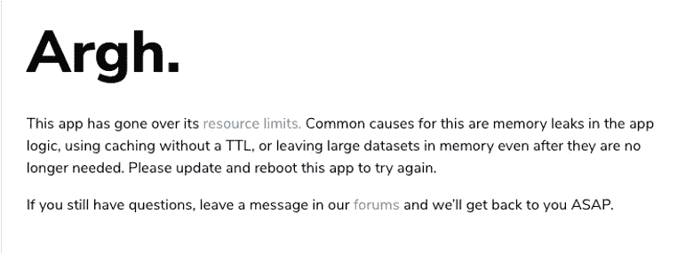
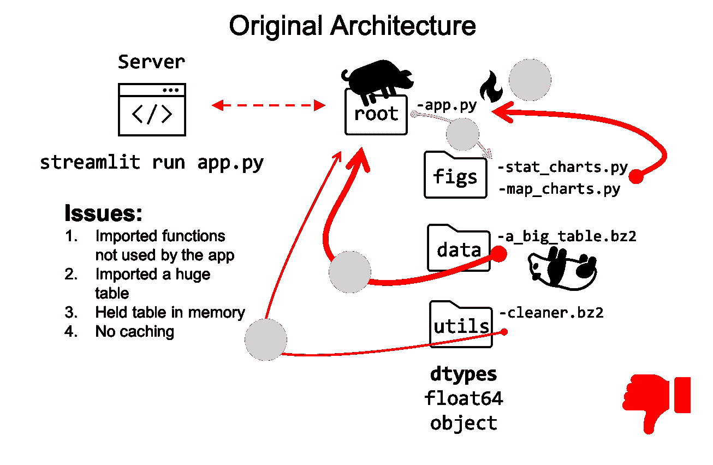
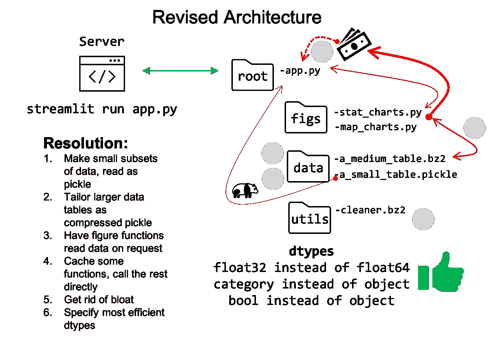
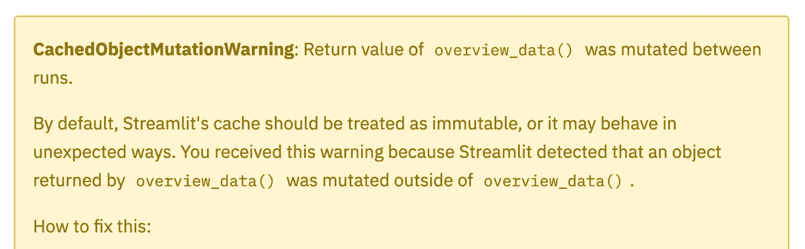

# 优化简化 it 部署

> 原文：<https://towardsdatascience.com/optimize-streamlit-deployment-1b9bb0e415b?source=collection_archive---------20----------------------->

## 使用 Streamlit 从 Python 部署数据应用程序时要避免的陷阱。


在 [Unsplash](https://unsplash.com?utm_source=medium&utm_medium=referral) 上[科学高清](https://unsplash.com/@scienceinhd?utm_source=medium&utm_medium=referral)拍摄的照片

# 部署代码—崩溃应用程序—吸取教训

当您部署一个数据应用程序而不进行内存优化编码时，会发生什么情况？至少对我来说，应用程序崩溃了，我花了几天时间痛苦地重构代码。如果你更幸运或者更聪明(或者两者兼而有之)，那么你没什么好担心的。否则，考虑一下从我的错误中吸取的教训和一些有用的资源，以避免你自己特别头疼的问题。

> 如何避免我的优化错误来部署您的应用程序以取得成功。

# 为网络编码与为我编码

我一直承认编写优化代码的重要性，但直到部署一个 Web 应用程序，我才完全意识到这意味着什么。在我的笔记本电脑上，即使是写得最差的代码也可能运行，尽管速度很慢。然而，网络上的后果要严重得多——内存泄漏和低效的代码会削弱体验。如果你不喜欢等待应用程序加载，用户也不会喜欢。

</deploy-code-with-streamlit-90090b611f3c>  

在之前的一篇文章中(链接在上方的*，我分享了我在部署我的应用时遇到的一些问题。虽然我成功地启动并运行了应用程序，但在添加了更大的数据集后，它开始崩溃。因此，在本文中，我分享一些部署后的问题和解决方案。*

## 部署 Streamlit 应用程序后的两个主要问题:

1.  应用不可用，因为它已超出其资源限制
2.  应用程序在部署几小时后崩溃，并在反复重启后继续崩溃



图 1——事实上……部署的喜悦被令人头痛的内存泄漏所中止。来自作者桌面的屏幕截图。

## 详细问题和关键资源的摘要:

*   **数据帧过大，超过 270 兆字节(MB)！相比之下，100 MB 可能已经太大了。尽管没有一个完美的大小，对于一个有一百万行的表，我最终将文件压缩到了大约 50mb——仍然很大，但还是可以管理的。**

> ***第一课:用尽所有可能的选项来减小数据帧的大小。***

</make-working-with-large-dataframes-easier-at-least-for-your-memory-6f52b5f4b5c4>  

*   **应用程序将数据帧保存在内存中。**这里有一个折衷——将数据保存在内存中以实现快速访问，但保存太多，一切都会崩溃。想都没想，就把应用程序编码成在内存中保存整个数据帧(一开始就太大了)——这被证明是一场灾难。

> 第二课:有意识地了解存储在内存中的内容。

*   **函数缓存。**在我开始搜索关于一个崩溃的 Web 应用的建议后，我发现 Streamlit 有一个方便的 ***@st.cache*** 函数装饰器。然后在正确实现了缓存 in 之后，我学习了 ***TTL*** 。为了节省时间，从一开始就考虑缓存和 TTL。考虑一下，对于任何多次使用且运行成本很高的函数，缓存可能会有所帮助，因为它将函数的结果保存在内存中。缓存对于一次生成 Plotly 图形并在以后从缓存中检索它们非常有用。

> 第三课:用@st.cache 缓存函数，不要忘记 TTL 参数。

<https://discuss.streamlit.io/t/this-app-has-gone-over-its-resource-limits/7334>  

*   **DataFrame 数据猪。**在熊猫数据帧中，当从 ***对象数据类型*** 转换为 ***分类数据类型*** 或 ***整数数据类型*** 时，每列的大小可以减少一半或更多。早期，我转换了大部分内容，但错过了一些专栏——这个疏忽最终吃掉了我的午餐。

> 第 4 课:在数据帧中应用必要的最小精度；避免像瘟疫一样的“对象”类型。

</pandas-save-memory-with-these-simple-tricks-943841f8c32>  

*   **垃圾进口。这是程序设计的一个总括性问题。举个例子，在每个 Python 文件的顶部，我有用于数据清理的库和包的必要的 import 语句，但是 Web 应用程序不需要。虽然这些垃圾进口没有占用大量的内存，但它们仍然消耗了我无法给予的时间和内存。**

> 第五课:只进口你需要的，扔掉垃圾。

# 几个具体问题及解决方法

让我们从垃圾箱火灾的粗略快照开始，这是我的程序中的原始架构。在图 2 中，Streamlit 调用了 ***app.py*** ，它依次读入数据作为 DataFrames 并调用程序的所有其他函数。起初，这对于我笔记本上的一个小数据集来说工作得很好。不幸的是，在部署带有完整数据集的应用程序后，事情就偏离了轨道。一天结束时，我的小应用程序超出了资源限制，关闭了。



图 2——所有东西都聚集到 app.py 中的原始架构。来自作者 [Justin Chae](https://medium.com/u/d9cf1c8c597d?source=post_page-----1b9bb0e415b--------------------------------) 。

现在，考虑图 3 中的一个更好的架构。所有东西都被瘦身了，而不是调用一个巨大的表格和臃肿的应用程序。该应用程序只调用上下文菜单所需的一个小文件，并在需要时通过函数调用其他数据。可以肯定的是，这并不完美，但这是对原始版本的巨大改进。



图 3 —架构上的小改进。来自作者 Justin Chae。

## 贮藏

缓存有两个重要的场景，(1)用 ***ttl*** 缓存，(2)用哈希字典缓存。

**首先，**考虑一个典型的 Streamlit 调用，它从一些其他代码( ***stat_charts.py*** )中绘制一个图形，这些代码使用一些函数( ***graph1*** ())进行实际绘制。在这种情况下，程序每次都会重新生成图形。在某些情况下，这可能会导致您的应用程序崩溃或耗尽分配的资源。

```
**# Streamlit with Plotly, no caching**import streamlit as st
from figs.stat_charts.py import Achartst.plotly_chart(Achart().graph1())
```

根据文档，你可以尝试使用带有函数包装器的 ***@st.cache*** 装饰器。然而，在几个小时的重复调用后，内存问题将会累积并使应用程序崩溃，正如这篇[博文](https://discuss.streamlit.io/t/memory-consumption-issues/2377)中所描述的那样。

```
**# with basic caching, eventually crash app****@st.cache()**
def make_fig():
    some_fig = Achart().graph1()
    return some_figdef show_objects():
    st.plotly_chart(make_fig()) 
```

相反，请确保包含用于 ***max_entries*** 和 ***ttl*** 的参数来管理缓存大小。对我来说，除非有理由不这样做，否则我将默认使用这些参数。

```
**# with basic cache controls****@st.cache(max_entries=10, ttl=3600)**
def make_fig():
    some_fig = Achart().graph1()
    return some_figdef show_objects():
    st.plotly_chart(make_fig())
```



图 4 —缓存的第二个问题。

**第二，**取决于你的函数，你可能会遇到***CachedObjectMutationWarning***这基本上意味着函数内部的某些东西每次都在变化。根据文档，改变缓存的函数通常是不可取的，但是这篇[博客文章](https://docs.streamlit.io/en/stable/caching.html)提供了一个解决方法。

```
**CachedObjectMutationWarning**: Return value of overview_data() was mutated between runs.By default, Streamlit's cache should be treated as immutable, or it may behave in unexpected ways. You received this warning because Streamlit detected that an object returned by overview_data() was mutated outside of overview_data().
```

Streamlit 博客中的一个解决方案非常聪明，它将绘图作为散列字典键值对返回到缓存中。之后，对字典的后续调用。这个超级酷！

```
**# cache plots in hashed dictionary****@st.cache(hash_funcs={dict: *lambda _*: *None*})**
def make_fig():
    some_fig = Achart().graph1()
    **cached_dict = {'f1': some_fig} **   
    return cached_dictdef show_objects():
    charts = make_fig()
    st.plotly_chart(**charts['f1']**)
```

## 优化熊猫

对于熊猫优化，有两个层次要考虑。首先，每一列的数据类型(dtypes)。第二，源文件和数据帧的整体大小和格式。由于这两个优化主题已经被其他的 [TDS](https://towardsdatascience.com/) 文章( ***参见参考资料*** )很好地涵盖了，我将在这个 Streamlit 部署的上下文中提供一个例子。

在一个应该是布尔值(真/假)的列的例子中，我在某个时候错误地把它变成了文本。因此，该列用两个非布尔值(' nan '和 1)占据了大量空间。).在这种情况下，“nan”是一个文字字符串 *nan* ，而不是 *numpy.nan* 类型。

> 不要让‘南’弦占用宝贵的内存。

```
**# correcting a mistake for a boolean column
# a DataFrame with about 1 million rows**print(df['flag_col'].unique())
# >>> [nan  1.] **should be boolean!**print(df['flag_col'].memory_usage())
# >>> 15,274,640 **ouch, way too much memory!**
```

要修补这种特定情况，请用新值映射字典，并应用新的 dtype。请注意，当布尔列的属性类型为 boolean 时，可以节省内存。

```
**# correct a Pandas Column that should be boolean****# make column into bool**
df['flag_col'] = df['flag_col'].astype('boolean')print(df['flag_col'].memory_usage())
# >>> 8,591,985 **huge savings in memory!**
```

其他优化考虑事项的清单(酌情适用):

*   使用浮点数和整数分析所需的最小精度，即 ***float16*** 而不是 ***float64***
*   使用类别数据类型代替对象
*   有意读取特定列，即 ***df = df[[col1，col2，col3]]***
*   如 ***资源*** 中所述，压缩大文件，但处理小文件(考虑大文件的空间和解压缩时间与小文件的速度之间的权衡)。

***2021 年 1 月 11、13 日更新:***

*   对于 Streamlit 中的 Plotly 图表，创建较小的未压缩 pickle 文件片段，而不是从较大的压缩文件中读取。**每个文件应该只包含图表所需的列和数据**。在撰写本文时，尽管进行了优化和压缩，我发现如果从单个大型表中读取数据，显示图表的速度仍然太慢。
*   **将布尔转换的示例从“布尔”更改为“布尔”——这是一个主要问题！更多信息，请点击这里阅读:**

</when-to-use-the-nullable-nan-10c073b0261e>  

# 资源

有时资源部分是事后想起的；然而，我想强调并分享一些关于一个我以前从未想过要研究的课题的信息性文章。

## 持久化熊猫数据帧的数据文件管理

</stop-persisting-pandas-data-frames-in-csvs-f369a6440af5>  

## 熊猫数据帧执行中的内存管理

</pandas-save-memory-with-these-simple-tricks-943841f8c32>  </how-to-avoid-a-pandas-pandemonium-part-ii-3426f53d7fba>  

## 诊断和修复 Pandas 数据帧内存

</make-working-with-large-dataframes-easier-at-least-for-your-memory-6f52b5f4b5c4>  </python-garbage-collection-article-4a530b0992e3>  

# 结论

在本文中，我分享了一个使用 Streamlit 和 Python 的简单数据仪表板应用程序的一些部署后优化缺陷。之前，我分享了一些部署前的问题，但后来，我发现了一些内存和优化方面的其他问题。起初问题并不清楚，但在应用程序不断崩溃后，我意识到我有严重的设计缺陷。感谢网络上的大量建议，我解决并修补了大多数问题。

这些经验可以归结为利用 Web 应用程序上的缓存，尽可能减小数据文件的大小，利用 Pandas 数据帧数据类型中的最低精度，以及简化程序的架构。至于下一步，我正在考虑如何利用库，如 [Modin](https://modin.readthedocs.io/en/latest/) 和 [Spark](/stop-using-pandas-and-start-using-spark-with-scala-f7364077c2e0) ，以备我用尽技巧并需要更多性能时使用。

> 我的项目在[这里](https://share.streamlit.io/justinhchae/app_courts/main/main.py)和通过 [GitHub](https://github.com/justinhchae/app_courts) 可用，并且实现了本文中描述的所有概念。感谢您的阅读，祝您在下一个项目中一切顺利！