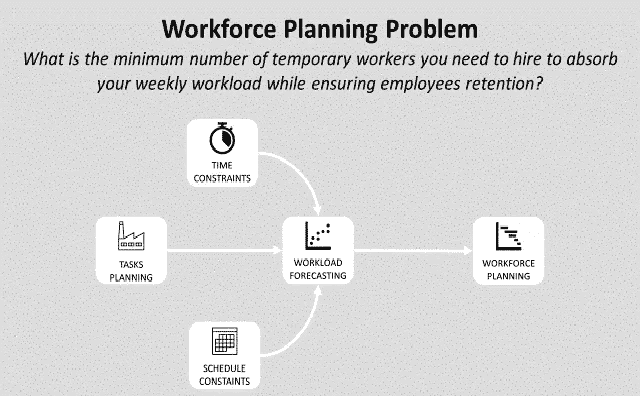
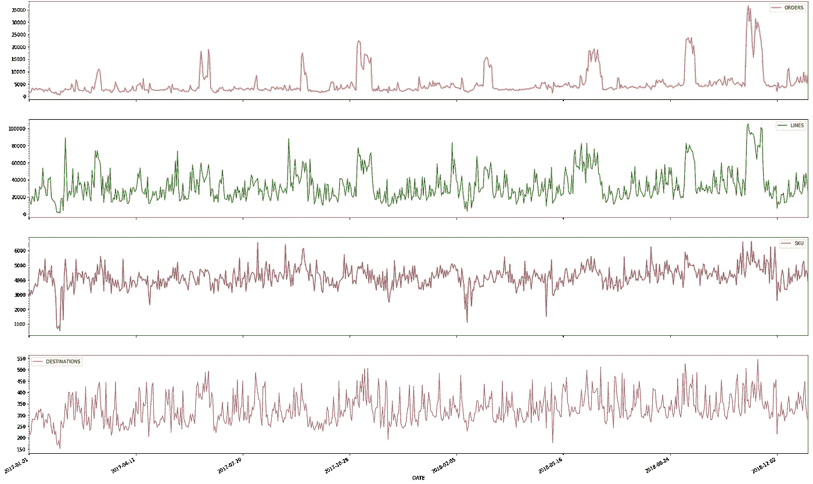
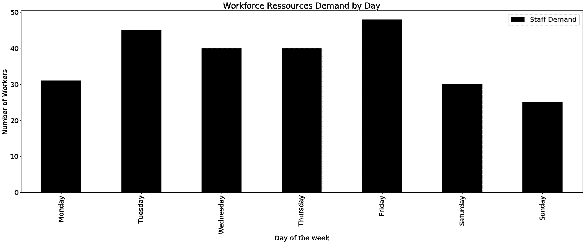
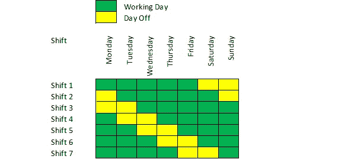
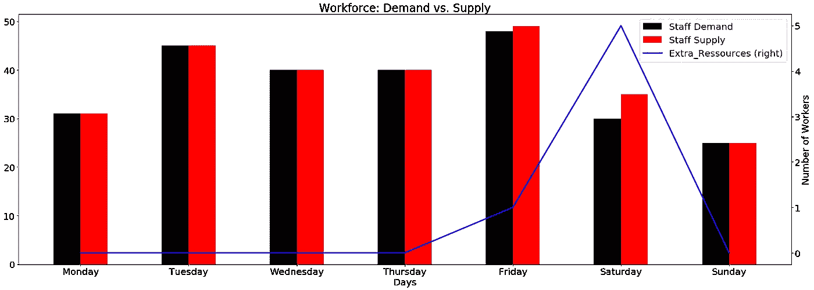

# 使用 Python 线性编程优化劳动力规划

> 原文：<https://towardsdatascience.com/optimize-workforce-planning-using-linear-programming-with-python-47a0b5f89a6f?source=collection_archive---------11----------------------->

## 在确保留住员工的同时，你需要雇佣多少临时工来消化你每周的工作量？



使用线性规划的劳动力计划问题—(图片由作者提供)

**配送中心(DC)** 经理面临的一个主要挑战是一周内工作量的波动。



代表大型电子商务 DC 工作量的每日数据—(图片由作者提供)

在下面的例子中，您可以看到推动您工作量的关键指标的每日变化**(#订单、#行、# SKU……)**。从一天到另一天，你可以看到需要被你的团队吸收的高度变化。

考虑到你的员工的[平均生产率](https://www.youtube.com/watch?v=KR_ziEiPcDk)是稳定的，唯一的解决办法就是调整你的资源以满足每天的需求。

💌新文章直接免费放入你的收件箱:[时事通讯](https://www.samirsaci.com/#/portal/signup)

# 一.员工队伍规划:问题陈述

## **1。场景**

你是一家大型零售商的第三方物流公司(3PL)运营的配送中心的 [**入库经理**](https://www.youtube.com/watch?v=nz69i6l7SzI) 。

您的团队职责包括

*   **从卡车上卸下**托盘
*   **扫描**每个托盘，**在您的仓库管理系统(WMS)中记录**收到的数量
*   将这些托盘放到库存区

团队的[全球生产率](https://www.youtube.com/watch?v=KR_ziEiPcDk)每周以(托盘/小时)为单位进行衡量。每个月初，您的运输团队同事会分享未来 4 周每天收到的托盘数量预测。

## 2.劳动力规模

根据这些预测和您的全球生产率，您可以估计每天需要多少资源



每天的入境资源需求预测—(图片由作者提供)

为了更加灵活，您将使用 100%的临时工来建立您的团队。

约束 1:供给必须满足需求

如果你在星期一需要 31 名工人，你至少需要为星期一准备 31 名工人。

**约束 2:** 工人的最小工作时间

为了**确保留住员工**，你需要保证每周至少**连续 5 个工作日**。劳动力来源可能具有挑战性，尤其是如果你的 DC 被电子商务履行中心所包围。

因此，你需要确保临时工的最低工作时间，以成为一个有吸引力的雇主。

**约束 3:** 每周最大工作时间

按照当地的规定，每个工人在连续工作 5 天后需要休息 2 天。



基于上面列出的约束条件的轮班计划—(图片由作者提供)

第一班的工人从周一开始工作，周五休息两天。她的第六班同事将从周六开始工作，周四休息两天。

**目标:**尽量减少雇佣工人的数量

按照经理设定的生产率目标，你必须最大限度地减少雇佣工人的数量。如果您没有达到该目标，您的 P&L 可能会受到影响，因为该生产率已被用于计算向客户(零售商)开具的发票价格。

## 3.线性规划问题

我们通过寻找几个变量 **(x[i])** 的一个线性函数**(目标函数)**的最优值
来定义一个线性规划问题，其条件是变量是非负的并且满足一组**线性不等式(称为线性约束)**。

我们的问题完全吻合！

> 编辑:你可以在下面的链接中找到这篇文章的 Youtube 版本和动画。

```
**Variables**
x[i]: number of temporary workers hired for shift i**Constraints**
- For each day the total number of workers on-duty must be higher than the demand- Each worker needs to work a minimum of 5 consecutive days per week- Each worker needs to have 2 days off after 5 consecutive days of work**Objective functions**
The total number of temporary workers hired for all shifts i = 1 … 7 should be minimal
```

[](http://samirsaci.com) [## 萨米尔·萨奇

### 数据科学博客，专注于仓储，运输，数据可视化和机器人流程自动化…

samirsaci.com](http://samirsaci.com) 

# 二。纸浆线性规划

PuLP 是由 COIN-OR Foundation(运筹学计算基础设施)维护的用 Python 编写的线性(LP)和整数规划(IP)问题的建模框架。

> 你可以在这个 Github 资源库中找到完整的代码:[链接](https://github.com/samirsaci/workforce-planning)。
> 我的其他项目组合: [Samir Saci](https://samirsaci.com/)

## 1.准备你的参数

*   **为每一天创建一个循环列表**(如果你需要在周五的基础上增加 5 天，你将到达周三)
*   **工作日列表:**如果 day = 0(星期一)，则工作日为星期一、星期二、星期三、星期四和星期五
*   **工人每天轮班休息:**如果 day = 0(星期一)，则第 2 班(从星期二开始)和第 3 班(从星期三开始)的工人休息

## 2.初始化模型，定义目标并添加约束

*   **初始化【最小化人员编制】模式**到**最小化**目标
*   **创建变量 x[i]:** 第一班雇佣的工人数量
*   **定义目标:**雇佣员工总数 x[i]
*   **添加约束:**值班工人总数(非休息日)高于最低员工需求

## 3.求解模型并分析结果

**结果:雇佣了多少工人？**

员工总数= **53**

> 洞察力
> 
> 0 名工人在周四和周六轮班工作

**供给与需求:差距是什么？**

我们的工人比需要的多吗？



每天工人的供给与需求—(图片由作者提供)

> 洞察力
> 
> 周五:1 名额外工人
> 周六:5 名额外工人

## 超出

除了优化您的劳动力分配，您还可以遵循流程改进方法来提高每个工人的生产率，就像本文中介绍的拣选方法一样。

[](https://www.samirsaci.com/improve-warehouse-productivity-using-order-batching-with-python/) [## 使用 Python 的订单批处理提高仓库生产率

### 物流持续改进设计一个模拟模型来估计几个单拣货员路线的影响…

www.samirsaci.com](https://www.samirsaci.com/improve-warehouse-productivity-using-order-batching-with-python/) 

# 三。结论和下一步措施

*关注我的 medium，了解更多与供应链数据科学相关的见解。*

## 1.结论

我们的结果符合约束条件，即满足需求。然而，这个规模并不令人满意，因为周五和周六，我们有 6 个额外的人天添加到我们的 P&L。

## 2.后续步骤

尝试影响几个参数

*   每周休息两天的限制？
*   连续工作几天的限制？
*   每周至少工作 5 天的限制？

你可以尝试这些场景，并在评论区分享你的结果(或问题)。

# 关于我

让我们在 [Linkedin](https://www.linkedin.com/in/samir-saci/) 和 [Twitter](https://twitter.com/Samir_Saci_) 上连线，我是一名供应链工程师，正在使用数据分析来改善物流运营和降低成本。

如果你对数据分析和供应链感兴趣，可以看看我的网站

[](https://samirsaci.com) [## Samir Saci |数据科学与生产力

### 专注于数据科学、个人生产力、自动化、运筹学和可持续发展的技术博客

samirsaci.com](https://samirsaci.com) 

# 参考

[1]运筹学的计算基础设施，优化与纸浆(文档)，[链接](https://coin-or.github.io/pulp/)