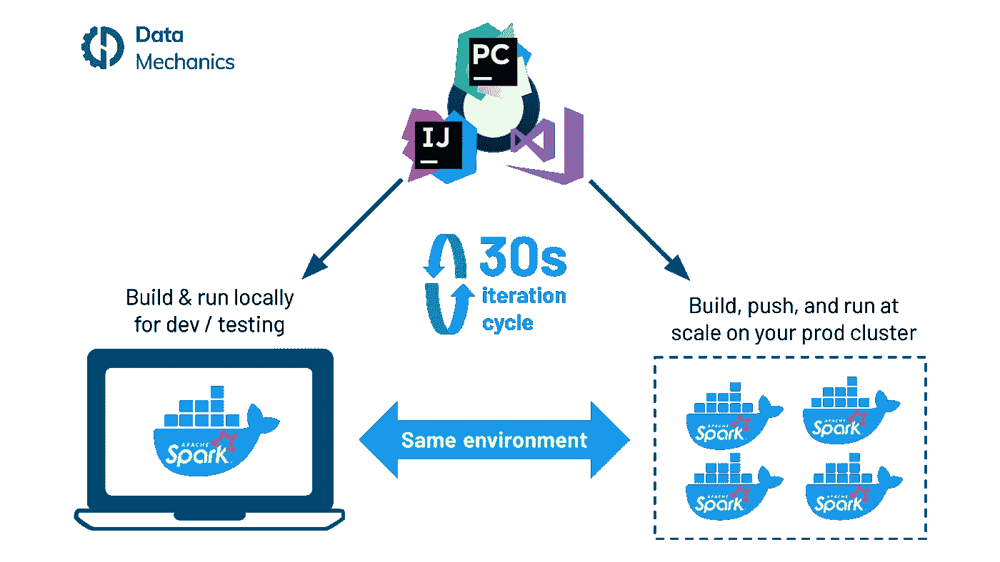
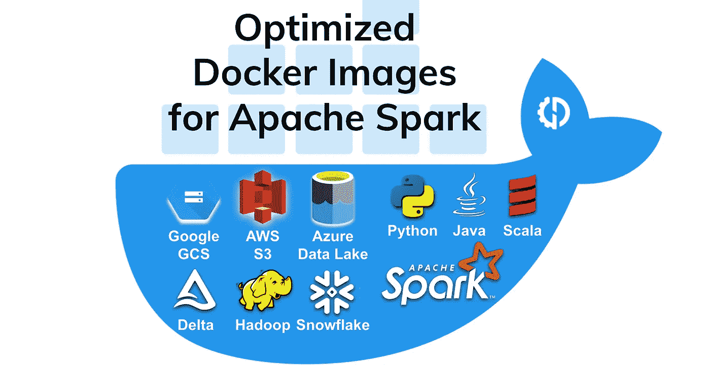
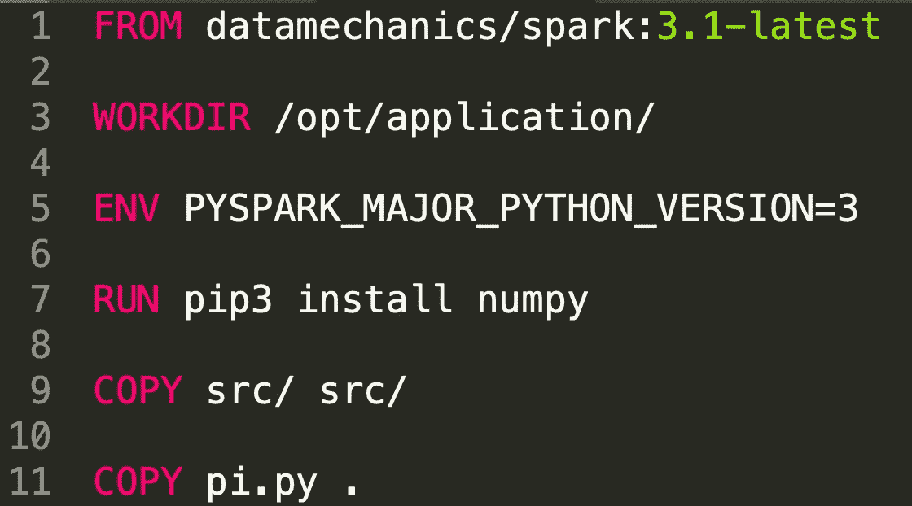

# 针对 Apache Spark 优化的 Docker 映像—现已在 DockerHub 上公开

> 原文：<https://towardsdatascience.com/optimized-docker-images-for-apache-spark-now-public-on-dockerhub-1f9f8fed1665?source=collection_archive---------20----------------------->

## 开始使用 Spark 支持的所有通用数据源。

我们为 [Apache Spark](https://www.datamechanics.co/apache-spark) 优化的 Docker 映像现在可以在我们的 [DockerHub 库](https://hub.docker.com/r/datamechanics/spark)上免费获得，无论你是否是[数据机制](https://www.datamechanics.co)的客户。

这是我们工程团队大量工作的结果:

*   我们构建了一个 Docker 映像舰队，结合了各种版本的 Spark、Python、Scala、Java、Hadoop 和所有流行的数据连接器。
*   在各种工作负载中自动测试它们，以确保包含的依赖关系能够协同工作——换句话说，将您从*依赖地狱*中解救出来😄

我们的理念是提供“附带电池”的高质量 Docker 图像，这意味着您将能够使用 Spark 支持的所有常见数据源开始工作。随着时间的推移，我们将维护这些图像，更新 Spark 的最新版本和错误修复以及各种内置依赖项。

# Spark 的 Docker 形象是什么？

当你在 Kubernetes 上运行 [Spark 时，Spark 驱动程序和执行器都是 Docker 容器。这些容器使用专门为 Spark 构建的图像，其中包含 Spark 分布本身(Spark 2.4、3.0、3.1)。这意味着 Spark 版本不是全局簇属性，因为它适用于纱线簇。](https://datamechanics.co/spark-on-kubernetes)

您还可以使用 Docker 映像在本地运行 Spark。例如，您可以在纯驱动模式下(在单个容器中)运行 Spark，或者在本地 minikube 集群上的 Kubernetes 上运行 Spark。我们的许多用户在开发和测试过程中选择这样做。

使用 Docker 将加速您的开发工作流程，并为您提供快速、可靠且可重复的生产部署。图片作者。

‍To 了解更多关于使用 Docker for Spark 的好处，并查看在您的开发工作流程中使用 Docker 的具体步骤，查看我们的文章: [Spark 和 Docker:您的开发周期快了 10 倍！](https://www.datamechanics.co/blog-post/spark-and-docker-your-spark-development-cycle-just-got-ten-times-faster)。

# 这些 Docker 图像中有什么？

它们包含 Spark 分发版本身——来自开源代码，没有任何专有修改。

它们内置了到公共数据源的连接器:

*   AWS S3 (s3a:// scheme)
*   谷歌云存储(gs:// scheme)
*   Azure Blob 存储(wasbs:// scheme)
*   Azure Datalake 第 1 代(adls:// scheme)
*   蔚蓝数据湖第二代(abfss:// scheme) [‍](https://docs.snowflake.com/en/user-guide/spark-connector.html)

它们还内置了对**Python**&**PySpark**的支持，以及 **pip** 和 **conda** 以便于安装额外的 Python 包。(如果不需要 PySpark，可以使用标签前缀为‘JVM-only’的更简单的映像)

最后，每个映像使用以下组件版本的组合:

*   Apache Spark: 2.4.5 到 3.1.1
*   Apache Hadoop: 3.1 还是 3.2
*   Java: 8 或 11
*   Scala: 2.11 或 2.12
*   Python: 3.7 还是 3.8

请注意，并非所有可能的组合都存在，请查看我们的 [DockerHub](https://hub.docker.com/r/datamechanics/spark) 页面以找到支持列表。

我们的图像包括 GCS、S3、Azure 数据湖、Delta 和雪花的连接器，以及对 Python、Java、Scala、Hadoop 和 Spark 的支持！图片作者。

# 如何使用我们的 Spark Docker 图片

您应该使用我们的 Spark Docker 映像作为基础，然后通过在其上添加您的代码依赖项来构建您自己的映像。这里有一个 Dockerfile 示例可以帮助您开始:

示例 Dockerfile 文件。图片作者。

一旦你建立了你的 Docker 镜像，你可以通过运行以下命令在本地运行它:***Docker run { { image _ name } } driver local:///opt/application/pi . py { args }***

或者您可以将新构建的映像推送到您自己的 Docker 注册中心，然后在您的生产 k8s 集群上使用它！

> *不要以未经验证的方式直接从您的生产集群中提取我们的 DockerHub 映像，因为您有达到速率限制的风险。最好将你的图片推送到你自己的注册中心(或者从 Dockerhub 购买付费计划)。*
> 
> *数据力学用户可以直接使用来自我们* [*文档*](https://docs.datamechanics.co/docs/docker-images) *的图片。它们有更高的可用性和一些数据机制独有的附加功能，比如 Jupyter 支持。*

# 结论——我们希望这些图片对您有用

这些图片对你有用吗？需要添加新的连接器或版本吗？请告诉我们，我们希望得到你的反馈。

*原载于*[*https://www.datamechanics.co*](https://www.datamechanics.co/blog-post/optimized-spark-docker-images-now-available)*。*