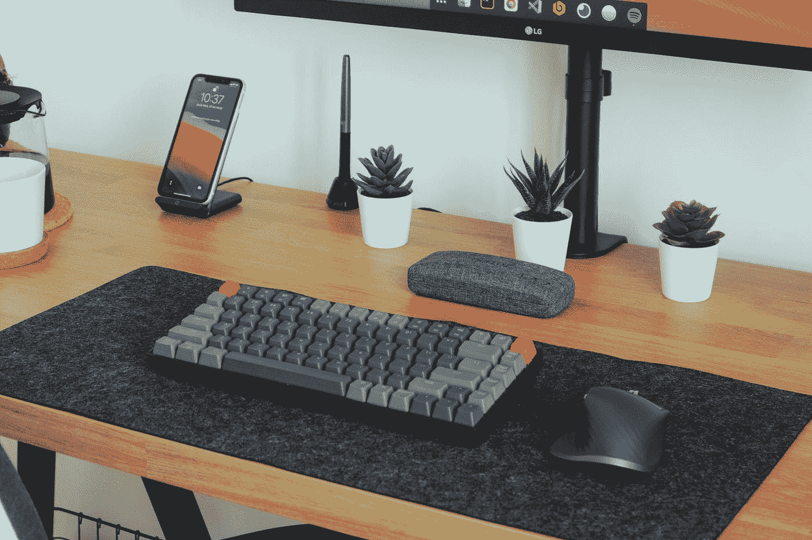
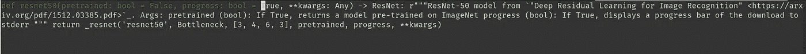
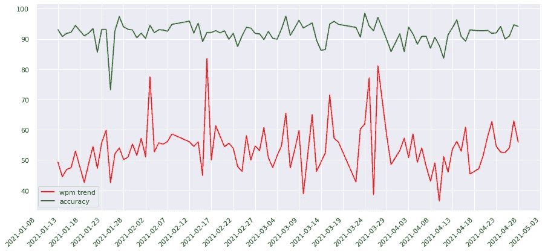

# 使用 Python 优化类型

> 原文：<https://towardsdatascience.com/optimized-typing-with-python-d042681be4b2?source=collection_archive---------13----------------------->



照片由[努贝尔森·费尔南德斯](https://unsplash.com/@nubelsondev?utm_source=medium&utm_medium=referral)在 [Unsplash](https://unsplash.com?utm_source=medium&utm_medium=referral) 上拍摄

## 使用 python 练习和可视化您的输入性能

打字是我们现代日常生活的一部分，因此，学习如何优化打字对像我这样主要在电脑上工作的人来说有很大的好处。

在这篇文章中，我将分享我的日常打字练习，以及我用来记录和可视化我的表现的脚本和软件包。


格伦·卡斯滕斯-彼得斯在 [Unsplash](https://unsplash.com?utm_source=medium&utm_medium=referral) 上拍摄的照片

## 为什么打字？

我是一名机器学习工程师，也就是说我大部分时间都花在我的电脑上，建立模型，写代码。3 年前，当我在攻读一个生成性对抗网络应用的硕士学位时，我开始注意到，如果我开始在打字技巧上下点功夫，我会更有效率。

因此，我学会了如何触摸打字，三个月后，我的标准打字速度从每分钟 60 个字提高到了 95 个字(今天我的平均速度是每分钟 105 个字)，我的编码速度从每分钟 35 个字提高到了 55 到 60 个字。

这种改进对我所有的工作和爱好活动都有很大帮助(比如写作……)，我觉得每个人都可以从一点点打字练习中受益。

## 简化你的打字练习

让我们进入代码！我打字的基本程序超级简单，每天持续大约 5-10 分钟。

我使用 [mltype](https://github.com/jankrepl/mltype) ，这是一个了不起的 cli 工具，可以在你的终端上练习打字。它真的很灵活，开源而且非常整洁！现在，让我们来看看让你的打字练习自动化的脚本。

## 1.导入依赖项

```
import os
import pathlib
import random
import pandas as pd
from datetime import datetime
import sys
import plotly.express as px
import plotly.graph_objs as go
```

## 2.用 mltype 进行打字练习

```
def typePractice(typingDataset):
    files = list(typingDataset.iterdir())
    file = random.choice(files)
    with open(file, "r") as f:
        numberOfLines = len(f.readlines()) - 1

    if numberOfLines<=1:
        numberOfLines=2
    elif numberOfLines>10:
        numberOfLines=10

    os.system(f"mlt file --n-lines {numberOfLines} {file}")    

typingDatasetFolder = "path/to/your/typingDataset"
typingDataset = pathlib.Path(typingDatasetFolder)
typingPerformance = "path/to/your/typingPerformance.csv"
df = pd.read_csv(typingPerformance)
typePractice(typingDataset)
```

在这里，我将所有的 python 文件放在一个名为:`typingDataset`的文件夹中，我从中选择了一个随机文件，并将其放入对 [mltype](https://github.com/jankrepl/mltype) cli 工具的调用中。我用`--n-lines`选项给出我想要的文件行数，然后我就可以开始了。键入界面如下所示:



它非常简约，而且非常好用。

## 3.记录性能并用我的打字性能更新 csv 文件

```
def updateTypingPerformance(df,datedPerformance, typingDfPath="path/to/typingPerformance.csv"):
    df.loc[len(df)] = datedPerformance
    df.to_csv(typingDfPath, index=False)
    return df

cont = "y"
while cont=="y":
    performance = []
    typePractice(typingDataset)
    date = str(datetime.now())
    wpm = input("What was the wpm?")

    acc = input("Waht was the accuracy?")

    performance.append(date)
    performance.append(wpm)
    performance.append(acc)

    updateTypingPerformance(df,performance)

    cont = input("Continue typing?")
```

在这里，我使用 python 的内置`input()`方法获取当前时间并记录我的性能(我想自动完成这一部分，但找不到直接从 mltype 会话中完成的简单方法)。

我给出了一个选项，让我永远继续 while 循环，每次都更新包含我的性能的 csv 文件。

## 4.绘图选项

```
import matplotlib.pyplot as plt
import seaborn as sns
sns.set()
from matplotlib import dates as mdates
from matplotlib import ticker

def plotTyping(typingDf):
    typingDf["wpm"] = pd.to_numeric(typingDf["wpm"])
    typingDf["accuracy"] = pd.to_numeric(typingDf["accuracy"])
    typingDf["date"] = pd.to_datetime(typingDf["date"])
    wpmAcc = typingDf.groupby("date")["wpm", "accuracy"].mean()
    wpm = wpmAcc["wpm"]
    acc = wpmAcc["accuracy"]
    fig, ax = plt.subplots(figsize=(15,7))
    ax.plot(wpm,label="wpm trend",color="red")
    ax.plot(acc, label="accuracy", color="green")
#     wpmAcc["wpm"].plot(label="wpm trend",color="red")
#     wpmAcc["accuracy"].plot(label="accuracy",color="green")
    ax.set_xticks(df["date"])
    ax.xaxis.set_major_formatter(mdates.DateFormatter("%Y-%m-%d"))
    ax.xaxis.set_minor_formatter(mdates.DateFormatter("%Y-%m-%d"))
    plt.gcf().autofmt_xdate()
    ax.xaxis.set_major_locator(ticker.MultipleLocator(5))
    plt.xticks(rotation=45)
    plt.legend()
    plt.show()

if len(sys.argv)>1:
    if sys.argv[1]=="plot":
        plotTyping(df)
```



在这里，我为我当前的打字性能编写了一个简单的绘图选项，用绿色显示每分钟字数，用红色显示准确率。正如我们所看到的，我的准确率平均保持在 90%以上，打字速度保持在每分钟 50 到 60 字左右。

## 关于打字的最终想法

打字很有趣，而编写代码来自动化练习打字的过程更有趣。对我来说，这种简单的脚本解决方案总是很值得去做和分享，我希望你能像我喜欢写作一样喜欢阅读！

如果你想知道更多关于触摸打字和如何改进的信息，你可以在这里查看我的帖子:

[](https://medium.com/digital-diplomacy/type-fast-work-fast-b80eacd10e26) [## 打字快，工作快

### 程序员优化生产力的方法

medium.com](https://medium.com/digital-diplomacy/type-fast-work-fast-b80eacd10e26) 

如果你喜欢这篇文章，请在 [Twitter](https://twitter.com/LucasEnkrateia) 、 [LinkedIn](https://www.linkedin.com/in/lucas-soares-969044167/) 上联系我，并在 [Medium](https://lucas-soares.medium.com) 上关注我。谢谢，下次再见！:)