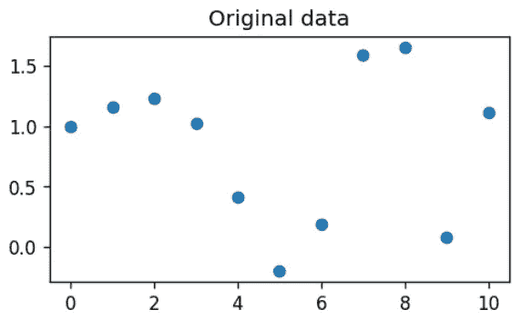

# 优化复杂模拟？使用科学插值

> 原文：<https://towardsdatascience.com/optimizing-complex-simulations-use-scipy-interpolation-dc782c27dcd2?source=collection_archive---------23----------------------->

## 在许多情况下，我们可以使用简单插值(Scipy)进行快速优化，而不是使用复杂的优化算法


**图片来源:**作者创作

# 背景

在复杂的科学或商业研究中插入实验或模拟数据是一种相当普遍的做法。在我的上一篇文章中，我展示了如何使用简单的 Scipy 代码来实现一维或多维。

<https://medium.com/productive-data-science/how-to-interpolate-data-with-scipy-d314143285bc>  

这种方法的一个关键好处是，我们从 Scipy 例程中获得了**精确函数，并可以将其用于多种用途——其中之一是**快速优化**。**

这对于单个实验成本高昂的情况**尤其有用**。在大多数情况下，成本方面远远超出了单纯的计算。想到与**昂贵的产品设计迭代，或者医疗保健(药物测试)**相关的优化问题。作为设计者或研究人员，你不会有无限的预算来进行数百个实验，因为每个实验可能花费数千美元。

相反，你可以，

*   运行一组有限的间隔合理的实验(如果你有关于实验设计的知识，那会有很大的帮助)
*   使用线性、二次或三次样条创建插值函数
*   运行插值函数以评估密集网格(即数千个点)上的实验/模拟结果
*   只需选择最大值或最小值以及相应的指数，即可根据您的要求了解哪个输入设置导致了最小值/最大值

**没有花哨的优化算法。没有昂贵模拟的成本**。只是一些实验设计知识和插值程序。

这种方法不能保证你在所有情况下都有最好的结果。但它在大多数实际情况下都有效。我们来看看为什么。

> 作为设计者或研究者，你不会有无限的预算来进行数百个实验，因为每个实验可能花费数千美元

# 为什么它能工作(在大多数情况下)？

插值主要基于*平滑度*或*连续性*的假设。函数**需要平滑，不要过于跳跃**，以便以合理的精度进行插值。下图说明了这个想法，假设我们无法收集大量的数据点(实验)。


**图片来源:**作者创作

而且，事实证明**大多数现实生活中的连续数据问题也没有那么跳跃**，也就是说，它们足够平滑，可以通过插值技术来处理。因此，在许多情况下，我们可以使用物理模拟和插值的**组合来进行快速优化。**


**图片来源:**作者创作

所以，在这里，


**图片来源:**作者创作

> 这种方法不能保证你在所有情况下都有最好的结果。但它在大多数实际情况下都有效。

# 简单的演示

样板代码在我的 Github repo 中。让我在本文中只展示一些相关的代码片段。

## 模拟和实验功能

假设我们有一个复杂的模拟任务，需要一些时间(这里是 0.1 秒)来完成。实际输出只是一个简单的非线性函数。这是代码，

```
def complex_simulation(x):
    """
    A nonlinear simulation function with some time delay
    """
    time.sleep(0.1)
    y = np.cos(-x**2/9.0)+np.sin(x/6)
    return y
```

我们还定义了一个函数`run_experiment`来运行这个模拟固定的次数。它返回实验域和来自给定边界(低/高端点)的结果。

```
def run_experiments(experiment_bounds,n=10):
    results = []
    low,high = experiment_bounds
    domain = np.linspace(low, high, num=n, endpoint=True)
    for i in domain:
        y = complex_simulation(i)
        results.append(y)
    return (domain,results)
```

比方说，我们运行它 11 次，得到这个数据，



**图片来源:**作者创作

## 插值和优化

一个简单的三次插值(使用 Scipy)，将会给我们这个很好的拟合结果，也是一个新的函数，可以生成任何我们想要的中间结果。


**图片来源:**作者创作

现在，我们可以用详尽的模拟结果编写一个简单的搜索函数来找到最大值出现的点。

```
def **optimum_simulation**(experiment_bounds,n=11):
    """
    Using exhaustive simulations
    """
    domain,results=np.array(run_experiments(experiment_bounds,n=n))
    imax = np.argmax(results)
    return (domain[imax])
```

基本上，它运行实验一定次数(使用之前定义的`run_experiment`函数)并搜索结果数组的`argmax`。这在算法上很简单，但由于模拟的性质，速度并不快。当我们为`n = 11`运行它时，需要大约 1.1 秒，因为每个模拟有 0.1 秒的时间延迟。它得出最佳 x 的结果为， ***x =* 8.0** 。

或者，我们可以定义另一个使用插值函数而不是实际模拟函数的函数。当然，它利用了从有限规模的单次实验中获得的`init_results`。

```
def **optimum_interpolation**(domain,init_results,n=101):
    """
    Using interpolation
    """
    low,high = domain.min(),domain.max()
    ip_interpolated = np.linspace(low, high, num=n, endpoint=True)
    **f3 = interp1d(domain, init_results, kind='cubic')**
    results_interpolated=np.array(f3(ip_interpolated))
    imax = np.argmax(results_interpolated)
    return (ip_interpolated[imax])
```

当我们用 n = 101 运行它时，它在大约 900 微秒内完成，并产生结果 ***x =* 7.54** 。

如果你回头看看实际的函数，你会意识到 ***x =* 7.54 比 *x =* 8.0** 更好的逼近最优值。

这意味着插值方法不仅产生了更快而且更准确的结果。这可能并不适用于所有情况，但是**的速度优势通常会抵消精度**的微小牺牲。

## 实验事项设计

然而，我们必须注意实验的设计。通常，均匀采样的实验空间是最合适的起点。例如，即使对于我们的简单演示，如果我们用均匀随机的 x 值(不是线性间隔的)做实验，我们可能会得到一个次优的插值函数。


**图片来源:**作者创作

有关实验设计以及如何使用 [**Python 包生成健壮的实验计划**](https://doepy.readthedocs.io/en/latest/) 的更多信息，请参见我的文章。

</design-your-engineering-experiment-plan-with-a-simple-python-command-35a6ba52fa35>  

# 在高维空间中非常有用

Scipy 插值例程在二维情况下的工作就像在一维情况下一样简单。由于维数灾难，使用穷举模拟的优化在多个维度上更加复杂和耗时。在这些情况下，插值方法可以派上用场。

这是一个示例结果，其中我们使用 Scipy 插值从稀疏数据中创建了一个平滑的插值 2D 表面。基本上，从 400 个实际数据点，我们创建了一个 4900 数据矩阵，它可以以更高的精度和速度为我们指出最佳点。


**图片来源**:作者创作(来自[同一作者的另一篇文章](https://medium.com/productive-data-science/how-to-interpolate-data-with-scipy-d314143285bc)

# 摘要

在本文中，我们展示了如何使用简单的插值例程和精心选择的、间隔良好的实验点，我们可以创建能够产生快速优化的插值函数。这种方法特别适用于复杂、耗时的科学或技术模拟，这些模拟的响应或多或少是平滑的。

请注意，虽然我们使用 Python 中的模拟函数展示了演示，但是**实验数据可以来自任何来源**(例如，数据库、MATLAB 连接器或流式 API)，Python 中唯一的部分是基于 Scipy 的插值和后续的搜索例程。

应用领域，如半导体设计、化学工艺优化、生产计划等。，可以从这种方法中获益。

喜欢这篇文章吗？成为 [***中等会员***](https://medium.com/@tirthajyoti/membership) *继续* ***无限制学习*** *。如果您使用下面的链接，* ***，我将收取您的一部分会员费，而不会对您产生额外费用*** *。*

[https://medium.com/@tirthajyoti/membership](https://medium.com/@tirthajyoti/membership)