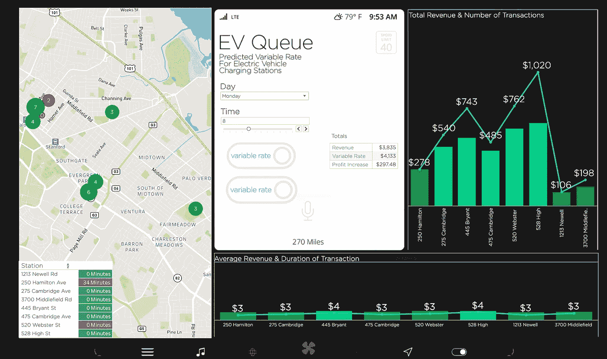

# 优化电动汽车充电站以增加使用

> 原文：<https://towardsdatascience.com/optimizing-electric-vehicle-charging-stations-for-increased-use-f514bbb7ab58?source=collection_archive---------18----------------------->

## 创建预测等待时间和可变使用率仪表板，以重定向电动汽车充电站的流量


詹尼斯·卢卡斯在 [Unsplash](https://unsplash.com?utm_source=medium&utm_medium=referral) 上的照片

2020 年，美国的新电动汽车销量创下 [2.4%的市场份额新高，投资大力推广电动汽车应用的大都市](https://theicct.org/publications/ev-us-market-growth-cities-sept21)[在电动汽车注册和车型可用性可变性方面处于领先地位](https://theicct.org/publications/ev-us-market-growth-cities-sept21)。

这些促进措施包括降低通行费、免费停车、购买奖励和充电基础设施投资。电动汽车的增长与公共和工作场所充电基础设施的可用性直接相关，主要的大都市地区目前每百万人提供 935 个充电器。

但这还不足以引领电动时代的到来。

今年 4 月，[拜登政府宣布了增加美国公共电动汽车充电器数量的雄心勃勃的计划](https://www.whitehouse.gov/briefing-room/statements-releases/2021/04/22/fact-sheet-biden-administration-advances-electric-vehicle-charging-infrastructure/)，称公共充电基础设施在未来十年增加道路上电动汽车数量方面发挥着“关键作用”。

“电动汽车充电基础设施是电动汽车普及的最大障碍，”PitchBook 的高级分析师 Asad Hussain 上个月对纽约时报说。

“你和任何犹豫是否购买电动汽车的人交谈，脑海中浮现的第一个担忧就是里程焦虑。”


亚历山大·安德鲁斯在 [Unsplash](https://unsplash.com?utm_source=medium&utm_medium=referral) 上拍摄的照片

里程焦虑是指担心电动汽车在你到达目的地或充电之前会没电。如果你曾经担心你的手机没电了，想象一下依靠它让你回家。

汽车制造商通过在电动汽车上提供先进的路线规划来解决这种焦虑——基本上是谷歌地图加。用户在车辆用户界面上计划的任何行程都包括预定的充电站——在哪里充电、电池的电量百分比以及在您可以上路之前充电多长时间。

但这些旅行规划服务目前没有考虑的一件事是车站的繁忙程度:有多少人在车站充电，是否有任何地方可供你充电。

随着越来越多的电动汽车上市，对电动汽车充电站的需求将继续增加，这可能会加剧新电动汽车用户的里程焦虑和充电挫折感。

想象一下，坐在充电站的队列中，看着你的电池电量耗尽到 0%，因为接下来的一个小时所有的位置都被占用了。


照片由[何 kei](https://unsplash.com/@whykei?utm_source=medium&utm_medium=referral) 在 [Unsplash](https://unsplash.com?utm_source=medium&utm_medium=referral)

众所周知，与在加油站加油相比，给电动汽车充电确实需要更长的时间，有时可能需要两个小时，这取决于你需要充电多少。

提前向电动汽车司机提供预测的等待时间和各个充电站的充电点可用性可以改变这一切。

根据[今年刚刚发表的一项关于适应性路线规划的研究](https://arxiv.org/abs/2102.06503)，估计充电站的等待时间并根据站点繁忙程度调整出行规划服务可以减少 97%的等待时间。

因此，我决定将这个想法付诸实践，利用帕洛阿尔托市的[公开可用的充电站使用数据](https://data.cityofpaloalto.org/dataviews/257812/ELECT-VEHIC-CHARG-STATI-83602/)来创建仪表板，为消费者显示基于实际充电站使用数据的预测等待时间。

这个想法是为计划出行的电动汽车用户提供当前的使用数据和预测的等待时间，以便他们可以在预计的到达时间内自行选择提供更多可用性的车站。第二个解决方案是通过在车站不经常使用的最佳时间提供较低的费率来激励用户在不太忙的时候使用车站。

在我对数据的初步分析中，我发现帕洛阿尔托公共网络中的电动汽车站，即使是那些相邻的，也有不同的交通模式和高峰繁忙时间。


[时间序列仪表板—表格](https://public.tableau.com/app/profile/celia.sagastume/viz/PaloAltoElectricVehicleChargingStations-TimeSeriesDashboard/EVChargingStations-TimeSeries)

在帕洛阿尔托市中心一个繁忙的车站等待很长时间可以很容易地避免，只要开车几个街区到一个在同一时间窗口有 5 个空位的车站。

但目前，用户没有实时可用信息，这可能会在不久的将来当路上有更多的电动汽车司机时引起一些大麻烦。

创建这些仪表板的第一步是从帕洛阿尔托市获取数据，您可以在这里[选择哪一年来预测等待时间。我选择 2019 年是因为 2020 年是隔离年，但如果你想预测疫情期间充电的等待时间，那么这绝对是你的一年。](https://data.cityofpaloalto.org/dataviews/257812/ELECT-VEHIC-CHARG-STATI-83602/)

接下来是预处理。这个数据集有很多信息，包括每个电动汽车充电插头的 MAC 地址，每个用户的个人邮政编码，以及完成交易的操作(用户或服务器)。就我们的目的而言，我们不需要这些。


Excel 中的原始 Palo Alto 数据

要预测等待时间，您需要站点地址、每个站点插头的唯一标识符(插头 ID 和站点名称的组合)、每次交易的开始时间和结束时间，以及交易数据，如使用的 kWh 和支付的总费用。

在 Excel 中，我创建了两个小时增量的时间窗口，以便预测这些时间段的等待时间。平均事务持续时间大约为两个小时，因此这似乎是跟踪站点繁忙程度的一个很好的基线。

我分别分析了每个工作站的数据，并通过跟踪每个时间窗口中结束的事务之间的时间量，创建了一个运行时间估计值。这意味着如果用户 A 在下午 5:15 离开车站，而用户 B 在下午 5:27 离开同一车站，那么我们有 12 分钟的经过时间。


照片由[迈克尔·福塞特](https://unsplash.com/@michaelfousert?utm_source=medium&utm_medium=referral)在 [Unsplash](https://unsplash.com?utm_source=medium&utm_medium=referral) 上拍摄

如果车站有 1 个或更少的可用位置，我们可以使用交易之间的平均经过时间来估计等待时间，或者下一个用户离开车站所需的平均时间。

最后，我还创建了一些表格，用于计算任意给定时间窗口内每个车站的车辆数量。这包括计数 1)在每个时间窗口中在每个站发起的事务的数量，以及 2)在先前时间窗口中开始的并且在当前时间窗口中仍然存在的事务的数量。

```
=COUNTIFS('Hamilton Ave Station'!$E:$E,"Sunday",'Hamilton Ave Station'!$G:$G,"0", 'Hamilton Ave Station'!$K:$K,"Sunday",'Hamilton Ave Station'!$M:$M,">=0")
```

一些用户让他们的汽车过夜充电，而其他人可能只停留 30 分钟，同时获得快速充电。第一种类型的交易需要在汽车在停车场上的所有时间窗内计数，而第二种类型的交易可以在交易发生的时间窗内计数一次。

对于可变费率，[我使用 PG & E 针对电动汽车用户的可变费率作为可变费率模型的灵感。](https://www.pge.com/en_US/residential/rate-plans/rate-plan-options/electric-vehicle-base-plan/electric-vehicle-base-plan.page)

这种模式鼓励夜间收费，当车站是空的，交易持续时间较长。这是激励那些没有家用充电系统的当地用户整夜停车充电的理想时机。

最后，仪表板。

Tableau 是一个交互式数据可视化程序，允许您创建可以根据用户输入进行更改的仪表板。它是这个项目的完美工具，因为它允许我创建一个最终用户产品的模型，电动汽车司机可以使用它来实时查看预测的等待时间和车站繁忙程度。

我用特斯拉 UI 的截图作为这些仪表盘的背景。


[用户仪表板—预计等待时间](https://public.tableau.com/app/profile/celia.sagastume/viz/PaloAltoElectricVehicleChargingStations-UserDashboard/UserDashboard)

使用 UI 作为指南，我放入了一个地图，显示每个时间窗口和每天可用的点的数量，如果有一个或更少的点可用，每个站的等待时间，以及向用户显示该时间窗口中的交易数量和交易持续时间的数据可视化。

对于电视台所有者，我构建了一个类似的仪表板，但突出显示了对所有者有用的信息，如每个时间窗口每个电视台的总收入和交易数量，以及每次交易的平均收入。


[站长仪表板—收入](https://public.tableau.com/app/profile/celia.sagastume/viz/PaloAltoElectricVehicleChargingStations-StationDashboard/StationDashboard)

在确定最适合激励用户的时间窗口方面，每笔交易的平均收入和电视台的繁忙程度非常有用。


所有加油站晚上 10 点的交易持续时间和平均收入

使用车站仪表板，我们可以确定夜间停车是平均收入最高的最长交易，同时也是车站最不繁忙的时间。

最后，电站所有者仪表板提供了在标准费率(0.23 美元/千瓦时)和建议的可变费率之间切换的能力，这改变了按时间窗口收费的金额。通过在车站应用每千瓦时的可变费率，我们可以通过提供较低的夜间费率来激励夜间停车——这遵循了 PG&E 为电动汽车用户推出的可变费率模式。



[车站所有者表仪表板—应用可变利率](https://public.tableau.com/app/profile/celia.sagastume/viz/PaloAltoElectricVehicleChargingStations-StationDashboard/StationDashboard)

Tableau 是一个非常棒的数据可视化工具，也可以用来为消费者和生产者创建数据驱动的最终产品的模型。下次你有一个数据驱动的业务或应用程序的想法，不要忘记使用 tableau 来展示你心目中的真实世界的最终产品。

查看[我的 github](https://github.com/CeliaSagas) 了解完整的[电动汽车队列项目](https://github.com/CeliaSagas/EV-Queue)，以及我的个人网站[*celiasagastume.com*](https://celiasagastume.com/)了解更多信息。