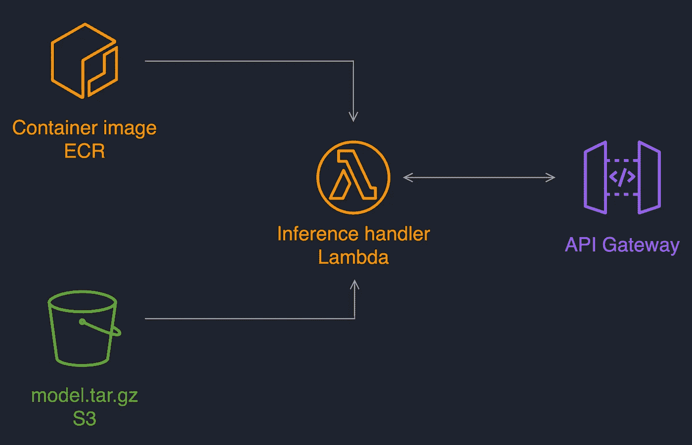
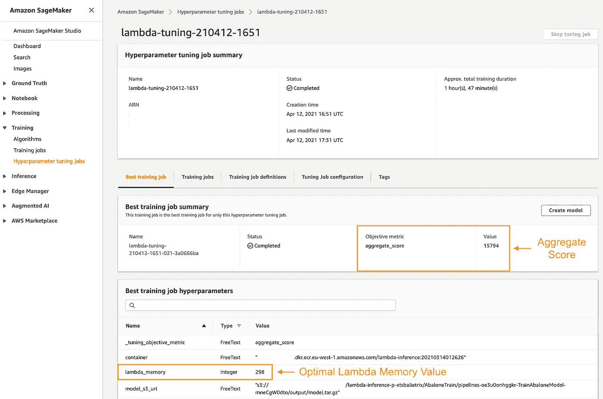
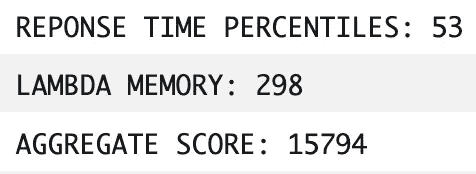

# 用 Amazon SageMaker 优化无服务器推理服务的性价比

> 原文：<https://towardsdatascience.com/optimizing-the-price-performance-ratio-of-a-serverless-inference-service-with-amazon-sagemaker-5969688a2074?source=collection_archive---------44----------------------->

## 使用 SageMaker 超参数调整和 Locust 为 AWS Lambda 推理寻找最佳设置

我最近发表了一篇关于使用 Amazon SageMaker Pipelines、Amazon API Gateway 和 AWS Lambda 进行无服务器模型部署的分步指南。

[菠萝供应公司](https://unsplash.com/@pineapple?utm_source=unsplash&utm_medium=referral&utm_content=creditCopyText)在 [Unsplash](https://unsplash.com/?utm_source=unsplash&utm_medium=referral&utm_content=creditCopyText) 上拍摄的照片

有了 AWS Lambda ，你只需为你使用的东西付费。Lambda 根据请求数量、执行持续时间和分配给函数的内存量收费。那么你应该给你的推理函数分配多少内存呢？

在这篇文章中，我将展示如何使用 [SageMaker 超参数调优](https://docs.aws.amazon.com/sagemaker/latest/dg/automatic-model-tuning.html) (HPO)作业和一个负载测试工具来自动优化无服务器推理服务的性价比。

我们将重用 XGBoost 模型二进制和 Lambda 推理容器，就像我在上一篇文章中所做的那样。我们将指定一个 Lambda 内存范围，并让 SageMaker 根据延迟-内存总得分找到最佳值。SageMaker 将运行许多作业，每个作业都创建一个推理服务，对其进行负载测试，并返回分数进行优化。我们将使用 [Locust](https://github.com/locustio/locust) 和 [Invokust](https://github.com/FutureSharks/invokust) 包装器从 SageMaker 作业中加载测试。

# 演练概述

我们将通过 3 个步骤找到 Lambda 的最佳内存分配:

*   我们将首先使用 [Boto3](https://boto3.amazonaws.com/v1/documentation/api/latest/index.html) 从 SageMaker 训练作业中创建和删除推理服务。
*   然后，我们将使用 Invokust 对服务进行负载测试，并为性价比生成一个总得分。
*   最后，我将展示如何启动 SageMaker HPO 作业来自动找到最佳内存值。

# 先决条件

要浏览此示例，请确保您具备以下条件:

1.  对于无服务器推理服务，我们将重用我上一篇文章中的容器和二进制模型。开始之前，请确保您熟悉本例中的。
2.  熟悉 SageMaker [超参数优化](https://docs.aws.amazon.com/sagemaker/latest/dg/automatic-model-tuning.html) (HPO)岗位。
3.  使用[工作室](https://www.youtube.com/watch?v=wiDHCWVrjCU)，一个[笔记本实例](https://www.youtube.com/watch?v=X5CLunIzj3U)，或者从你的笔记本电脑访问 SageMaker 环境。
4.  将这个 [GitHub 库](https://github.com/SofianHamiti/amazon-sagemaker-hpo-aws-lambda-locust)克隆到您的环境中来遵循这些步骤。

# 步骤 1:使用 Boto3 从 SageMaker 培训作业中创建和删除推理服务

首先，我们将使用 Boto3 创建基于 API Gateway 和 AWS Lambda 的简单推理服务。每个 SageMaker 培训作业将通过创建一个服务开始，然后在结束前删除它。

作者图片:无服务器推理服务视图

对于训练作业，我们将使用 PyTorch 估计器和来自 [source_dir](https://github.com/SofianHamiti/amazon-sagemaker-hpo-aws-lambda-locust/tree/main/source_dir) 文件夹的脚本。这里我们对使用提供的容器比框架本身更感兴趣。

容器入口点是 [entry_point.py](https://github.com/SofianHamiti/amazon-sagemaker-hpo-aws-lambda-locust/blob/main/source_dir/entry_point.py) ，你可以在[栈文件夹](https://github.com/SofianHamiti/amazon-sagemaker-hpo-aws-lambda-locust/tree/main/source_dir/stack)下找到 boto3 脚本。

## 用 Boto3 创建 Lambda 函数

我们将使用 [ApiGateway](https://github.com/SofianHamiti/amazon-sagemaker-hpo-aws-lambda-locust/blob/main/source_dir/stack/api_gateway.py) 和 [LambdaFunction](https://github.com/SofianHamiti/amazon-sagemaker-hpo-aws-lambda-locust/blob/main/source_dir/stack/lambda_function.py) 类来创建服务。

下面是带有简单创建和删除函数的 LambdaFunction 类:

Lambda 函数的关键参数是:

*   容器:包含推理代码的容器图像 URI。
*   model _ S3 _ uri:S3 的模型二进制位置。
*   内存:分配给函数的内存。它根据 SageMaker HPO 的输入而变化。
*   role:由函数承担的 IAM 角色。

# 步骤 2:负载测试推理服务，并给它一个性价比分数

当一个推理服务被创建时，我们的 [entry_point.py](https://github.com/SofianHamiti/amazon-sagemaker-hpo-aws-lambda-locust/blob/main/source_dir/entry_point.py) 执行一个负载测试来获得它的延迟响应性能。

为此我们使用了 [Locust](https://github.com/locustio/locust) ，这是一个用 Python 编写的开发人员友好的开源负载测试工具。 [Invokust](https://github.com/FutureSharks/invokust) 是一个从 Python 本身运行 locust 的包装器，不需要使用 Locust 命令行。它使得从 SageMaker 培训工作中运行负载测试器变得非常容易。

SageMaker 脚本模式使得通过一个 [requirements.txt](https://github.com/SofianHamiti/amazon-sagemaker-hpo-aws-lambda-locust/blob/main/source_dir/requirements.txt) 文件安装这些依赖项变得很容易。

## 使用示例负载创建一个 locust API 用户

您可以在下面找到一个供 Locust 使用的用户行为示例:

它将向推理服务发送一个示例负载，以便从中获得预测。

## 运行负载测试并对推理服务评分

然后，我们使用 Invokust 模拟 1000 个用户，100 的生成率，负载测试的运行时间为 1 分钟:

这将允许我们收集推理服务的统计数据。特别是，我们希望使用响应时间的第 95 百分位统计数据作为评估服务性能的关键指标。

下面是来自我们入口点的负载测试代码片段:

在第 11 行中，我们为推理服务计算了一个基本的总分。为了便于说明，我们简单地将 Lambda 内存和响应时间的第 95 个百分点相乘，得到一个数字。这是我们将要求 SageMaker 在 HPO 工作中尽量减少的数字。

根据您的 ML 项目的延迟和成本要求，随意使用更复杂的评分。

# 第三步:启动 SageMaker HPO 工作，寻找最佳性价比

现在我们准备启动我们的 SageMaker HPO 工作！您可以在下面找到一个示例笔记本，使用我们的代码启动一个示例笔记本:

HPO 的工作将使用[贝叶斯搜索](https://docs.aws.amazon.com/sagemaker/latest/dg/automatic-model-tuning-how-it-works.html)，并尝试最小化我们推理服务的总得分。这是为了根据我们的 XGBoost 模型找到一个最佳的延迟-内存(成本)比。

## 分析您在 HPO 工作的结果

当您的 HPO 作业结束时，您可以导航到 SageMaker 控制台并找到它的结果。在 *Best training job* 选项卡下，您可以找到 SageMaker 找到的最低分数以及您可以在推理服务中使用的相关 Lambda 内存。

作者图片:在我的例子中，300MB 似乎是分配给 Lambda 的一个不错的值

快速查看该作业的 CloudWatch 日志，可以发现该推理服务的响应时间为 53 毫秒:

作者图片:查看 CloudWatch 日志，并根据工作进行评分

# 结论

在本文中，我展示了如何使用 Amazon SageMaker 来优化无服务器推理服务的性价比。在我的[上一篇关于使用 SageMaker 管道的无服务器部署的文章](/deploying-a-serverless-inference-service-with-amazon-sagemaker-pipelines-2d2f3cc96c39)中，我给 Lambda 函数分配了 1024MB。通过使用 SageMaker HPO，我们自动发现我们可以改为分配 300MB，并且仍然可以从服务获得 53 毫秒的延迟响应。这是 3 倍的内存分配差异！

现在，使用这种模式来优化其他基础设施堆栈怎么样？SageMaker 端点，KFServing，其他？请随意分享你的想法。