# 利用会议室评分者数据优化您的网络会议背景

> 原文：<https://towardsdatascience.com/optimizing-your-web-conference-background-with-room-rater-data-dad61f966d4a?source=collection_archive---------40----------------------->


照片由 [Beci Harmony](https://unsplash.com/@becihannah?utm_source=unsplash&utm_medium=referral&utm_content=creditCopyText) 在 [Unsplash](https://unsplash.com/photos/mzN7eMmv9IM?utm_source=unsplash&utm_medium=referral&utm_content=creditCopyText) 上拍摄

## 通过将自然语言处理和分类算法应用于房间评级者的推文，我们可以学到什么？

在 Zoom calls 上，你对你背后的事情花了多少心思？远程工作，至少是部分时间，可能会成为我们中许多人的习惯。虽然你可能可以在工作中穿着运动裤，但你的演讲中有一个新的元素你以前可能没有考虑过:你的背景装饰、灯光和拍摄角度。

这个项目使用自然语言处理和机器学习管道来预测人们的网络会议背景的质量。这些模型在从房间评级员(@ratemyskyperoom)推特账户收集的推特上进行训练和测试。这个帐户发布人们的网络会议背景照片，评论背景美学，并给他们打 0-10 分。

自然语言处理用于对 tweet 文本进行标记，以识别在背景评估标准中使用的关键词汇。然后，标记化的文本被输入到机器学习模型中，在该模型中测试几个分类器预测评级的能力。

以下是房间评核人给出的较低和较高分数的示例:

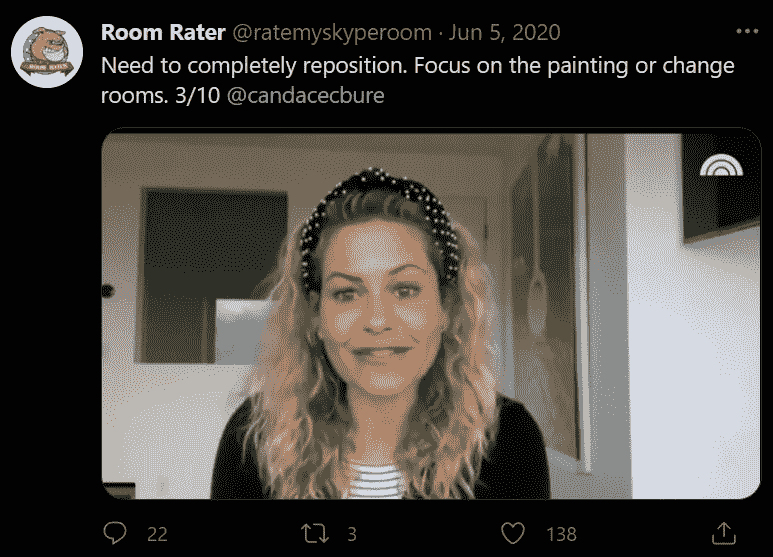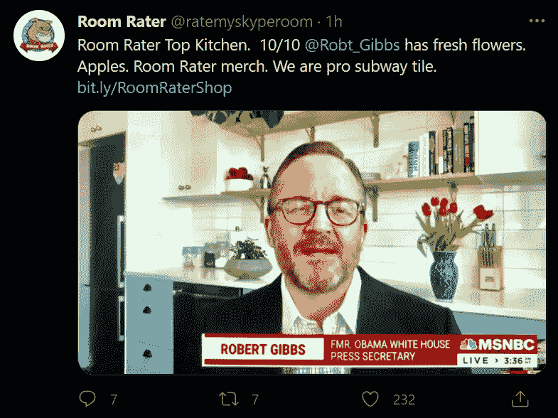

让我们看看数据对如何从 3/10 提高到 10/10 有什么说明。

## 挑战

在 COVID 疫情开始时，许多专业人士发现自己突然开始在家工作，要求他们在厨房、客厅、卧室参加会议，如果幸运的话，还可以在家庭办公室参加会议。

许多人不习惯在这种背景下展示自己，甚至可能更不知道他们的背景是如何形成他们给人的印象的一部分。

输入房间评级人。这个 Twitter 账户开始给人们的网络会议背景打分，称赞他们在背景中对植物和书籍的良好安排，或者批评他们的照明和相机角度。

如果我们将自然语言处理应用于房间评级员的推文，我们能破解他们的评分系统并预测 10/10 的背景吗？

## 机器学习管道:输入和输出

**变量**

*预测变量:*推文文本

*结果变量:*评级，1-10 级的多类别变量

**评估指标**

为了评估分类模型，将使用以下指标:

*   *准确性* —准确预测的标签部分
*   *精度* —正确预测的特定类别的预测部分(例如有多少预测为 9 的实际上是 9)
*   *回忆* —正确预测的特定 a 类的部分(例如。有多少个实际的 9 被预测为 9)
*   *F1 得分*——精确度和召回率的调和平均值
*   *ROC AUC 得分*—ROC 曲线下的面积(真阳性率对假阳性率)，. 5 表示模型表现与随机分类相当。

因为评级是有序的，所以上面的度量没有考虑到错误分类的程度。他们不会意识到把 10 错划为 9 比把 10 错划为 2 更好。因此，我们还将使用以下数据点来评估与正确值的距离:

*   实际评分和预测评分之差的平均绝对值

## 数据收集

这里有一些资源可以帮助你开始使用 Twitter API 和一个有用的 Python 包来获取 tweets:

*   [https://developer . Twitter . com/en/docs/Twitter-API/tweets/lookup/introduction](https://developer.twitter.com/en/docs/twitter-api/tweets/lookup/introduction)
*   [https://docs.tweepy.org/en/latest/](https://docs.tweepy.org/en/latest/)
*   [https://docs.tweepy.org/en/v3.10.0/cursor_tutorial.html](https://docs.tweepy.org/en/v3.10.0/cursor_tutorial.html)

创建一个函数来收集来自 [@ratemyskyperoom](http://twitter.com/ratemyskyperoom) 的推文，如果我们想扩展我们的数据集，可以很容易地返回来收集更多的推文。

一旦你收集了推文并把它们存储在一个数据帧中，下面是它们的样子:

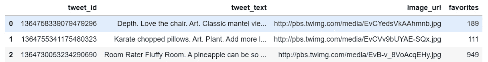

在将数据加载到模型中之前，我们需要将数据解析成 X 和 y 变量。

## 数据预处理

准备数据集进行分析的第一步是提取结果变量，即评级。幸运的是，房间评分者的评分格式是一致的，这使我们能够将评分识别为“/10”之前的数字。

## 数据探索

在选择和应用模型之前，我们应该花时间了解我们的数据。

直方图显示结果变量严重不平衡，接近 10/10。我们将通过各种模型探索解决这一问题的方法。

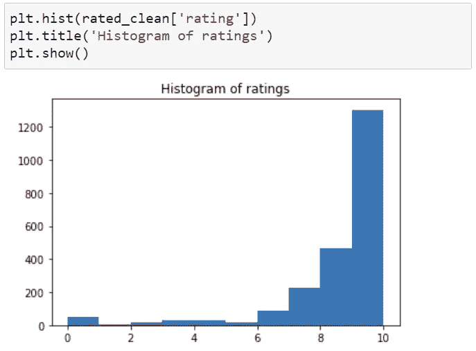

(图片由作者提供)

## 自然语言处理

我们使用了几种自然语言处理技术来识别房间评级者推文中最常见的词语:

*   删除标点符号、URL 和其他非文本字符，并规范大小写
*   删除英语停用词(the，a，an)
*   单词标记化将句子分解成单词单元进行分析
*   将像 plant 和 plant 这样的单词处理成单个标记

在将表征输入分类模型之前，可视化表征可能是有帮助的。

让我们来看看 10/10 最常见的单词。

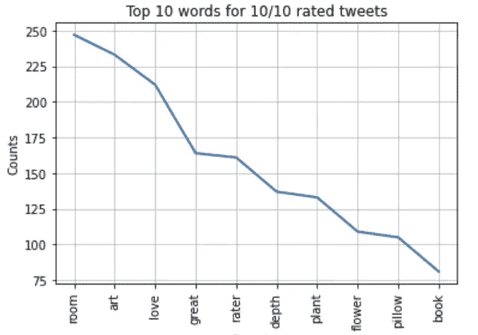

(图片由作者提供)

我们可以推断，房间评级机构称赞背景艺术的大量使用。植物、鲜花、枕头和书籍也是很好的配饰，也能营造一种深度感。

对其他评级重复这一分析，我们看到中低评级的背景需要在**相机**角度上进行工作，并保持它们的**线**在视线之外。背景得分在 7-9 分范围内的有一些基本的东西，可以专注于融入像**植物**和**艺术**这样的元素来增加趣味性。如果你身后有一面空白的白墙，你将被指控制作了一个**人质** **视频**，并可能获得 2 或 3 级评分。

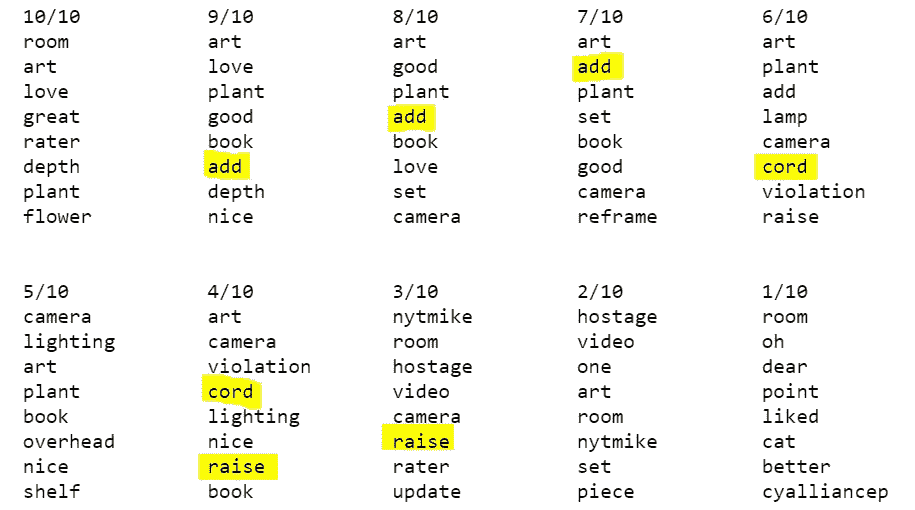

按背景评级排列的热门关键词。(图片由作者提供)

## 机器学习管道

评估了五个分类器:

*   随机森林分类器(在不同的子样本上拟合多个决策树分类器，以最小化过度拟合)
*   平衡随机森林分类器(通过使用欠采样来平衡随机森林分类器)
*   梯度推进分类器(运行多个决策树分类器以最小化损失函数)
*   简易集成分类器(使用 AdaBoost 分类器作为基本估计器，对引导样本采用随机欠采样)
*   有序逻辑回归(考虑到评级的顺序是有意义的)

GridSearchCV 用于评估分类器的几种参数组合。

以下函数可以帮助我们重新运行多个分类器的评估，而不必为每个模型重复代码。

1.  由于预测变量是多类别的(输出范围为 0-10)，结果标签必须二进制化，以便计算 ROC AUC 得分。

2.将预测评级合并回原始数据框架将允许我们通过可视化和统计来比较实际值和预测值。

3.创建的可视化函数，例如实际值与预测值的热图，可以快速显示结果。

4.打印评估分数的集合可以帮助我们更容易地比较模型。

让我们来看两个不同的模型，随机森林分类器和一个解决数据中类别不平衡的变体。

## 建立和应用模型

下面的管道首先使用前面开发的标记器转换文本，然后应用选择的分类器。使用 GridSearchCV，您可以同时评估几组参数，并返回最佳参数。

GridSearchCV 选择的参数:

```
model_rf.best_params_{'clf__class_weight': 'balanced_subsample',
 'clf__min_samples_leaf': 2,
 'clf__n_estimators': 100}
```

快速查看实际评分和预测评分:

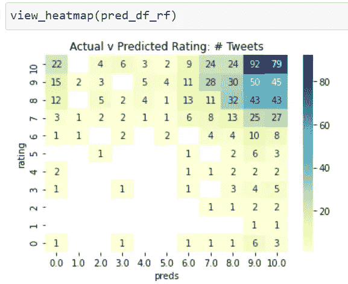

(图片由作者提供)

```
print_scores(y_test_rf, y_pred_rf, pred_df_rf)accuracy score:  0.45
precision score:  0.5
recall score:  0.45
f1 score:  0.46
roc_auc_score:  0.65
avg diff, actual v pred:  2.36
```

就任何评估指标而言，模型性能都不是很强。平均而言，它预测的评分与实际评分相差 2 个多点。让我们使用平衡随机森林分类器重新运行该模型，该模型旨在通过欠采样解决类别不平衡问题。

查看平衡随机森林分类器的指标，该模型在指标上的得分甚至更低:

```
accuracy score:  0.1
precision score:  0.33
recall score:  0.1
f1 score:  0.11
roc_auc_score:  0.55
avg diff, actual v pred:  4.54
```

为了理解其中的原因，让我们将随机森林分类器和平衡随机森林分类器的实际评级分布与预测评级进行比较:

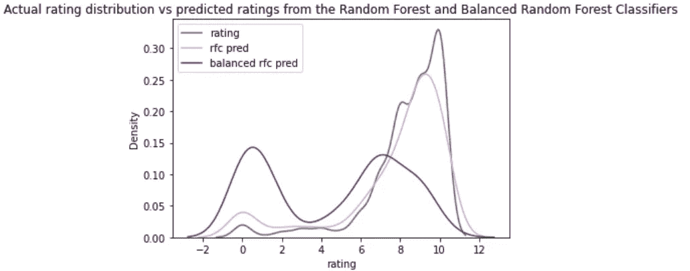

(图片由作者提供)

上面的分布图将实际评级与随机森林分类器和平衡随机森林分类器的预测评级进行了比较。我们可以看到平衡分类器产生了更广泛的预测分布。

我们可能要考虑测试数据集是否反映了真实世界的现实。我们知道房间评级提供了很多 10/10 评级。这与现实相符吗，还是房间评级者在他们选择发布的照片中引入了偏见？从个人经验来说，我在同事中看到的平均背景(包括我自己！)是相当简单和一维的，可能更接近于 3/10 而不是 10/10。

## 梯度增强、平衡 AdaBoost 和有序逻辑回归

其余的模型，梯度增强分类器、平衡 AdaBoost 分类器和有序逻辑回归，对度量执行类似的操作。

像平衡随机森林分类器一样，平衡 AdaBoost 分类器也使分布变平。平衡 AdaBoost 的性能优于平衡随机森林。我们可以在上面看到，平衡的随机森林导致了更极端的重新平衡，峰值在 0/10 和 7/10 的评级附近，而不是像实际值那样的 10/10。平衡 AdaBoost 峰值出现在 9/10，更接近实际值。

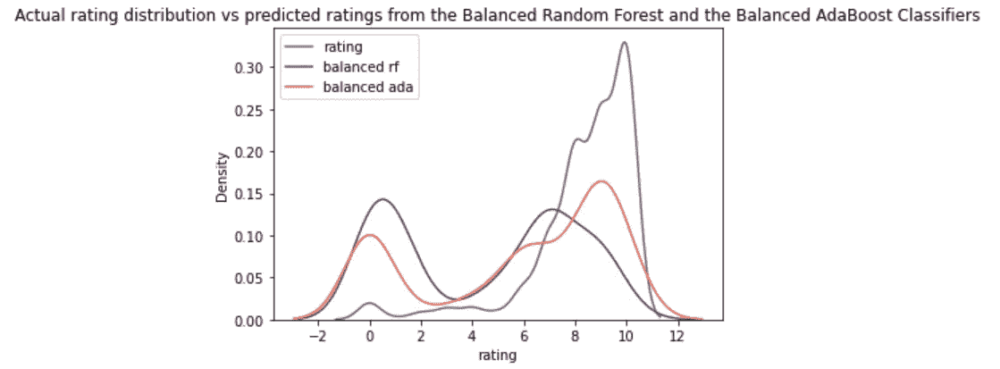

(图片由作者提供)

尽管利用了结果变量的有序性质，有序逻辑回归并没有胜过其他模型，但是开发一种将有序方法应用于其他分类器的定制集成方法可能是值得测试的。有序逻辑回归更接近真实数据集，比平衡模型更接近 10/10:

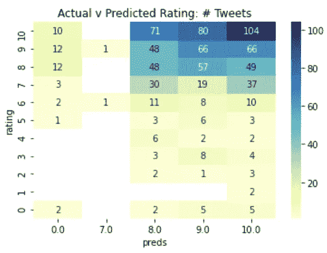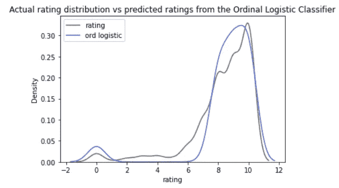

(图片由作者提供)

## 外卖食品

通过自然语言处理，我们能够识别出构成良好背景的关键元素:艺术、植物和书籍。我们还了解到，仅仅拥有这些元素并不能成为很好的背景。对于顶级收视率，还必须创造一种深度感，注意照明，并使用熟练的取景和拍摄角度。

机器学习模型表现不佳。一个挑战是中低评级的代表性不足。也很难判断模型在现实世界中的表现如何，因为样本数据是由房间评级机构预先选择的。10/10 背景的过度呈现可能是由于房间评级者选择他们喜欢的照片，而你的日常背景可能更平庸。

## 进一步改进

我们可以从几个方向从这些数据中提取更多信息。

**情感分析**

向管道中添加额外的情感分析步骤可以改进该模型。我们看到像“深度”、“照明”、“重构”这样的普通词，但如果我们能更好地区分这些词是正面使用还是负面使用，我们会获得更多的价值。

**动词形式分析**

识别动词类型，查看是否使用了命令形式，也有助于我们识别房间评定者是在称赞此人的有效使用，还是在提出建议。例如，在“良好的重构”中使用动名词(-ing)是积极的，而在“重构”中使用命令形式是一种改进的建议。

**深度学习和图像分类**

另一个可以增强模型的数据源是实际的照片。可以开发一种神经网络来识别 10/10 背景中的视觉相似性。像情感分析一样，这个模型可以帮助评估照明的质量、装饰的位置和摄像机的位置。

人们可以进一步推进这个项目，创建一个应用程序，允许用户上传他们的网络背景照片，并通过图像分析，建议添加植物，艺术品，书籍，或调整照明和框架。

> 你认为 10/10 的背景是什么样的？房间评级员有最终决定权吗？

点击此处访问 GitHub 知识库: [laurenmarar/RoomRater:使用数据科学优化您的缩放背景(github.com)](https://github.com/laurenmarar/RoomRater)

**致谢**

这篇博文是 Udacity.com 大学数据科学纳米学位顶点项目的一部分。