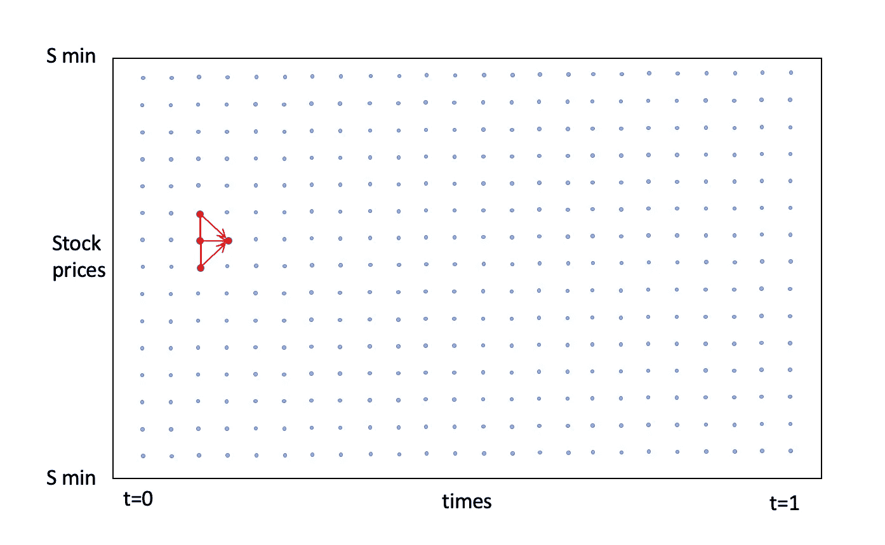

# 期权定价使用布莱克-斯科尔斯模型，没有公式

> 原文：<https://towardsdatascience.com/option-pricing-using-the-black-scholes-model-without-the-formula-e5c002771e2f?source=collection_archive---------12----------------------->

## 定量金融学基础的另一个视角，布莱克-斯科尔斯公式。

每个选修金融课程的大学生都见过布莱克-斯科尔斯-默顿期权定价公式。它又长又丑，令人困惑。它甚至没有给出期权定价的直觉。它的推导是如此的困难，以至于斯科尔斯和默顿为此获得了 1997 年的诺贝尔奖(布莱克于 1995 年去世)。它依赖于费曼-卡奇定理和风险中性指标，但我不会深入探讨。

([https://en . Wikipedia . org/wiki/Black % E2 % 80% 93 choles _ equation](https://en.wikipedia.org/wiki/Black%E2%80%93Scholes_equation))。

# 布莱克-斯科尔斯偏微分方程

期权的定价可以用 Black-Scholes 偏微分方程(BS PDE)来完成。BS PDE 可以通过将 Ito 引理应用于几何布朗运动，然后设置必要条件以满足连续时间 delta 对冲来导出。


布莱克-斯科尔斯偏微分方程。

我们将使用 Python 数值求解这个方程。这种方法的主要优点是它绕过了用数值方法进行的非常复杂的分析计算，这些计算是由我们的计算机来完成的。

# 偏微分方程的数值解

当我们试图用数值方法求解偏微分方程时，我们需要先建立一些东西。首先，我们将使用它来评估执行价格为 k 的欧式看涨期权。我将使用的方法称为有限差分法，它涉及到建立一个网格点。

这个网格将用于点对点模拟 PDE。x 轴上的网格将代表模拟时间，范围从`[0,1]`开始，y 轴将代表可能的股票价格，范围从`[S_min,S_max]`开始。结果将是一个三维图形，我们的工作是确定网格上每个点的期权价格。


点网格。(图片由作者提供)

为了在网格上进行模拟，我们需要确定网格的 3 个边界(边缘)条件。在我们的例子中，我们可以对网格的顶部、底部和最后边界这样做。我们稍后还会看到，由于这个原因，我们将反向模拟等式**。底部是最容易的，我们将设置`S_min=0`。顶部条件有点棘手。它应该远高于期权的执行价格 K，以确保期权的价值`V = max( S-K, 0)`总是(不发生`p < 0.0001`的概率可以忽略不计)支付`S-K`。我们可以通过设置`S_max`远离平均值 8 个标准差来做到这一点，因为股票价格是对数正态分布的。所以，如果我们取`S_max=8sigma*(T-t)^0.5`，我们就保证了那个属性。**

**`S_max`处的选项值`V`可以使用复制自变量来推导。如果一个衍生品在时间 t 支付`S-K`，我们可以通过购买 1 个单位的股票并将`e^(-r(1-t)*K`放入无风险银行账户来复制它。所以这使得选项的值为大 S: `V(t,S_max)=S_max — e^(-r(1-t)*K`。**

**最后的边界条件将是欧式看涨期权的收益，因为这将给出期权的确切价值。所以三个边界条件是:**

****

**边界条件。**

**我们现在已经建立了网格的边界条件。接下来，我们需要离散化我们的空间，这将允许我们对 BS PDE 的导数使用中心差分估计。**

****

**布莱克-斯科尔斯偏微分方程。**

**在股价方向(垂直)上，我们引入 M 个点。来思考一下这个，假设 S 的可能范围是`[0,100]`带`M=100`。这将产生 100 个股票点，每个整数为 1。我们在时间方向(水平)用 N 步做同样的事情。这将创建一个`N+1 x M+1`矩阵，我们可以用它来创建导数估计值。**

# **估计导数**

**有了离散化的空间，我们可以对期权价值的导数(希腊人的 delta 和 gamma)使用中心差分估计。**

****

**BS PDE 中的导数近似。**

**将这些代入布莱克-斯科尔斯偏微分方程，我们得到**

****

**具有中心差分估计的布莱克-斯科尔斯偏微分方程。**

**这可以很容易地通过想象上面的等式来理解。基本上需要 3 个点，并计算这些点的加权平均值，以在时间上向前**一步**到达点。**

****

**(图片由作者提供)**

**通过重复上面的过程，我们可以一步一步地模拟上面的网格。注意，因为我们知道最后的边界条件，而不是第一个，我们将会回到过去。**

## **模拟**

**将欧拉-丸山方案应用于离散化的布莱克-斯科尔斯偏微分方程，我们得到:**

****

**这是一个 ODEs 系统，其中 V 是每个时间步长的期权价格的列向量。此外，我们需要在上面包含时间 t: `W_t`的边界条件的方程中添加一个向量，然后我们可以用矩阵符号重写方程，这样`Lambda`就包含了乘数。这个方程现在包含了我们所有的信息，被称为显式方法。它使用关于 t 的 V 的后向差估计，如果我们正在模拟前向 It 时间(我们正在模拟后向)，这相当于前向差。**

****

**所以，为了编码，我们需要边界条件的函数。**

```
import numpy as np
import scipy.sparse
import matplolib.pyplot as plt
from mpl_toolkits.mplot3d import Axes3Ddef bottom_boundary_condition(K,T,S_min, r, t):
    return np.zeros(t.shape)def top_boundary_condition(K,T,S_max, r, t):
    return S_max-np.exp(-r*(T-t))*Kdef bottom_boundary_condition(K,T,S_min, r, t):
    return np.maximum(S-K,0)
```

**我们还需要函数来计算`Lamda`中的系数。我为此编写了两个函数，这是我在对带有中心差分估计的方程进行了一些代数运算以隔离每个`V_i`之后得到的。**

```
def compute_abc( K, T, sigma, r, S, dt, dS ):
    a = -sigma**2 * S**2/(2* dS**2 ) + r*S/(2*dS)
    b = r + sigma**2 * S**2/(dS**2)
    c = -sigma**2 * S**2/(2* dS**2 ) - r*S/(2*dS)
    return a,b,cdef compute_lambda( a,b,c ):
    return scipy.sparse.diags( [a[1:],b,c[:-1]],offsets=[-1,0,1])def compute_W(a,b,c, V0, VM): 
    M = len(b)+1
    W = np.zeros(M-1)
    W[0] = a[0]*V0 
    W[-1] = c[-1]*VM 
    return W
```

**将所有这些组合在一个函数中，该函数基本上用期权值填充`N x M`矩阵，并返回期权值`V`、时间`t`和股票价格`S`。**

```
def price_call_explicit( K, T, r, sigma, N, M):
    # Choose the shape of the grid
    dt = T/N
    S_min=0
    S_max=K*np.exp(8*sigma*np.sqrt(T))
    dS = (S_max-S_min)/M
    S = np.linspace(S_min,S_max,M+1)
    t = np.linspace(0,T,N+1)
    V = np.zeros((N+1,M+1)) #...

    # Set the boundary conditions
    V[:,-1] = top_boundary_condition(K,T,S_max,r,t)
    V[:,0] = bottom_boundary_condition(K,T,S_max,r,t)
    V[-1,:] = final_boundary_condition(K,T,S) #...

    # Apply the recurrence relation
    a,b,c = compute_abc(K,T,sigma,r,S[1:-1],dt,dS)
    Lambda =compute_lambda( a,b,c) 
    identity = scipy.sparse.identity(M-1)

    for i in range(N,0,-1):
        W = compute_W(a,b,c,V[i,0],V[i,M])
        # Use `dot` to multiply a vector by a sparse matrix
        V[i-1,1:M] = (identity-Lambda*dt).dot( V[i,1:M] ) - W*dt

    return V, t, S
```

**绘制`t`和`S`与`V`的对比图，我们得到了每个时间-股票组合的期权收益图。**

****

**期权价格为 K=50，r=0.02，σ= 0.2，N=M=50。(图片由作者提供)**

**我们可以看到在`t=1`期权价值正好等于它的收益，这是一个很好的健全性检查。下面你可以看到曲线是如何在最后时刻演变成期权收益的。这正是我们想要的。**

****

**切片图。(图片由作者提供)**

# **结束语**

**使用 Black-Scholes PDE 为期权定价是一个很好的直觉构建例子，但遗憾的是它不能真正用于实践。主要是因为用起来慢，而且我们有配方可以用。通过调整 Crank-Nicholson 方法进行模拟，可以使我的上述方法更加稳健，这使得该过程不那么敏感。**

**如果你想知道更多关于推导的信息，或者更深入的代码回顾或者 Crank-Nicholson 方法，请告诉我。**

**我想补充一点，我从我在 KCL 的金融数学讲师小约翰·阿姆斯特朗博士那里学到了很多东西。[https://nms.kcl.ac.uk/john.armstrong/](https://nms.kcl.ac.uk/john.armstrong/)**

**如果你对布莱克-斯科尔斯模型不熟悉，看看这篇文章就能得到很棒的介绍:[https://medium . com/cantors-paradise/the-Black-Scholes-formula-explained-9e 05 b 7865d 8 a](https://medium.com/cantors-paradise/the-black-scholes-formula-explained-9e05b7865d8a)**