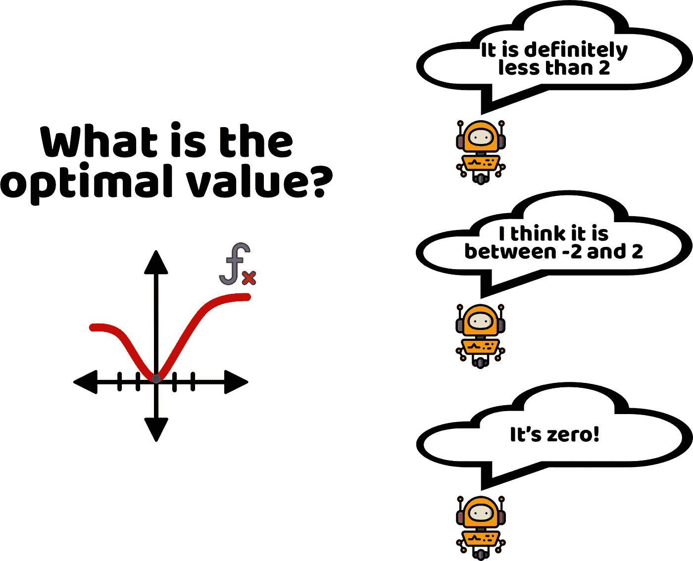
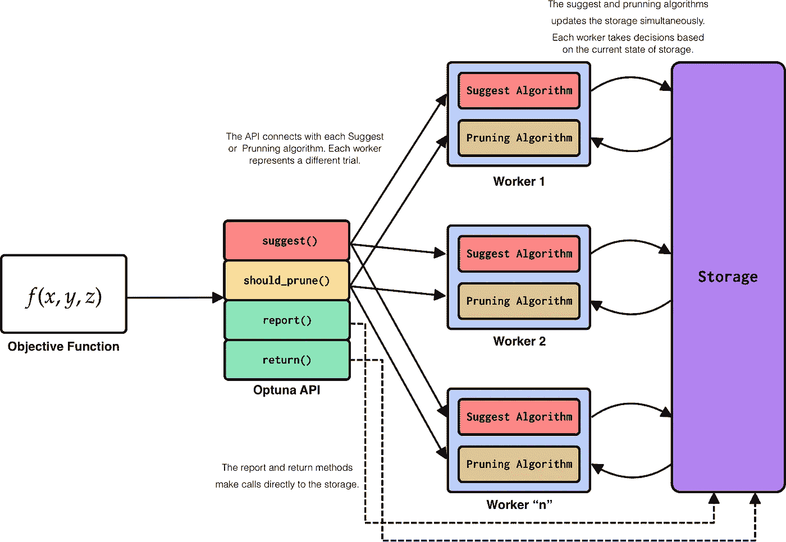

# OPTUNA:一个灵活、高效、可扩展的超参数优化框架

> 原文：<https://towardsdatascience.com/optuna-a-flexible-efficient-and-scalable-hyperparameter-optimization-framework-d26bc7a23fff?source=collection_archive---------9----------------------->

## 轻型和大型超参数优化的新选择



图一。关于超参数优化的漫画|作者图片|图标取自 [smashicons](https://smashicons.com/) 、 [freepik](https://www.flaticon.es/autores/freepik)

建立机器学习模型时的一个决定性任务是*超参数优化*。超参数的正确优化直接反映在模型的性能上。这就是为什么*超参数优化*多年来一直是一个活跃的研究领域。幸运的是，今天有几个备选方案可以用来优化机器学习模型，如:*hyperpt*[[1](https://conference.scipy.org/proceedings/scipy2013/pdfs/bergstra_hyperopt.pdf)，*spearmant*[[2](https://github.com/HIPS/Spearmint)， *Vizer* [ [3](https://cloud.google.com/ai-platform/optimizer/docs/overview) ，*AutoSklearn*[[4](https://arxiv.org/abs/2007.04074)*或 *Autotune* 这些备选方案中的每一个都提出了各种优化范例。同样，这些优化工具中的每一个都提出了不同的可用性方法，这些方法可以根据情况变得或多或少地灵活。*

*在这种背景下， **Optuna** [ [6](https://dl.acm.org/doi/10.1145/3292500.3330701) 出现，其目标是*将优化范例*统一在由三个支柱支持的理念下:*按运行设计 API* 、*高效实现*和*易于设置。*因此，在这篇博客中我们将看到什么是 **Optuna** ，它的组件，它的优化范例，以及如何用 **Scikit-Learn** 和 **PyTorch** 将其付诸实践。所以这个博客会分为:*

*   ***什么是 Optuna？***
*   ***Optuna & Scikit-Learn 集成***
*   ***Optuna & PyTorch 集成***

# ***什么是 Optuna？***

***Optuna** 由 Takuya Akiba 等人引进。艾尔。[6]2019 年。 **Optuna** 是一个用于*超参数优化*的开源 python 库。在后台， **Optuna** 旨在平衡*采样*和*修剪*算法。 **Optuna** 实现了独立参数采样的**树形 Parzen 估计器** (TPE) [ [7](https://optunity.readthedocs.io/en/latest/user/solvers/TPE.html#id2) ， [8](https://papers.nips.cc/paper/2011/file/86e8f7ab32cfd12577bc2619bc635690-Paper.pdf) 以及**高斯过程** (GP) [ [8](https://papers.nips.cc/paper/2011/file/86e8f7ab32cfd12577bc2619bc635690-Paper.pdf) ，**协方差矩阵自适应***(CMA)[9](http://www.cmap.polytechnique.fr/~nikolaus.hansen/cmaartic.pdf)[同样， **Optuna** 为搜索空间的*修剪*实现了**异步连续减半** (ASHA) <http://www.cmap.polytechnique.fr/~nikolaus.hansen/cmaartic.pdf> [10](https://arxiv.org/abs/1810.05934) ]算法的变体。**

****Optuna** 作为一个*超参数优化*软件出现在一个新的*设计标准*下，该设计标准基于三个基本思想: ***定义运行 API*** ，它允许用户以动态方式构建和操作搜索空间， ***高效实现*** ，它专注于采样策略以及修剪算法的最佳功能， ***易于设置在图 2 中，我们可以看到对 **Optuna** 架构的可视化描述。*****

****

**图二。Optuna 系统架构|作者图片**

****Optuna** 的设计标准使其易于实施、灵活且可扩展。由于 **Optuna** 的可扩展性，大规模实验的优化可以以并行和分布式的方式进行。 **Optuna** 是框架不可知的，也就是说，它可以很容易地与任何机器学习和深度学习框架集成，如: **PyTorch** 、 **Tensorflow** 、 **Keras** 、 **Scikit-Learn** 、 **XGBoost** 等。**

****Optuna** 的实现相对简单直观。在代码片段 1 中，我们可以看到一个基本的 **Optuna** 实现的框架。基本上，需要定义 python 函数，该函数将充当过程的*包装*，以获得要优化的值(最小化或最大化)。该程序包括 3 个基本步骤，搜索空间的*定义，模型*的*实现，以及待优化值*的*获取。***

**代码片段 1。Optuna 实现的基本架构。**

**太好了，到现在为止我们已经知道了 **Optuna** 是什么，它的组件和属性。现在让我们来看看几个**集成。**在下一节中，我们将看到 **Optuna** 与 **Scikit-Learn** 的集成，稍后我们将看到 **PyTorch** 的集成，让我们开始吧！**

# ****Optuna&sci kit-Learn 集成****

**在这个例子中，我们将通过使用众所周知的*乳腺癌数据集*和*随机森林*算法来解决*分类问题*。想法是实现 **Optuna** 来优化每个*随机森林超参数*，以便**最大化**将通过 K 倍交叉验证过程生成的*平均精度*。**

**代码片段 2。optuna & sci kit-学习集成**

**正如我们在前面的代码片段中看到的，*包装器*包含了搜索空间的定义、模型和要优化的值的计算。从第 4 行到第 6 行，执行待优化的 3 个*超参数*的搜索空间的定义。我们可以看到，对于*随机森林*算法的决策树的*分裂准则*，定义了一个*分类搜索空间*，另一方面，对于估计器的数量和最大深度，定义了*整数搜索空间*。随后，初始化*随机森林*模型(第 9 行),并且在 k 倍交叉验证过程下执行训练(第 18 行),存储每个倍的准确度(第 32 行),并且最终返回*平均准确度*(第 34 行)。该函数的返回(在本例中为*平均精度*)是每个 **Optuna** 研究的每个试验用作调整采样和修剪算法的参数。最后，该函数的优化可以通过以下定义来实现:**

**代码片段 3。研究定义**

**最后，当执行优化，获得*最优超参数*并用这样的最优配置训练模型时，我们获得:**

```
**Best average accuracy: 0.9666356155876418
Best parameters: {'criterion': 'entropy', 'n_estimators': 40, 'max_depth': 6}Train score: 1.0
Test score: 0.982456140350877**
```

> **你可以在这里找到这个例子的完整实现:[https://github.com/FernandoLpz/Optuna-Sklearn-PyTorch](https://github.com/FernandoLpz/Optuna-Sklearn-PyTorch)**

**我们可以看到， **Optuna** 和 **Scikit-Learn** 的集成相对简单直观。一般来说，包装 **Scikit-Learn** 模型，返回要优化的值就足够了。 **Optuna** 研究的定义允许我们确定该程序是*最大化*还是*最小化*。**

**现在让我们来看看与 **PyTorch** 的更强大的集成，我们将尝试找到神经网络应该包含的*最佳超参数*甚至*最佳层数*，让我们开始吧！**

# ****Optuna & PyTorch 集成****

**在这个例子中，我们将利用众所周知的 MNIST 数据集来解决一个*多类分类*问题。出于实用目的，我们将实现的神经网络将只包含*线性层*。想法是使用 **Optuna** 来找到模型的*最优超参数*，例如:优化器*和学习率*。此外，我们将使用 **Optuna** 找到神经网络中的*最佳层数*以及每层的*最佳单元数*。****

*让我们首先从神经网络的定义开始:*

*代码片段 4。神经网络定义*

***Optuna** 的一个优点是它允许我们定义动态定义搜索空间的对象。在这种情况下，我们首先初始化一个空堆栈，其中定义线性层的对象和由*试验*(第 6 行和第 7 行)确定的漏失将被动态存储。随后，定义层数和漏失的搜索空间(第 11 和 12 行)。然后开始将由 trial 定义的动态数量的线性层以及每层的单元数量引入堆栈的过程。值得一提的是，第一层的输入维度和最后一层的输出维度将始终是静态的(分别是第 15 行和第 29 行)。其余层的尺寸将由*试验*(第 20 行)决定。此时，我们已经有了一个包含各自输入和输出维度的线性图层堆栈和一个辍学堆栈。然而，在 **PyTorch** 中，定义神经网络的类必须有引用定义神经网络每个组件的对象的实例变量。在这种情况下，堆栈中定义的每个层和 dropout 必须定义为实例变量(第 36 和 39 行)。最后是**前进**功能。由于层和漏失的数量已经在堆栈中定义，我们只需要展开堆栈并在每个层和漏失上传递*输入张量 x* 。*

*正如我们已经观察到的，神经网络的定义并不意味着复杂性，只是被认为是网络的每个组件的动态分配。现在让我们看看如何为*超参数优化*训练这个神经网络。*

*代码片段 5。优化功能*

*考虑到代码片段 1 中显示的框架，代码片段 5 中定义的*包装器*函数将等同于神经网络的优化。首先，通过将*试验*作为参数(第 4 行)传递给神经网络进行初始化，然后定义*优化器*和*学习速率*的搜索空间，就这样。剩下的就是分批训练神经网络并计算测试集中的精度，这样的精度就是返回的值，也是 **Optuna** 用来执行优化的值。*

*最后，在进行优化时，我们得到以下结果:*

```
*Best accuracy: 0.944831498
Best parameters: {'n_layers': 2, 'dropout': 0.2048202637410447, 'output_dim_0': 13, 'output_dim_1': 24, 'optimizer': 'Adam', 'lr': 0.0030389965486299388}Train score: 0.95349231
Test score: 0.94231892*
```

> *你可以在这里找到这个例子的完整实现:[https://github.com/FernandoLpz/Optuna-Sklearn-PyTorch](https://github.com/FernandoLpz/Optuna-Sklearn-PyTorch)*

# *结论*

*在这篇博客中，我们了解了什么是 **Optuna** ，开发 Optuna 的理念是什么，它的组件以及几个 **Optuna** 与 **Scikit-Learn** 和 **PyTorch** 集成的例子。*

**超参数优化*有多种选择。一些共享优化方法，采样和修剪算法的相似性。同样，每一个都为每种工具的使用和实现提出了具体的特征。在这种情况下， **Optuna** 作为*超参数优化*工具出现，它专注于实现的简单性、灵活性和可伸缩性，这使得它成为迄今为止被广泛接受的工具。*

# *参考*

*[1] [Hyperopt:用于优化机器学习算法的超参数的 Python 库](https://conference.scipy.org/proceedings/scipy2013/pdfs/bergstra_hyperopt.pdf)*

*[2] [留兰香储存库](https://github.com/HIPS/Spearmint)*

*[3] [维泽](https://cloud.google.com/ai-platform/optimizer/docs/overview)*

*[4] [Auto-Sklearn 2.0:下一代](https://arxiv.org/abs/2007.04074)*

*[5] [自动调优:超参数调优的无导数优化框架](https://arxiv.org/pdf/1804.07824.pdf)*

*[6] [Optuna:下一代超参数优化框架](https://dl.acm.org/doi/10.1145/3292500.3330701)*

*[7] [树形结构 Parzen 估计器](https://optunity.readthedocs.io/en/latest/user/solvers/TPE.html#id2)*

*[8] [超参数优化算法](https://papers.nips.cc/paper/2011/file/86e8f7ab32cfd12577bc2619bc635690-Paper.pdf)*

*【9】[进化策略中完全去随机化的自适应](http://www.cmap.polytechnique.fr/~nikolaus.hansen/cmaartic.pdf)*

*【10】[大规模并行超参数调谐系统](https://arxiv.org/abs/1810.05934)*