# 轨道飞行器:重新发明(球形)轮子及其控制算法

> 原文：<https://towardsdatascience.com/orbitron-reinventing-the-wheels-and-its-control-algorithm-8f60ffd44238?source=collection_archive---------40----------------------->

## 我花了六个月的时间建造了一辆四轮独立驾驶汽车

作为一个重度科幻迷，我总是想知道:那些来自 *Tron* 和 *I-Robot* 的球形轮子在现实生活中会如何工作？这个简单的想法开始了为期 6 个月的**轨道计划**之旅。

这个项目一开始就有两个主要目标:

*   使用 Arduino 制造一辆配有球形车轮的汽车，实现 4 轮独立转向/驱动(4WIS/D)系统
*   在 Mathematica 中开发 4WIS/D 车辆直观控制算法

这篇文章将展示我的车辆原型 Orbitron 以及建筑场景背后的一个小故事。然后，我将向您介绍亮点:我构建的一个智能算法，用于无缝控制 Orbitron。

您也可以查看我为大学申请制作的这个 [**maker 组合视频**](https://youtu.be/WXjisSnfGTI) 或查看包含完整代码的 [**GitHub repo**](https://github.com/tylertaewook/project-orbitron) 。

# O RBITRON

正如我上面提到的，轨道飞行器是一种带有球形轮子的交通工具，因此被命名为‘ORB’itron。不幸的是，我有点不够资格用电磁铁将车轮悬浮在半空中，就像许多科幻电影建议的那样。相反，我实现了一个 4 轮独立转向/驱动(4WIS/D)系统:一个用于四轮车辆的转向系统，允许对每个车轮进行单独的速度和方向控制。

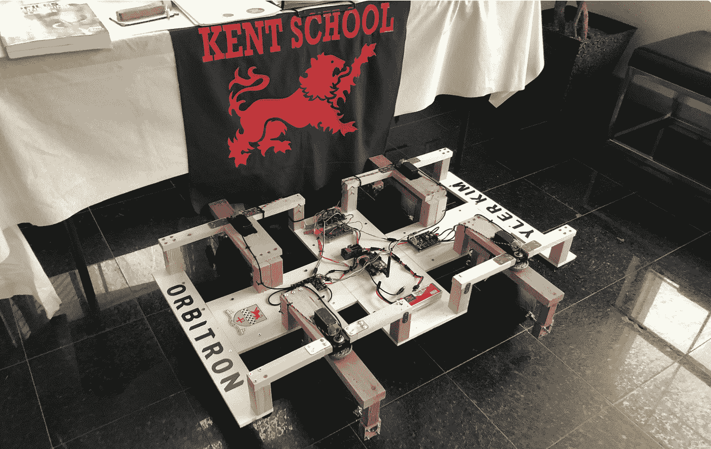

肯特预工程中心展示的轨道飞行器(图片由作者提供)

## 结构

在车轮框架的初始草图之后，我在 Fusion 360 中模拟了相同的设计。我在车架上设计了两个独立的马达，每个马达控制速度和方向，独立地操纵和驱动车轮。

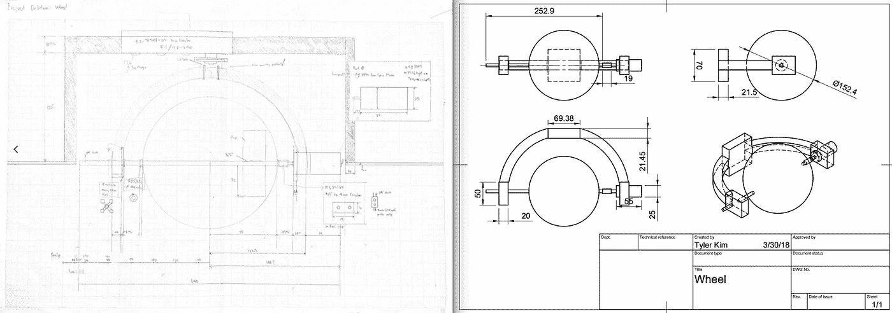

初始车轮草图(图片由作者提供)

我用一个 60 毫米的 EVA 泡沫球作为车轮，因为它们很轻，但足够坚固，可以支撑车辆。顶部带有内置变速箱的 HS-785HB 伺服系统通过转动电机的整个矩形结构来控制车轮的方向。转速为 170 RPM 的 Econ 齿轮马达直接连接到球体的轴上，负责驱动车轮和控制速度。

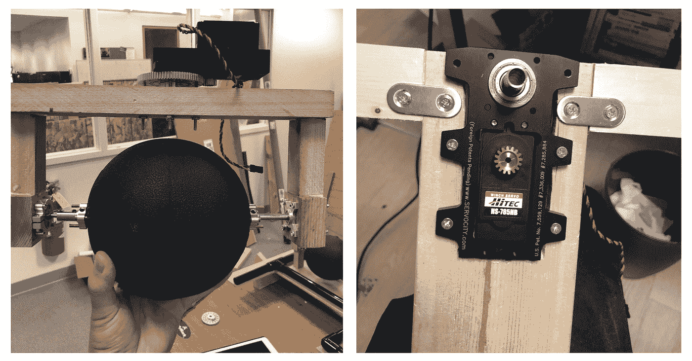

车轮结构(图片由作者提供)

设计车身相对简单，因为它只是一个支撑轮架的矩形板。

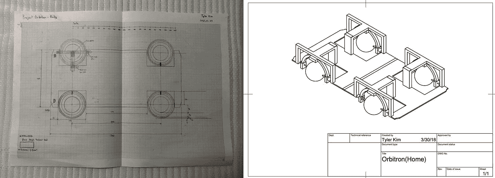

初始身体草图(图片由作者提供)

一开始我用中密度纤维板做了车身，但事实证明它太重了。所以我换成了 PVC 管支撑的 Foamex 板，轻多了，结实多了。

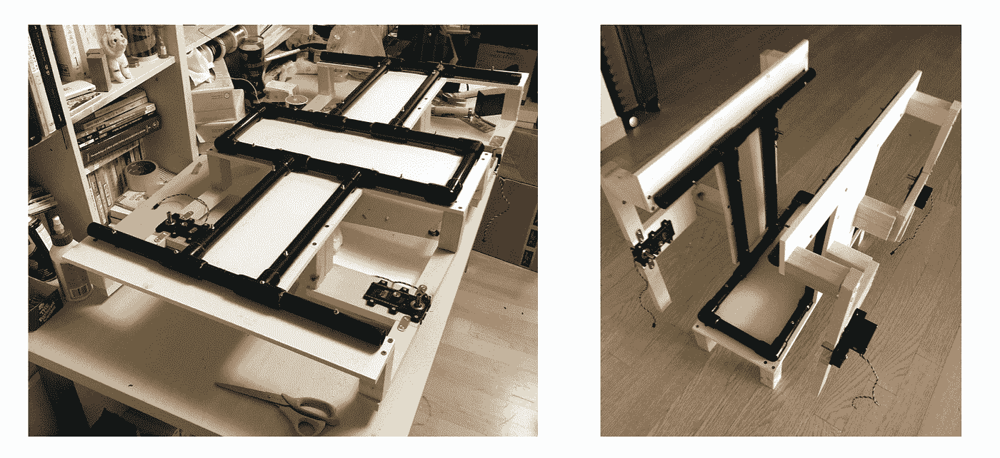

主体框架(图片作者提供)

为了在我飞回韩国的暑假期间继续这个项目，我精心设计了可折叠的板子，以方便海外运输。这样，我只需拆下轮架，将板折叠起来，并在运输时用气泡包装覆盖即可。

## 电子学

在这里我不会对布线做太多的详细说明。简而言之，Arduino Mega 连接到 XBee shield 进行无线通信，两个电机驱动器用于控制驱动电机，四个伺服电机用于控制每个车轮。

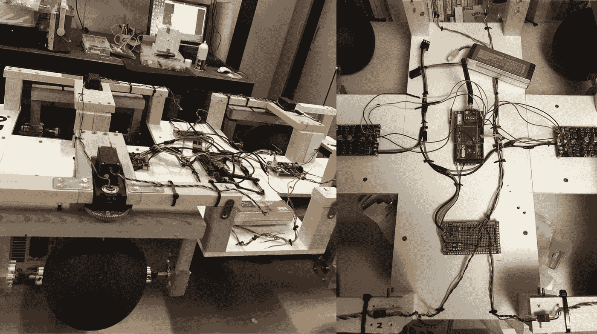

在首尔国立大学实验室测试所有组件(图片由作者提供)

在构建过程中，我开发了一个简单的 C# WinForms 应用程序，以确保每个组件都能正常工作。这个应用程序将通过 XBee 无线模块发送字母信号，Orbitron 将执行预先设置的动作，例如当收到' r '字符时，将所有伺服系统旋转 180 度。

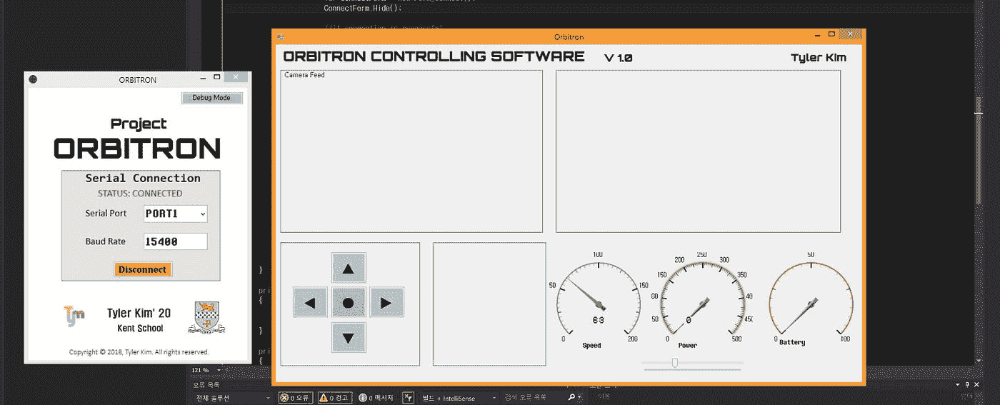

原型控制软件(图片来自作者)

# 算法

这个项目的真正美妙之处在于算法开发。下面的文字将总结我的论文: [**【使用空间鼠标的 4WIS/4WID 直观控制算法开发】**](https://tylertaewook.github.io/static/media/orbitron-paper.506633ba.pdf)

Orbitron 的 4WIS/D 系统为需要在狭小空间中导航的车辆提供了更灵活的运动，但控制每个车轮的两个参数(方向和速度)会导致需要同时控制八个参数。

所以我们的目标很简单:**开发一种算法，实现直观的控制，抽象出复杂性，允许充分实现车辆的功能。**

## 算法设置

我们选择 3Dconnexion 的 SpaceMouse (SpaceNavigator)作为控制器，因为它是为在 CAD 中的 3D 空间上进行直观导航而设计的。

将 SpaceMouse 与 Mathematica 连接起来，根据鼠标的位置，我们得到了从-1 到+1 的六个数字，这成为了我们算法的原始输入数据。

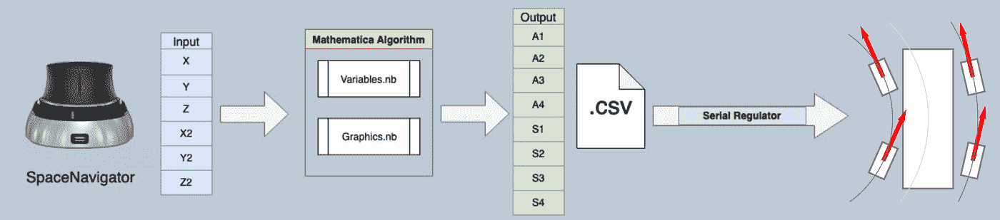

算法管道(图片由作者提供)

该算法的主要工作是将来自 SpaceMouse 的这六个变量转换为八个变量，每个变量代表一个轮子的角度或速度。该算法负责计算变量转换，并将带有时间戳的变量集记录在 CSV 文件中。然后，我们使用一个串行调节器，一个我开发的 C#应用程序，在适当的时间传递变量集，而不会向原型过度提供数据。

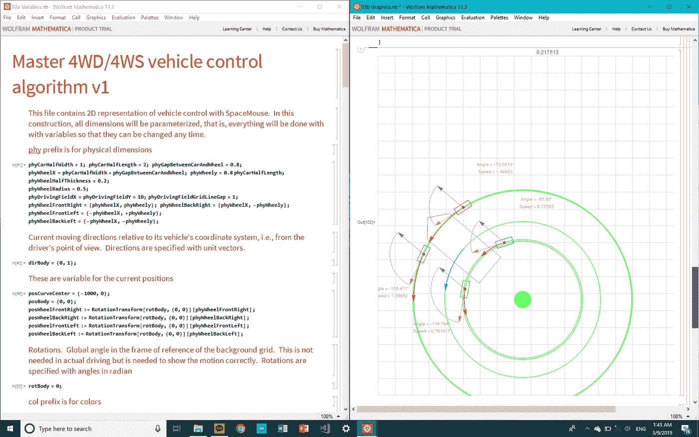

Mathematica 算法(图片作者提供)

Mathematica Notebook 执行时，右边的界面会根据用户的输入不断更新。该界面中显示的所有箭头都用不同的颜色编码，以便更容易区分彼此。每个车轮旁边显示四个标签，以显示更新的角度和速度值。

*   **绿色同心圆**:分别代表每个车轮的曲率半径和车辆的中心。这可以应用于具有任意数量车轮的车辆，但只是具有更多曲率圆。
*   **蓝色箭头**:车辆中心的运动
*   **灰色箭头**:作为红色/粉色箭头的底座；总是沿着车身的角度固定
*   **粉色箭头**:绿色圆圈的切线；灰色箭头和粉色箭头之间的角度用于确定每个轮子的角度
*   **红箭**:车辆的实际轨迹；当用户控制鼠标时，箭头的长度将总是代表每个轮子的相对速度。

## 实施不同的转向模式

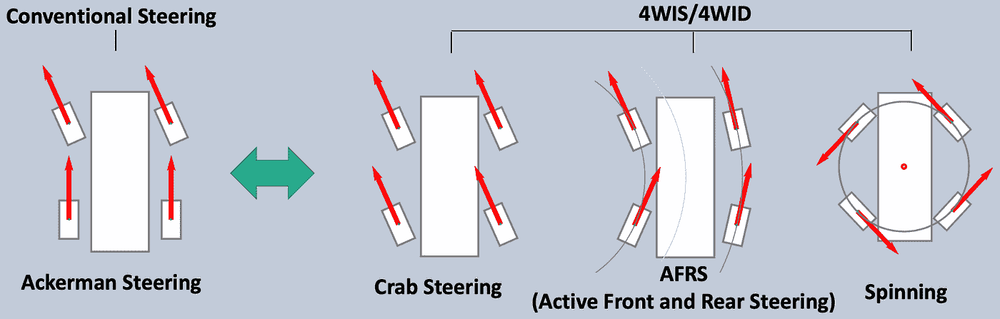

转向模式(图片由作者提供)

虽然传统的转向系统只涉及阿克曼转向，但 4WIS/4WID 可以有三种不同的转向模式:AFRS、螃蟹式转向和旋转。我们的算法支持所有三种转向模式，并允许我们同时控制所有四个车轮，而没有任何运动冲突的危险。我们这样做是通过计算车轮的方向和速度的基础上，车轮的角速度在一个转弯。这防止了信号之间的任何冲突，这些冲突会导致车辆打滑。

**螃蟹转向**

蟹式转向是一种特殊类型的主动四轮转向，通过将所有车轮转向相同的方向和角度来操作。

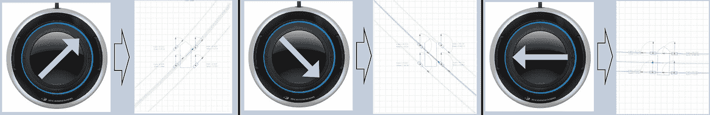

螃蟹驾驶中的太空鼠(图片由作者提供)

每当用户在飞机上滑动太空鼠标时，该算法都使用 Crab 转向模式。在这个具体的例子中，当鼠标面向右上角时，所有四个滚轮都与鼠标指向的方向成一个角度。所有四个车轮具有相同的速度，该速度被计算为半径非常大的圆的切向速度。

**主动前后转向**

AFRS 机制包括前轮和后轮独立转动，以获得更小的转弯半径和更好的转弯稳定性。在这种转向模式下，后轮根据驾驶参数改变车辆的转向方式。每个车轮的速度计算为圆周的切向速度。

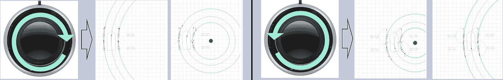

AFRS 的太空老鼠(图片由作者提供)

太空鼠的扭转运动负责改变飞行器的曲率半径。该算法的核心是将每一个运动视为圆周运动，并计算每个车轮的速度和与该圆周相切的角度。曲率半径(𝒓)由上面所示的等式计算，角度值(θ)由鼠标的扭转运动控制。

顺时针扭转鼠标时，θ增大，导致曲率半径变大。逆时针扭转鼠标时，θ减小，导致曲率半径变小。负θ将使圆在车辆的另一侧移动。

这一原则也适用于直线运动的情况，如螃蟹转向模式。持续逆时针扭动鼠标会使θ变得很小，导致转动半径几乎为无穷大。此时，车辆的运动将被视为直线运动。

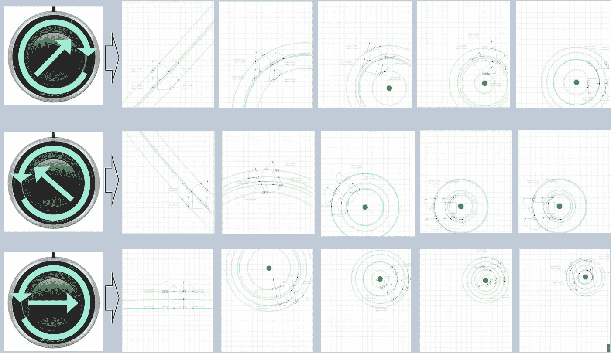

AFRS 的太空老鼠(图片由作者提供)

在这些例子中，直线运动和曲线运动是同时完成的。当扭转和移动鼠标同时发生时，车辆可以执行更复杂的运动，例如以逐渐减小的转弯半径向前移动。

**旋转**

也称为零转弯模式，旋转是车辆以零半径旋转的运动。通过垂直于中心对角线转动所有车轮，并以相同的方向转动车轮，很容易实现这一点。

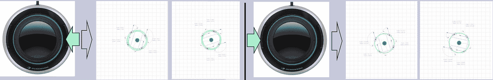

旋转运动中的太空老鼠(图片由作者提供)

当按下 SpaceMouse 侧面的两个按钮中的一个时，飞行器向各自的方向旋转。如上图截图所示，按下右键车辆顺时针方向转弯，按下左键车辆逆时针方向旋转。

# 结论

在六个月的时间里，我建造了一辆原型车，并通过实验证实，我们的算法成功地处理了一只太空鼠标传达的驾驶员的意图，并合作控制所有四个车轮，使它们彼此不冲突，以完成预期的运动。

我以前在 Arduino 做过几个有趣的项目，但是 Project Orbitron 是我做过的最大最复杂的项目。光是建造原型就花了整个暑假和超过 1000 美元的预算。我又花了三个月时间开发算法，同时自学 Mathematica 并不断调整 Orbitron 的设置。

完成这个项目后，我参加了一个[当地的科学展](https://kentnews.org/2382/features/an-outstanding-performance-at-the-71st-annual-connecticut-science-and-engineering-fair/)，并把我的作品展示给了我学校的一个学术团体[肯特公会](https://kentnews.org/2525/features/a-guild-presentation-by-tyler-kim-20/)。

Orbitron 项目已经成为我旅程的核心体验/项目，并最终成为我大学论文的主题。原型目前展示在肯特学校的预工程中心一楼，我的算法正在韩国走专利流程。*(申请号:KR 10–2019–0087022)*

*最初发表于*[https://blog.tylertaewook.com/post/project-orbitron](https://blog.tylertaewook.com/post/project-orbitron)