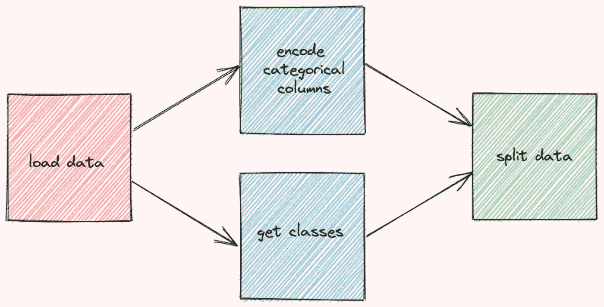
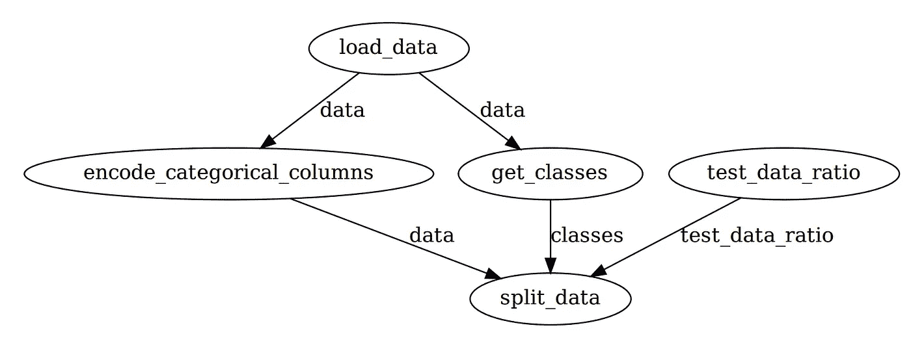
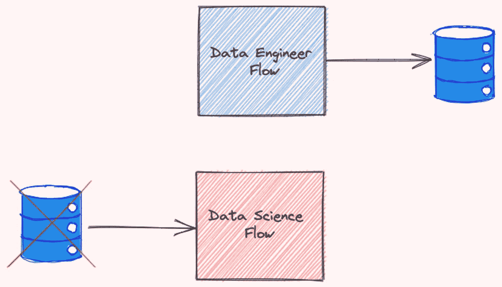

# 用 Prefect 编制 Python 中的数据科学项目

> 原文：<https://towardsdatascience.com/orchestrate-a-data-science-project-in-python-with-prefect-e69c61a49074?source=collection_archive---------0----------------------->

## [实践教程](https://towardsdatascience.com/tagged/hands-on-tutorials)

## 用几行代码优化您的数据科学工作流程

# 动机

作为一名数据科学家，您为什么应该关注优化您的数据科学工作流程？让我们从一个基础数据科学项目的例子开始。

假设您正在处理虹膜数据集。您从构建处理数据的函数开始。

定义函数后，执行它们。

您的代码运行良好，并且您没有看到输出有任何错误，因此您认为工作流足够好。然而，像上面这样的线性工作流程有很多缺点。


作者图片

缺点是:

*   如果函数`get_classes`出现错误，函数`encode_categorical_columns`产生的输出将会丢失，工作流需要从头开始。如果执行`encode_categorical_columns`功能需要很长时间，这可能会令人沮丧。


作者图片

*   由于功能`encode_categorical_columns`和`get_classes`互不依赖，因此可以同时执行以节省时间:



作者图片

以这种方式运行函数还可以防止在不起作用的函数上浪费不必要的时间。如果功能`get_classes`出现错误，工作流程将立即重启，无需等待功能`encode_categorical_columns`完成。


作者图片

现在，你可能会同意我的观点，优化不同职能部门的工作流程非常重要。然而，手动管理工作流可能会有大量的工作。

有没有一种方法可以让你通过增加几行代码来自动优化工作流程？这时候提督就派上用场了。

# 什么是提督？

[perfect](https://www.prefect.io/)是一个用 Python 构建工作流的开源框架。Prefect 使大规模构建、运行和监控数据管道变得容易。

要安装提督，请键入:

```
pip install prefect
```

# 使用 Prefect 构建您的工作流程

为了了解 Prefect 是如何工作的，让我们用 Prefect 封装文章开头的工作流。

## 第一步—创建任务

一个`Task`是一个完整流程中的离散动作。从使用装饰器`prefect.task`将上面定义的功能转化为任务开始:

## 第二步—创建流程

一个`Flow`通过管理任务之间的依赖关系来表示整个工作流。要创建一个流，只需在`with Flow(...)`上下文管理器中插入运行函数的代码。

请注意，在运行上面的代码时，这些任务都不会执行。Prefect 允许您立即运行流程，也可以安排在以后运行。

让我们尝试使用`flow.run()`立即执行这个流程:

运行上面的代码将会得到类似如下的输出:

为了理解 Prefect 创建的工作流，让我们将整个工作流可视化。

从安装`prefect[viz]`开始:

```
pip install "prefect[viz]"
```

然后将方法`visualize`添加到代码中:

您应该会看到如下所示的`data-engineer`工作流的可视化效果！


作者图片

请注意，Prefect 会自动管理任务的执行顺序，从而优化工作流。对于一些额外的代码来说，这非常酷！

## 第三步-添加参数

如果您发现自己经常尝试一个变量的不同值，那么理想的做法是将该变量转换成一个`Parameter`。

您可以将`Parameter`视为`Task`，除了它可以在流程运行时接收用户输入。要将变量转换成参数，只需使用`task.Parameter`。

`Parameter`的第一个参数指定了参数的名称。`default`是可选参数，指定参数的默认值。

再次运行`flow.visualize`将给出如下输出:



作者图片

您可以通过以下方式覆盖每次运行的默认参数:

*   将参数`parameters`添加到`flow.run()`:

*   或者使用完美的 CLI:

*   或者使用 JSON 文件:

您的 JSON 文件应该如下所示:

您还可以使用 Prefect Cloud 更改每次运行的参数，这将在下一节中介绍。

# 监控您的工作流程

## 概观

Prefect 还允许您在 Prefect Cloud 中监控您的工作流程。按照本说明为完美云安装相关依赖项。

在安装和设置了所有依赖项之后，通过运行以下命令在 Prefect 上创建一个项目:

```
$ prefect create project "Iris Project"
```

接下来，启动一个本地代理，在单台机器上本地部署我们的流:

```
$ prefect agent local start
```

然后补充:

…在你文件的末尾。

运行该文件后，您应该会看到类似下面的内容:

单击输出中的 URL，您将被重定向到一个概述页面。概览页面显示了您的流程的版本、创建时间、流程的运行历史及其运行摘要。


作者图片

您还可以查看其他运行的摘要、执行时间及其配置。


作者图片

Perfect 自动跟踪这些重要信息的方式非常酷！

## 使用默认参数运行工作流

请注意，工作流已注册到 Prefect Cloud，但尚未执行。要使用默认参数执行工作流程，请单击右上角的快速运行。


作者图片

单击创建的管路。现在，您将能够实时看到新流程运行的活动！


作者图片

## 使用自定义参数运行工作流

要使用自定义参数运行工作流，请单击运行选项卡，然后在输入下更改参数。


作者图片

当您对参数感到满意时，只需单击 Run 按钮即可开始运行。

## 查看工作流程的图表

单击示意图将为您提供整个工作流程的图表。


作者图片

# 其他功能

除了上面提到的一些基本功能，提督还提供了一些其他很酷的功能，将大大提高您的工作流程的效率。

## 输入缓存

还记得我们在文章开头提到的问题吗？通常，如果函数`get_classes`失败，函数`encode_categorical_columns`创建的数据将被丢弃，整个工作流需要从头开始。

然而，使用提督，`encode_categorical_columns`的输出被存储。下次重新运行工作流时，下一个任务**将使用`encode_categorical_columns`的输出，而不重新运行**任务`encode_categorical_columns`。


作者图片

这可以大大减少运行工作流所需的时间。

## 持续输出

有时，您可能希望将任务数据导出到外部位置。这可以通过向任务函数插入保存数据的代码来完成。

然而，这样做会使测试功能变得困难。

Prefect 使每次运行时保存任务的输出变得很容易，方法是:

*   将检查点设置为`True`

```
$ export PREFECT__FLOWS__CHECKPOINTING=true
```

*   并将`result = LocalResult(dir=...))`添加到装饰器`@task`中。

现在任务`split_data`的输出将被保存到目录`data/processed`中！该名称类似于以下内容:

```
prefect-result-2021-11-06t15-37-29-605869-00-00
```

如果你想定制你的文件名，你可以添加参数`target`到`@task`:

提督还提供了其他的`Result`职业，比如`GCSResult`和`S3Result`。你可以点击查看结果[的 API 文档。](https://docs.prefect.io/api/latest/engine/results.html)

## 将另一个流的输出用于当前流

如果您正在处理多个流，例如，`data-engineer`流和`data-science`流，您可能希望将`data-engineer`流的输出用于`data-science`流。


作者图片

将`data-engineer`流的输出保存为文件后，您可以使用`read`方法读取该文件:

## 连接相关流

想象一下这个场景:您创建了两个相互依赖的流。流程`data-engineer`需要在流程`data-science`之前执行

看了你的工作流程的人不理解这两个流程之间的关系。结果他们同时执行流程`data-science`和流程`data-engineer` 遇到错误！



作者图片

为了防止这种情况发生，我们应该指定流之间的关系。幸运的是，提督使我们更容易做到这一点。

从使用`StartFlowRun`抓取两个不同的流开始。将`wait=True`添加到参数中，以便仅在上游流程完成执行后执行下游流程。

接下来，调用`with Flow(...)`上下文管理器下的`data_science_flow`。使用`upstream_tasks`指定在执行`data-science`流程之前将要执行的任务/流程。

现在，两个流连接如下:


作者图片

相当酷！

## 安排你的流程

Prefect 还使得在某个时间或某个时间间隔执行一个流变得无缝。

例如，为了每 1 分钟运行一个流，您可以初始化类`IntervalSchedule`并将`schedule`添加到`with Flow(...)`上下文管理器中:

现在，您的流量将每 1 分钟重新运行一次！

点击了解更多安排你心流的不同方式[。](https://docs.prefect.io/core/concepts/schedules.html#overview)

## 记录

只需将`log_stdout=True`添加到`@task`中，就可以记录任务中的打印语句:

执行任务时，您应该会看到如下输出:

```
[2021-11-06 11:41:16-0500] INFO - prefect.TaskRunner | Model accuracy on test set: 93.33
```

# 结论

恭喜你！您刚刚学习了 Prefect 如何用几行 Python 代码优化您的数据科学工作流。从长远来看，代码中的小优化可以大大提高效率。

随意发挥，并在这里叉这篇文章的源代码:

[](https://github.com/khuyentran1401/Data-science/tree/master/data_science_tools/prefect_example) [## 数据科学/数据科学工具/完美范例

### 收集有用的数据科学主题以及代码和文章-Data-science/Data _ science _ tools/prefect _ example…

github.com](https://github.com/khuyentran1401/Data-science/tree/master/data_science_tools/prefect_example) 

我喜欢写一些基本的数据科学概念，并尝试不同的数据科学工具。你可以通过 [LinkedIn](https://www.linkedin.com/in/khuyen-tran-1ab926151/) 和 [Twitter](https://twitter.com/KhuyenTran16) 与我联系。

如果你想查看我写的所有文章的代码，请点击这里。在 Medium 上关注我，了解我的最新数据科学文章，例如:

[](/great-expectations-always-know-what-to-expect-from-your-data-51214866c24) [## 远大的期望:永远知道从你的数据中可以期待什么

### 使用 Python 确保数据按预期工作

towardsdatascience.com](/great-expectations-always-know-what-to-expect-from-your-data-51214866c24) [](/kedro-a-python-framework-for-reproducible-data-science-project-4d44977d4f04) [## kedro——可再生数据科学项目的 Python 框架

### 使用 Kedro 创建可维护的模块化数据科学管道

towardsdatascience.com](/kedro-a-python-framework-for-reproducible-data-science-project-4d44977d4f04) [](/introduction-to-weight-biases-track-and-visualize-your-machine-learning-experiments-in-3-lines-9c9553b0f99d) [## 权重和偏差介绍:用 3 条线跟踪和可视化你的机器学习实验…

### 无缝比较不同的实验，并使用 Python 重现您的机器学习实验

towardsdatascience.com](/introduction-to-weight-biases-track-and-visualize-your-machine-learning-experiments-in-3-lines-9c9553b0f99d) [](/introduction-to-datapane-a-python-library-to-build-interactive-reports-4593fd3cb9c8) [## Datapane 简介:构建交互式报表的 Python 库

### 创建精美报告并与您的团队分享分析结果的简单框架

towardsdatascience.com](/introduction-to-datapane-a-python-library-to-build-interactive-reports-4593fd3cb9c8)