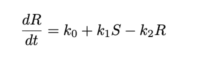
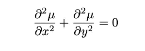
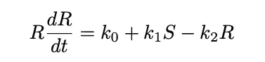
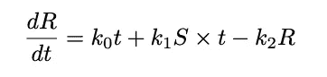
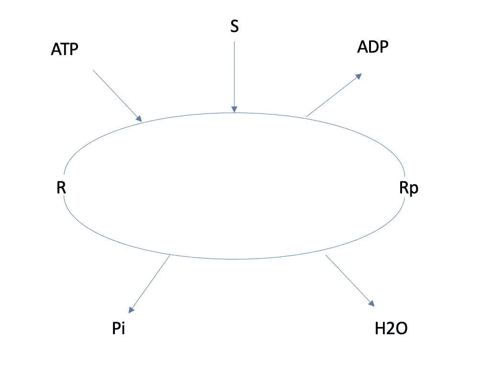
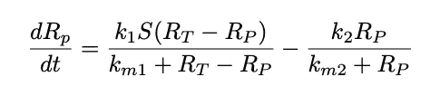
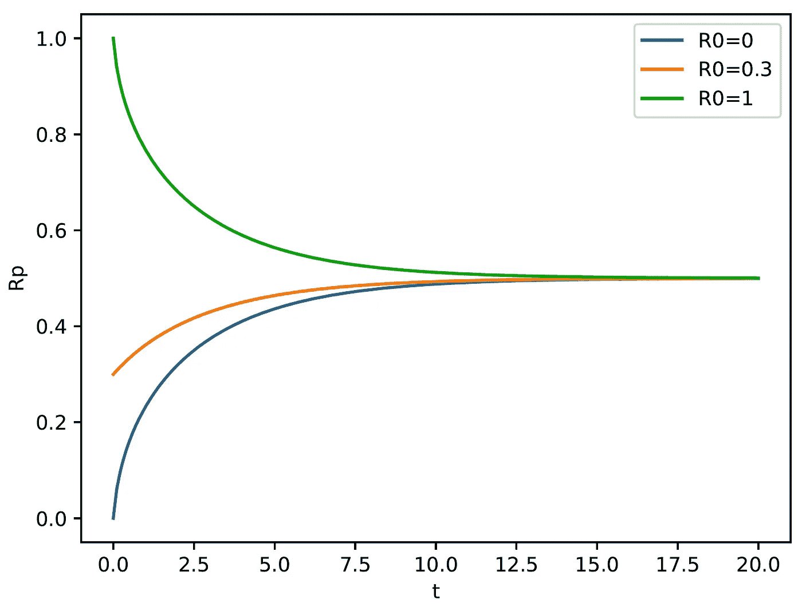
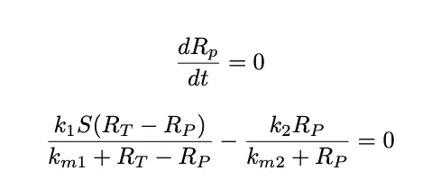
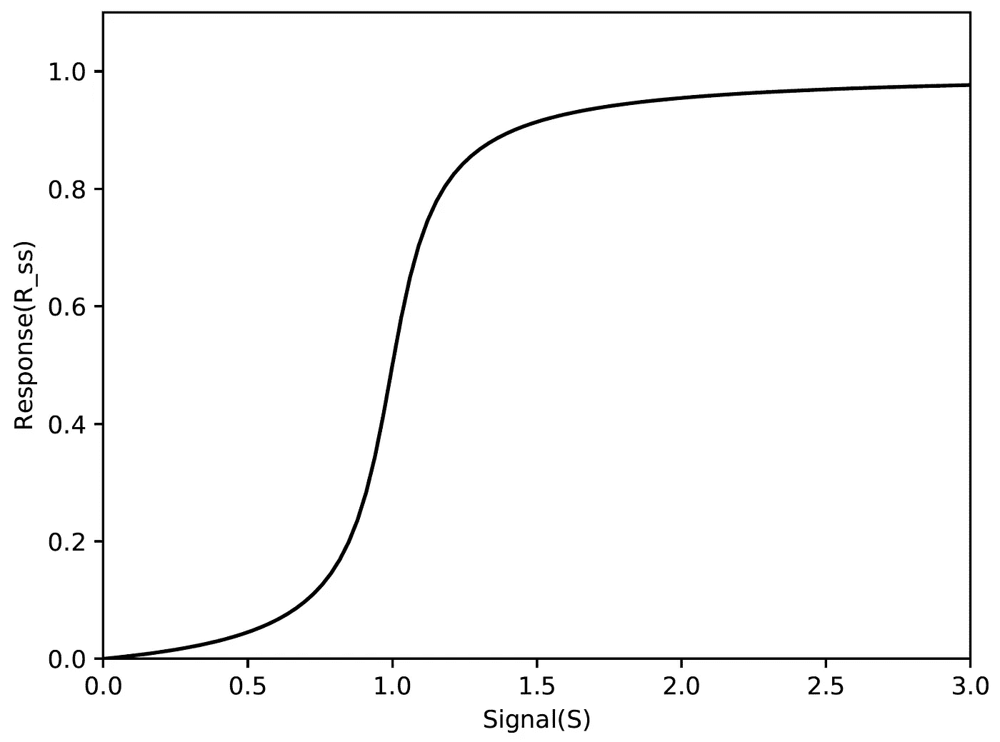

# Python 中的常微分方程

> 原文：<https://towardsdatascience.com/ordinal-differential-equation-ode-in-python-8dc1de21323b?source=collection_archive---------2----------------------->

## 颂的用法是什么？如何用 Python 求解 ODE？


约翰·莫塞斯·鲍恩在 [Unsplash](https://unsplash.com?utm_source=medium&utm_medium=referral) 上拍摄的照片

**常微分方程** (ODE)可以用来描述一个动态系统。在某种程度上，我们生活在一个动态系统中，窗外的天气从黎明到黄昏不断变化，我们体内的新陈代谢也是一个动态系统，因为随着时间的推移，成千上万的反应和分子被合成和降解。

更正式地说，如果我们定义一组**变量**，比如一天中的温度，或者某个时间点的分子 X 的量，它随着**自变量**而变化(在动态系统中，通常会是**时间 t** )。ODE 为我们提供了一种从数学上描绘定义变量的动态变化的方法。与之相对的系统叫做**静态系统**，想着拍一张外面的照片，这张快照不包含任何动态，换句话说就是静态的。

求解常微分方程意味着确定变量将如何随着时间的推移而变化，该解有时被称为**解曲线**(如下图所示)，为任何动态系统的默认行为提供信息性预测。


线性系统的示例解曲线

在这篇文章中，我将介绍 ODE，更重要的是，如何仅仅使用 Python 来解决 ODE。

# 术语概述

在这里，我首先介绍一些术语，读者可能会从中受益。**常微分方程**看起来是这样的:



颂诗

这是一个包含导数的方程，但方程本身没有偏导数。换句话说，我们只考虑**一个自变量**，那就是时间 t，当我们有多个自变量进来时，就变成了**偏微分方程(PDE)** ，不在本文讨论范围内。



偏微分方程（Partial Differential Equation 的缩写）

在 ODE 中，*如果包含因变量的项的系数(在上面的例子中，变量 R，包含 R 的项包括 dR/dt 和 k2R)与 R* 无关，则该 ODE 被视为**线性 ODE** 。为了说明这一点，让我给你看一首非线性颂歌作为比较:



非线性 ODE

大家可以看到，现在 dR/dt 的系数是 R，违反了线性 ODE 的定义，所以变成了一个**非线性 ODE** 。

最后，最后一对术语，如果变量的导数独立于自变量(这里是时间 t)，我们称它们为**自治颂**，否则，就变成了**非自治颂**。同样，非自治 ODE 如下所示:



非自治颂歌

你可以看到现在时间 t 在右边，所以这是一首非自治颂歌。

# 求解 s 形信号响应曲线

首先，本文中使用的例子来自于[泰森等人](https://www.sciencedirect.com/science/article/abs/pii/S0955067403000176)的一篇精彩综述论文。如果你对此感兴趣，我强烈推荐你去看看。

s 形信号响应曲线描述了如下所示的系统:



体内磷酸化过程(改编自[泰森等人](https://www.sciencedirect.com/science/article/abs/pii/S0955067403000176))

它是在我们体内发生的磷酸化过程，R 是一种物质，它将被转化为磷酸化形式 Rp 以发挥许多功能，这一过程由信号 S 催化，并伴随着 ATP 水解。为了描述这一过程，原始论文使用了以下 ODE:



现在我们首先要解这个方程，这意味着获得描述 Rp 如何随时间变化的**解曲线**。

让我们开始编码:

```
from scipy.integrate import odeint
import numpy as np
import matplotlib.pyplot as pltdef model(Rp,t,S):
    k1 = 1
    k2 = 1
    Rt = 1
    km1 = 0.05
    km2 = 0.05
    dRpdt = (k1*S*(Rt-Rp)/(km1+Rt-Rp)) - k2*Rp/(km2+Rp)
    return dRpdt
```

上面的代码只是为了建立我们描述的使用数学方程的模型，这里的一些参数我只是使用了在[原始论文](https://www.sciencedirect.com/science/article/abs/pii/S0955067403000176)中提供的。

我们将信号强度设置为 1，但这只是为了说明，您可以随意将其更改为您喜欢的任何值。然后我们将 Rp 的初始值设置为三种不同的可能性:0，0.3，1。它可以向我们展示不同的初始化将如何最终收敛到稳态。为了简单起见，我们将模拟时间窗口设置为 0 到 20。最后，我们用`odeint`函数来求解这个 ODE。

```
S = 1
Rp0 = [0,0.3,1]
t = np.linspace(0,20,200)
result = odeint(model,Rp0,t,args=(S,))
```

`result`对象是形状为[200，3]的 NumPy 数组，3 对应三个初始化条件。现在我们画出:

```
fig,ax = plt.subplots()
ax.plot(t,result[:,0],label='R0=0')
ax.plot(t,result[:,1],label='R0=0.3')
ax.plot(t,result[:,2],label='R0=1')
ax.legend()
ax.set_xlabel('t')
ax.set_ylabel('Rp')
```



s 形响应，溶液曲线

这里我们可以看到，无论 Rp 从哪里开始，它们都会收敛到 0.5 左右，这被称为**稳态**。稳态是 ODE 的要点，因为它定义了动态系统的默认行为。你可能想知道为什么我们称之为 s 形信号响应曲线？这是因为除了求解解曲线，我们还想知道信号强度将如何作用于整个系统，用 ODE 语言来说，信号强度将如何改变系统的稳态？现在我们要去探索它！

数学上，当设置 dRp/dt = 0 时，系统的稳态基本上是公式的根。一个更好的例子如下:



定态

所以如果我们能解出关于 Rp 的最后一个方程，我们就能得到稳态时 Rp 的值。

```
S_all = np.linspace(0,3,100)
def equation(Rp,S):
    k1 = 1
    k2 = 1
    Rt = 1
    km1 = 0.05
    km2 = 0.05
    return k1*S*(Rt-Rp)/(km1+Rt-Rp) - k2*Rp/(km2+Rp)

from scipy.optimize import fsolve
store = []
for S in S_all:
    Rp_ss = fsolve(equation,[1],args=(S,))[0]
    store.append(Rp_ss)
```

我们首先设置信号 S 的范围从 0 到 3，然后我们使用来自`scipy.optimize`的`fsolve`函数来完成这项工作。当 S 等于 0–3 之间的不同值时，结果基本上就是 Rp 值。

```
fig,ax = plt.subplots()
ax.plot(S_all,store,c='k')
ax.set_xlim(0,3)
ax.set_xlabel('Signal(S)')
ax.set_ylim(0,1.1)
ax.set_ylabel('Response(R_ss)')
```

现在让我们看看结果:



信号响应曲线(s 形)

现在，我希望大家能够清楚为什么称之为 sigmoid 信号响应曲线，因为随着信号强度的变化，系统的稳态将以 sigmoid 方式响应。

# 进一步评论

上面的例子只是为了让你体会一下什么是 ODE，以及如何用 python 只用几行代码就解决了 ODE。当系统变得更复杂时，例如，涉及到不止一个组件(这里我们称之为**一阶 ODE** ，另一个名为 [GEKKO](https://gekko.readthedocs.io/en/latest/) 或 scipy.integrate.solve_ivp 的 python 包可能会帮你完成这项工作。

如果我们对如何复制 Tyson 等人的其他图感兴趣，我建议你查看我的 Github 库，那里提供了所有代码。

[https://github . com/Frank ligy/ScPyT/blob/main/ODE/submission/Frank _ system _ biology _ HW . pdf](https://github.com/frankligy/ScPyT/blob/main/ODE/submission/Frank_system_biology_hw.pdf)

我希望你觉得这篇文章有趣和有用，感谢阅读！如果你喜欢这篇文章，请在 medium 上关注我，非常感谢你的支持。在我的 [Twitter](https://twitter.com/FrankLI55917967) 或 [LinkedIn](https://www.linkedin.com/in/guangyuan-li-399617173/) 上联系我，也请让我知道你是否有任何问题或你希望在未来看到什么样的教程！