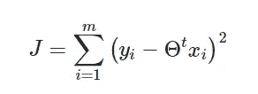
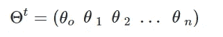
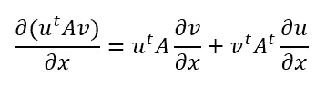
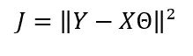
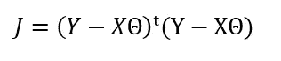
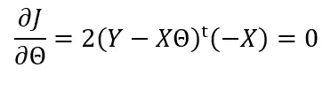
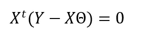
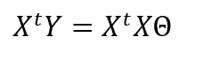
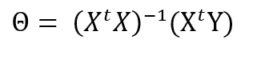

# 推导普通最小二乘法的正规方程。

> 原文：<https://towardsdatascience.com/ordinary-least-squares-ols-deriving-the-normal-equation-8da168d740c?source=collection_archive---------16----------------------->

## 这将比你想象的要简单。

OLS 无疑是最基本的机器学习算法之一。这个想法真的很简单，给定一个数据集，该算法寻求找到超平面，该超平面使从超平面到数据集中每个点的**偏移**的、**平方和**最小化。

慢慢读最后一句话，考虑超平面

我们可以将损失函数推导为

其中 **( *x* ᵢ *，y* ᵢ)** 为数据集中的一个元素(观察值) *m* 为其长度。

足够幸运的是，这只有一个极小值，也就是说有一个唯一的

这绝对最小化了数量，前提是 *m > n，*否则我们的数据集非常小，损失明显为零，没有唯一的极小值。

这篇文章的存在理由是为了推导出 OLS 问题的封闭解，也称为正规方程，为此，我们将使用一点矩阵微积分(以及一些矩阵代数),这将使我们的推导过程更加简单。

特别是，我们会对以下身份感兴趣:

你可以在维基百科的矩阵微积分页面上找到这个

其涉及相对于向量对标量进行微分，并且可用于通过向量微分恒等式导出[许多其他](https://www.youtube.com/watch?v=A5mUplxPvVY&list=PLhcN-s3_Z7-YS6ltpJhjwqvHO1TYDbiZv&index=6)标量。现在很清楚，设置 A=I 和 v=u 我们得到

尽管从基本原理出发推导这个恒等式并不困难，但在寻找封闭形式或与其他算法(如迭代加权最小二乘法和最小绝对偏差)相关的迭代方案时，前面给出的一般恒等式将被证明更加有用，因此最好将其作为起点。现在让我们和 OLS 一起行动吧。

照片由[舒巴姆·莎兰](https://unsplash.com/@shubhamsharan?utm_source=unsplash&utm_medium=referral&utm_content=creditCopyText)在 [Unsplash](https://unsplash.com/s/photos/calculus?utm_source=unsplash&utm_medium=referral&utm_content=creditCopyText) 上拍摄

让我们从写作开始

如同

注意 J 看起来没有那么弯曲，为了进一步用矩阵形式写出来，我们有

*其中 Y* 是一个列向量，所有的 *yᵢ'* 都在我们的数据集中，并且每个对应的行向量 *xᵢ* 都位于矩阵 *X. T* 中。为了最小化这样的损失函数，我们需要将它(标量)相对于θ(向量)进行微分，并将其设置为零。

利用这个身份，我们有了

右边的项通过分布微分算子，以 *Y* 和 *X* 为常数，得到 *-X*

两边都除以-2，然后交换两边，我们得到

使用基本的矩阵代数

最后求解θ来完善我们得到的结果

这就是标准方程。给定一个数据集，它归结为简单地构造矩阵 *X* 和向量 *Y* ，然后插入封闭形式，以简单地找到最佳地最小化损失函数的超平面的系数，也就是说，一旦我们有θ，我们就可以使用该超平面

基于特征 *x，*的值来推断 *y* 的合适值，这总体上是一个合适的机器学习模型，特别是如果你的数据集幸运地遵循或接近线性趋势。

希望这篇文章对你有所帮助，也希望你考虑给它一些掌声作为回报。下次见，再见。

参考资料:

[1]:舒巴姆莎兰。(2019 年 6 月 21 日)。搜索了“微积分”。[https://unsplash.com/photos/Z-fq3wBVfM](https://unsplash.com/photos/Z-fq3wBVfMU)