# 普通最小二乘回归

> 原文：<https://towardsdatascience.com/ordinary-least-squares-regression-da96dde239d5?source=collection_archive---------26----------------------->

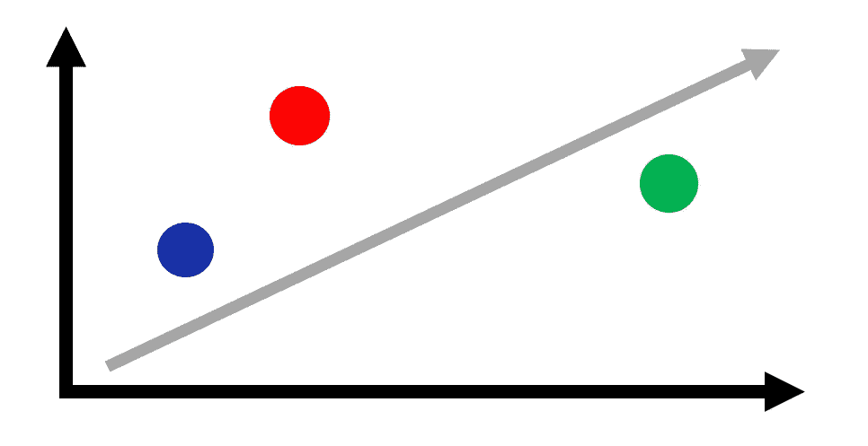

作者图片

## 权威的数学指南。

**普通最小二乘法**回归是每个人都应该熟悉的标准技术。我们从**高斯-马尔可夫定理的角度激励**线性模型**，**辨别**超定**和**欠定**的情况，并将 OLS 回归应用于葡萄酒质量数据集。

# 内容

1.  线性模型
2.  高斯马尔可夫定理
3.  欠定和超定情况
4.  分析红酒数据集
5.  摘要

# 线性模型

线性模型假设以下 ansatz:

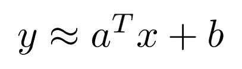

自变量和因变量通过一个乘法和一个常数项的加法联系起来。换句话说，预测的标签是特征向量加上常数的线性组合。然而，在不失一般性的情况下，我们可以去掉常数项，因为它可以被吸收到如下的线性组合中:

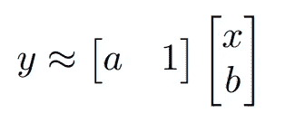

我们用虚拟常数 1 扩展了该特性，并将待学习的未知变量连接成单个未知向量。现在，给定数据要素和标注的完整训练集，我们可以拟合数据，或学习最佳预测值和偏移以最好地解释数据。让我们将特征向量按行堆叠成矩阵，并用帽子符号表示未知向量:

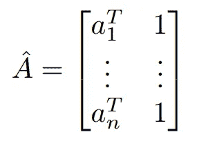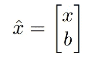

然后，优化问题转化为下面的普通最小二乘问题，该问题可以使用线性代数和微积分的技术来解决。

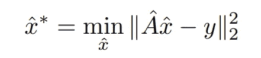

因此，在不失一般性的情况下，我们能够在实现和问题表述中省略常数项，只要我们用一列 1 来扩充特征向量。

我们注意到每门统计学课程都将涵盖线性模型，因为它很容易**解释**，**计算**不昂贵，也许最重要的是，**合理**。

# 高斯马尔可夫定理

关于普通最小二乘法(OLS)的讨论如果没有讨论高斯-马尔可夫定理是不完整的，该定理从统计的角度解释了 OLS 估计量的最优性。我们陈述如下。

> 在线性无偏估计类中，OLS 估计量具有最低的抽样方差；换句话说，OLS 是蓝色的(高斯-马尔可夫)。

**蓝色**:方差最小意义上的最佳线性无偏估计量

**OLS** :在普通的最小二乘意义上，就是最小化残差的欧氏范数

我们注意到，上一节的讨论没有包括任何关于噪声和随机性的假设。相反，我们在线性模型 ansatz 中使用了近似的等号。事实上，在现实生活和真实数据集中，**等式将是不精确的，**无论是因为**测量/白噪声误差**，还是**自然发生的误差源**，或者更糟糕的是，数据和标签之间的关系从一开始就不是线性的。然而，在线性的假设下，我们扩展我们的分析以明确模拟误差，并从**概率角度**观察线性模型。

数学上，我们像以前一样采用线性模型 ansatz，并假设它被噪声破坏**。下面，随机噪声变量ε代替了原来的常数项 b，它与线性项合并在一起。**

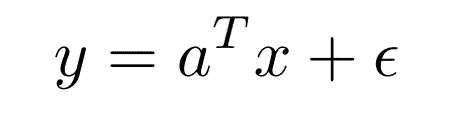

现在，标签本身就是一个随机变量，由一个**确定部分**和一个**随机部分**组成。请注意，所有随机性都来自白噪声或ε项。特别是，我们假设噪声的均值为零且方差有限:

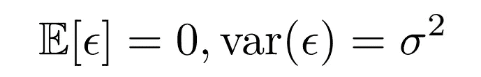

我们感兴趣的是估计 x hat，下面这个问题的解，它本身就是一个随机变量，因为 y 是一个随机变量。

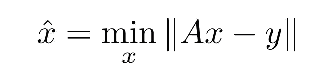

特别是，我们只对线性估计类或形式的估计感兴趣

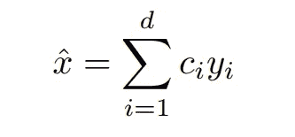

对于由系数 c 定义的给定估计量，估计量的**方差**或均方误差由下式给出。

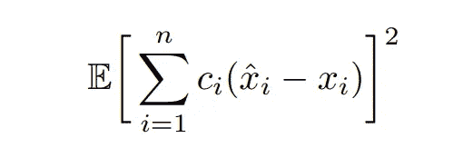

估计量是无偏的意味着

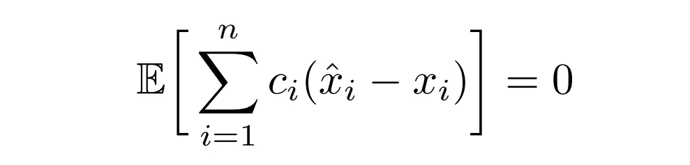

高斯-马尔可夫定理简单地说明了下面的估计量是无偏的并且具有最低的方差:

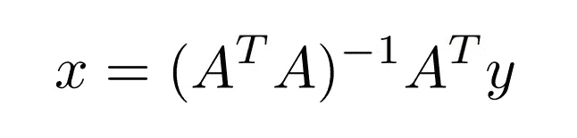

高斯-马尔可夫定理告诉我们，在线性估计量无偏的条件下，我们能做的使方差最小的最好的事情就是上面的估计量。这一统计特性体现了 OLS 估计量的简单性和最优性。线性和无偏性是至关重要的假设。如果我们允许估计量有偏差，那么我们可以进一步减少方差，例如通过**岭回归**，也称为[吉洪诺夫正则化](https://en.wikipedia.org/wiki/Tikhonov_regularization)。詹姆斯-斯坦估算器摒弃了线性假设，也实现了更低的方差。偏差和方差之间的权衡是机器学习和统计学习中的一个重要主题，因为有时为了另一个而放弃一部分是可取的，反之亦然。

虽然高斯-马尔可夫定理的证明超出了本文的范围，但我们希望该定理的陈述已经得到澄清。对于感兴趣的读者，可以在这里找到一个证明。

# 超定情况(n>m)

到目前为止，我们已经隐含地假设矩阵 A 具有满列秩——或者特别地，它具有更多的行和列。在前一节中，我们甚至给出了最小二乘问题解决方案的预览。在这里，我们将更详细地讨论如何解决这个问题。我们准备好了

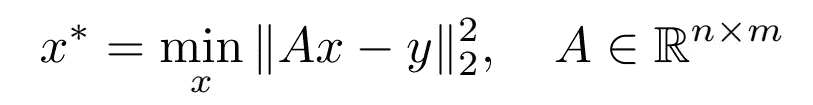

其中特征矩阵的高度当然大于宽度:在 n-空间中，要满足的方程比自由度还多。我们还假设矩阵是满秩的。在这种情况下，求解 [**正规方程**](https://mathworld.wolfram.com/NormalEquation.html) (通过对上面的表达式求微分并将导数设置为零而获得)得到解

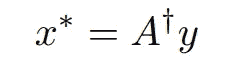

其中匕首表示矩阵的 Moore-Penrose 伪逆:

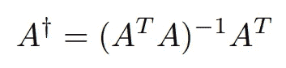

# 欠定情况(m>n)

在欠定情况下，特征矩阵短而宽。在这种情况下，我们有足够的自由度来满足方程！当然，通过[秩-零性定理](https://en.wikipedia.org/wiki/Rank%E2%80%93nullity_theorem)，我们知道方程 Ax=y 实际上有无穷多个解。因此，为了将问题公式化为寻找最小范数解:

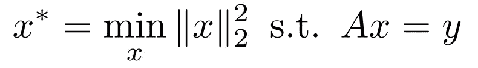

这个问题可能看起来与前一个问题无关，但结果是解决方案看起来非常相似！我们为短且胖的矩阵类似地定义 **Moore-Penrose 伪逆**，除了交换一些术语:

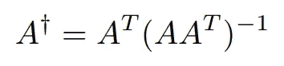

在这个定义下，最小范数问题的解可以再次表示为

上面提出的解决方案可以通过使用这些幻灯片中[所描述的限制论点来找到。](http://ee263.stanford.edu/lectures/min-norm.pdf)

# **分析真实数据集**

我们对来自 UCI 机器学习知识库的[红酒质量数据集](https://archive.ics.uci.edu/ml/datasets/Wine+Quality)应用最小二乘回归。任务是使用以下 11 个解释性特征(固定酸度、挥发性酸度、柠檬酸、残糖、氯化物、游离二氧化硫、总二氧化硫、密度、pH、硫酸盐、酒精)预测葡萄酒质量。我们在下表中展示了一些葡萄酒的特性。

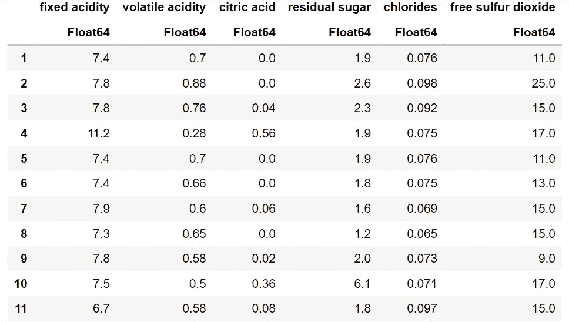

红葡萄酒的质量特征。图片作者。

我们先解决所有解释变量的线性回归问题，然后针对单个变量(密度)进行可视化。在下面的代码中，我们将问题转化为最小二乘问题，进行 80–20 训练测试分割，然后使用上面的等式求解预测值。

线性最小二乘回归。

均方误差(MSE)为 0.4068。使用单个特征(密度)，我们实际上可以获得 0.7206 的 MSE，这与使用所有特征相比是有竞争力的。如下图所示，密度与葡萄酒质量呈负相关。橙色线显示最佳线性无偏预测值(蓝色)，我们通过使用特征矩阵的 **Moore-Penrose 逆运算**解决了该预测值。

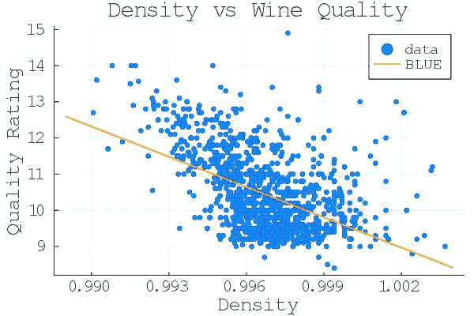

图片作者。

# 摘要

最小二乘回归对于拟合数据是必不可少的，应该是每个数据科学家的工具包中的一部分。它不仅是一个基本的模型，而且也是优雅和合理的——由方差最小化考虑(高斯-马尔可夫定理)驱动。在本文中，我们展示了如何解决超定和欠定最小二乘问题，并将线性最小二乘回归应用于红酒数据集。摩尔-彭罗斯逆运算和 OLS 回归问题的解决方案可以用你喜欢的脚本语言用几行代码实现。虽然我们没有深究细节**偏差-方差权衡**，如果你喜欢这篇文章，这是一个有趣的话题，可以了解更多。这个故事的简短版本是:人们可以通过**正则化**来进一步减少估计量方差，以换取额外的偏差。我强烈鼓励你继续阅读下面的文章！

# **参考文献**

*   [机器学习:凯文·墨菲的概率观点](https://www.amazon.com/Machine-Learning-Probabilistic-Perspective-Computation/dp/0262018020)
*   [斯坦福最小二乘问题讲义](http://ee263.stanford.edu/lectures/min-norm.pdf)
*   [UCI 机器学习知识库](https://archive.ics.uci.edu/ml/index.php)
*   [最小二乘法中的偏差方差权衡](https://people.eecs.berkeley.edu/~jegonzal/assets/slides/linear_regression.pdf)