# 正交系统和傅立叶级数

> 原文：<https://towardsdatascience.com/orthogonal-system-and-fourier-series-bec96510db98?source=collection_archive---------9----------------------->

## [思想和理论](https://towardsdatascience.com/tagged/thoughts-and-theory)

## 如何利用函数的正交性导出傅里叶级数

图片来自 [Unsplash](https://unsplash.com/)

这篇文章介绍了傅立叶级数以及它是如何推导出来的。阅读这篇文章你不需要知道很多关于傅立叶变换的知识，但是我希望你知道一些关于多项式和基本微积分的知识。一些线性代数可能也会有所帮助。

周期函数可以分解成正弦函数和余弦函数，它们构成了傅立叶级数。正弦和余弦函数都可以称为正弦曲线，因为它们都是以下形式的函数:

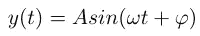

执行傅立叶变换的中心思想是将函数从**时域**转换到**频域**。傅立叶级数是应用数学中一个非常强大的工具，因为它可以将一个问题转化为更容易解决的问题。如果某个问题在频域比在时域更容易解决(这在信号处理中非常典型)，那么我们就把它转换到频域。有时候我们可以用[卷积定理](https://en.wikipedia.org/wiki/Convolution_theorem)来检索解。这种变换提供了很多便利，例如在解微分方程时，我想在以后的另一篇文章中讨论。

# 正交系

这里引入正交系是因为傅里叶级数公式的推导就是基于此。

这意味着什么？当两个向量的点积等于 0 时，我们说它们正交。形式上，

> 向量的正交系是欧几里得(希尔伯特)空间的非零向量的集合{x_α}，具有标量积(⋅,⋅)，使得当α≦β时(x_α，x_β)=0。

考虑两个向量 **x** = (-1，2，0)， **y** = (1，0.5，2)，那两个向量是正交的，因为点积**x****y**= 0。

要理解两个函数 g(x)和 f(x)的正交性，可以类比推理。它们可以被认为是两个无限维的向量，事实上构成了[希尔伯特空间](https://en.wikipedia.org/wiki/Hilbert_space)。我们如何计算两个函数的“点积”？我们用积分来计算

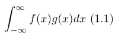

如果这两个函数是正交的，则积分(1.1)的值为 0。

## 一些准备

现在我们可以看看一些正交系统的例子，它们将在下一节中用到。我们想证明这一点

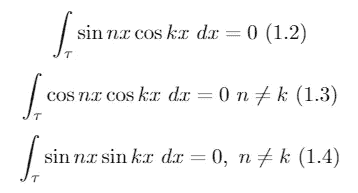

我们用τ来表示一个周期的间隔，这里是 2π，意思是τ = [t₀，t₀+2π].为了方便起见，我们让一个周期的长度 T = 2π，这样我们可以处理 sin(nx)而不是 sin(2π/t * nx)。

为了证明这些等式，这两个公式会派上用场

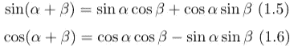

首先让我们看看(1.2)。我们可以使用公式(1.5)以如下方式重写它

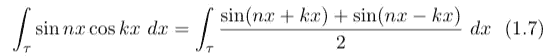

根据[求和规则积分](https://www.mathdoubts.com/integral-sum-rule/)

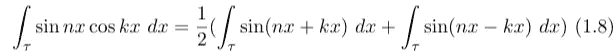

现在很容易看出(1.2)成立。sin(nx+kx)和 sin(nx-kx)的积分成立，因为任何正弦波在一个周期内的积分等于 0。在此之后，我们可以使用公式(1.6)以同样的方式证明(1.3)和(1.4)，并且我们可以得到

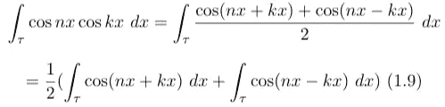

和

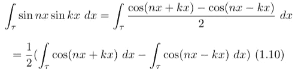

# 傅立叶级数的求导

我们可以用下面的公式来近似一个周期函数:

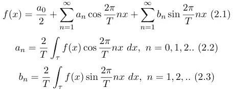

傅立叶级数和傅立叶系数

其中 T 是一个周期的长度。这是一般情况下的公式，其中周期为 T，如前所述，为了方便起见，我们考虑 T = 2π的情况。现在，我们将使用上一部分中配备的正交系知识来推导这些公式。

在公式(2.1)中，a₀、a_n 和 b_n 是所谓的傅立叶系数。公式(2.2)和(2.3)告诉我们如何找到这些系数。为了计算 a_n，我们只需使用公式(2.2)并代入 n=0。a_0 除以 2，所以公式(2.2)可以直接用来计算 a_n。

现在我们来看看如何推导 a_n 和 b_n，为了求一个具体的 a_k，诀窍是将(2.1)的两边乘以 **cos(kx)** ，这样就可以创建相互正交函数的积分。然后我们整合双方

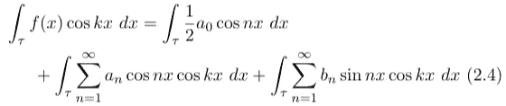

再次使用积分的求和规则

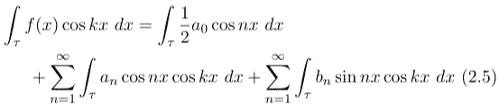

现在事情变得非常简单，因为我们已经从上一节中获得了结论，我们可以很容易地观察到

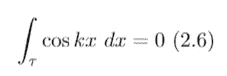

因为任何正弦曲线在一个周期内的积分等于 0。根据我们以前证明的等式(1.2)、(1.3)和(1.4)，除了 n=k 的部分，所有其他加数都消失了。提醒一下:

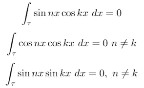

我们在上一节已经看到的正交函数

去掉零加数后，剩下的就是评估了

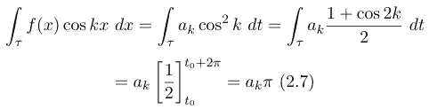

然后我们可以很容易地获得

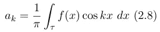

这个结论也适用于一般情况，其中 T 是任意周期。系数 a_n. (2.3)的公式可以用同样的方法证明，唯一的区别是我们把(2.1)的两边都乘以 **sin(kx)** 而不是 cos(kx)。

## 示例和实施

在这一节中，我们将看一个傅立叶级数应用的典型例子，它是一个方波。我们会尝试用 Matlab 来实现(因为我真的很喜欢用 MatLab 做数值分析或者函数逼近)。

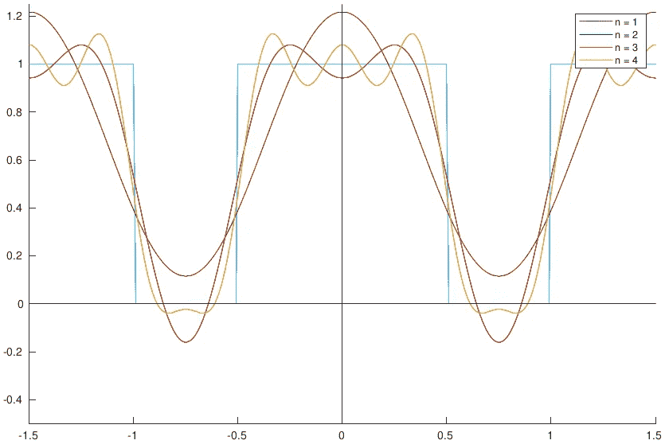

用傅立叶级数逼近方波。图片作者。

我们可以这样实现周期函数

我们知道，那么这个方波函数的一个周期的长度是 T = 3/2，紧支集的长度是 1。我们可以使用公式(2.1)、(2.2)和(2.3)以及下面的脚本来模拟这个函数

你可以试着改变逼近的迭代次数(n)，你会看到 n 越大，逼近越接近原函数。一些曲线被其他曲线覆盖，因为当 n / (3/2)是整数时，结果曲线与前一条曲线相同。如在 n=2 和 n=3 的情况下——曲线 n = 3 被曲线 n=2 覆盖，因为在最后一次迭代中`cos(2*pi/t * i*x)`和`sin(2*pi/t * i*x)`都等于 0，并且它不做任何事情。

# 摘要

在这篇文章中，我们看到了傅立叶级数的简短介绍，然后我们看了一下正交系统的定义。有了这些知识(也有一些技巧)，我们试图推导傅立叶系数的公式。最后，我们看到了如何使用傅立叶级数来实现近似，这一部分使用了 Matlab。

**资源**

【1】[正弦波](http://encyclopediaofmath.org/index.php?title=Sinusoid&oldid=35602)。*数学百科全书。*

【2】[正交系统](https://encyclopediaofmath.org/index.php?title=Orthogonal_system&oldid=49667)。*数学百科全书。*

[3]G. Arfken， [H. Weber 和 F. E. Harris，物理学家的数学方法第 7 版(2011)](https://www.elsevier.com/books/mathematical-methods-for-physicists/arfken/978-0-12-384654-9) ，学术出版社

[4]Swapnil Sunil Jain，[傅立叶系数的推导(2013)](https://planetmath.org/derivationoffouriercoefficients1) ，PlanetMath

**错误日志**

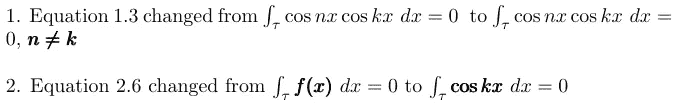