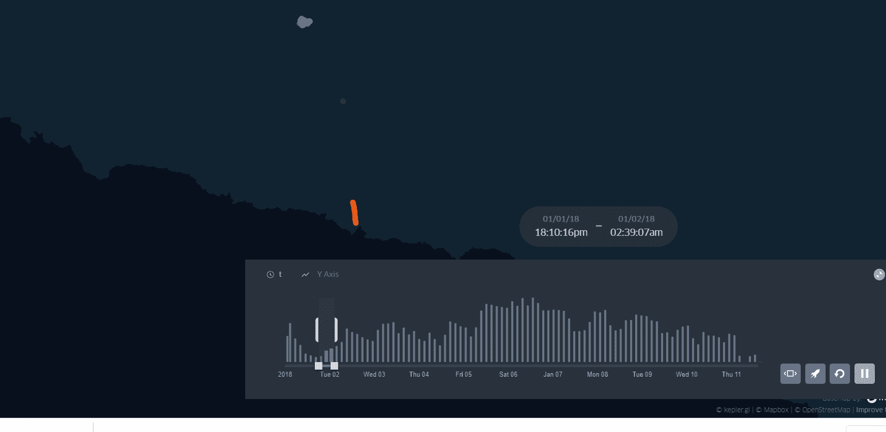
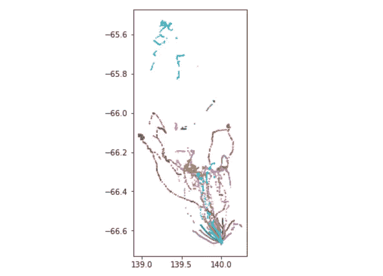
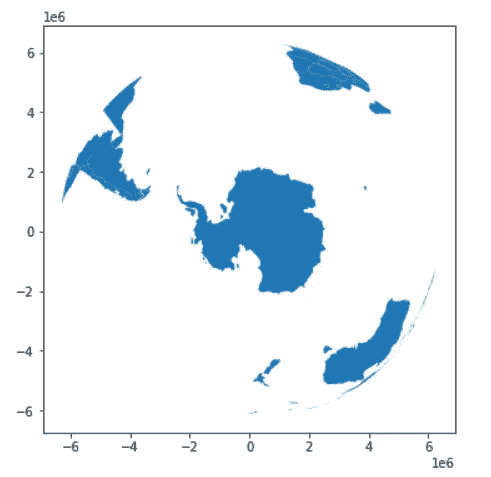
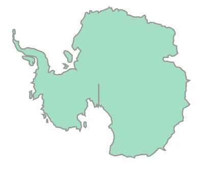
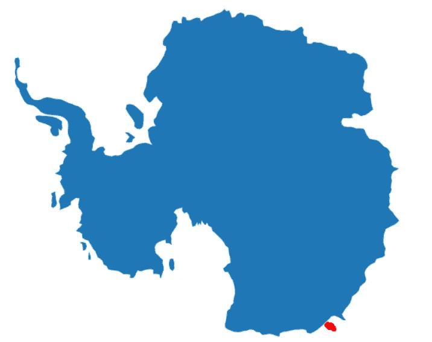
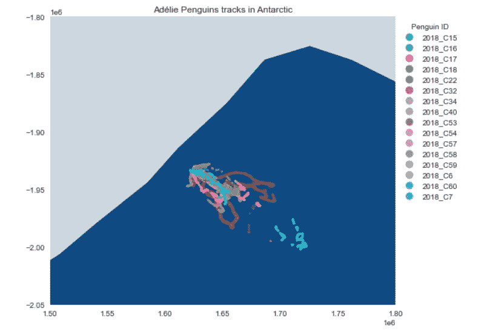
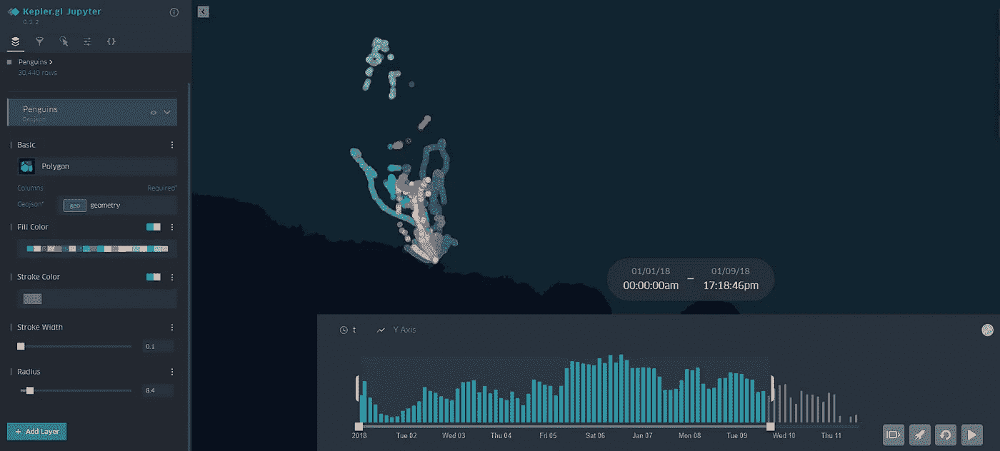

# 基于 pyproj 的南极企鹅追踪正射投影

> 原文：<https://towardsdatascience.com/orthographic-projection-with-pyproj-for-penguin-tracking-in-antarctica-18cd2bf2d570?source=collection_archive---------34----------------------->

## 如何在正投影中创建地图以及使用企鹅追踪数据创建地图动画— Pyproj 和 KeplerGL



阿德利企鹅的行为研究是针对**中心位置觅食理论**的，该理论解释了繁殖海鸟应该积极优化猎物的获取，因此，觅食应该位于猎物最容易获得的地方，在物种能量学定义的范围内【1】。尽管南极的条件如海面温度、叶绿素浓度或海冰覆盖，企鹅必须根据海洋学特征在不同的地点找到觅食的成功。

在这次地图审查中，我将使用一个子集，其中包含 2018 年在南极洲记录的 16 只企鹅的运动轨迹。整个数据集包含 2010 年 12 月 21 日至 2018 年 1 月 11 日期间记录的 129 只企鹅的跟踪信息，可以在 Movebank 中直接找到[T5 这里](https://www.movebank.org/cms/webapp?gwt_fragment=page=studies,path=study1375204238) **。**

> **最终地图动画:** [**这里！**](https://bryanvallejo16.github.io/penguin-tracking-antarctica/) **资源库:** [**这里！**](https://github.com/bryanvallejo16/penguin-tracking-antarctica)

**目标*目标*目标**

这个练习的主要目的是用 pyproj 在正投影中可视化企鹅的足迹。此外，使用 KeplerGL 创建地图动画，显示企鹅在海岸线上觅食活动期间的行为运动。因此，我们将获得两个产品:1)具有正交视图的地图，以及 2)企鹅足迹的地图动画。

***1)用正投影创建地图***

正交投影的思想是在三维地球中以方位角透视(垂直)来可视化对象。为此，我们将使用 python 库 pyproj 和 geopandas。第一个主要步骤是可视化数据集。

```
import geopandas as gpd
import pandas as pd
from pyproj import CRS
from keplergl import KeplerGl
import matplotlib.pyplot as plt# reading data
fp = r'data/penguin-tracks.gjson'
geodata = gpd.read_file(fp, driver='GeoJSON')# defining timestamp columns
geodata['timestamp'] = pd.to_datetime(geodata['timestamp'])
geodata['year'] = pd.DatetimeIndex(geodata['timestamp']).year
geodata['t'] = geodata['timestamp'].astype(str)
```

上面的代码只是读取数据并创建两个额外的列。`year`包含曲目的年份，对于本例，所有记录都是 2018 年，而`t`包含字符串类型的时间戳。地图动画的字符串类型中需要最后一列。然后，作为 WGS84 中的快速可视化，我们运行下一行来可视化数据。

```
geodata.plot(column='ind_ident', figsize=(12,6), markersize=0.2)
```



图片由作者提供。wgs84 中 16 只企鹅的足迹

现在，我将直接从 geopandas 加载全球国家的[自然地球](https://www.naturalearthdata.com/)图层，并将其投影到 [**正投影**](https://epsg.io/3031) 。因此，按照我们观察圆形球体的方式，我将正投影的中心放在南极，这意味着`latitude -90°`和`longitude 0°`。正投影的 CRS 通过转换获得:从 proj4(参数)到 CRS。代码是这样的:

```
# create world layer
world = gpd.read_file(gpd.datasets.get_path(‘naturalearth_lowres’))# define center of Orthographic Projection
lat = -90
lon = 0ortho = CRS.from_proj4("+proj=ortho +lat_0={} +lon_0={} +x_0=0 +y_0=0 +a=6370997 +b=6370997 +units=m +no_defs".format(lat, lon))# Re-project and plot
geodataor = geodata.to_crs(ortho)
world = world.to_crs(ortho)
world.plot(figsize=(12,6))
```



图片由作者提供。正交投影以南极洲为中心的世界图层

现在，我们创建一个独特的`figure, ax`，在那里**世界层**和**企鹅轨迹**将被添加。在这个独特的`figure, ax`中，我们设定 **x** 和 **y** 限制了南极洲大陆的边界框。首先，我们得到南极洲的边界框，然后我们绘制它。代码如下所示:

```
antarctic = list(world.loc[world['continent']=='Antarctica'].geometry)[0]
antarctic
```



图片由作者提供。南极的几何对象

现在我们设置包围盒的 **x 最小，x 最大，y 最小，y 最大**:

```
bounds = antarctic.bounds

xmin = bounds[0]
xmax = bounds[2]ymin = bounds[1]
ymax = bounds[3]
```

现在，独特的`figure, ax`:

```
# create unique fig, ax
fig, ax = plt.subplots(figsize=(12, 8))# adding layers
world.plot(ax=ax)
geodataor.plot(ax=ax, markersize=10, color=’red’)# limits
ax.set(xlim=(xmin, xmax), ylim=(ymin, ymax))plt.axis(‘off’)
```



图片由作者提供。正投影中企鹅足迹的定位

既然我们知道了企鹅足迹的位置，我们就可以绘制最终的地图了。

```
plt.style.use(‘seaborn’)# create unique fig, ax
fig, ax = plt.subplots(figsize=(10, 7))# adding layers
world.plot(ax=ax, color=’#CED7E0', edgecolor=’black’)
geodataor.plot(ax=ax, column = ‘ind_ident’, markersize=7, alpha=0.8, cmap=’tab10', legend=True)# limits
ax.set(xlim=(1500000, 1800000), ylim=(-2050000, -1800000))# plt.axis(‘off’)
plt.grid(False)
ax.set_facecolor(‘#0F4983’)plt.title(‘Adélie Penguins tracks in Antarctic’)ax.get_legend().set_bbox_to_anchor((1.2,1))
ax.get_legend().set_title(“Penguin ID”)plt.savefig(r’png/penguin-tracks.png’)
```



图片由作者提供。南极的企鹅足迹。

***2)用 KeplerGL*** 创建地图动画

现在，我们想要可视化企鹅足迹的运动模式。我们在`geodata` 层中只选择地图动画所需的列。那么，可视化运动模式的一个很棒的工具就是 KeplerGL 库。创建 KeplerGL 映射的步骤是从一个空实例开始，然后添加数据，最后保存映射。如下:

```
# selecting the needed columns
geodata = geodata[[‘t’, ‘ind_ident’, ‘geometry’]]# Create KeplerGl instance
m = KeplerGl(height=600)# Add stop durations
m.add_data(geodata, ‘Penguins’)m
```

在这里，我们使用 KeplerGL 根据需要配置地图。



图片由作者提供。带有企鹅跟踪数据的 KeplerGL 实例

最后，配置完成后保存地图即可。

```
# Save map as html
m.save_to_html(file_name=’index.html’)
```

**结论**

您可以根据需要使用正投影，不仅可以使用这些数据，而且您可能会注意到，您总是需要在同一个地图中包含所有具有相同投影的内容。这个病例是正高的。对于 KeplerGL，数据必须在地理 CRS (EPSG 4326)中。

企鹅追踪记录包含了空间空白。像往常一样，这种情况发生在运动数据上，并且与 GPS 信号有关。有重建轨迹(路径)的选项。如果你有兴趣了解更多动物追踪和运动数据，请在 [**上 ping 我的 LinkedIn 个人资料**](https://www.linkedin.com/in/bryanrvallejo/) **。**

**参考文献**

[1] Ballard，g .，Schmidt，a .，Toniolo，v .，Veloz，s .，Jongsomjit，d .，Arrigo，k .，Ainley，D. (2019)。*“表征阿德利企鹅在西南罗斯海成功觅食的精细尺度海洋学特征”*。第 608 卷:263–277 页。https://doi.org/10.3354/meps12801