# 使用折射仪测量其他咖啡

> 原文：<https://towardsdatascience.com/other-coffee-measurements-using-a-refractometer-85d0fb28d3d7?source=collection_archive---------35----------------------->

## 咖啡数据科学

## 探索未知

在阅读有关色度计来分析咖啡烘焙时，我想到了咖啡在提取后是如何改变颜色的。我想知道测量之前和之后的颜色是否与提取有关。理解圆盘的哪些部分比其他部分提取得更多或更少将是有趣的。

我不会为了一个不确定的实验花 300 美元或更多在这样一个设备上。然而，我有一个折射计，我有一个疯狂的想法。如果我们把咖啡磨粒放在折射计的镜头前和镜头后会怎么样？虽然单个测量的输出可能不令人感兴趣，但与其他测量相比，它可能会告诉我们一些东西。

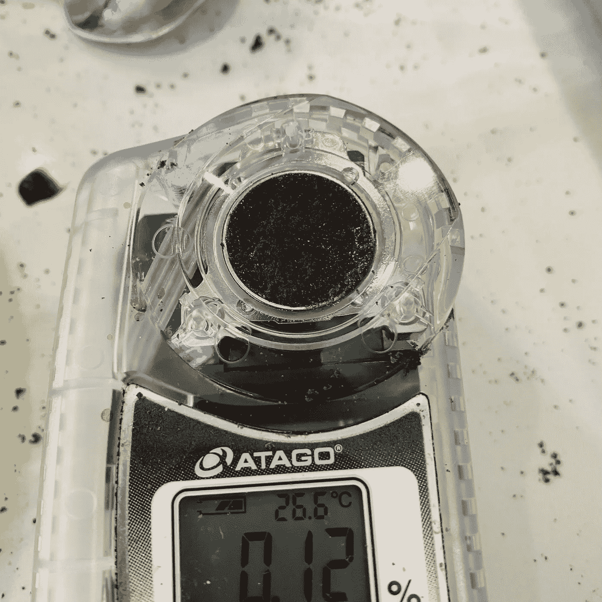

# 初始测试

我的第一次测试马上就失败了。我有一台 Atago 数字折光仪，可以测量总溶解固体(TDS)。我把干的用过的咖啡渣放在上面。然而，它需要一些液体。

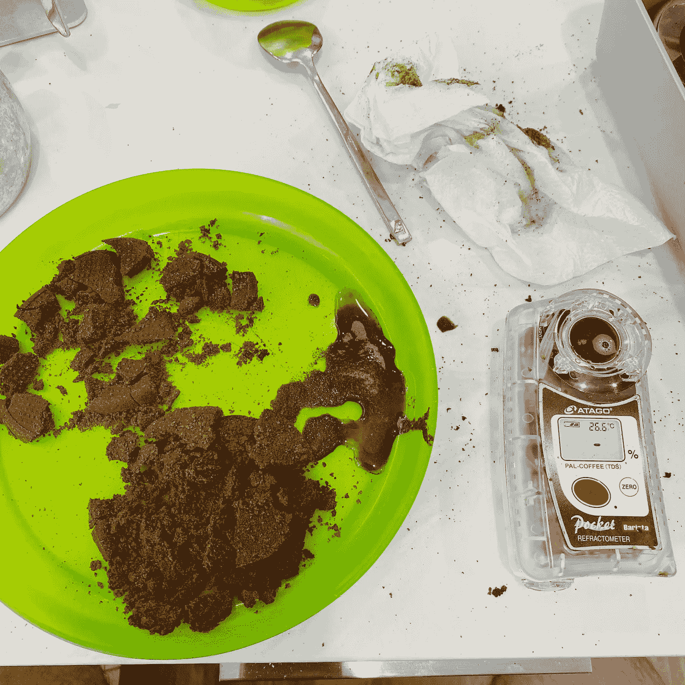

所以我修改了我的测试，加入了一点水，然后我等待着。我等待着。我等了一分钟，最后，读数显示大约 0.1% TDS。这是令人鼓舞的，所以我想做一些测试，以确定这是否能提供有用的信息。

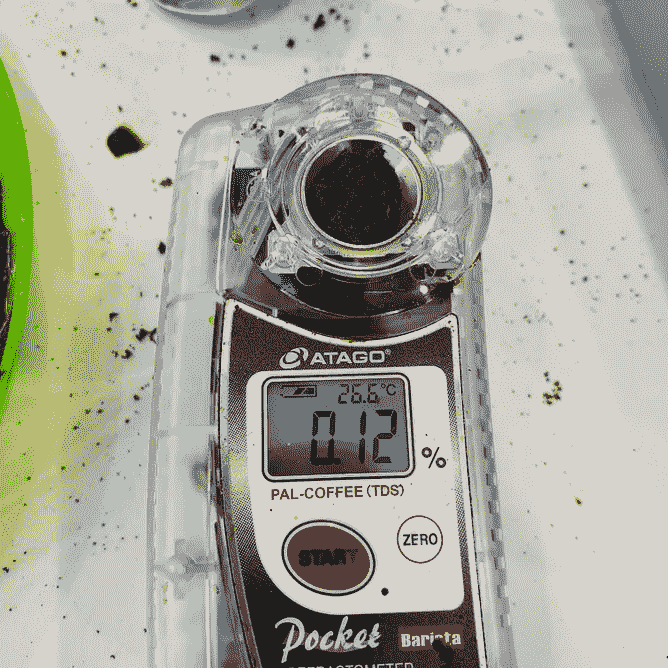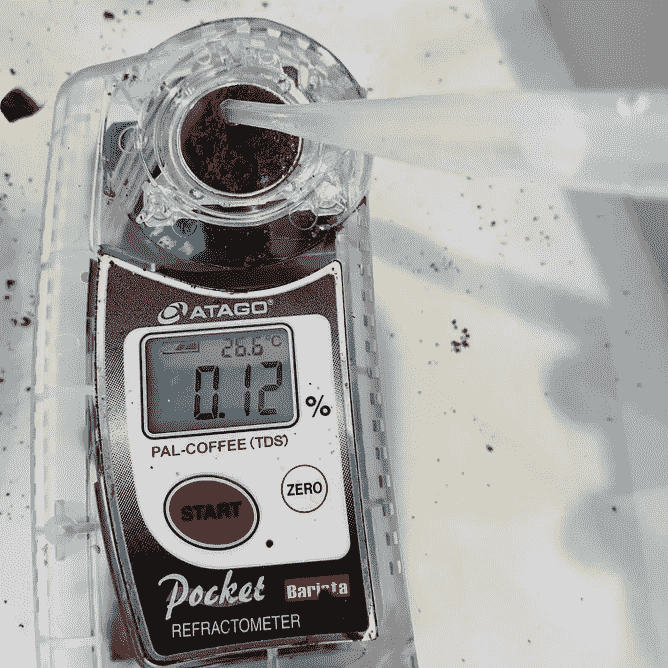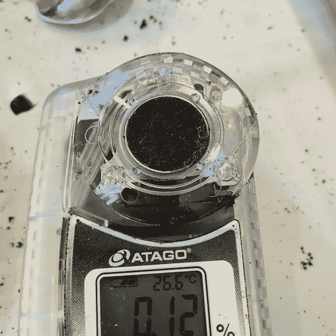

我们可以将这种测量接地 TDS (gTDS)称为占位符。

# 进一步测试

我在测试中使用了一个断续的夯实镜头。我一直在测量冰球上半部分和下半部分的重量，看看提取来自哪里。

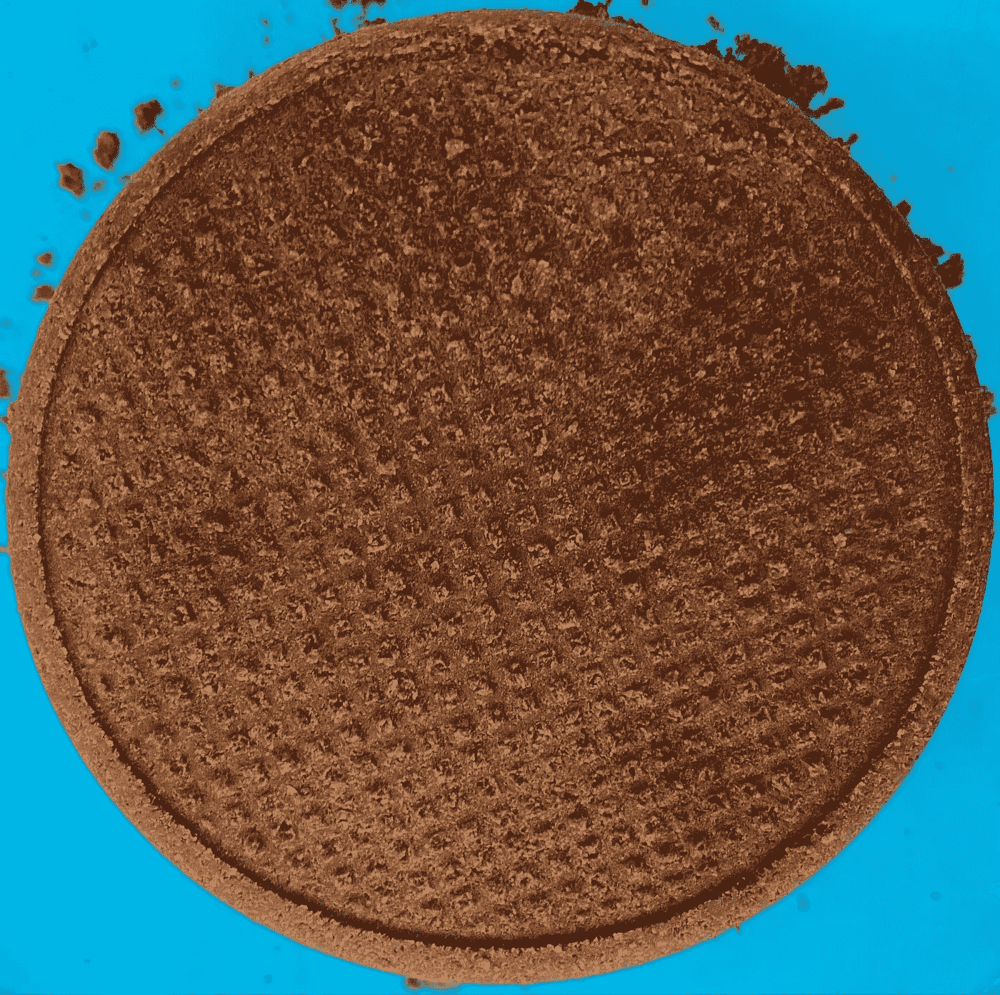

我只是在靠近中心的地方随机选择了一个点，然后通过将加了水的废咖啡样品放在 Atago 上来测量 gTDS。我知道，这实际上不是 TDS，因为通常，你希望样品没有未溶解的固体。

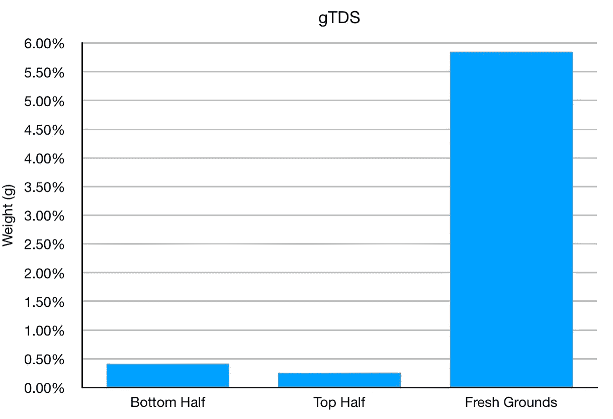

然后，我进行空间测量，以了解这些测量的可重复性，以及测量值是否会因较暗或较亮的点而发生变化。众所周知，较暗的点流量较低，因此提取较少。

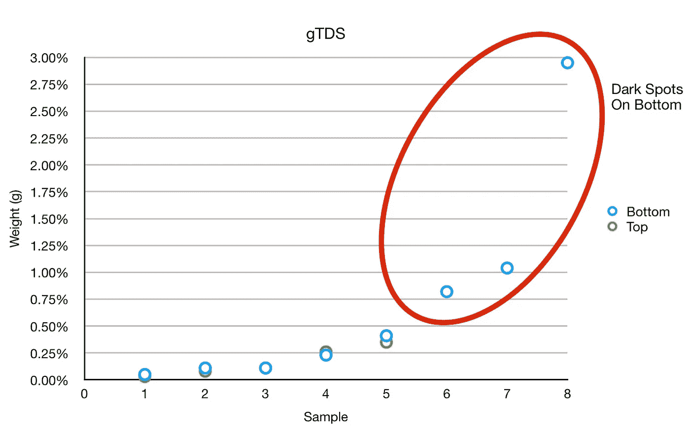

然后我们可以从空间上看下半部分的这些值。对于上半部分，没有任何明显的颜色差异。对于下半部分，有，大部分的深色只是在表面。

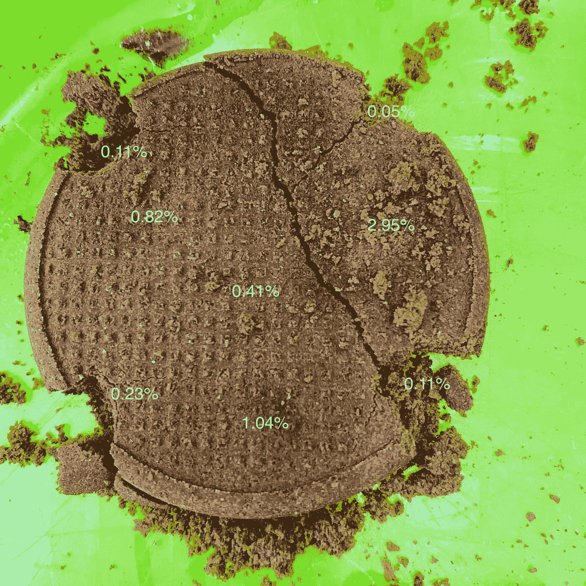

所以冰球上的差异就显现出来了。令我感兴趣的是，根据击球后的重量估计，冰球底部应该有更高的提取率，但 gTDS 略高。

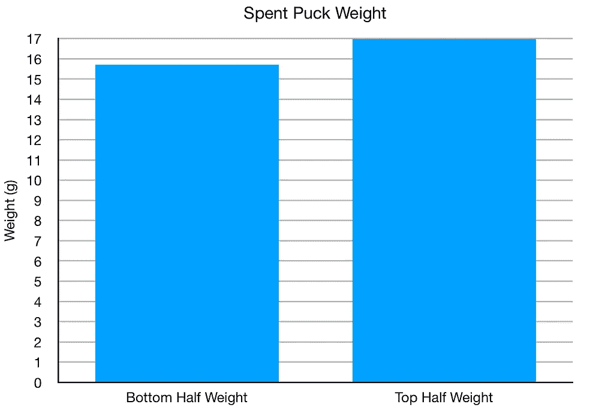

我认为这说明了圆盘的顶部比底部被提取得更多，但是底部可能过滤掉了一些提取物，因为我之前的作品展示了咖啡渣是如何捕获可溶物的。然而，那只是理论。我认为没有足够的信息。做出这个决定。

# 废咖啡测量

作为一个健全的检查，我有一些用过的咖啡渣，我一直在使用一些实验，他们被筛选到三个粒子大小的箱子。我也测量了它们，gTDS 非常低，比投篮后的冰球低得多。

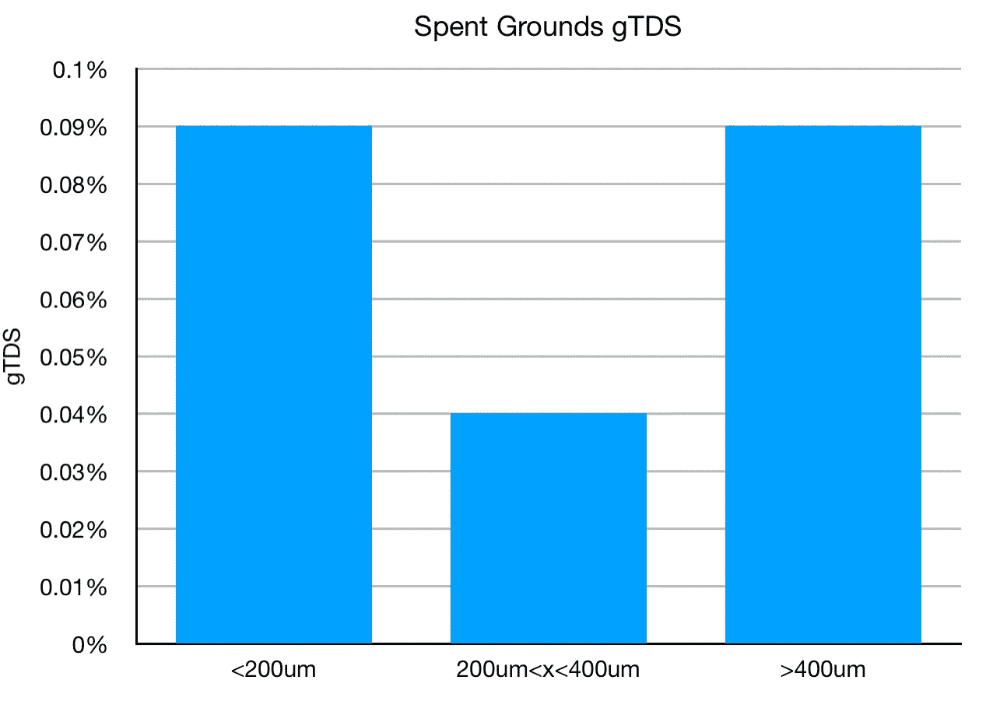

这个实验有点疯狂，但我很好奇，如果我随着时间的推移取一些样本，我会看到提取和 gTDS 测量之间的相关性吗？击球时没有取出的东西一定还在冰球里。除了心照不宣的知识之外，许多这些奇怪的实验都没有很好的理由或直觉来启动它们，但它们最终让我对浓缩咖啡有了深刻的理解。

如果你愿意，可以在 Twitter 和 YouTube 上关注我，我会在那里发布不同机器上的浓缩咖啡视频和浓缩咖啡相关的东西。你也可以在 [LinkedIn](https://www.linkedin.com/in/robert-mckeon-aloe-01581595?source=post_page---------------------------) 上找到我。也可以关注我[中](https://towardsdatascience.com/@rmckeon/follow)。

# [我的进一步阅读](https://rmckeon.medium.com/story-collection-splash-page-e15025710347):

[浓缩咖啡系列文章](https://rmckeon.medium.com/a-collection-of-espresso-articles-de8a3abf9917?postPublishedType=repub)

[工作和学校故事集](https://rmckeon.medium.com/a-collection-of-work-and-school-stories-6b7ca5a58318?source=your_stories_page-------------------------------------)

[个人故事和关注点](https://rmckeon.medium.com/personal-stories-and-concerns-51bd8b3e63e6?source=your_stories_page-------------------------------------)

[乐高故事启动页面](https://rmckeon.medium.com/lego-story-splash-page-b91ba4f56bc7?source=your_stories_page-------------------------------------)

[摄影启动页面](https://rmckeon.medium.com/photography-splash-page-fe93297abc06?source=your_stories_page-------------------------------------)

[改进浓缩咖啡](https://rmckeon.medium.com/improving-espresso-splash-page-576c70e64d0d?source=your_stories_page-------------------------------------)

[断奏生活方式概述](https://rmckeon.medium.com/a-summary-of-the-staccato-lifestyle-dd1dc6d4b861?source=your_stories_page-------------------------------------)

[测量咖啡磨粒分布](https://rmckeon.medium.com/measuring-coffee-grind-distribution-d37a39ffc215?source=your_stories_page-------------------------------------)

[咖啡萃取](https://rmckeon.medium.com/coffee-extraction-splash-page-3e568df003ac?source=your_stories_page-------------------------------------)

[咖啡烘焙](https://rmckeon.medium.com/coffee-roasting-splash-page-780b0c3242ea?source=your_stories_page-------------------------------------)

[咖啡豆](https://rmckeon.medium.com/coffee-beans-splash-page-e52e1993274f?source=your_stories_page-------------------------------------)

[浓缩咖啡用纸质过滤器](https://rmckeon.medium.com/paper-filters-for-espresso-splash-page-f55fc553e98?source=your_stories_page-------------------------------------)

[浓缩咖啡篮及相关主题](https://rmckeon.medium.com/espresso-baskets-and-related-topics-splash-page-ff10f690a738?source=your_stories_page-------------------------------------)

[意式咖啡观点](https://rmckeon.medium.com/espresso-opinions-splash-page-5a89856d74da?source=your_stories_page-------------------------------------)

[透明 Portafilter 实验](https://rmckeon.medium.com/transparent-portafilter-experiments-splash-page-8fd3ae3a286d?source=your_stories_page-------------------------------------)

[杠杆机维护](https://rmckeon.medium.com/lever-machine-maintenance-splash-page-72c1e3102ff?source=your_stories_page-------------------------------------)

[咖啡评论和想法](https://rmckeon.medium.com/coffee-reviews-and-thoughts-splash-page-ca6840eb04f7?source=your_stories_page-------------------------------------)

[咖啡实验](https://rmckeon.medium.com/coffee-experiments-splash-page-671a77ba4d42?source=your_stories_page-------------------------------------)