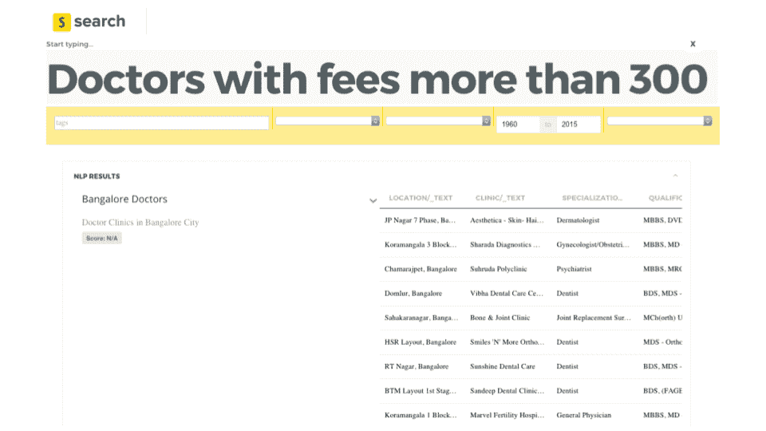
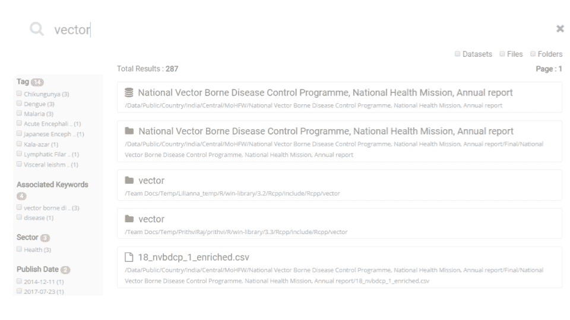
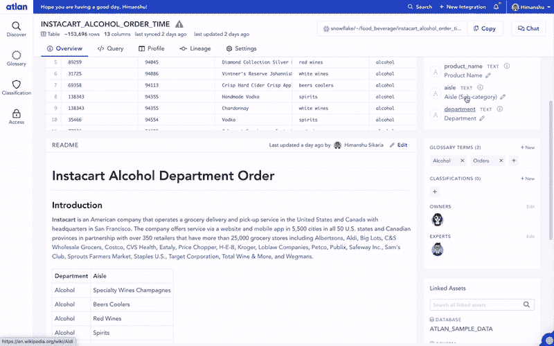

# 我们未能建立一个数据目录 3x。原因如下。

> 原文：<https://towardsdatascience.com/our-learnings-from-3-failures-over-5-years-to-set-up-a-data-catalog-fb9778e25d4e?source=collection_archive---------5----------------------->

## 我们认为解决这个问题很容易，但是我们大错特错了。

*照片由* [*汤姆·赫曼斯*](https://unsplash.com/@tomhermans) *上* [*下*](https://unsplash.com/)

在 Atlan，我们最初是一个数据团队，与联合国、盖茨基金会、世界银行等组织一起推动社会公益数据项目。

我们充当客户的“数据团队”，因此我们亲身经历了处理大规模数据的所有混乱和挫折。我们每隔几天就会被危机电话吵醒，哪怕是很小的问题——无论是解决仪表板上的数字为什么不正确，还是试图访问正确的数据集。

我们处理各种各样的数据，从 600 多个政府数据源到卫星图像等非结构化数据源。**我们的数据增长速度超出了我们的预期，而且我们事先并没有真正计划好如何存储或访问这些数据。**我们很快意识到，我们需要一个中央存储库来帮助我们的团队发现、理解和建立对我们正在处理的所有数据集的信任。

我们认为解决这个问题很容易，但是我们大错特错了。这是一个故事，讲述了我们的团队如何经过 4 次尝试和 5 年时间，最终成功实现了一个成功的数据目录。

# 尝试 1:构建一个由知识图驱动的 NLP 搜索

早在 2013 年，我们就开始涉足数据目录。我们一直在处理大型政府数据集，组织它们并快速找到我们需要的信息是一件痛苦的事情。

我们的目标是创建一个所有数据的存储库。我们想让它变得智能、易于搜索、使用直观。如果我们做对了，我们想我们甚至会把它提供给我们的用户，这样他们就不必通过同样困难的政府数据网站。

> 我们让我们最好的数据工程师参与这个项目，并制定了一个雄心勃勃的路线图——每个搜索的用户都应该能够在几秒钟内找到正确的数据。我们投入巨资建立了最好的搜索算法工具，如 Elasticsearch 和图形引擎，如 Neo4j，甚至建立了我们自己的自然语言能力。

我们内部团队最令人兴奋的演示是当他们搜索“收费超过 300 Rs 的医生”时，该工具返回了确切的答案。不是数据源或表的列表，而是最相关的表中的 10 行。

*我们第一个数据目录的 NLP 支持的搜索正在进行。(图片来自作者。)*

然而，尽管这是我们在构建数据目录的 3 次尝试中最成功的技术成就之一，我们还是失败了。

## 我们失败的原因

阻止数据目录项目起飞的根本挑战不是搜索算法。老实说，今天的搜索算法是这个难题中比较容易的部分，已经被像 [Elasticsearch](https://www.elastic.co/) 这样的生态系统和像 [Algolia](https://www.algolia.com/) 这样的 SaaS 产品商品化了。

**真正的挑战在于在数据发现中建立相关性** —即能够管理和标记数据集和元数据，以便我们的知识图可以建立有意义的关系，我们的搜索算法可以了解哪些数据实际上与用户相关。

在过去的一年里，有很多关于人工智能驱动的元数据管理生态系统的讨论。在 Atlan，我们已经花了很多时间来思考(并构建)ML 算法，以自动化元数据监管的一切可能——例如，自动推荐来自机器人的列描述或相关业务标签。然而，在所有的炒作中，理解 ML 能做什么和不能做什么是至关重要的。

> 数据科学和分析的现实存在于技术和业务的交叉点上。*没有人主导的业务、用户和实体环境，任何数据团队都不可能成功。虽然机器可以帮助丰富元数据的过程，但它们永远不会取代人类。*

我们第一次尝试失败的原因是我们过于关注技术的酷和花哨部分，如 NLP 支持的搜索，而不是核心挑战——我们如何使我们的数据团队能够轻松地将“上下文”添加到我们所有的数据资产中，作为他们日常工作流程的一部分？

# 尝试 2:购买数据编目解决方案

在对该工具投入大量时间和工程资源后，我们放弃了构建内部解决方案的尝试。相反，我们决定买一个。

我们的一位分析师开始评估所有现成的商业解决方案。她最终列出了大约 10 种产品，我们开始联系他们。

**这开启了一个为期三个月的漫长过程，以了解外面有什么，以及什么是可能的。**许多供应商甚至没有回应我们的演示请求，可能是因为我们太小了。有些人接了我们的电话，但他们报出了百万美元的费用和 18 个月的实施周期。大多数这些产品的界面看起来像是 20 世纪 90 年代为 IT 团队设计的。它们都有复杂的实施周期和许可模式。

整个过程让我们伤脑筋。我们是一个现代团队，热爱投资于生产力。

> 我们已经在使用 Slack、Quip、Github 和十几个其他 SaaS 工具来帮助我们的团队更好地运行。我们如此习惯于现代软件的基础(快速设置、小额前期投资、随用随付模式和令人愉快的用户体验)，以至于我们无法相信解决我们的数据 CRM 问题的唯一方法是…嗯，不存在的。

最后一根稻草是当我们在生态系统中发现了一个相对较新的、有前途的产品。由于他们的产品仍在开发中，我们给他们发了一份十几个功能需求的清单。他们回答说，每个功能将花费 20，000 美元，只是为了在他们的路线图中优先考虑它。开发相对基本的功能需要 24 万美元，更不用说除此之外的额外软件许可费了。

就这样，我们停止了第二次尝试。

## 我们失败的原因

当时，对于我们这种类型的团队来说，没有可用的解决方案—云优先、“按需购买”的定价、快速的设置时间，以及少于 20 个用户。

# 尝试 3:创建一个 hacky 内部工具(并取得一些进展)

在两次彻底失败后，我们尝试了一个稍微不同的项目。这一次，我们……几乎成功了。

我们开始这一尝试时略有不同。我们没有考虑产品，而是从创建一个简单的共享元数据框架开始。这基本上是我们希望收集的所有属性的列表，作为我们所有数据的“上下文”。对于每个数据资产，我们的数据分析师和科学家将在一个. txt 文件中创建这些元数据。它与我们的数据资产存储在同一个共享文件夹中(类似 AWS S3 的对象存储)，提取器会将它转储到一个中央“目录”中。目录本身是一个简单的 UI，具有基本的搜索和浏览功能。

*我们第二个数据目录的搜索和浏览功能。(图片来自作者。)*

这个框架的好处是，基本发现是可用的，并且在我们所有的数据资产中启用。然而，虽然该目录帮助团队改进了一些数据发现问题，但我们并没有成功地让我们的团队添加关于数据资产的上下文，即列描述、为什么我们在分析中删除了某些列、已验证的数据资产等等。

> 这时我们意识到，当涉及到数据时，创建共享环境是一项团队运动。

为什么？没有人对数据有全面的了解。一些上下文是以业务为中心的，所以只有业务分析师或利益相关者知道它。有些上下文是技术性的，数据工程师知道。一些上下文隐藏在数据深处，如数据分析师所知的列中的怪异异常。

为了创造真正的共享环境，正确的解决方案需要具有包容性。一方面，我们需要让工程师通过他们的管道工具中的 API 推送元数据变得容易。另一方面，业务用户需要一个简单的 UI 或松散的集成来添加他们的上下文。整合不同人的工作流程是这一尝试的不足之处。

## 为什么我们半失败了

在这个项目中，我认为我们成功地迈出了第一步——创建了对我们团队最有效的元数据框架。然而，我们只是没有足够关注下一步——创建一种用户体验，让我们所有的团队成员能够轻松直观地向数据资产添加上下文。

像大多数团队一样，工程和产品资源是稀缺的。在这个项目中，我们没有产品设计师或 UI/UX 专家——我们根本没有多余的资源。结果是难以更新元数据的笨拙体验。像大多数现代团队一样，我们的文化永远不允许我们“强制”人们采用内部工具，所以不管我们做什么，**我们实际上无法让人们使用这个笨重的工具。**

# 尝试四:以用户体验为出发点

这一次我们以不同的方式开始，因为我们不能在这个问题上一直处理和失败。**我们从一个“匿名分析师”会议**、开始，我们的数据团队在周五晚上聚在一起，倾吐他们的心声。他们谈论了他们面临的挑战和他们在日常工作中遇到的挫折。

我们再次承诺构建我们自己的工具，但这次没有 hacky。从我们最近的尝试中，我们从高保真 UI 驱动的原型开始。我们首先在自己身上进行了测试，然后在一组不同组织类型、文化、领域、地域等的试点客户身上进行了测试。

> 我们反复测试和修改，直到我们自己的团队和我们一起工作的团队真正喜欢使用这个工具。

这花了很长时间，但很值得。我们构建的工具帮助我们自己的数据团队将工作质量提高了一倍，同时将我们用于数据项目的时间减少了一半。这就是今天变成亚特兰蒂斯的版本。

*我们在数据目录中加入了一些协作和文档功能。(图片来自* [*图集*](https://atlan.com) *)。)*

## 我们成功的原因

Airbnb 在[分享他们关于推动采用内部数据门户的经验](https://www.slideshare.net/neo4j/graphconnect-europe-2017-democratizing-data-at-airbnb)时说了一些深刻的话:“设计数据工具的界面和用户体验不应该是事后的想法。”**我们早就应该注意到这一点。**

我们的第四次尝试终于成功了，因为我们没有从一个很酷的功能开始，比如我们第一次尝试的 NLP 支持的搜索，或者后端功能，比如我们第三次尝试的 hacky 工具。我们从用户体验入手，做出我们团队想要使用的东西。

我们没有一个“酷”的 NLP 搜索(尽管我们正在努力)😉)，但人家没在意。我们的团队和客户实际上喜欢每天使用 Atlan。他们最终管理、分享和合作数据，这是最重要的。

# 数据目录的未来:面向不同数据用户的协作工作空间

在过去的一年里，随着 Atlan 成为数据团队工作流的核心部分，我花了很多时间思考数据目录的未来。

对我来说，这一类别的未来看起来将更像 Github 或 Figma，而不是我们在当今世界看到的任何东西。它将借用概念和超人的原则，使数据团队通过嵌入式协作变得更加高效。

嵌入式协作是指工作发生在你所在的地方，摩擦最少。想象一下，如果你可以在获得链接时请求访问数据资产，就像使用 Google Docs 一样，所有者可以在 Slack 上获得请求，并在那里批准或拒绝它？不再有浪费我们时间和精力的跨无数工具的微工作流。只有一个统一的空间，既包容又令人愉悦。

*了解将推动下一波数据目录的 4 个关键原则的更多信息:*

 [## 数据目录 3.0:现代数据栈的现代元数据

### 是时候采用一种现代元数据解决方案了，这种解决方案与其他现代解决方案一样快速、灵活、可伸缩…

towardsdatascience.com](/data-catalog-3-0-modern-metadata-for-the-modern-data-stack-ec621f593dcf) 

**觉得这个内容有帮助？在我的时事通讯《元数据周刊》上，我每周都写关于活动元数据、数据操作、数据文化和我们的学习建设的文章。** [**在此订阅。**](https://metadataweekly.substack.com/)