# 我们寻找需求:雷克斯房地产指数

> 原文：<https://towardsdatascience.com/our-search-for-demand-rex-real-estate-index-51590c8a7de1?source=collection_archive---------26----------------------->

## [行业笔记](https://towardsdatascience.com/tagged/notes-from-industry)

## 采用子市场方法预测房地产需求，并使用贝叶斯分层方法。

*该项目和报告由* ***普雷斯顿·程、南鲁和欧文·斯查费*** *共同撰写，是 2021 年春季哈佛顶点项目*的一部分

蒂埃拉·马洛卡在 [Unsplash](https://unsplash.com?utm_source=medium&utm_medium=referral) 上拍摄的照片

# 目录

1.  问题陈述和动机
2.  钻研数据
3.  建模方法
4.  估价
5.  未来的步骤

# 问题陈述和动机

9.6 万亿美元(截至 2019 年)的全球房地产市场是当今受技术干扰最小的市场之一。住宅房地产中的联系、交易和关系通常是通过传统的利益相关者和人类互动形成的。我们的合作伙伴组织 [REX](https://www.rexhomes.com/) ，利用机器学习和大数据的力量来匹配房屋所有者和买家，寻求创建一个大幅降低交易费用的平台。在减少信息不对称的各种方法中，REX 打算为房地产经纪人和房地产投资者建立一个更强大、更细粒度的房地产指数。目前的解决方案包括全国房地产经纪人协会(NAR)的价格指数和 Zillow 或谷歌实施的自动估价机(AVMs)。然而，这些价格指数通常仅基于州级或城市级指标，并不提供更细粒度子市场的清晰度。此外，确定住宅房地产现货价格的 AVM 是嘈杂的指标，受到不同买卖价差和抵押贷款批准的困扰。销售交易的价格也被认为是二阶效应，因为它们反映了供求动态的平衡。**因此，该项目旨在创建一个房地产指数，通过房屋上市和销售交易来预测需求。**

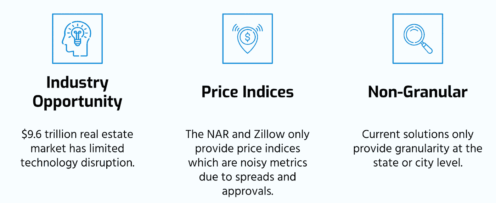

**图 1** 子市场需求型房地产指数的动机

有两篇关键的文献激发了我们的模型。首先，之前构建更精细的房地产指数的工作是由 2020 年秋季学期的[IACS·雷克斯团队开发的。他们的工作中描述的模型预测了市场层面上特定时间范围内的上市和销售数量，然后通过特定子市场内的销售/上市率与整个市场的销售/上市率的平均比率来缩放其市场预测，从而预测预定义的地理子市场(人口普查区域)内的相同数量。这种方法可以被视为“自上而下”,因为在更细粒度的子市场级别上做出的预测部分是从模型先前确定的市场级别预测中生成的。其次，刘等人。艾尔。(2020)引入了一个](/towards-a-revamped-real-estate-index-c48ae27b33c5)[贝叶斯框架来模拟房地产估价](https://ieeexplore.ieee.org/document/9145836)，使用层次聚类来捕捉已知子市场之间的不同趋势。这种方法可以被视为一种“自下而上”的方法，旨在首先在子市场层面进行预测，然后在市场层面生成需求的总体预测。这个贝叶斯分层框架中的一个主要假设也是享乐假设，价格可以完全根据个人住房的属性来预测。此外，这个模型试图预测嘈杂的价格信号，而不是需求。

我们团队的模型利用这两个关键文献的优势，通过使用贝叶斯分层方法来预测需求，而不是房地产的货币价值。**与基于人口普查的子市场不同，贝叶斯方法可以更准确有效地将子市场识别为地理(靠近学校、商业区)、环境(犯罪率、人口统计)和物理(大小、公寓景观)因素的混合体。**为了更好地通知房地产经纪人和房地产投资者，我们的主要目标之一是让我们的模型具有可解释性，并允许洞察各种子市场分类和属性。这篇文章概述了我们回答上述问题的旅程，我们希望它能提供直接的学习以及追求类似挑战的动力。

# 钻研数据

对于任何机器学习项目来说，拥有正确的数据进行建模对于信任正在做出的结论至关重要。此外，一旦找到正确的数据，我们就必须确保我们已经以可以使用这些数据的方式处理了这些特征。我们已经整合了来自 3 个不同来源的最终数据集，如图 2 所示。

第一个 MLS 数据集由众多合作的房地产经纪人编制，为我们的目标变量提供了房屋上市和销售交易数据的信息。该数据集包含 439，427 个观测点，拥有大丹佛地区从 2016 年 3 月到 2020 年 11 月的 399，883 个唯一房产的交易数据。对于每笔交易，我们都有列表日期、出售日期、撤回日期、到期日期、状态(该物业是出售、到期还是撤回)、该物业的邮政编码和出售价格。

第二个数据源来自我们的合作伙伴 REX，它提供了关于每处房产概况的信息。该数据集提供了另外 70 个数字和分类特征，例如平方英尺面积、房间数量和车库的存在等。该数据集包含 236，000 个房源和 1，200，000 个非房源的信息。

第三个数据集是来自美国邻里分析数据库 NeighborhoodScout 的数据和其他公共人口普查记录的组合，生成了另外 122 个要素，其中包含城市人口统计信息以及对大学生、专业人士和交通分数等友好程度的人口普查指标。

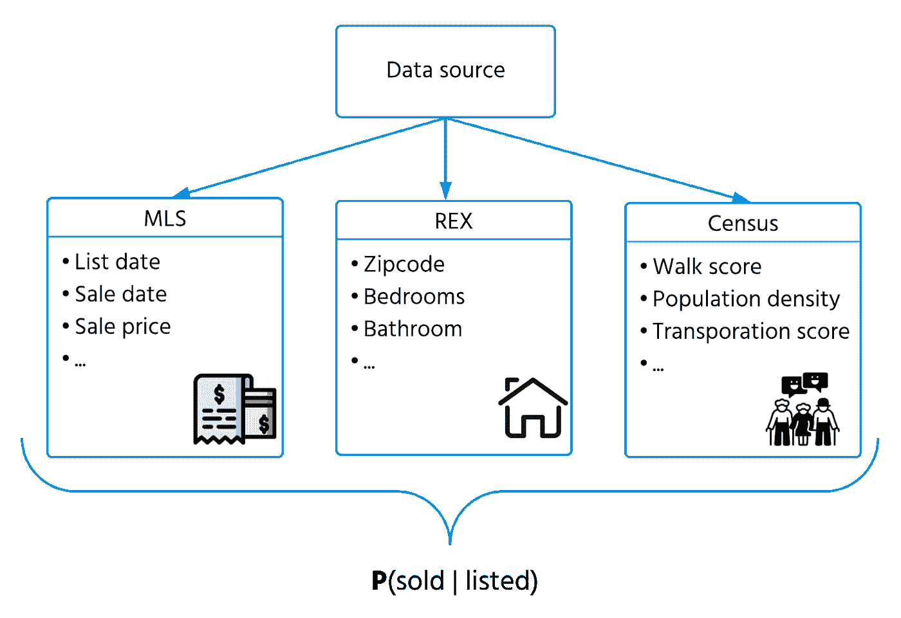

**图 2** 本项目中使用的 3 个不同数据源的信息图

对于数据预处理，我们基于特定的阈值去除了具有缺失数据和低方差的变量。多重共线性也可以通过移除高度相关的要素来解决，协方差矩阵如图 3 所示。这个过程给我们留下了总共 62 个特征。然而，当训练开发的模型时，我们会遇到内存问题，即使 AWS 实例具有非常高的内存。这就需要进一步减少功能的数量。为此，我们使用 XGBoost 来选择具有最高预测增益的顶级特征。我们还使用基线模型中的子市场分类，并在每个子市场上使用 XGBoost 来获得每个子市场的顶级功能，从而保持所有子市场的一致性能。使用特征重要性，我们将特征空间缩减到以下 15 个特征，前 5 个为单个房屋属性，其余为基于人口普查区域的特征:

*   *卧室*:卧室数量
*   *浴室数量*:浴室数量
*   *多户家庭、公寓、其他*:该单元是多户家庭、公寓，还是既不是多户家庭、公寓也不是独栋房屋。这些特性是特性类型特性的一次性版本。
*   *18–59*:附近年龄在 18–59 岁的居民的百分比
*   *家庭平均收入*:普查家庭的家庭平均收入
*   *1995 年或以后建造*:机组是否在 1995 年或以后建造
*   *活动房屋百分比*:活动房屋的百分比
*   *每户年出生人口*:每次人口普查中每户出生人口的比率
*   *农场评分，豪华社区评分*
*   *房产犯罪率*:同一次人口普查中房产的犯罪率
*   *小户型建筑百分比*:同一普查中小户型所占的百分比
*   *标准化测试得分百分位数*:同一人口普查中居民标准化测试百分位数。

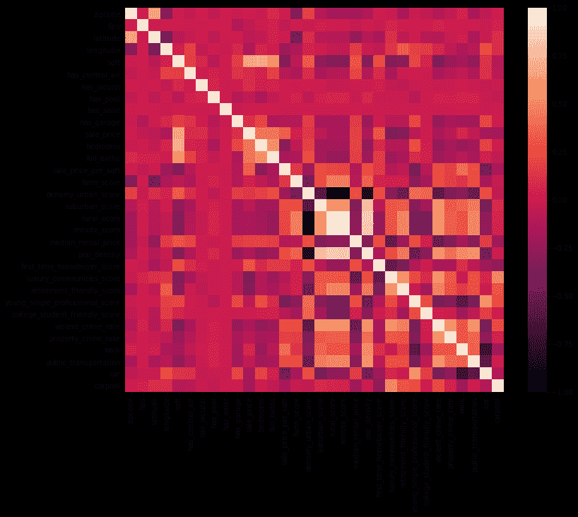

**图 3** 来自初始预处理的 62 个特征之间的相关矩阵

# 建模方法

给定由上述选择过程选择的 15 个特征，然后我们可以开始我们的建模方法。我们预测了房屋被出售的概率，假设它被列为每个家庭需求的代理变量。这是在探索需求的其他潜在候选人之后，例如预测房屋在市场上的剩余天数。

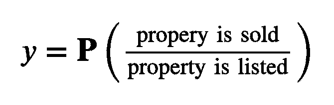

**图 4** 目标预测变量。注意:这是一个条件概率，而不是分数。

我们的基线模型分为两类，即:非次级市场和次级市场方法。开发非子市场方法是为了通过对整个市场进行整体预测来证明业绩的下降。这种情况下的建模方法是将逻辑回归模型拟合到所选特征，并返回目标变量的预测值(图 4)。我们已经试验了其他模型，比如随机森林分类器或简单的神经网络，但是在没有看到真正的性能优势后，最终没有进一步追求它们。

我们创建了子市场方法，以直接与开发的模型进行比较，并确保聚类方法比这里的简单方法更智能。在这种方法中，我们天真地通过在数字特征上使用 K-means 聚类将房屋分配给子市场。K-means 需要指定“聚类数”的超参数，因此我们通过交叉验证和最小化预测出售房屋数和实际出售房屋数之间的 MSE 找到了最佳数量。在这种情况下，我们使用逻辑回归和 XGBoost 来拟合和预测数据，因为我们注意到了 XGBoost 在确定处理步骤中的特征重要性方面的价值。

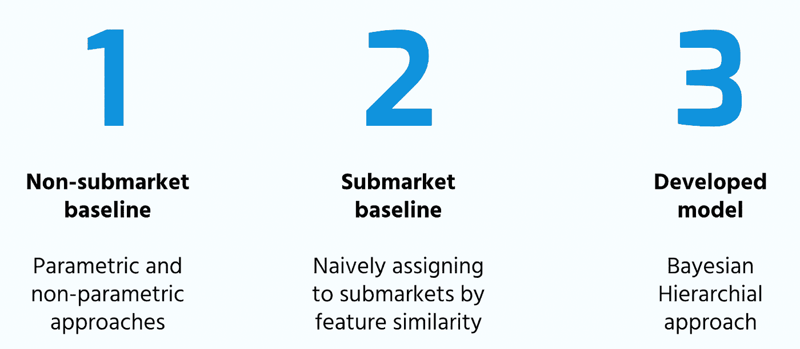

**图 5** 三种主要建模方法的概要

转到开发的模型，贝叶斯分层方法试图在两个方面改进我们的基线模型。首先，我们的目标是让我们的模型更好地学习定义最佳子市场分类，而不是被每个家庭的预定义数据聚类所限制。其次，我们的目标是能够解释每个子市场中使用的享乐需求模型，以便理解给定住宅的每个特征对需求的相对重要性和影响，并潜在地定义对应于每个子市场的大致地理区域。在该贝叶斯模型中，住宅的子市场被分类为𝐾子市场之一作为潜在变量，并且该住宅的每个预测数量根据由其子市场分类所确定的其特征的享乐需求函数来分配。这种分层方法是通过期望最大化来估计的，尽管 PyMC3 以前也进行过实验，但由于数据维数的原因，遇到了几个计算问题。这些估计方法试图在具有未观察到的潜在变量的模型中找到参数的最大后验(MAP)估计。

我们假设每个家庭的目标变量是家庭特征的确定性加权线性组合的函数，这些权重由家庭的子市场成员决定。也就是说，对于与单个住宅相对应的层级结构中的特定抽奖 *n ∈ { 1，…，N}* ，我们的模型假设变量之间存在以下结构和依赖性(参见图 6):

1.  *z_n ~Cat(π)* :这个变量代表一个家的子市场分类。参数 **π** ∈ R^K 表示属于每个𝐾子市场的房屋的先验概率，其中 *π_ k=1/K* 表示*k∈***【1，…，K}* 。*
2.  **h _ n ~ P _ n(θ_(z _ n))*:这些随机向量代表每家的特征。这些特征是从𝐾完全不同分布(对于每个子市场)之一中提取的，每个分布由*θ_(z _ n)*参数化，这是一组分别表征连续、离散和布尔家庭特征的多元正态、泊松和伯努利分布的参数。*
3.  **l_n N ~( μ_(z_n)，σ_(z _ N))*:这个变量对应一个家的经纬度。这与 *h_n* 分开处理，因为由于潜在的过度拟合，我们不希望将位置特征作为线性享乐需求函数的输入。然而，我们选择将它包含在这个模型层次结构中，目的是获得更多地理上不同的子市场，以获得更好的可解释性。*
4.  **y_n = f_(z_n)(h_n)* :这个变量表示在这个指定的时间间隔内，给定一个房屋被出售的概率。函数 *f_(z_n)* 是由家庭的子市场成员确定的 *h_n* 的享乐需求函数。我们实现了开发模型的两个不同版本，其中 *f_(z_n)* 对应于 *h_n* 的梯度推进树(XGBoost)的逻辑回归。*

**

***图 6** 提出贝叶斯分层模型*

# *结果和评价*

*非次级市场和次级市场基准方法的结果分别见表 1 和表 2。对于非次级市场基线，我们看到普遍表现不佳，特别是在预测与实际售出房屋数量的比率上。该比率的值大于 2，表明它预测的待售房屋数量是实际数量的两倍。次级市场基线方法大大改进了这一指标(表 2 ),得分非常接近 1。然而，在非次级市场和次级市场方法中，每个家庭的准确性和 ROC-AUC 得分相对较低。我们认为这表明子市场方法特别抓住了每个子市场水平上的普遍情绪，但在每个家庭水平上却不那么好。*

**

***表 1** 基线模型的非子市场指标*

*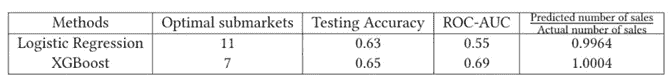*

***表 2** 基线模型的子市场指标*

*基于交叉验证将子市场参数𝐾的数量设置为 11，具有频率主义逻辑回归享乐需求函数的贝叶斯分层模型(通过 1000 次迭代的期望最大化方法估计)导致 9 个子市场被识别。另一方面，具有 XGBoost 享乐需求函数的模型将𝐾设置为 7，并确定了 7 个子市场。表 3 和表 4 分别显示了逻辑回归和 XGBoost 的各个子市场的训练和测试准确性、ROC-AUC、预测房屋销售和实际房屋销售，以及根据各种子市场规模、MSE 和 R2 加权的累积指标。*

*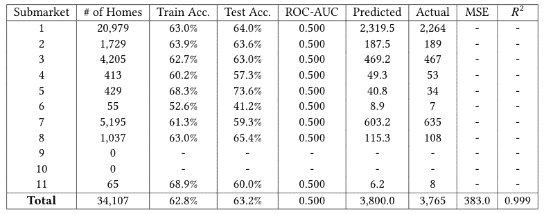*

***表 3** 逻辑回归享乐函数模型的子市场指标*

*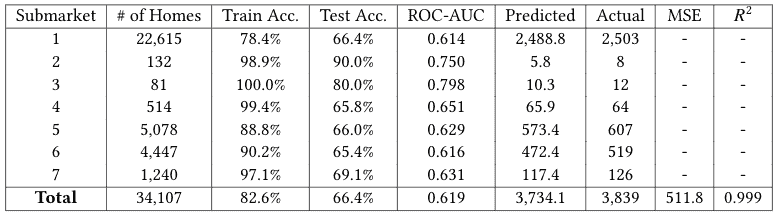*

***表 4**XG boost Hedonic 函数模型的子市场指标*

*据观察，线性回归模型的加权平均测试精度和 ROC-AUC 表明在预测单个房屋的销售上表现不佳，但低 MSE 和高 R2 表明该模型确实了解每个子市场内房屋销售分布的特性。另一方面，与子市场基线相比，XGBoost 模型具有更合理的性能。这意味着我们的层次结构能够捕捉训练中使用的家庭数据的分布特性，尽管逻辑回归享乐需求函数不是一个很好的拟合。图 7 和图 8 分别描述了逻辑回归和 XGBoost 的各个子市场的地理分布。*

*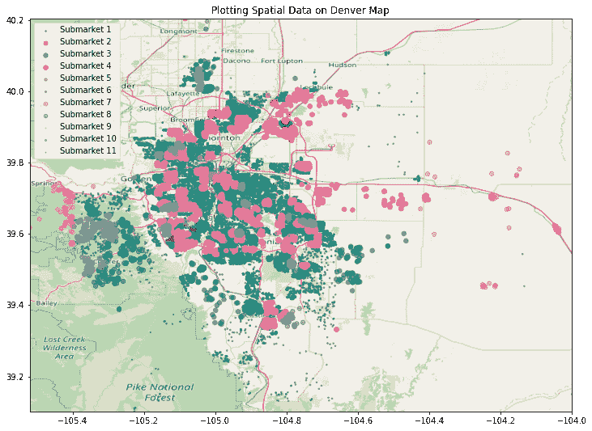*

***图 7** 逻辑回归特征函数模型 9 个子市场的地理分布*

*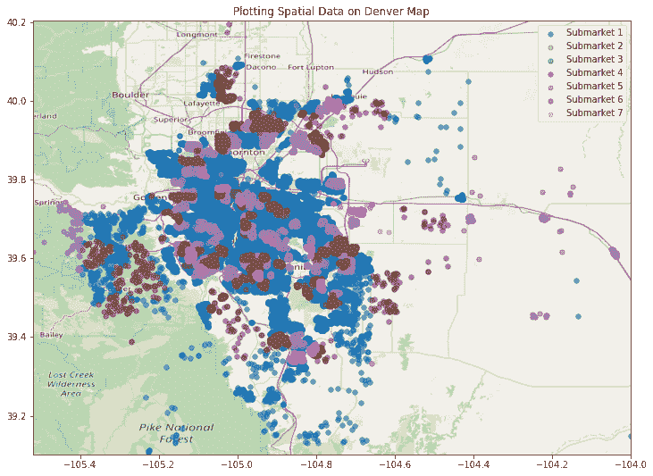*

***图 8**XG boost Hedonic 函数模型 9 个子市场的地理分布*

*此外，XGBoost 模型的三个最重要的特性在每个子市场中的重要性如表 5 所示。虽然有一些特征在许多子市场中都很重要，但没有两组特征的重要性是相同的，这表明该模型正在学习每个子市场中独特的享乐函数。*

*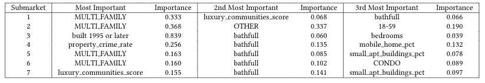*

***表 5**7 个子市场的特征重要性(XGBoost Hedonic 函数模型)*

*我们发现，我们开发的模型在预测个人住房是否会被出售时，没有一个表现得特别好(尽管在这一领域，使用 XGBoost 特征需求函数的模型确实大大优于使用 logistic 回归特征需求函数的模型)。然而，我们的模型能够对每个子市场内的预期房屋销售数量提供合理的估计。我们从观察中注意到以下情况:*

1.  *享乐需求函数:使用逻辑回归享乐需求函数产生的结果通常比 XGBoost 更差，所以我们更喜欢后者。然而，可能有其他享乐需求函数是可以解释的(我们可以理解每个家庭特征的重要性/权重)。*
2.  *享乐假设:我们当前框架的一个关键假设是，上市房屋在特定时间段内被出售的概率(以及未上市房屋被出售的概率)是由房屋特征和其他宏观因素(目前在房屋普查区域的水平上)的函数给出的。通过上述过程选择的 15 个特征的集合仅包含特定家庭特有的 5 个特征。*
3.  *一般性:我们的模型所确定的子市场已经使用单一的时间间隔进行了评估。虽然它们表现出合理的表现，但当根据其他时期的数据进行评估时，尚不清楚这些子市场分类是否提供了可比较的表现。*

# *未来的步骤*

*我们希望这项工作能够激发在房地产市场使用机器学习的进一步行动。我们相信有形的商业价值可以从我们的方法中获得，这包括能够利用发现的子市场来推动房地产投资决策。这项工作的自然延伸包括预测供应量，并将工作扩展到丹佛地区以外的地区。对于其他希望接受类似挑战的人，我们建议尽快花时间收集和处理正确的数据。在这样的任务中，正确的数据是必不可少的，任何市场都有需要考虑的细微差别。*

# *感谢*

*我们要感谢我们的团队合作伙伴 [REX](https://www.rexhomes.com/) 在整个过程中为我们提供项目、数据和支持，感谢我们的课程成员在每个项目里程碑提供反馈，感谢我们的助教 [Zona Kostic](https://www.linkedin.com/in/zonakostic/) 对房地产市场的全面指导和知识，最后感谢我们的课程导师 [Chris Tanner](https://www.chriswtanner.com/) 精心组织课程并随时提供反馈。*

# *链接*

*[https://github.com/luunam/cs297_rex](https://github.com/luunam/cs297_rex)*

*[https://youtu.be/tRUT96APK_8](https://youtu.be/tRUT96APK_8)*

*[课程网站](https://www.capstone.iacs.seas.harvard.edu/)*