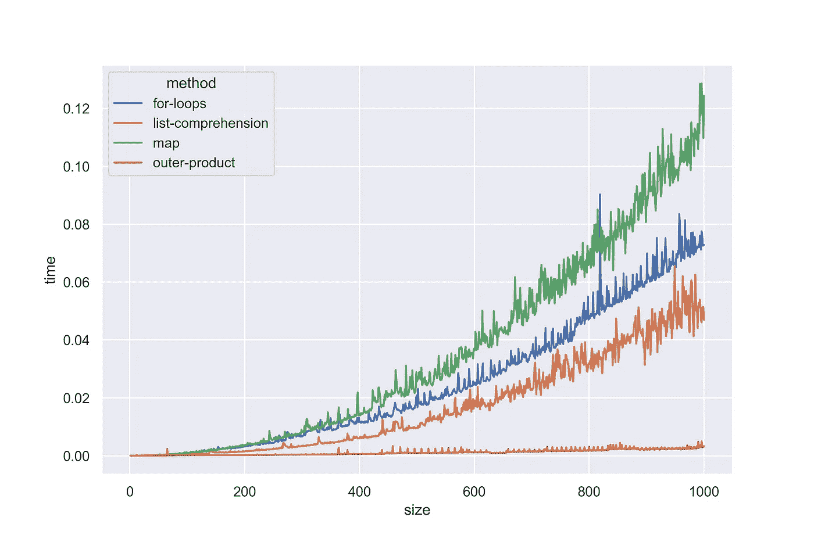

# 外部产品:情书

> 原文：<https://towardsdatascience.com/outer-products-a-love-letter-b29a2c2c818e?source=collection_archive---------19----------------------->

图片作者。

## 矩阵魔法不可否认的力量。

线性代数和向量微积分很厉害！这真的是一个可怕的耻辱，几乎没有时间专门用于高中数学的这些部分。相反，我们被给予了令人作呕的积分和导数问题集——恶心！向量、矩阵和数组提供了一种非常有效地进行大量计算的强大方法。Python 中的 NumPy 模块就是一个很好的例子，它使高级语言能够执行基于数组的计算。
在这里，我展示了如何使用线性代数的方法——外积——来避免过多的循环并加快计算速度。我们开始吧！

*(代码可以在*[*【GitHub】*](https://github.com/BenTenmann/outer_prod)*)*

# 什么是“外部产品”？

首先，如果你不熟悉线性代数，有几种方法可以将两个数组相乘。其中之一被称为“外部产品”,其写法如下:

其中 *u* 和 *v* 分别为 *n* 和 *m* 维向量， *M* 为一个 *n* x *m* 矩阵。 *M* 的第 *ij* 个元素计算如下:

所以最后我们从向量 *u* 和向量 *v* 得到每个可能的元素对之间的一个乘积。这有什么用？让我们来了解一下！

# Python 中的外部产品

## 基础 Python

尽管从技术上讲，这不是数组之间的外积，但是只使用基本 Python 也可以产生类似的东西。最直观的方法是使用列表(表示向量)和嵌套 for 循环:

这个表达式返回列表的列表，其中每个列表都类似于数组中的行向量。然而，这种方法；似乎很笨重。事实上，正如我们所看到的(图 1)，它是。众所周知，嵌套的 for 循环在 Python 中效率低下，并且通常被认为不是“Python 式的”。

更优雅和“Pythonic 式”的解决方案是使用列表理解:

虽然您可能会意识到这个解决方案在语法上比嵌套的 for 循环更加高效和简洁，但是您也会注意到这个表达式不会像前面的解决方案那样给出一个列表列表，而是一个长度为 *n* x *m* 的长列表。因此，阅读和索引不太直观。然而，它在算法上明显更有效(图 1)。

最后，我们可以使用 base Python 提供的 **map()** 函数来解决这个问题:

这种方法不仅最难理解，而且效率最低(图 1)。虽然 **map()** 通常是将函数映射到可迭代对象的非常有效的方式，但是这里我们有一个需要更多内存的问题。为了实现这个方法，我们需要将 iterables *u* 和 *v* 分别延长一个因子 *m* 和 *n* 。这是非常浪费的，因为这些可重复项是非常占用内存的列表。此外——像 list comprehension 一样——这个方法返回一个平面列表，而不是一个类似数组的列表。

## NumPy

如果你没有抓住备忘录，NumPy 是了不起的！作为一个可扩展的模块，它是每个数据科学家工具箱中必不可少的一部分。它的数据类—**numpy . array()**—带来了许多有用的操作和功能，使大量数据的计算变得更加容易和快速。

外积的计算非常简单，因为它是模块的预定义函数:

它也比基本的 Python 方法更有效(图 1)。此外， **numpy.array()** 输出的数据类型带来了一大堆简洁的方法和有利的特性。

图 1:使用不同的方法计算给定大小(长度)的两个向量的外积所花费的时间。outer-product(**NP . outer()**)的效率最高，而 map() 的效率最低。图片作者。

# 有什么意义？

外部产品固然很好，但在更广泛的数据科学背景下，它们的用途肯定有限？嗯，是的。外积在某些用例之外没有特别的用处(例如多层感知器中的误差反向传播)，但是它们的原理是可以概括的。

例如，我们可以想象，我们使用任何接受两个数并返回一个值的任意函数，而不是两个数相乘。在数据科学中，我们经常希望找到数据点之间的差异，即距离。为了有效地捕捉这些信息，我们通常会使用*成对距离矩阵*，它给出了每对点之间的距离。

使用这种方法的一个经典例子是旅行推销员问题(TSP)中的模拟退火算法。在 TSP 中，我们试图找到最短的可能路径来访问集合中的每个城市一次，在起始城市结束。为此，需要一组城市的*成对距离矩阵*。下面是一个使用 NumPy 的解决方案:

好的，这里有几件事:

*   我使用 **scipy.stats** 中的 **uniform** 函数来生成城市的随机坐标
*   我用复数表示坐标系。这有几个好处，主要是我可以把一个坐标作为一个数组中的一个单独的元素来存储；同样，我通过求两点的绝对差得到两点之间的欧几里德距离
*   我通过使用 **np.frompyfunc()** 对距离函数进行矢量化。这是这种方法的关键一步。我们现在可以在这个函数上使用由 NumPy 提供的 **ufunc** 方法
*   其中一种方法是**。outer()** ，这个我们以前见过。它像以前一样工作，只是我们将得到两个坐标之间的距离，而不是两个数字的乘积；(它以 **dtype=object** 的形式返回数组中的值，可烦了；然而，这很容易用**解决。astype()** 方法)

很漂亮，是吧？这个最大的卖点就是可以泛化，我之前也提到过。

例如，我最近使用这种方法来计算一组 DNA 序列的成对序列比对分数。人们也可以很容易地想象如何使用参数向量来测试实验参数的不同组合。可能性几乎是无穷无尽的——而我们只是在 NumPy 中触及了表面。

哦，笨蛋，你这个漂亮的机器！