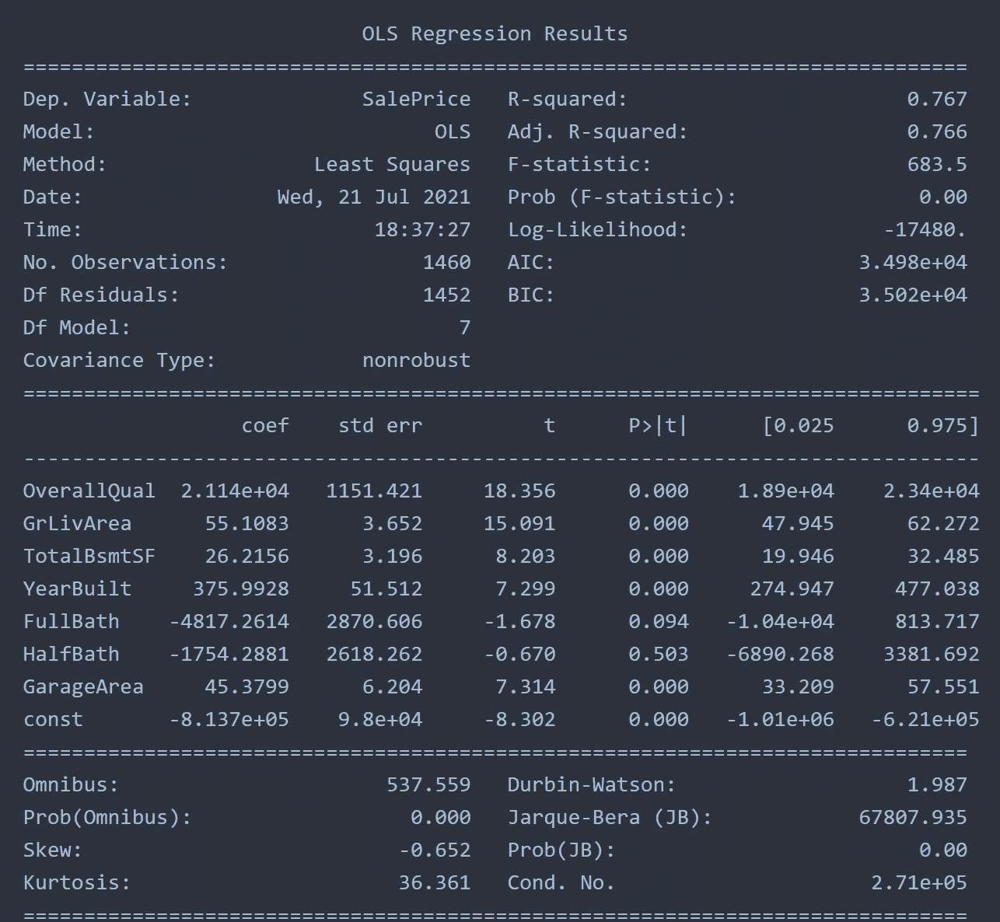
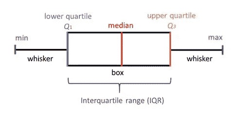
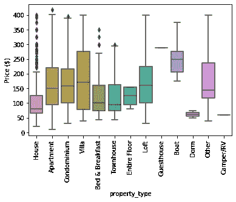
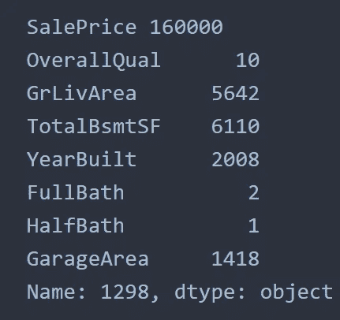
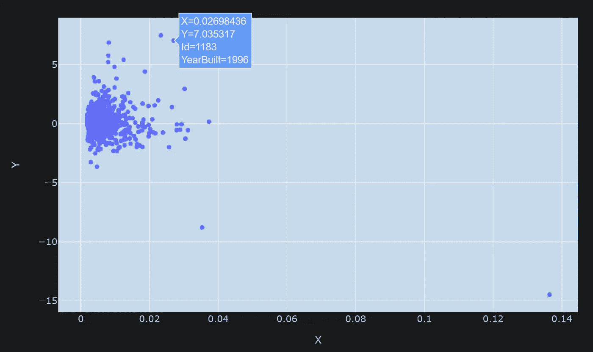
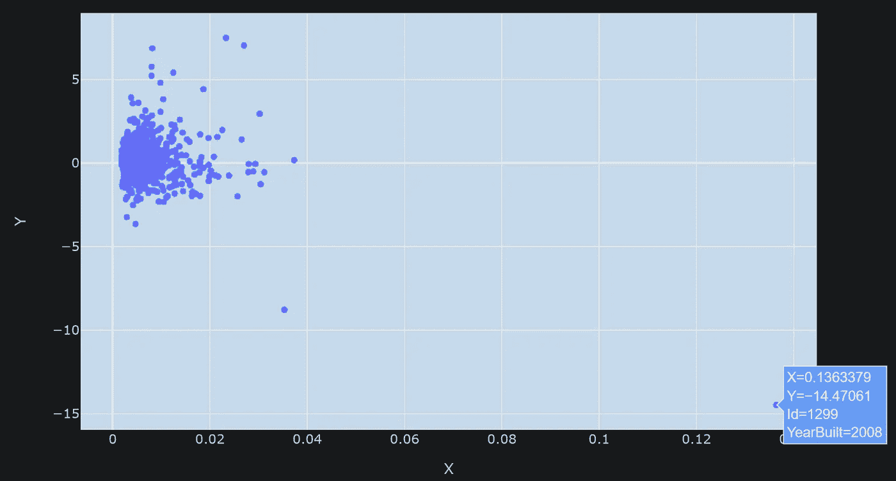
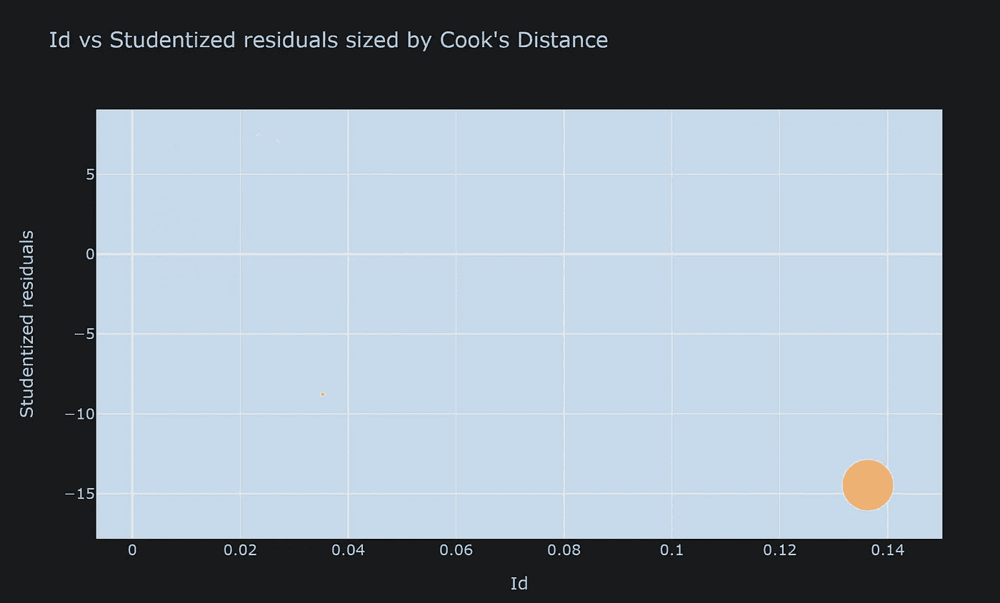
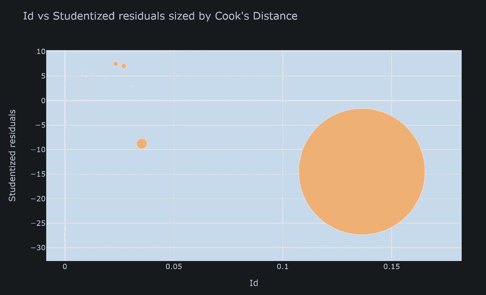
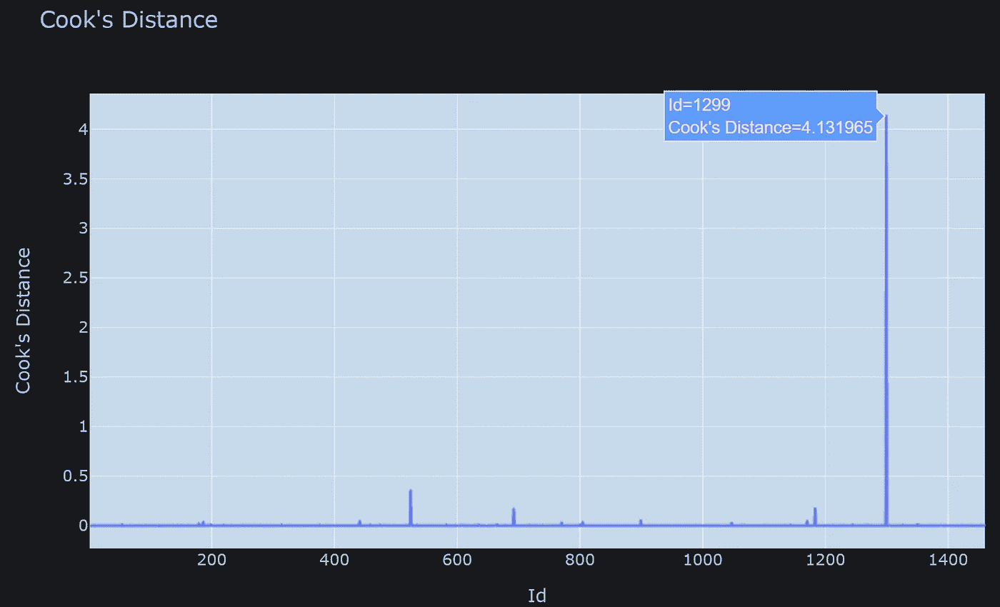

# 回归分析中的异常值检测

> 原文：<https://towardsdatascience.com/outlier-detection-in-regression-using-cooks-distance-f5e4954461a0?source=collection_archive---------5----------------------->

## 在 Scikit-Learn 和 Statsmodel 中使用 Cook 距离进行回归异常值检测


图片来自 [unsplash](https://unsplash.com/photos/vHnVew5foFU)

> **简介**

异常值是指数据集中不符合正态分布的异常值，有可能严重扭曲任何回归模型。因此，必须小心处理异常值，以便从数据中获得正确的见解。通常，从现实世界中收集的数据由几个要素的几个观测值组成，许多值可能放置错误，或者可能只是数据处理的产物。无论异常值的原因是什么，都必须对异常值进行分析，并验证它们是真实的。如果离群值是真实的，可以将这些离群值带入回归模型，或者简单地删除它们，以创建更好的回归模型。

> 资料组

为了用 python 实现，我将使用 Scikit-Learn 的线性回归和 Statsmodel 的 OLS 方法来拟合房价数据。为了简单起见，这里所有的特征数据都是数字。我将使用下一篇文章中使用的相同的房价数据。

[](https://medium.com/geekculture/feature-selection-in-large-datasets-fc27a7e8e388) [## 大型数据集中的特征选择

### 使用 Shapash 和 Scikit-Learn 的 SelectKBest

medium.com](https://medium.com/geekculture/feature-selection-in-large-datasets-fc27a7e8e388) 

我将从房价的线性回归模型开始，从数据集中选择几个数字预测值。预测值为“总体质量”、“GrLivArea”、“TotalBsmtSF”、“YearBuilt”、“FullBath”、“HalfBath”、“GarageArea”，目标为“销售价格”。这些功能的相应描述如下。

```
'OverallQual': 'Overall material and finish of the house'
'GrLivArea': 'Ground living area square feet'
'TotalBsmtSF': 'Total square feet of basement area
'YearBuilt': 'Original construction date'
'FullBath': 'Full bathrooms above grade'
'HalfBath': 'Half baths above grade'
'GarageArea': 'Size of garage in square feet' 
```

我还有另一篇异常值检测文章，特别关注基于 IQR、汉佩尔和 DBSCAN 方法的数值异常值。

[](/practical-implementation-of-outlier-detection-in-python-90680453b3ce) [## 异常检测在 python 中的实际实现

### IQR、汉佩尔和 DBSCAN 法

towardsdatascience.com](/practical-implementation-of-outlier-detection-in-python-90680453b3ce) 

在这里，文章将具体到回归模型和使用库克距离的方法来检测异常值。

> **Scikit-Learn 和 Statsmodel**

我们有兴趣调查 Scikit-Learn 和 Statsmodel 之间的拟合质量。首先，Scikit-Learn 的线性回归模型适用于预测值和目标变量。

通过该模型获得的 R 平方值是 0.7672，这基本上表明大约。数据集中 76%的方差是由我们选择的预测因子解释的。

当切换到 Statsmodel 时，R 平方值仍然非常相似，为 0.767，用户也可以选择调整后的 R 平方，它不会改变 mich，这种情况下表示非常适合最初选择的特性。



作者图片

> **异常值分析**

Statmodel 的 OLSinfluence 提供了一种快速的方法来衡量每个观察的影响。当数据绘制在箱线图中时，对数据进行一般异常值分析，高于或低于四分位数间距(IQR)1.5 倍的点被标记为异常值。



图片来自[simplypsychology.org](https://www.simplypsychology.org/boxplots.html)

这些异常值有时非常高或非常低，可以形成局部聚类。如果我们选择传统的箱线图，这些局部聚类被识别为异常值。像 DBSCAN 这样的其他方法可以有效地识别这些极值点，并且可以将这些极值点合并到分析中，因为它遵循基于密度的算法。



作者图片

然而，在回归中，标准化残差是异常值的指标。它用标准误差来衡量数据点离回归线有多远。我们将把这个残差用于同一个数据集。

在这里，我们可以看到回归线上最有影响力的数据点，它基本上是一个奇点，具有控制模型的最高能力。



作者图片

根据具体情况，人们可以选择保留或放弃。在下面的代码块中，我们可以画出所有点的影响。当使用 plotly express 绘图时，只需将鼠标悬停在异常值上，就可以更容易地识别异常值。



作者图片

X 轴代表数据点的帽值。多元线性回归表示如下

> Y = HX

其中 Y 是以 X 为预测值的结果。H 是帽子矩阵，帽子值是 H 矩阵的对角分量。y 轴代表标准化残差。很明显，最右边的点是具有非常高的 hat 值的异常值。悬停数据可以被修改以显示关于它的更多信息。



作者图片

在这一点上，我们将引入库克距离，这是一个衡量数据点影响的指标。Cook 的距离是杠杆(Wiki 定义:在统计学中，特别是在回归分析中，杠杆是一种衡量一个观察值的独立变量值与另一个观察值的距离)和残差大小的组合。

当以这种方式绘制时，单个点的影响如此之大，以至于所有其他点的贡献几乎不明显。



作者图片

我们需要扩大厨师的距离来注意其他人。当缩放 50 倍时，其他的点就成了大图。



作者图片

> **绘制库克的距离**

库克距离是数据点的导数，并且会因样本而异。下面的块以容易识别的方式绘制了 Cook 的距离，以检测异常值。这里，我们选择将 Id 放在 X 轴上。



作者图片

在这种情况下，可以放弃那个最有影响的点，并继续回归模型，因为它具有如此大的扭曲模型的能力。

> **结论**

在本文中，我们演示了如何使用 Scikit-Learn 和 Stasmodel 来评估回归模型。稍后使用 Stasmodel，基于 Cook 的距离检测异常值。由于人为错误，真实世界的数据可能有几个异常值，或者可能作为分析的产物生成。根据具体情况，数据分析师/科学家可能会选择保留或删除异常值。

[Github 页面](https://mdsohelmahmood.github.io/2021/07/21/Cook's-Distance.html)