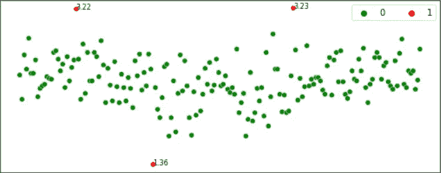
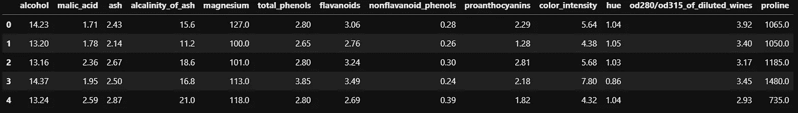
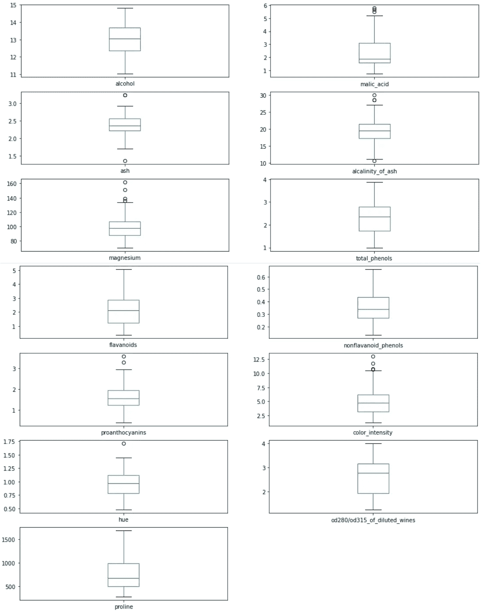
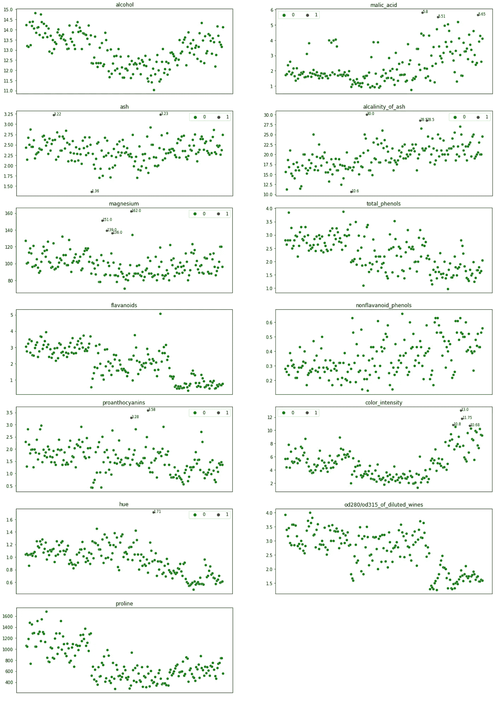
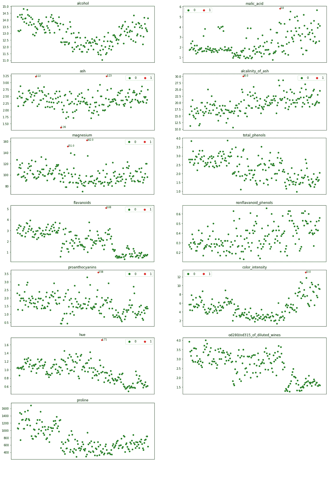
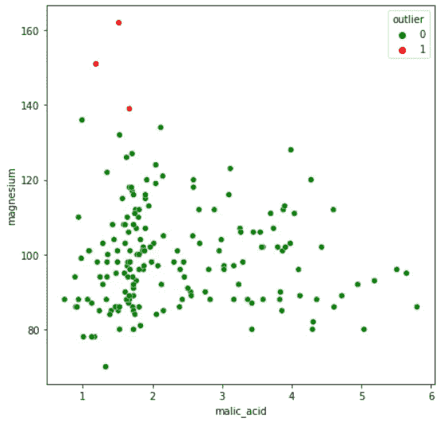

# 机器学习中的离群点检测方法

> 原文：<https://towardsdatascience.com/outlier-detection-methods-in-machine-learning-1c8b7cca6cb8?source=collection_archive---------12----------------------->

本文讨论了在预处理数据以开发机器学习模型时检测异常值的几种常用方法。

图片由[粘土堤](https://unsplash.com/@claybanks?utm_source=medium&utm_medium=referral)上的 [Unsplash](https://unsplash.com/?utm_source=medium&utm_medium=referral)

# **什么是离群值？**

异常值是看起来与数据中的其他值不同的值。下图突出显示了“红色”的异常值，在数据的两个极端都可以看到异常值。

作者图片

# 数据中异常值的原因

1.  数据输入过程中的错误或有故障的测量设备(有故障的传感器可能导致极端读数)。
2.  自然发生(初级员工与高级员工的工资)

# 异常值引起的问题

1.  数据中的异常值可能会在模型拟合(特别是线性模型)。
2.  异常值可能会扩大误差度量，从而为大误差(例如，均方误差、RMSE)赋予更高的权重。

# 识别数据中异常值的方法

在本文中，我们将使用 Scikit-Learn 的 ***葡萄酒数据集。*** 在继续下一步之前，我们将加载并准备数据。

作者图片

## 1.箱线图

箱线图是识别异常值的直观方法。箱形图是可视化数据分布的许多方法之一。箱线图绘制了数据的 q1(第 25 个百分点)、q2(第 50 个百分点或中间值)和 q3(第 75 个百分点)以及*(Q1–1.5 *(Q3-Q1))*和 *(q3+1.5*(q3-q1))* 。异常值(如果有)被标绘为图上方和下方的点。

作者图片

在上图中，异常值显示为箱线图上下的点。“酒精”、“总酚”、“稀释葡萄酒的 od280/od315”和“脯氨酸”没有异常值。

## 2.IQR 方法

箱线图使用 IQR 方法来突出异常值。IQR 代表四分位数范围，即第三季度(第 75 个百分位数)和第一季度(第 25 个百分位数)之差。IQR 方法通过计算下限和上限来识别异常值。

*下限= Q1–1.5 * IQR*

*上限= q3+1.5*IQR*

任何低于下限和高于上限的值都被认为是异常值。下面是 IQR 方法在 Python 中的实现。

作者图片

在上图中，如箱线图所示，“酒精”、“总酚”、“稀释葡萄酒的 od280/od315”和“脯氨酸”没有异常值。

## 3.z 分数法

Z-score 方法是另一种检测异常值的方法。当变量的分布接近高斯分布时，通常使用这种方法。z 得分是一个变量的值偏离该变量平均值的标准偏差数。

*Z 得分= (X 均值)/标准差*

当一个变量的值被转换为 Z 分数时，那么该变量的分布就称为均值=0、标准差=1 的标准正态分布。Z 分数法需要用户指定一个临界值来识别异常值。广泛使用的下限截止值是-3，上限截止值是+3。使用这些临界值的原因是，在标准正态分布中，99.7%的值位于-3 和+3 之间。让我们看看 Z-Score 方法在 Python 中的实现。

作者图片

## 4.“与平均值的距离”方法(多元方法)

与以前的方法不同，这种方法考虑了数据集中的多个变量来检测异常值。该方法根据平均值计算数据点的欧氏距离，并将距离转换为绝对 z 得分。任何大于预先指定的临界值的 z 值都被视为异常值。我们将考虑葡萄酒数据集中的两个变量(“苹果酸”和“镁”)，使用 3 作为临界值在 Python 中实现这个方法。

作者图片

以上是机器学习中几种常用的离群点检测方法。异常值的存在可能会在模型拟合(特别是线性模型),并且还可能导致夸大的误差度量，其给予大误差更高的权重。因此，在建立机器学习模型之前，有必要处理异常值。