# 用 Python 过度分析野生动物活动

> 原文：<https://towardsdatascience.com/over-analyzing-wildlife-activity-with-a-trail-camera-and-python-f7aaebbdbd01?source=collection_archive---------24----------------------->

## [实践教程](https://towardsdatascience.com/tagged/hands-on-tutorials)

## 什么叫“你自己出去看看那只鹿”？那是一种选择吗？！

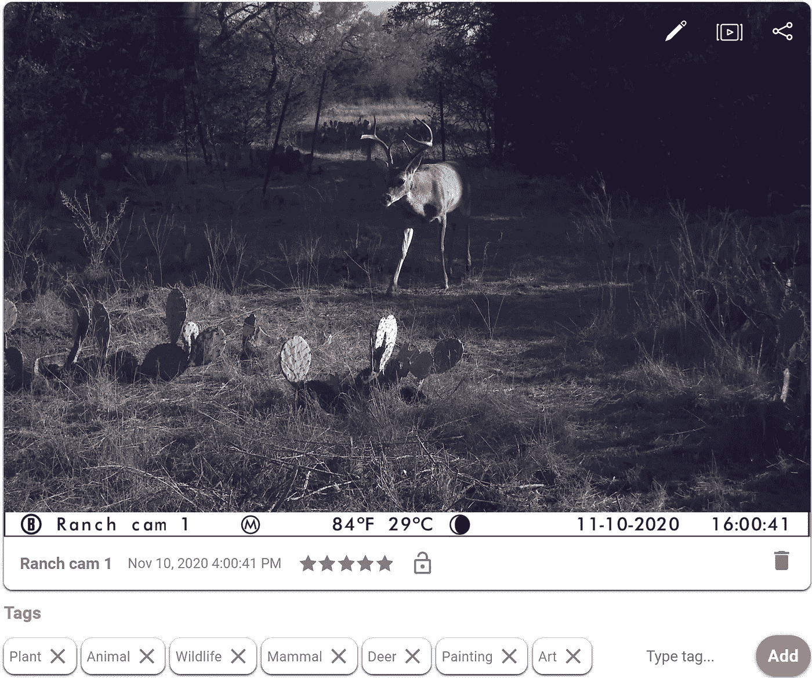

Bushnell trail 相机拍摄了一只漂亮的大雄鹿，下面有 Amazon Rekognition 图像标签。

在狩猎和数据分析的交叉点上，有一个疯狂的人会想方设法利用他们的技术技能来提高他们成功猎鹿的几率。一个既享受户外生活又编写大量多余代码的人。一个努力学习更多自然知识的人，最终花了几个小时在他的笔记本电脑上。

那个人就是我。

几个月前，我在德克萨斯州中部的一些家庭土地上安装了一台蜂窝移动摄像机，用来观察鹿和其他好奇动物的进进出出。这个设备是一个[布什内尔脉冲手机摄像头](https://www.amazon.com/Bushnell-Impulse-Cellular-Verizon-119900V/dp/B07F46ZLBJ/ref=sr_1_2?dchild=1&keywords=bushnell%2Bimpulse%2Bcellular&qid=1610741644&sr=8-2&th=1)，你可以通过网页与之互动。当我去检查它拍摄的图像时，我期待的是一个简单的存储库——只不过是一堆照片和它们拍摄的时间。当我发现这些额外的数据点时，你可以想象我有多惊讶:

*   亚马逊识别图像标签
*   温度
*   月相
*   风向
*   风速
*   大气压

2020 年给我留下了很多空闲时间，我花了一部分时间学习使用 Python 进行数据分析的概念。这台相机给我提供了一个有趣的机会，一个突然出现的与个人相关的数据财富正等着我去分析。有什么比将我的知识应用于真实世界数据集更好的方法来测试我的知识呢？

当我想到这个想法时，我坐在笔记本电脑前，准备做任何崭露头角的新分析师在试图证明自己的价值时都会做的事情——通过从不完整的数据中得出不必要的结论来解决一个无关紧要的问题。我们去拯救世界吧。

# **问题**

在我们开始之前，我可能应该定义我们在寻找什么——我们试图回答什么问题。

首先，我想知道鹿什么时候最活跃。这可以是一天中的几个小时，也可以是一年中的几天/几周。这将帮助我确定一年中最有希望的日子(在合法的猎鹿季节)去寻找它们。我还想知道**上面列出的哪些数据点与鹿的活动**最相关。例如，鹿有多关心月亮的相位？当风从南方而不是北方吹来时，他们会紧张吗？我相信我们都有自己的猜测，哪些*功能*是最重要的*，但是看看数据来支持它会很有趣。*

# ***数据***

*我可以看到我想要的信息，但我不喜欢手动将每张图片的数据输入到 excel 电子表格的数百行中。一定有更好的方法…*

*在对 Bushnell Javascript API 进行逆向工程以了解要查找什么之后，我决定使用 Python 的 HTTP 请求库来收集数据。*

*我能够拼凑一个脚本来抓取网站，并使用我的数据生成一个漂亮的 excel 电子表格。我就不告诉你细节了——如果你好奇，可以看看下面的代码。*

*Python 脚本创建了一个 excel 电子表格，其中填充了来自 Bushnell“wirelesstrophycam”网站的数据。*

*有了下面的 excel 电子表格，我们可以开始分析了。*

*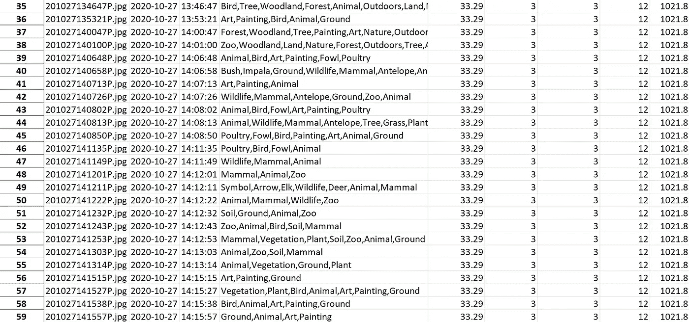*

*excel 电子表格输出的屏幕截图。*

# ***探索性数据分析***

*我做的第一件事是导入我打算使用的库，并将电子表格转换成数据帧。*

```
*import pandas as pd
import numpy as np
import matplotlib.pyplot as plt
import seaborn as sns
import scipy.stats as stats
%matplotlib inline df = pd.read_excel('SPREADSHEET_NAME_HERE.xlsx', index_col = 0)df.info()*
```

*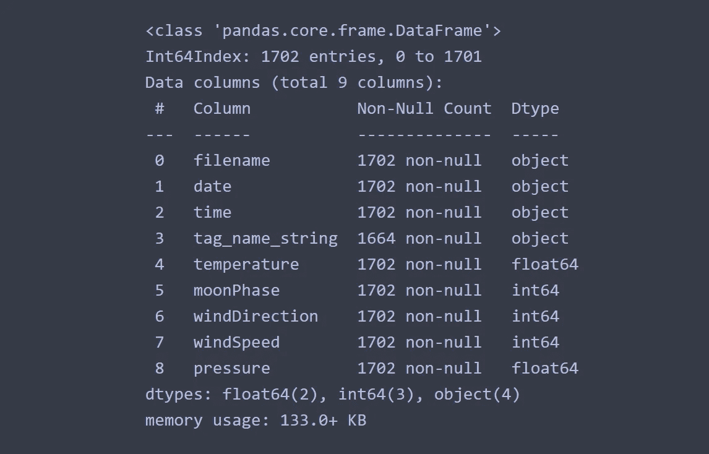*

*数据帧信息。*

*在这里，我们可以看到我们的每个列名以及行数——自从我启动相机以来，看起来我们已经获得了 1700 多张照片。接下来，我希望能够区分有鹿的图片和由其他毛茸茸的朋友触发的图片。我添加了一个新的列，如果图片包含一只鹿，该列将填充 1 或 0。*

> *如果你仔细查看 excel 电子表格，你可能会注意到一些奇怪的标记……鉴于我们的牧场位于德克萨斯州中部，我相当有信心不会看到麋鹿、黑斑羚或羚羊。相反，似乎亚马逊河流域识别错误地识别了这些鹿。考虑到这一点，我肯定会在下面的代码中寻找那些附加的动物标记，并将它们视为鹿。*

```
*# add a column that determines if Deer is in the string and will  #populate as True or False or NaN
df['contains_deer'] = df['tag_name_string'].str.contains('Deer|Antelope|Elk|Impala')#replace Trues and Falses with 1s and 0s
df['contains_deer'] = df['contains_deer'].replace({True: 1, False:0})#fill in the contains_deer column with 0's if no tags were present (NaN in tag_name_string)
df['contains_deer'] = df['contains_deer'].fillna(0)#the df.replace from above defaults to float values (1.0 and 0.0), #so change them to ints (1 and 0)
df['contains_deer'] = df['contains_deer'].astype(int)*
```

*我使用新的 *contains_deer* 列来轻松区分有鹿的图片和没有鹿的图片。这种二进制分类将在以后派上用场…*

*为了探究因鹿而拍摄的照片相对于其他照片的比例，我使用了 Seaborn 计数图的“色调”特征:*

```
*sns.countplot(data = df, x = 'date', hue = 'contains_deer', palette = 'Paired')*
```

*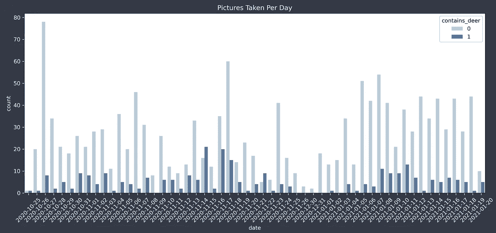*

*浅蓝色条代表图像中没有任何鹿(至少根据 AWS)。我们可以看到，在任何一天，除了鹿之外，还有更多其他东西的照片。但是如果不是鹿，外面还有什么？是什么让我的相机有这么多珍贵的记忆呢？*

*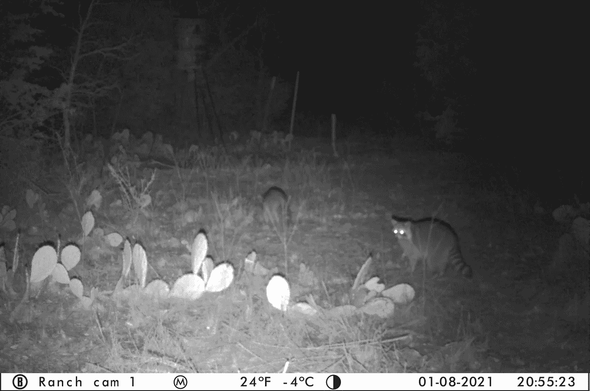*

*进入垃圾熊猫。这些家伙每天晚上都出去偷喂食器里的玉米，就像他们的生命依赖于此一样(在某种程度上，我想他们是这样的)，并占了数百张照片。不管怎样，现在我们知道了为什么有这么多与我的问题无关的照片，我们可以去掉它们，只画鹿。*

*在我展示之前，这里有一个简短的插曲，是相机拍摄的一些其他有趣的照片:*

*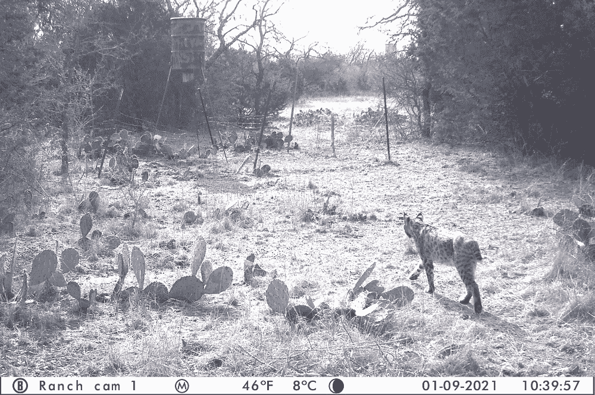**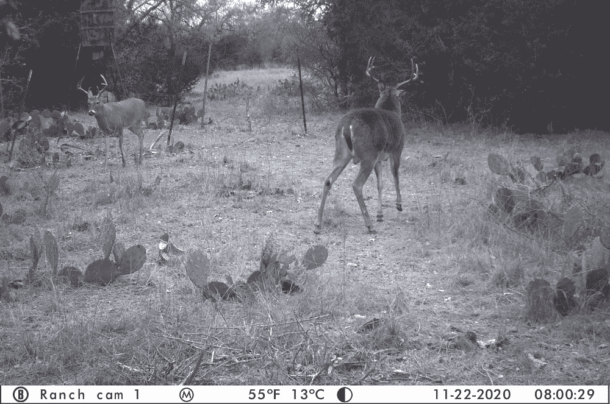**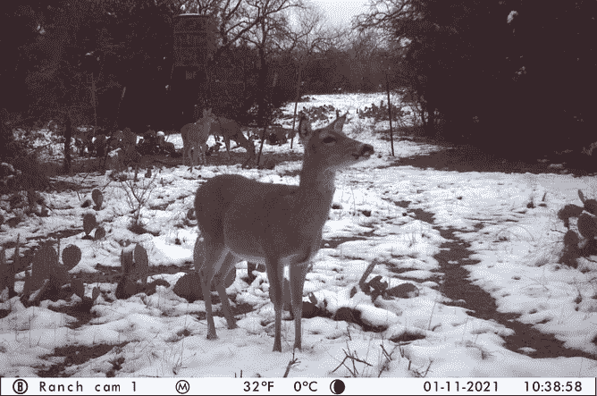**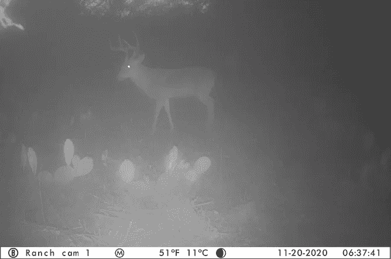**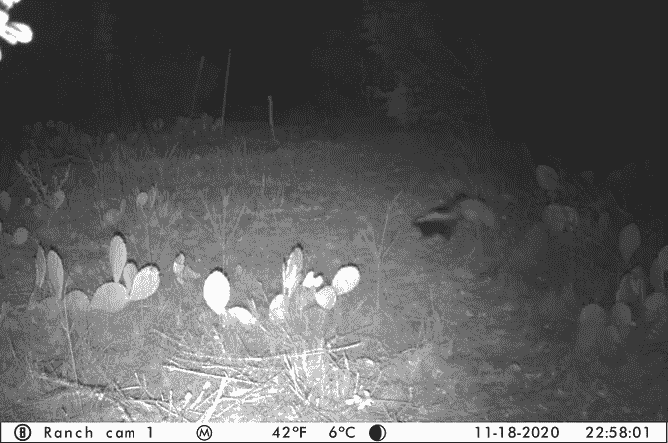*

*山猫、雄鹿、臭鼬，还有更罕见的东西——雪！*

*在图表上:*

```
*sns.countplot(x = 'date', data = df2, palette = 'rainbow')*
```

*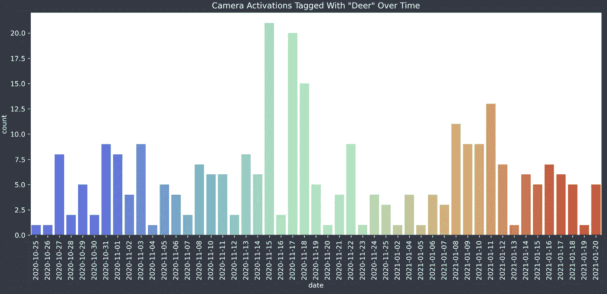*

*随着时间的推移，相机激活标记为“鹿”。*

*现在事情开始变得有趣了。上图显示了每天拍摄的鹿的标记图片数量。尽管有相当多的变化(一般来说，每天 1 到 12 张照片)，你可能会注意到从 11 月 13 日到 19 日活动的增加。15、17、18 都大于 15 张图！*

*如果你注意到了那个大尖峰，那么你也应该注意到了 16 日明显缺乏图片——正好在我们的鹿朋友们似乎最活跃的几天中间。怎么回事？*

*不用花几个小时写脚本和分析数据就知道鹿的运动严重依赖于天气。为了探索这一点，我决定检查每天的平均温度，并将它们叠加在活动图上。结果如下:*

```
*df.groupby(['date']).mean()['temperature'].plot(kind = 'line', ax = ax, linestyle = '--', marker = 'o', markerfacecolor = 'c', ylabel = 'Temperature (F)', xlabel = 'Date') #line graph of avg temp per day*
```

*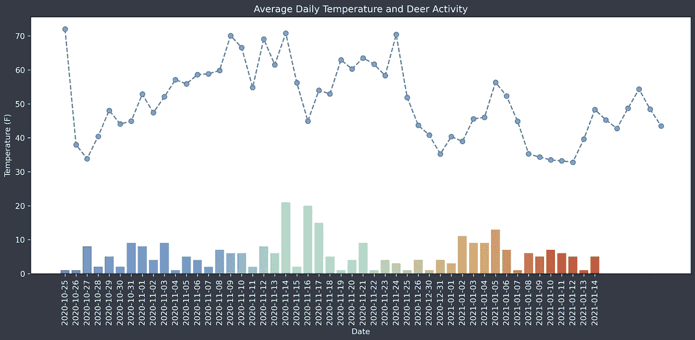*

*你瞧，**16 日的平均气温实际上比那一天**前后五天的移动平均气温低 11 度。看起来我们对这种奇怪的现象有了一个非常令人信服的解释:一股冷锋吹来，导致鹿躲避，打断了它们在这段时间活跃的自然趋势。*

*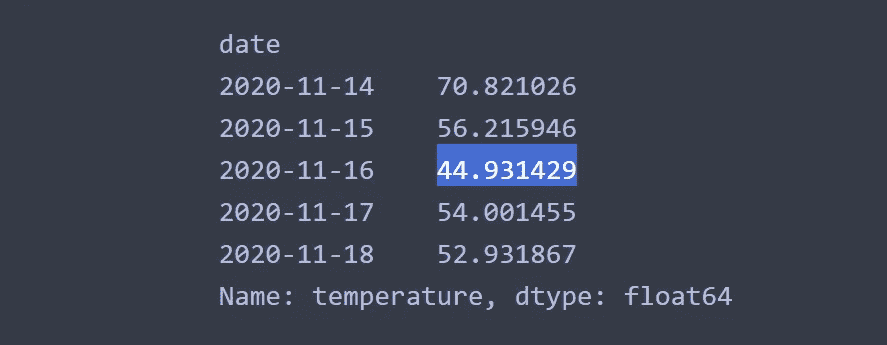*

*所选时段的日平均温度。请注意，16 日是 44 度——远低于边境日的温度。*

*没有什么比你自己得出结论，然后找到完全支持你的结论的外部数据更好的了。我们在我的牧场确定的活动高峰日期(**11 月 13 日至 11 月 19 日**)恰好落在[德克萨斯公园和野生动物预测的“发情期”高峰](https://tpwd.texas.gov/huntwild/hunt/planning/rut_whitetailed_deer/#E11E5)——这是鹿繁殖和最活跃的时期。对于这个地区(爱德华兹高原)，他们发现发情期在 11 月 7 日和 11 月 24 日之间。我们对数据的解读得到了证实！*

*这一分析给了我一些可操作的见解。明年，我会计划一次旅行，在这段高度活跃的时期去那里。我也会关注雷达，记住即使是最活跃的时期也会受到恶劣天气的严重影响。*

> *当然，我可以在第一时间浏览 TPW 的网站，然后在发情期出去，但是这有什么意思呢？*

# *训练随机森林机器学习模型*

*如果你认为我刚才做的分析是不必要的，你会喜欢接下来的。在这一部分，我训练了一个机器学习模型，根据我们的定量数据(温度、风速、大气压等)来预测鹿是否会出现。*

> *注意:如果你不知道什么是随机森林分类器，那也没关系。这里有几篇文章的链接，可能有助于解释这个问题:[这里](https://stackabuse.com/random-forest-algorithm-with-python-and-scikit-learn/)或者[这里](https://scikit-learn.org/stable/modules/generated/sklearn.ensemble.RandomForestClassifier.html)。*

*我做的第一件事是导入一个 Scikit-learn 库，然后[将数据](https://scikit-learn.org/stable/modules/generated/sklearn.model_selection.train_test_split.html)分成一个训练集和一个测试集。*

```
*from sklearn.model_selection import train_test_splitX = df.drop(columns = ['filename', 'date', 'time', 'tag_name_string', 'contains_deer'])
y = df['contains_deer']X_train, X_test, y_train, y_test = train_test_split(X, y, test_size=0.3, random_state=101)*
```

**X* 变量是我用于模型的数据，而 *y* 变量是我试图预测的数据。*

*下面的代码包含了我需要做的几乎所有事情——导入更多的库，训练模型，并打印出结果(在分类报告中)。*

```
*from sklearn.ensemble import RandomForestClassifier
from sklearn.metrics import classification_report, confusion_matrix
from sklearn.inspection import permutation_importancerf = RandomForestClassifier(n_estimators = 600)rf.fit(X_train, y_train)
pred_rfc = rf.predict(X_test)print(classification_report(y_test, pred_rfc))*
```

*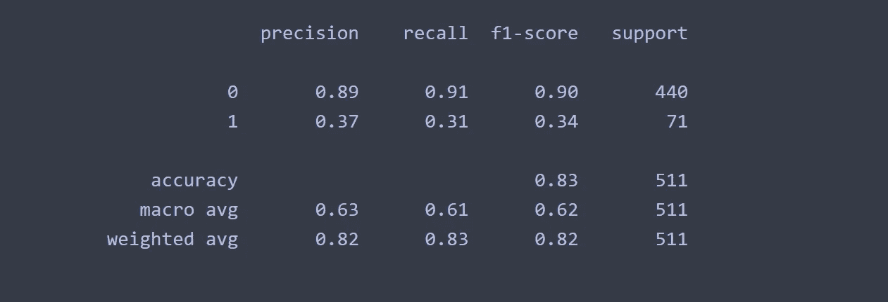*

*随机森林模型的分类报告。*

*上面的分类报告向我们展示了模型的准确性。由于在这种情况下模型本身是完全不必要的，我将只强调 F1 分数——它是召回和精确分数的调和平均值。用更通俗的话来说，它告诉你模型做出的正面预测有多少是正确的。我现在可以从理论上提供一组数据(温度、气压、风速等)。)给模型，并让它基于所述数据预测鹿是否会出现。*

*就像我之前说过的，一次又一次，这完全没有必要。我真正好奇的是，是否有任何数据点对预测鹿的活动有不成比例的影响。一个[特征重要性](https://machinelearningmastery.com/calculate-feature-importance-with-python/)图将向我们展示在进行预测时模型的哪些参数是最重要的。*

```
*feature_importance = pd.DataFrame(sorted(zip(rf.feature_importances_, X.columns)), columns=['Value','Feature'])sns.barplot(x="Value", y="Feature", data=feature_importance.sort_values(by="Value", ascending=False))*
```

*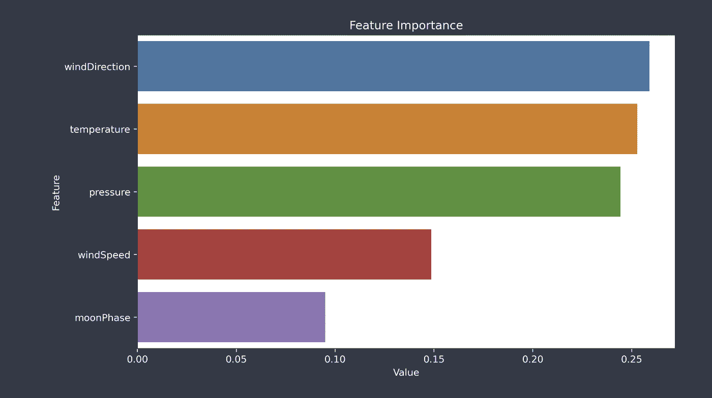*

*特征重要性图。*

*根据上面的图表，很清楚哪些输入参数是最重要的。一个重要的警告是，这种分析对“循环”数据不起作用。例如，*风向*被列为我们模型最重要的特征。数据点在 0 到 359 度之间，表示主要风向。0 度风向和 359 度风向几乎相同，但模型将它们视为最大不同值。出于这个原因，我们应该忽略*风向*和*月相*特征(并考虑将它们从我们的模型中完全移除)。*

*删除这些错误特征后，我们现在可以看到温度是我们模型中最重要的预测特征，紧随其后的是压力。当试图预测鹿的行为时，风速是一个不太重要的特征。这有助于验证我们早期的观点，即为什么在快速移动的冷锋期间鹿的活动突然减少。*

*如果你能走到这一步，恭喜你。我希望你学到了一些数据分析或野生动物活动或两者兼而有之。下次你拿到一些关于鹿的数据时，也许你也可以进行一些有见地的分析。否则，你知道该找谁。*