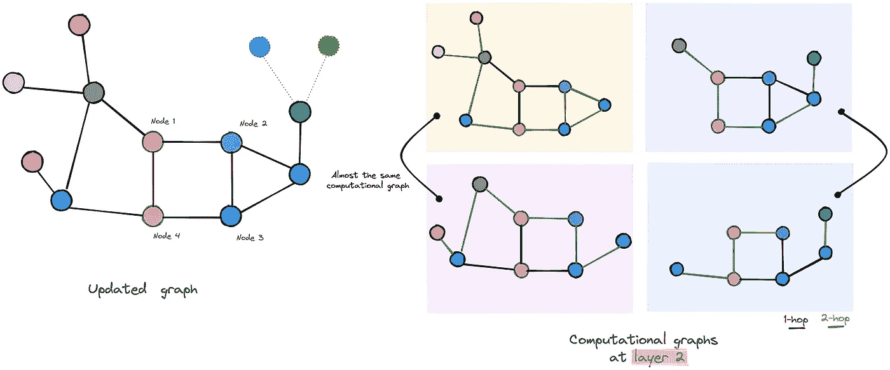
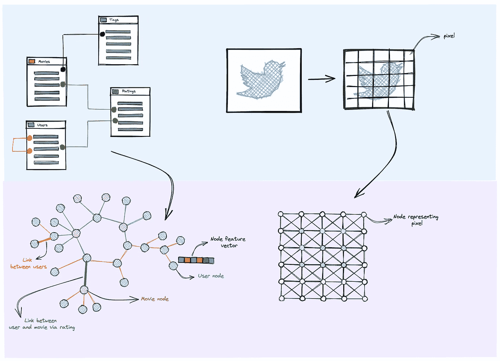
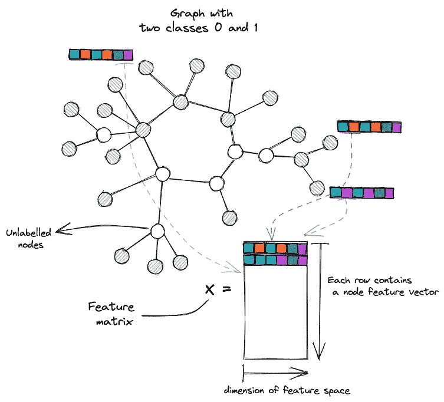
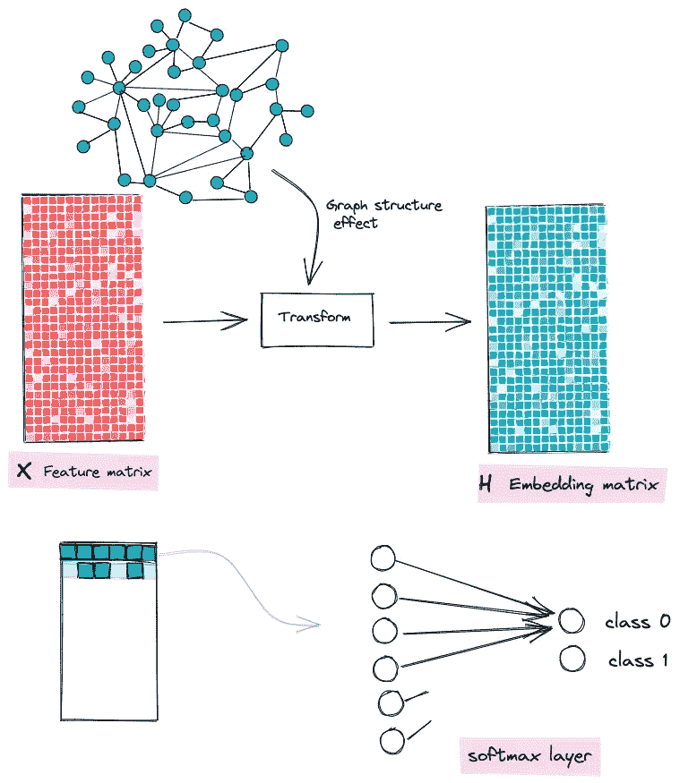
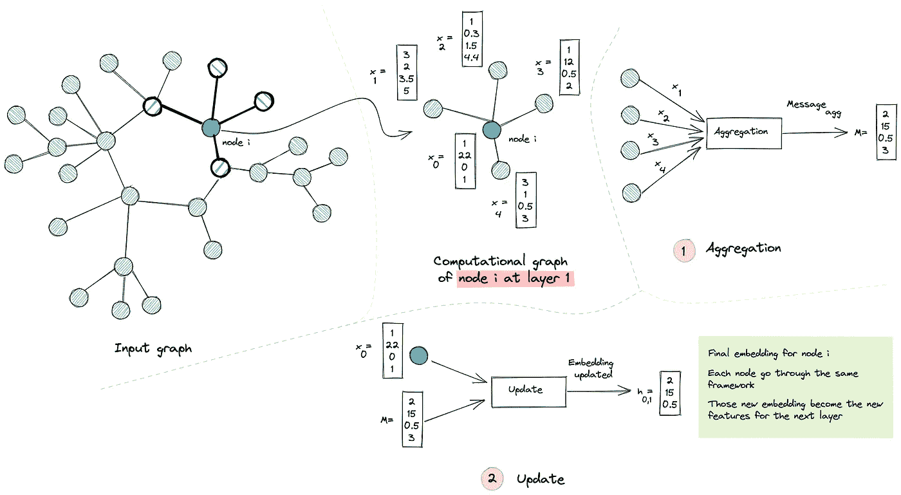
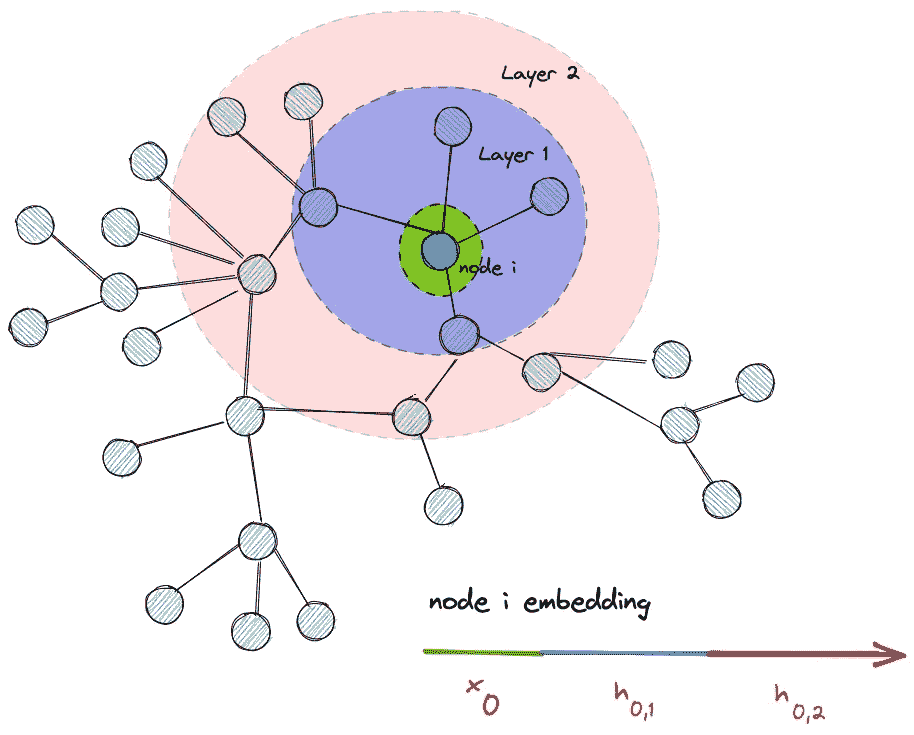
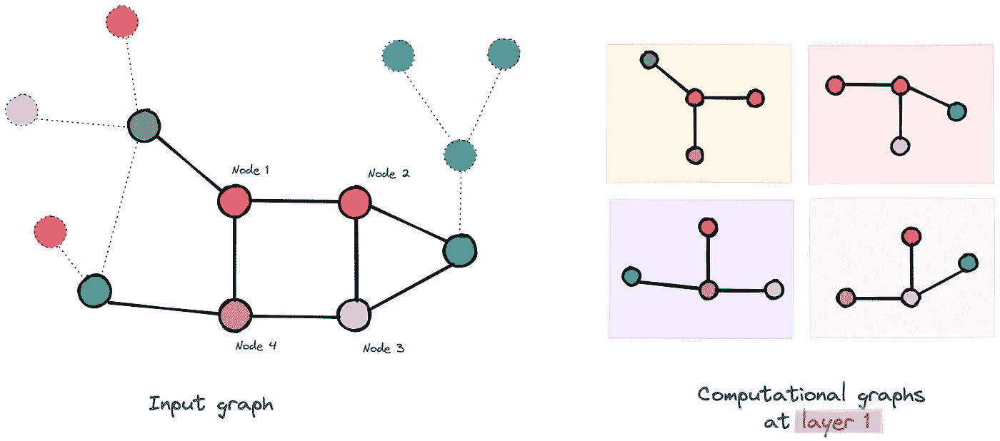
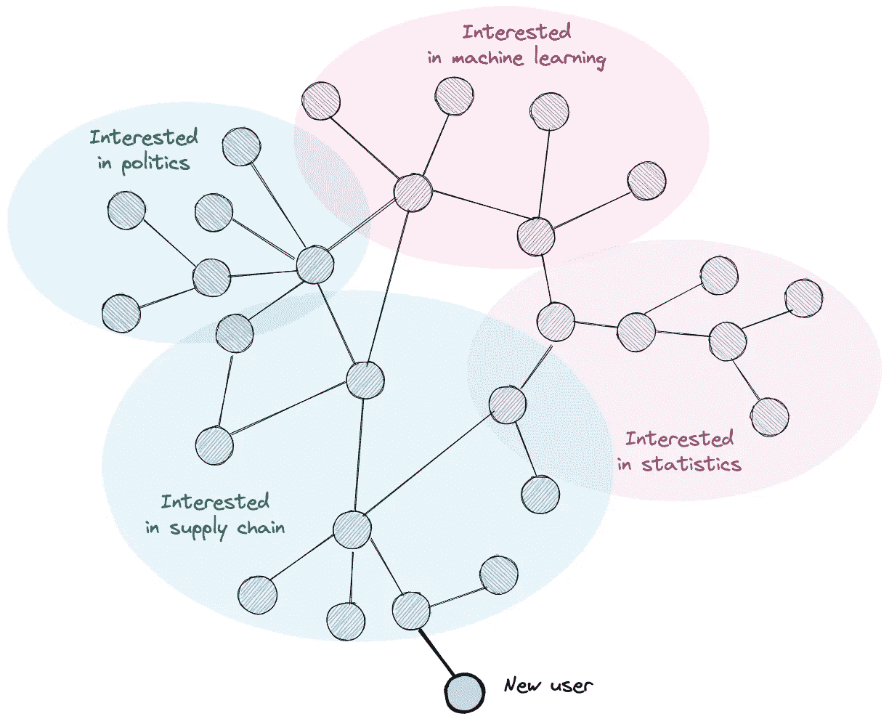
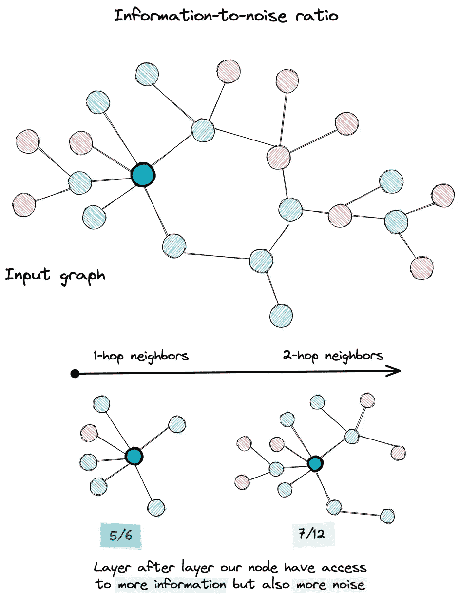
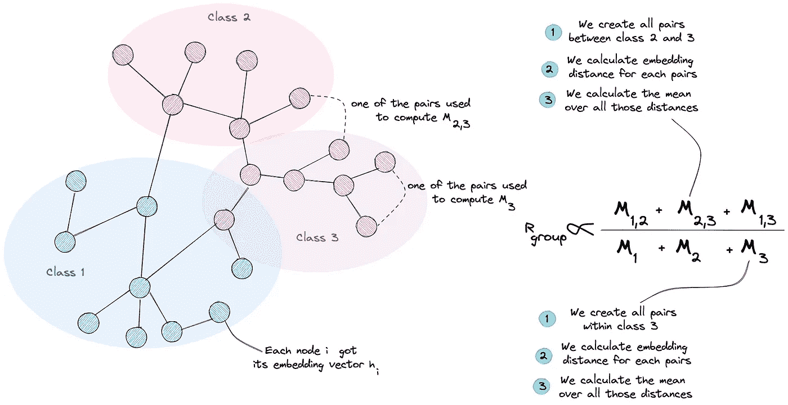

# 图形神经网络中的过平滑问题

> 原文：<https://towardsdatascience.com/over-smoothing-issue-in-graph-neural-network-bddc8fbc2472?source=collection_archive---------8----------------------->

[作者插图]

**TLDR** :这个故事给出了图形神经网络的一个高级入口:如何和为什么，然后介绍伴随着消息传递框架的一个严重问题，它代表了当今 GNN 的主要特征。别忘了使用下面的参考资料来加深你对 GNNs 的理解！

# 图形神经网络图解指南

图形神经网络或简称 GNN 是用于图形数据的深度学习(DL)模型。最近几年，它们变得相当热门。这种趋势在 DL 领域并不新鲜:每年我们都会看到一个新模型脱颖而出，要么在基准测试中显示最先进的结果，要么在已经使用的模型中显示全新的机制/框架*(但当你阅读它时会非常直观)*。这种反思让我们质疑这种致力于图形数据的新模型存在的理由。

## 我们为什么需要 GNNs？

**图形无处不在:**图形数据丰富，相信是最**自然**和**灵活**的方式来呈现我们每天产生或消耗的素材。我们无需费力去列举一整套图表数据示例，从大多数公司和社交网络(如脸书或 Twitter)中使用的关系数据库，到链接科学和文学中的知识创造的引用图表。由于图像的网格结构，甚至图像也可以被视为图形。

对于关系数据库，实体是节点，关系(一对一，一对多)定义了我们的边。至于图像，像素是节点，相邻像素可以用来定义边缘[作者举例]

**能够捕捉图形中所有可能信息的模型**:正如我们所看到的，图形数据无处不在，并且采用具有特征向量的互连节点的形式。是的，我们可以使用一些[多层感知器模型](https://en.wikipedia.org/wiki/Multilayer_perceptron#:~:text=A%20multilayer%20perceptron%20(MLP)%20is,artificial%20neural%20network%20(ANN).&text=An%20MLP%20consists%20of%20at,uses%20a%20nonlinear%20activation%20function.)来解决我们的下游任务，但是我们将失去图拓扑提供给我们的连接。至于卷积神经网络，它们的机制致力于图的特殊情况:网格结构的输入，其中节点是完全连接的，没有稀疏性。也就是说，唯一剩下的解决方案是**一个可以建立在两者中给出的信息之上的模型:我们的图中的节点特征和本地结构，**这可以减轻我们的下游任务；这正是 GNN 所做的。

## **GNNs 训练什么任务？**

既然我们已经适度地证明了这种模型的存在，我们将揭示它们的用法。事实上，我们可以在很多任务上训练 GNNs:大型图中的节点分类(*根据属性及其关系*对社交网络中的用户进行细分)，或整个图分类(为药物应用对蛋白质结构进行分类)。除了分类之外，回归问题也可以在图形数据之上公式化，不仅在节点上工作，也在边上工作。

总之，图形神经网络的应用是无止境的，并且取决于用户的目标和他们拥有的数据类型。为了简单起见，我们将集中于唯一图中的节点分类任务，其中我们尝试将由节点的特征向量领导的节点图的子集映射到一组预定义的类别/类。

该问题假设存在一个训练集，其中我们有一组带标签的节点，并且我们图中的所有节点都有一个特定的特征向量，我们记为 x。我们的目标是预测验证集中特征节点的标签。

节点分类示例:所有节点都有一个特征向量；彩色节点被标记，而白色节点未被标记[作者插图]

## 引擎盖下的 GNN

既然我们已经设置了我们的问题，是时候了解 GNN 模型将如何被训练来为未标记的节点输出类了。事实上，我们希望我们的模型不仅使用我们的节点的特征向量，而且利用我们处理的图结构。

使 GNN 独特的这最后一个陈述必须被限制在某个假设内，该假设声明 ***邻居节点倾向于共享相同的标签*** 。GNN 通过使用消息传递形式来合并它，这个概念将在本文中进一步讨论。我们将介绍一些我们将在后面考虑的瓶颈。

抽象够了，现在让我们看看 gnn 是如何构造的。事实上，GNN 模型包含一系列通过更新的节点表示进行通信的层(每层为每个节点输出一个嵌入向量，然后该向量被用作下一层的输入以在其上进行构建)。

我们的模型的目的是构建这些嵌入(*对于每个节点*)，集成节点的初始特征向量和关于围绕它们的局部图结构的信息。一旦我们有了良好表示的嵌入，我们就为这些嵌入提供一个经典的 Softmax 层来输出相关的类。

GNN 的目标是将节点特征转换成能够感知图形结构的特征

为了构建这些嵌入，GNN 层使用一种简单的机制，称为**消息传递**，这有助于图节点与其邻居交换信息，从而一层又一层地更新它们的嵌入向量。

*   **消息传递框架**

这一切都从一些节点开始，用向量 x 描述它们的属性，然后每个节点通过置换等变函数(平均值，最大值，最小值)从它的邻居节点收集其他特征向量..).换句话说，这是一个对节点排序不敏感的函数。这个操作叫做**聚合，它**输出一个**消息向量。**

第二步是**更新功能，**其中节点将从其邻居收集的信息(*消息向量*)与其自己的信息(*其特征向量*)相结合，以构建**新的向量 h:嵌入**。

这种聚集和更新函数的实例化因论文而异。你可以参考 GCN[1]，GraphSage[2]，GAT[3]或者其他人，但是消息传递的思想是不变的。

我们的 GNN 模型的第一层从特征向量 x0 到它的新嵌入 h 的图解[作者图解]

**这个框架背后的直觉是什么？嗯，我们希望我们的节点的新嵌入考虑到本地图结构，这就是为什么我们从邻居的节点聚合信息。通过这样做，人们可以直观地预见到一组邻居节点在聚集后将具有更相似的表示，这将在最后减轻我们的分类任务。所有这一切在我们的第一个假设( ***邻居节点倾向于共享同一个标签*** )的情况下总是成立的。**

*   **GNNs 中的图层组成**

现在我们已经理解了消息传递的主要机制，是时候理解层在 GNN 的上下文中意味着什么了。

回想上一节，每个节点使用来自其邻居的信息来更新其嵌入，因此自然的扩展是使用来自其邻居的邻居的信息(*或第二跳邻居*)来增加其感受域并变得更加了解图结构。这就是我们 GNN 模型的第二层。

通过聚集来自 N 跳邻居的信息，我们可以将其推广到 N 层。

一层又一层，节点可以访问更多的图节点和更具图结构意识的嵌入

至此，您已经对 gnn 如何工作有了一个高层次的理解，并且您可能能够发现为什么这种形式主义会有问题。首先，在深度学习的背景下谈论 GNN 假设深度(许多层)的存在。这意味着节点可以访问来自远处的节点的信息，这些节点可能与它们不相似。一方面，消息传递形式主义试图软化相邻节点之间的距离(平滑)以方便我们稍后的分类。另一方面，它可以在另一个方向上工作，通过使我们所有的节点嵌入相似，因此我们将不能分类未标记的节点(过度平滑)。

在下一节中，我将尝试解释什么是平滑和过度平滑，我们将讨论平滑作为增加 GNN 图层的自然效果，我们将了解为什么它会成为一个问题。

我还将尝试量化它(从而使它可跟踪)，并在此量化的基础上，使用关于此问题的已发表论文中的解决方案来解决它。

# GNNs 中的过度平滑问题

尽管消息传递机制有助于我们利用图结构中封装的信息，但如果与 GNN 深度结合，它可能会引入一些限制。换句话说，我们对一个更具表达性和更了解图结构的模型的追求(通过增加更多的层，使节点可以有一个大的感受域)可以转化为一个对节点一视同仁的模型(节点表示收敛到不可区分的向量[4])。

这种平滑现象不是错误，也不是特例，而是 GNN 的本质，我们的目标是缓解它。

## 为什么会出现过度平滑？

消息传递框架使用前面介绍的两个主要函数**聚合**和**更新**，它们从邻居那里收集特征向量，并将它们与节点自身的特征相结合，以更新它们的表示。该操作的工作方式使得交互节点(在该流程中)具有非常相似的表示。

我们将尝试在模型的第一层中说明这一点，以显示平滑为什么会发生，然后添加更多的层来显示这种表示平滑如何随着层的增加而增加。

> 注:**过度平滑以节点嵌入的相似性的形式表现出来。**所以我们使用颜色，其中**不同的颜色意味着矢量嵌入的不同**。此外，为了简化我们的示例，我们将只更新突出显示的 4 个节点。

我们 GNN 的第一层[作者插图]

正如您在第一层中看到的**，节点可以访问一跳邻居。例如，您可能还会观察到，**节点** **2** 和**节点 3** 几乎可以访问相同的信息，因为它们相互链接并具有共同的邻居，唯一的区别在于它们最后的邻居(紫色和黄色)。**我们可以预测，它们的嵌入会略有相似。**至于**节点 1** 和**节点 4** ，它们相互作用但有不同的邻居。因此我们可以预测**他们的新嵌入将会不同。****

我们**通过给每个节点分配新的嵌入来更新我们的图**，并移动到**第二层**并重复相同的过程。

GNN 的第二层[作者插图]

在我们的 GNN 的第二层中，节点 1、4 和 2、3 的计算图分别几乎相同。我们可以预期，我们对这些节点的新的更新嵌入将更加相似，甚至对于在某种程度上“*幸存于*”的**节点 1** 和**节点 4** ，第一层现在将具有相似的嵌入**、**，因为额外的层给予它们对图的更多部分的访问，增加了**访问相同节点**的概率。

这个简化的例子显示了过度平滑是 GNN 深度的结果。公平地说，这与真实案例相去甚远，但它仍然给出了这种现象发生背后的原因。

## 为什么这真的是一个问题？

既然我们了解了过度平滑发生的原因，以及它是由 GNN 图层合成的效果设计而成的原因，那么是时候强调我们为什么应该关注它，并提出解决方案来克服它了。

首先，学习我们的嵌入的目标是在最后将它们提供给分类器，以便预测它们的标签。考虑到这种过度平滑的影响，我们最终会对没有相同标签的节点进行类似的嵌入，这将导致它们的错误标签。

人们可能认为减少层数会降低过度平滑的效果。是的，但是这意味着在复杂结构数据的情况下不能利用多跳信息，因此不能提高我们的最终任务性能。

为了强调最后一句话，我将用一个现实生活中常见的例子来说明它。想象一下，我们正在处理一个有数千个节点的社交网络图。一些新用户刚刚登录平台，订阅了他们朋友的个人资料。我们的目标是找到主题建议来填充他们的提要。

一个虚构的社交网络[作者插图]

给定这个假想的社交网络，在我们的 GNN 模型中仅使用 1 或 2 层，我们将仅了解到我们的用户关心供应链话题，但是我们错过了他可能喜欢的其他多样化话题，因为他的朋友的互动。

总之，由于过度平滑是一个问题，我们在低效率模型和更有深度但在节点表示方面缺乏表达性的模型之间遇到了一个折衷。

## 怎么才能量化呢？

既然我们已经清楚过度平滑是一个问题，我们应该关注它，我们必须量化它，以便我们可以在训练 GNN 模型时跟踪它。不仅如此，通过将量化作为正则项添加到我们的目标函数中，量化还将为我们提供一个用作数值惩罚的度量。

根据我最近的阅读，大量的论文讨论了 GNN 的过度平滑问题，他们都提出了一个量化指标来证明他们对这个问题的假设，并验证他们的解决方案。

我从两篇讨论这个问题的不同论文中选择了两个指标。

*   **MAD 和 MADGap【5】**

Deli Chen 等人引入了 MAD 和 MADGap 两个量化指标来度量图节点表示的光滑性和过度光滑性。

一方面，MAD 计算图中节点表示(嵌入)之间的**平均距离，并使用它来显示平滑是向 GNN 模型添加更多层的自然效果。基于这一度量，他们将其扩展到 MADGap，MADGap 测量不同类别节点之间表示的****相似性。**这种概括建立在主要假设上，即当节点交互时，它们或者可以从来自同一类的节点获得重要信息，或者可以通过与来自其他类的节点交互获得噪声。****

****

**当节点访问图的更多部分时，我们可能会访问影响最终嵌入的噪声节点**

**在这篇论文中引起我兴趣的是作者质疑消息传递形式主义所基于的主要假设的方式(邻居节点可能有相似的标签)。事实上，他们的测量 MADGap 不仅仅是过度平滑的测量，而是相对于节点收集的信号的信噪比的测量。因此，观察到这一比率逐层降低证明了图拓扑和下游任务目标之间的**差异。****

*   ****组距离比【6】****

**周凯雄等人引入了另一个应变前向度量，但其目标与 MADGap 相同，即**组距离比。**此指标计算两个平均距离，然后计算它们的比率。我们首先将节点放在相对于其标签的特定组中。然后，为了构造我们的比率的命名器，我们计算每两个节点组之间的成对距离，然后对结果距离进行平均。至于分母，我们计算每组的平均距离，然后计算平均值。**

****

**解释如何计算组距离比率的图解[作者图解]**

**具有小的比率意味着不同组中节点嵌入之间的平均距离小，因此我们可以根据它们的嵌入来混合组，这是过度平滑的证明。**

**我们的目标是保持一个高的**组距离比率**，以使节点类在嵌入方面有所不同，这将减轻我们的下游任务。**

## **有没有解决过度平滑的方法？**

****直接监管术语？****

**既然我们已经量化了过度平滑问题，您可能会认为我们的工作已经结束，将这一指标作为监管条款添加到我们的损失目标中就足够了。剩下的问题是，在我们的训练会话的每次迭代中计算这些度量(*如上所述*)可能在计算上是昂贵的，因为我们需要访问我们的图中的所有训练节点，然后进行一些距离计算，处理与节点数量成二次比例的节点对(C(2，n) = n * (n -1) / 2 = O(n))。**

****间接解决方案？****

**由于这个原因，所有讨论过平滑问题的论文都考虑通过更容易实现并且对过平滑有影响的其他间接解决方案来克服这个计算问题。我们不会详细讨论这些解决方案，但是您可以在下面找到其中一些的参考资料。**

**对于我们的例子，我们将处理由周凯雄等人引入的**可微分组归一化[6]**。DGN 将节点分配到组中，并独立地归一化它们，以输出下一层的新嵌入矩阵。**

**这个附加层是为了优化先前定义的**组距离比**或 ***组*** 而构建的。事实上，在一个组内嵌入的节点的归一化使得它们的嵌入非常相似(减少 ***Rgroup*** 的分子)，并且这些使用可训练参数的缩放和移位使得来自不同组的嵌入不同(增加 ***Rgroup*** 的分子)。**

****

**可区分组规范化是如何工作的？[作者插图]**

**为什么会起作用？第一次阅读这篇论文时，我没有看到添加这个归一化层和优化 **Rgrou 比率之间的联系，**然后我观察到，这个层一方面使用可训练的分配矩阵，因此它有来自我们的损失函数的反馈，所以它被引导在理想情况下将节点分配给它们的真实类。另一方面，我们也有同样由损失函数引导的移动和缩放参数。这些参数用于区分不同组的嵌入，因此有助于下游任务。**

# **开场白和结论**

**这篇文章可能很长，但它只是触及了图形神经网络及其问题的表面，我试图从 gnn 的一个小探索开始，并展示它们如何能够——用这样一个简单的机制——打开我们在其他 DL 架构的上下文中无法想到的潜在应用。这种简单性受到许多问题的限制，阻碍了它们的表达能力(目前…)，研究人员的目标是在寻求利用图形数据的全部力量时克服它。**

**就我而言，我阅读了不同的论文讨论 GNNs 的一些限制和瓶颈，但将它们统一起来的一个共同点是**所有这些问题都可以与我们用来训练我们的图模型的主要机制相联系，这就是消息传递**。我可能不是专家，但我必须就此提出一些问题。不断列举这些问题并试图解决它们真的值得吗？既然我们还处于这个有趣领域的第一次迭代，为什么不考虑一个新的机制并尝试一下呢？**

**[1] Kipf，T. N. (2016 年 9 月 9 日)。基于图卷积网络的半监督分类。ArXiv.Org。[https://arxiv.org/abs/1609.02907](https://arxiv.org/abs/1609.02907)**

**[2]汉密尔顿，W. L. (2017 年 6 月 7 日)。大型图上的归纳表示学习。ArXiv.Org。[https://arxiv.org/abs/1706.02216](https://arxiv.org/abs/1706.02216)**

**[3]veli kovi，P. (2017 年 10 月 30 日)。图形注意力网络。ArXiv.Org。[https://arxiv.org/abs/1710.10903](https://arxiv.org/abs/1710.10903)**

**[4] Oono，K. (2019 年 5 月 27 日)。图形神经网络指数地失去了节点分类的表达能力。ArXiv.Org。[https://arxiv.org/abs/1905.10947](https://arxiv.org/abs/1905.10947)**

**[5]陈 d .(2019 . 9 . 7)。从拓扑角度度量和缓解图神经网络的过光滑问题。ArXiv.Org。[https://arxiv.org/abs/1909.03211](https://arxiv.org/abs/1909.03211)**

**[6]周，K. (2020 年 6 月 12 日).用可微分的组规范化走向更深层次的图形神经网络。ArXiv.Org。[https://arxiv.org/abs/2006.06972](https://arxiv.org/abs/2006.06972)**

**我想对**齐纳布·SAIF**和[巴德尔·穆法德](https://badr-moufad.medium.com/) 为这部不大的作品做出的贡献表示感谢。不要忘了我的阅读团队，他们一直在给我发草稿。谢谢大家，直到我们在另一个故事中相遇**