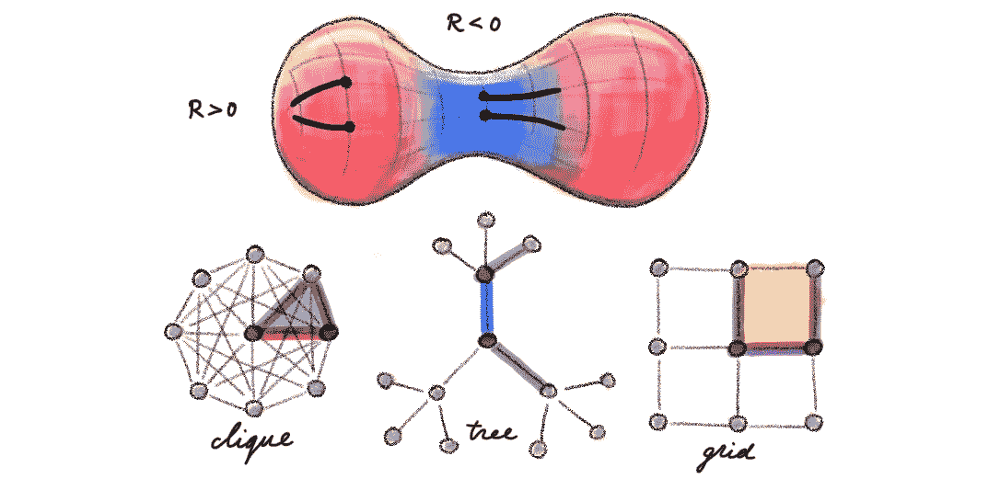
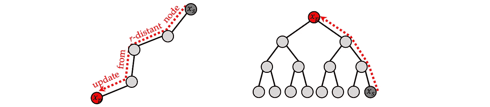
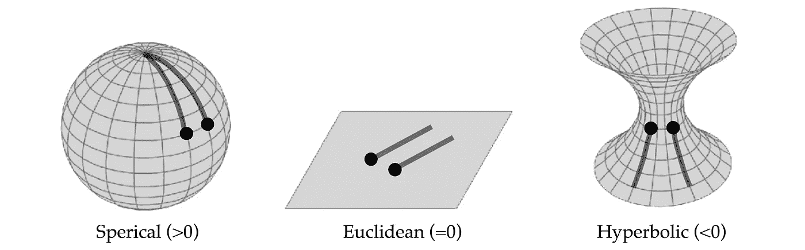
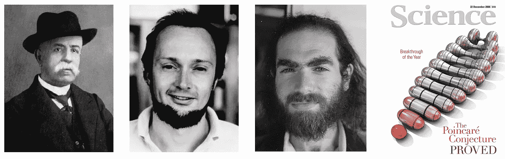
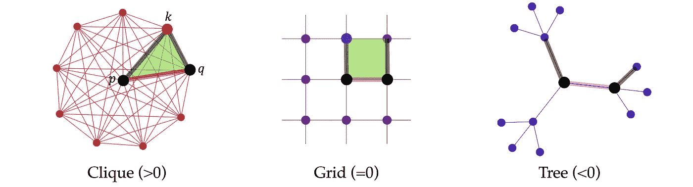
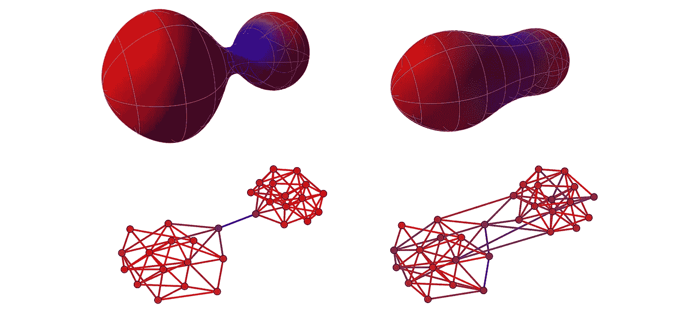

# 过度挤压、瓶颈和图的 Ricci 曲率

> 原文：<https://towardsdatascience.com/over-squashing-bottlenecks-and-graph-ricci-curvature-c238b7169e16?source=collection_archive---------4----------------------->

## 重新思考 GNNs

## 当消息传递未能在图上有效传播信息时，过度挤压是图神经网络的常见困境。在这篇文章中，我们讨论如何通过从微分几何领域借用的 Ricci 曲率的概念来理解和纠正这种现象。

*本文由弗朗西斯科·迪·乔瓦尼和杰克·托普合著，基于 j·托普、f·迪·乔瓦尼等人的论文* [*通过曲率理解图的过度挤压和瓶颈*](https://arxiv.org/pdf/2111.14522.pdf)*【ICLR】(2022)，由 Twitter Cortex 和牛津大学合作完成。这篇文章是通过微分几何和代数拓扑* *的透镜来研究* [*图神经网络系列的一部分。另见系列讨论*](/graph-neural-networks-through-the-lens-of-differential-geometry-and-algebraic-topology-3a7c3c22d5f?source=your_stories_page----------------------------------------) [*神经扩散偏微分方程*](/graph-neural-networks-as-neural-diffusion-pdes-8571b8c0c774?sk=cf541fa43f94587bfa81454a98533e00) *、* [*细胞束*](/neural-sheaf-diffusion-for-deep-learning-on-graphs-bfa200e6afa6?sk=0b2f814a1180a64460699f6a3277053a) 、*和* [*拓扑信息传递*](https://michael-bronstein.medium.com/a-new-computational-fabric-for-graph-neural-networks-280ea7e3ed1a?sk=3d4185067ef3c1cf81793deada08e18f) *的其他帖子。如需更多详细信息，请参见 Aleksa gordi**解释论文的视频以及图表&几何阅读小组中 Francesco 和 Jake 的* [*谈话*](https://www.youtube.com/watch?v=T5J3JzeTC2Y) *。*

T 大多数图神经网络(GNN)体系结构基于*消息传递*范式，其中信息在图的节点之间沿其边缘传播。传统上，输入图形既用作*数据*(连同节点特征)的一部分，也用作信息传播的*计算结构*。然而，最近的工作表明，某些图形在某些情况下对消息传递来说往往是“不友好的”[1]，挑战了这一范式。

更具体地说，当所学习的任务需要长程相关性时(即，MPNN 的输出依赖于彼此交互的远程节点的表示)，消息传递神经网络(mpnn)[2]往往表现不佳，同时，图的结构导致指数级的许多长程相邻节点(即，节点的“感受野”随着邻域的半径呈指数级增长)。在这种情况下，来自非相邻节点的消息需要被传播并压缩成固定大小的向量，从而造成*信息过度挤压*【3】的现象。造成过度挤压的图形结构特征被称为“瓶颈”。公平地说，尽管从经验上进行了广泛观察，但对这些现象的理论理解相当有限。

在最近的一篇论文中，我们引入了一些工具，通过描述图的局部几何性质来研究过度拥挤和瓶颈。假设我们有一个多层的 MPNN；我们可以计算由 MPNN 计算的隐藏特征对远程节点处的输入特征的敏感度。给定一个节点 *p* 和另一个节点 *s* 即*r*-远离它[5]，雅可比∂**h***ₚ*⁽ʳ⁺⁾/∂**x***ₛ*告诉我们输入特征的变化 **x** *ₛ* 将如何被 MPNN 传播并影响(r+1)st 层输出【t35 该雅可比矩阵的小绝对值表明信息传播不良或过度拥挤[6]。

*过挤压可以被定义为节点 p 处的 MPNN 的输出对 r 远处节点 s 处的输入特征缺乏敏感性，由雅可比|∂****h****ₚ⁽ʳ⁺⁾/∂****x***ₛ|.量化树是这种现象特别严重的病理图的示例。

雅可比矩阵可以由通过图的归一化邻接矩阵的幂表示的项来限定[7]。然而，除了指出图形结构(“瓶颈”)在某种程度上是过度挤压的原因之外，这种表达方式并不具有启发性。为了更好地理解瓶颈的本质，我们需要更仔细地看看图的细粒度几何属性。

首先，我们期望看起来像网格的图(其中节点的感受域多项式增长，就像卷积神经网络的情况)和看起来像树的图(具有指数增长的感受域)有非常不同的行为。在微分几何中，一个让我们能够区分不同几何形状的自然物体就是 [Ricci 曲率](https://en.wikipedia.org/wiki/Ricci_curvature)，以早期微分几何学家[Gregorio Ricci-curba stro](https://en.wikipedia.org/wiki/Gregorio_Ricci-Curbastro)【8】命名。粗略地说[9]，它决定了“测地线离散度”，即从附近具有“相同”速度的点开始的测地线是保持平行(如在曲率为零的欧几里德空间中)，收敛(正曲率的球面空间)，还是发散(负曲率的双曲空间)。

*流形的 Ricci 曲率可以通过“测地分散”来表征，即从附近点射出的两个平行测地线是否收敛(这发生在局部类似于球体的正弯曲空间中)、保持平行(平坦或欧几里得情形)或发散(负曲率产生双曲几何)。*

流形的 Ricci 曲率是微分几何和引力几何理论中研究的最基本的几何对象之一(在广义相对论中，Ricci 曲率出现在[爱因斯坦的场方程](https://en.wikipedia.org/wiki/Einstein_field_equations)中，该方程将时空的曲率与能量和动量联系起来)。它还被广泛探索为一种通过一族几何偏微分方程使公制结构变形的方法，该方程由理查德·汉弥尔顿在 20 世纪 80 年代以“[瑞奇流](https://en.wikipedia.org/wiki/Ricci_flow)”【10】的名义引入。二十年后，格里戈里·佩雷尔曼完成了汉密尔顿的程序，证明了著名的庞加莱猜想，这一方法甚至在纯数学领域之外也声名狼藉。

*从左至右:格雷戈里奥·利玛窦-库巴斯托(他引入了现在所谓的“利玛窦曲率”)、理查德·汉弥尔顿(他构想了“利玛窦流”)、格里戈里·佩雷尔曼(他用汉密尔顿的技术证明了百年* [*庞加莱猜想*](https://en.wikipedia.org/wiki/Poincar%C3%A9_conjecture) *)。《科学》杂志宣布该证明为 2006 年* [*年度*](https://www.science.org/doi/10.1126/science.314.5807.1848) *突破。图片来源:维基百科/卡梅伦·斯莱登/科学。*

作为图中测地离差的类比，考虑一条边 *p* ~ *q* 和两条分别从 *p* 和 *q* 开始的边。在一个离散的球形几何体中，边会在另一个节点 *k* 处相遇，形成一个*三角形*(一个 3-团)。在离散欧几里德几何中，边将保持平行，并形成基于 *p* ~ *q* (正交网格)的*矩形* (4 圈)。最后，在离散双曲几何中，与 *p* 和 *q* 相比，边端点的相互距离会增加(这是树的情况)。

基于对上述局部结构(三角形、矩形和向外边缘)的计数，我们为边缘 *p* ~ *q* 定义了一个新的概念*平衡共振峰曲率*【12】，用 Ric( *p* ， *q* 表示。我们的离散曲率再现了连续情况下的测地线色散行为:

*我们对图上离散 Ricci 曲率的定义通过捕捉从节点 p 和 q 发出的边(用粗体黑色标记)形成的局部结构来模拟连续情况下的“测地线离散度”,其中 p~q 是边。在球面几何的离散类比中，这些边倾向于形成三角形(本例中的 pqk)。在欧几里得几何中，它们保持“平行”(即，停留在相同的 1 跳距离并形成 4 个循环)。在双曲几何中，边发散(即，它们的端点之间的距离增加，导致树状结构)。*

本文的主要理论结果是雅可比矩阵的界限，它量化了 MPNN 输出对输入特征的敏感度，通过平衡的 Forman 曲率[13]，从而将图形的曲率与过度挤压现象联系起来。我们的结论是*负向弯曲的边是导致过度挤压*的图形瓶颈。

我们的结果的实际含义之一是一种基于曲率的图重布线的概念方法，称为“随机离散瑞奇流”连续的 Ricci 流与 Ricci 曲率成比例地发展了黎曼流形的度量。受这种方法的启发，并根据我们对瓶颈的描述，我们使用离散的平衡福尔曼曲率来指导图上的重新布线，其中在最负弯曲的边周围局部添加边 *p* ~ *q* 以减少瓶颈。在预处理阶段完成，这样的重新布线使得图对消息传递更友好，并且提高了图神经网络的性能。同时，我们程序的“外科手术”性质确保了新图表与原始图表没有显著不同。

*上图:具有负弯曲瓶颈(由冷色编码的负曲率)的哑铃形黎曼流形经历了基于曲率的度量演化，变得“更圆”，更少“瓶颈”。下图:基于曲率的图形重布线的类似过程，减少了瓶颈，使图形对消息传递更友好。*

在本文的第二部分，我们将看看基于曲率的图重布线的实验评估，并将其与约翰内斯·克利茨佩拉和合著者介绍的流行的基于扩散的重布线方法 DIGL 进行比较【14】。使用微分几何的技术，我们将试图更好地理解扩散是否(以及何时)改善图形学习。

[1] U. Alon 和 E. Yahav，[论图神经网络的瓶颈及其实际意义](https://arxiv.org/pdf/2006.05205.pdf) (2020) arXiv:2006.05205 .

[2] J. Gilmer 等人，[量子化学的神经信息传递](https://arxiv.org/abs/1704.01212) (2017) ICML。

[3]以前在传统(基于 RNN 的)seq2seq 模型中观察到过度挤压现象——这些模型必须将整个输入序列“挤压”到固定大小的向量中。然而，当在 1D 网格上操作的 RNNs 中，节点的感受野线性增长时，在 GNNs 中，这种增长通常是指数的，因此更令人关注。

[4] J. Topping，F. Di Giovanni 等人，[通过曲率理解图的过度挤压和瓶颈](https://arxiv.org/pdf/2111.14522.pdf) (2021) arXiv:2111.14522。

[5]即 *p* 和 *s* 之间的最短路径(测地线)由 *r* 跳组成。

[6]类似的灵敏度分析由徐等人完成，[跳跃知识网络图的表示学习](http://proceedings.mlr.press/v80/xu18c/xu18c.pdf) (2018)，但据我们所知，我们是第一个将其应用于过度挤压的。

[7]我们论文[4]中的方程 2。

[8] G .利玛窦,《质量变化中的原理》( 1903-1904 年)。威尼托*63(2):1233–1239。用一个缩写姓氏“利玛窦”(而不是“利玛窦-库巴斯托”，一个[古老的意大利家族](https://www.riccicurbastro.it/en/farm-winery/history/))签名，有时会让人混淆这是不是两个不同的人。*

*[9]形式上，Ricci 曲率为黎曼流形上每一点的切空间指定了一个对称的双线性形式(张量),它表示度量与平坦的(欧几里得)度量有多么不同。更一般地，可以测量任意仿射连接的 Ricci 曲率。测地线色散还可以与体积增长(即半径为 *r* 的球的体积)相关，在欧氏空间中是多项式，在双曲空间中是指数。*

*[10] R. S. Hamilton，[具有正 Ricci 曲率的三流形](https://doi.org/10.4310%2Fjdg%2F1214436922) (1982)微分几何杂志 17(2):255–306 介绍了 Ricci 流。瑞奇流是形式为∂*g*/∂*t*=**-**2*r*的偏微分方程，其控制流形的黎曼度量张量 *g* 与瑞奇曲率张量 *R* 成比例的演化，其在结构上类似于扩散方程。*

*[11]该证明出现在一系列 arXiv 论文中，G. Perelman，[*Ricci 流的熵公式及其几何应用*](https://arxiv.org/abs/math.DG/0211159)*(*2002)arXiv:0211159，G. Perelman， [*Ricci 流与三流形上的手术*](https://arxiv.org/abs/math.DG/0303109)*(*2003)arXiv:0303109，以及 G. Perelman，[佩雷尔曼用“手术的瑞奇流”证明了一个更一般的结果，称为](https://arxiv.org/abs/math.DG/0307245)[瑟斯顿几何化猜想](https://en.wikipedia.org/wiki/Geometrization_conjecture)，其中庞加莱猜想是一个特例。如果不是因为与另一位明星数学家丘成桐在优先权问题上的争执，这一非凡的数学成就可能会被公众忽视。大卫·格鲁伯(我在 CETI 项目中的同事，也是出了名的离群索居的佩雷尔曼接受采访的少数人之一)和西尔维娅·纳萨尔(通常被认为是《美丽心灵》的作者)在他们的《纽约客》文章中引起了广泛关注。佩雷尔曼因此拒绝了应得的奖励和金钱，并退出了公共生活和数学。*

*[12]在我们的论文[4]中，等式 3 给出了平衡曲率的定义。存在几种 Ricci 曲率的图形类比，其中包括 R. Forman 介绍的构造、 [Bochner 的细胞复形和组合 Ricci 曲率的方法](https://link.springer.com/content/pdf/10.1007/s00454-002-0743-x.pdf) (2003)离散和计算几何 29:323–374 和 Y. Ollivier、[度量空间的 Ricci 曲率](https://www.math.uchicago.edu/~shmuel/QuantCourse%20/Metric%20Space/Ollivier,%20Ricci%20curvature%20of%20Metric%20Spaces.pdf)(2007)Comptes Rendus mathématique 345(11):643–646，称为 *Forman* -和奥利维尔曲率由于其与最佳传输的[关系而具有更丰富的理论，但同时计算起来很昂贵，而福曼曲率的优势在于其组合定义和更低的计算复杂度。然而，Forman 曲率的缺点在于它偏向于负曲率(例如，根据 Forman 的定义，网格的曲率是负的)。出于这个原因，我们引入了一个新版本的 Ricci 曲率图，在精神上类似于 Forman 的构造，但考虑了 4 个周期的贡献，因此命名为“*平衡 Forman* ”。我们证明了我们的曲率是奥利维尔曲率的下界(定理 2)。这个结果的一个结果，连同关于奥利维尔曲率的已知事实，是在正弯曲的图中，体积多项式地增长(推论 3)。](https://cedricvillani.org/sites/dev/files/old_images/2012/08/P12.CIME_.pdf)*

*[13]我们论文[4]中的定理 4。*

*[14] J .克利茨佩拉等人，[扩散改善图学习](https://proceedings.neurips.cc/paper/2019/file/23c894276a2c5a16470e6a31f4618d73-Paper.pdf) (2019) NeurIPS，缩写为“DIGL”，是一种基于扩散图拓扑的图重布线方法。*

*我们非常感谢克里斯·博德纳尔和大卫·艾纳德的校对和深刻的评论。本帖是通过微分几何和代数拓扑 *的透镜讲述* [*图神经网络系列的一部分。有关图形深度学习的其他文章，请参见 Michael 在《走向数据科学》中的*](/graph-neural-networks-through-the-lens-of-differential-geometry-and-algebraic-topology-3a7c3c22d5f?source=your_stories_page----------------------------------------) [*其他帖子*](https://towardsdatascience.com/graph-deep-learning/home) *，* [*订阅他的帖子和*](https://michael-bronstein.medium.com/subscribe) [*YouTube 频道*](https://www.youtube.com/c/MichaelBronsteinGDL) *，获取* [*中级会员资格*](https://michael-bronstein.medium.com/membership) *，或在* [*Twitter 上关注 Michael*](https://twitter.com/mmbronstein)*