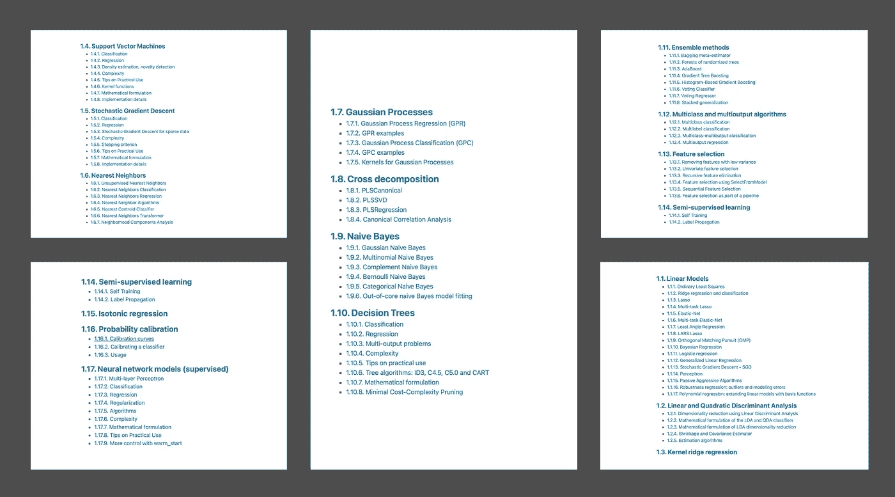

# 克服人工智能在预测创业成功方面的偏见

> 原文：<https://towardsdatascience.com/overcoming-ai-faults-in-predicting-startup-success-768985e6e289?source=collection_archive---------22----------------------->

*许多预测创业成功的尝试(* [*我们*](http://twostory.com) *做到了 78%的准确率)。人工智能时代让我们能够识别复杂创业数据中的模式。但是，当我们有脏数据和次优的现成人工智能时，会发生什么？在这篇文章中，我们描述了我们识别数据和创建预测创业成功的人工智能的方法。*

迈克尔·泽兹奇拍摄的照片

# 动机

每个投资者都想在潜在投资的海洋中找到隐藏的独角兽。发现具有独角兽潜力的创始人，尤其是在他们职业生涯的早期，极其困难。尽管如此，还是有很多尝试预测公司成功的例子。我在谷歌上快速搜索了一下，找到了 20 多个。其中一些是投资者给出他们对最重要的事情的看法的诀窍。其他人是从大数据中搜索预测洞察力的机器学习工程师。

**不幸的是，这些方法最终都达不到要求。**这些方法不够理想有多种原因。投资者提供的见解是他们认为重要的有价值的视角，但它们是不可能复制的。他们衡量创始人“专注度”的内部尺度是无法在另一个投资者的过程中(非常容易地)校准的。虽然我坚信人类是优秀的模式识别者，但我们也只能掌握这么多信息。这些投资者的“规则”可能只捕捉到一个更大的画面的一部分，并可能以某种不明显的方式存在偏见。这意味着这些规则可能不适用于所有创始人。我也坚信数据和机器学习/数据科学/人工智能/模式识别技术包含预测创业成功的能力(具有一定程度的准确性)。然而，我看到的方法通常使用公开可用的数据，做出自己的一套假设。我没有提及这些作品，因为我不想贬低他们正在做的工作。我认为这很有价值，但这是一个有很多不确定性的问题。在这篇文章的剩余部分，我将重点关注预测创业成功的数据驱动方法。我将对数据、标准人工智能实践以及我们为交付专门为此开发的解决方案所做的工作进行高层次的概述。

# 启动数据

询问任何一位数据科学家，他们可能会告诉你这项工作最令人沮丧的部分之一是清理数据。我从事数据工作已经 10 多年了，但从未收到过干净的数据。围绕数据的问题不是它是否脏，而是脏到什么程度？我寻找的前两件事是数据是否不完整或不正确。不完整的数据仅仅是指任何数据点丢失，不正确的数据是指数据点完全错误。为了减少不完整的数据，我通常会寻找缺失的值并明确定义范围。例如，如果 2021 年的数据还没有收集，我会在检查结果时明确说明这一点。

关于创业公司的可用信息从未如此之多。许多网站的整个价值主张是提供关于创业公司的数据。常见的数据点包括公司成立的年份、地点、创始人人口统计、融资轮次、融资金额等。这篇[的文章](https://medium.com/@andreretterath/what-s-the-best-startup-vc-database-8237fc189830)强调了一项关于数据质量的研究。这进一步证实了我的观点，即所有数据都是脏的，尤其是在这个领域。每个数据点至少在不同方面略有偏差，因此我们将考虑使用这种类型的数据的一些含义。

*   **创始人人口统计**

使用创始人的人口统计数据来预测成功可能是最糟糕的数据点，尤其是如果你使用任何黑盒分类器的话。有很多恐怖的故事说明为什么用人口统计来预测不是一个好主意。如果不明显的话，使用人口统计学会导致一个人口统计学被提升到另一个之上。使用这个作为输入意味着一个人口统计比另一个更好——这应该发出危险信号。

*   **资助金额**

资金的多少可能是创业公司成功和失败的一个重要区别。然而，这有助于你预测他们未来的成功吗？绝对不行！投资者想在投资前知道谁会成功，而不是投资后——这使得这个数据点毫无用处。

*   **公司所在地**

位置也可能预测成功，但与此相关的偏见是阶级不平衡。当一种类型的数据比另一种类型的数据有更多的例子时，就会出现类别不平衡。例如，一个地方比另一个地方有更多成功的创业公司。我来自纳齐兹小镇，女士。独角兽创业公司不太可能来自纳齐兹，但这就意味着不可能吗？还是那句话，绝对不行。然而，如果这个数据点暴露于一种算法，它 ***可能*** 了解到只有来自硅谷的公司才值得。

> 为什么我在最后一段突出了“may ”?用于这类任务(分类)的标准算法并不总是明确说明它们在数据集中发现什么是重要的。

# 分类算法

分类器是用于在对应于标签的一组数据中寻找模式的算法。分类算法已经存在了几十年，它们在分类方面非常出色。不幸的是，没有银弹解决方案，这就是为什么有这么多不同的分类器。例如，这是流行的 [scikit-learn](https://scikit-learn.org/stable/) 工具箱中分类器的数量(这些是可以在几分钟内使用的！)

分类器有成千上万种，知道哪一种(如果有的话)适合手头的问题(和数据)是一门艺术和科学。选择分类器有两种标准做法。

1.  *数据科学家/ML 工程师知道哪些？*
2.  *哪个精度最高？*

**这两个问题都没有回答它们是否是全局最佳算法。平心而论，这是一个不可能回答的问题。但是，这并不意味着所有的分类器都是一样的。作为这些方法的实践者，理解何时使用每种算法是至关重要的。当预测创业成功时，我看到的趋势是使用上面的两个问题来预测创业成功。虽然他们的解决方案是数据科学社区的标准，但我认为这个问题具有更高的标准，因为我不认为存在更好的解决方案。因此，我们应用两种不同于普通方法的实践来预测创业成功。我们不仅收集行为数据，而且我们还为这个问题开发了一个特定的分类器。我们不仅预测相当准确，而且我们还可以直接向投资者解释这些结果，做出切实可行的投资建议。**

# 简单的规则

[简单规则](https://medium.com/codex/practical-ai-a-fuzzy-solution-beaa6cb79228)是我和迈克尔[在过去几年里开发的一种算法。我们发现问题是:](https://www.linkedin.com/in/michaelmuelleraperio/)

> **找出导致公司成功(或失败)的创始人的行为特征。**

我们的数据开始时是每位创始人 100 多项特质(或数据科学术语中的特征)与他们的成功相对应——我们最终减少到不到 10 项。标准分类器(来自 scikit-learn)可以学习哪些特征是重要的，但它们不能告诉我们它们是哪些。此外，他们无法以一种通俗易懂的方式解释每个功能对每个创始人的影响。所以，我们制定了简单的规则。简单规则是一个分类器，它学习如何对创始人和数据中的规则进行分类。

> **数据科学/人工智能专家提示:开发一个最终用户能够理解的分类器是物有所值的。**

**这很重要，因为我们有一个可以从两个层面解释的解决方案。**首先，它对投资者是可解释的，因为与创始人相关的风险产生了(预测)。第二，这对于行为科学家来说是可以解释的，因为他们理解每种特质的影响(在全球层面上，并且对于特定的创始人来说)。简单规则学习模糊规则库，可以预测创始人的成功，同时还可以学习每个特征的影响。这意味着我们可以将从数据中学到的东西直接传递给最终用户。行为科学家现在明白了:

> 情绪稳定性低，那么成功就低。

你可能会问，为什么有人会关心特性呢？有了这些信息，行为科学家就可以将上下文应用到预测中。了解情绪稳定性在现实世界中的表现超出了任何人工智能的能力。尽管如此，领域专家可以有效地描述和发展这种特质，以减轻创始人给公司带来的风险。

# 结论

我们成功地创建了一个识别创始人及其成功潜力的流程。这个由两部分组成的解决方案涉及到使用行为数据和一个可解释的算法来预测和向最终用户(投资者和行为科学家)传递信息。我们的方法不仅是可解释的(我们可以突出任何偏见)，而且由于数据的标准，它不容易受到其他解决方案所面临的偏见的影响。

如果你是一名数据科学家/ ML 工程师/ AI 爱好者，我希望这篇文章能启发你创建、突破和构建更好的解决方案来管理不确定的现实世界的数据。与领域专家交流是困难的，但它确实有助于打造值得构建的解决方案。能够产生更广泛影响的解决方案。