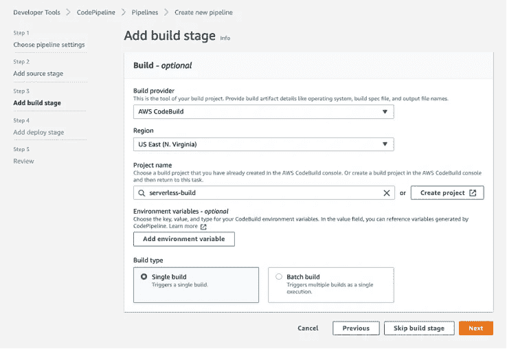

# 克服 AWS CodePipeline 的设计缺陷以自动化无服务器 ML 架构部署

> 原文：<https://towardsdatascience.com/overcoming-aws-codepipelines-design-flaws-to-automate-serverless-ml-architecture-deployment-2c250ae5006a?source=collection_archive---------12----------------------->

## 构建一个简单的 CI/CD 管道，在 15 分钟内在 Amazon 上自动创建和部署 lambda 函数和相关的 SQS 队列。


照片由来自[佩克斯](https://www.pexels.com/photo/mountain-covered-snow-under-star-572897/?utm_content=attributionCopyText&utm_medium=referral&utm_source=pexels)的埃伯哈德·格罗斯加斯泰格拍摄

机器学习和数据科学需要无服务器应用。它们是轻量级的现收现付功能，可以减少为机器学习基础架构设置服务器或实例所花费的时间。AWS 通过 CodeCommit、CodeBuild、CodeDeploy 和 CodePipeline 使构建 CI/CD 管道变得更加容易。数据科学家可以花更少的时间在云架构和 DevOps 上，花更多的时间微调他们的模型/分析数据。此外，现收现付模式比支付云服务器/EC2 实例 24/7 运行来托管基础架构更便宜。

在本文中，我们将介绍如何使用 AWS 原生工具来构建 CI/CD 管道，以便将简单的机器学习模型部署为无服务器端点。该管道(使用 CodePipeline)从 CodeCommit 存储库中读取所有代码，并触发代码构建。此代码构建使用无服务器框架(一个用于 YAML + CLI 开发的软件包)将 CodeCommit 中的代码部署到 AWS Lambda 函数中。目标是每当我们对 CodeCommit 存储库进行更改时，触发 AWS Lambda 部署。

## 在开始之前

*   这篇文章将涉及很多概念，可能你们中的很多人都不熟悉。请查看**术语**和**建议阅读**了解更多详情。
*   声明:由于 AWS Lambda 是轻量级的，它可能不适合庞大的深度学习模型。参见[为什么我们不使用 Lambda 进行无服务器机器学习](/why-we-dont-use-lambda-for-serverless-machine-learning-d00038e1b242)了解更多信息。
*   AWS Lambda 和无服务器通常可以互换使用。为了避免混淆，在讨论按需付费架构时，我将参考 AWS Lambda。当谈到用于部署 Lambda 的 CLI 工具时，我将参考无服务器框架。

## 术语

*   AWS SQS-简单队列服务。一种完全托管的消息队列服务，使您能够分离和扩展微服务、分布式系统和无服务器应用程序。
*   AWS SageMaker 通过整合一系列专为机器学习构建的功能，帮助数据科学家和开发人员快速准备、构建、训练和部署高质量的机器学习(ML)模型。用于独立于 AWS Lambda 部署 ML 模型。
*   AWS Lambda —一种无服务器计算服务，让您无需配置或管理服务器、创建工作负载感知集群扩展逻辑、维护事件集成或管理运行时即可运行代码。
*   无服务器框架—用于 YAML + CLI 开发和部署到 AWS Lambda 的软件包。
*   AWS cloud watch——监控和观察工具。在日志中跟踪 Lambda 输出。

## 推荐阅读

要了解更多关于 AWS Lambda 的信息，我强烈推荐阅读[无服务器函数和使用 AWS Lambda 和 S3 桶](/serverless-functions-and-using-aws-lambda-with-s3-buckets-8c174fd066a1)。

要了解更多关于在无服务器框架中部署的信息，请参见[无服务器框架文档](https://www.serverless.com/framework/docs/)。

要了解 AWS 中的 CI/CD 和代码管道开发，我强烈推荐阅读 [CI/CD-在 AWS 上构建四步管道的逻辑和实用方法](/ci-cd-logical-and-practical-approach-to-build-four-step-pipeline-on-aws-3f54183068ec)。

要了解更多关于 [SageMaker](https://aws.amazon.com/sagemaker/) 和 [SQS](https://aws.amazon.com/sqs/) 的信息，请参见 AWS 上的文档。

# 体系结构


我使用 [Codecraft](https://www.cloudcraft.co/) 创建的无服务器架构图

以下步骤如下

*   开发者在 SageMaker 上部署一个模型
*   开发人员通过 git 更新包含架构逻辑的 CodeCommit 存储库
*   CodePipeline 通过 CloudWatch 注意到 CodeCommit 存储库中的一个变化。然后它触发 CodeBuild 在 AWS 中创建/更新、链接和部署所有 4 个服务(3 个 SQS 队列和 1 个 lambda 函数)。
*   然后，开发人员从 TriggerLambdaSQS 发送一条消息。然后，这个 TriggerLambdaSQS 用输入数据触发 ModelPredictLambda 函数。Lambda 将使用 SageMaker 部署的模型。如果消息格式/lambda 中有错误，失败的消息将输出到 DeadletterSQS。如果 lambda 函数成功处理了消息，它将把 SageMaker 的结果输出到 CloudWatch 日志中。

## **为什么使用 CodeBuild 进行无服务器部署？AWS CodeDeploy 没有内置 Lambda 部署吗？**

正确，CodeDeploy 允许 lambda 部署。对于 CodeCommit 的每次提交，您可以手动调用 CodeBuild，然后调用 CodeDeploy。我们希望通过 CodePipeline 自动化构建和部署阶段，而不用担心手动触发。

## **好吧，但是为什么不在 CodePipeline 中使用 CodeDeploy 呢？**

在 CodeDeploy 中，在 lambda 函数上部署包不同于在 EC2 实例上部署包。在 lambda 函数上部署时，CodeBuild 只接受列出 lambda 部署配置的 **YAML 文件**，并将其存储在 S3 桶中。CodeDeploy 下载 YAML 文件并将其部署在 lambda 函数上。在 EC2 上部署时，CodeBuild 从 CodeCommit 获取所有文件，压缩它们，并将 **zip 文件**存储在 S3 桶中。CodeDeploy 在 EC2 上下载并解压缩文件。CodePipeline 指定从 CodeBuild **生成的工件必须**为 zip 格式，才能传递给 CodeDeploy。这使得自动化 lambda 部署变得棘手，因为它依赖于 YAML 文件进行部署。这是 AWS 论坛中的一个已知问题，亚马逊承诺会修复这个错误。截至 2021 年，仍然没有更新。

解决方法是创建一个同时使用 CodeCommit 和 CodeBuild 的代码管道。在 CodeBuild 中，您安装所有包(包括无服务器框架)并运行无服务器框架来将应用程序部署到 AWS Lambda。由于您依赖于无服务器框架包而不是 CodeDeploy 进行部署，因此您需要创建一个名为 **serverless.yml** 的不同的 YAML 文件(不需要 **appspec.yml** ，这是 CodeDeployment 的默认 YAML 文件)。我们稍后会讨论更多。

# **教程**

对于本教程，我们将使用 scikit-learn 的波士顿房价数据集。我们将训练一个 XGBoost 模型来预测波士顿的房价中值。我们将在 SageMaker 上部署模型，并在 AWS Lambda 架构中使用它进行预测。

## **创建文件夹结构**

我们首先要创建一个名为 **repo** 的文件夹。这将包含同一级别的一个文件夹(lambda_deployment)和一个 Python 脚本(boston_sagemaker_deployment.py)。lambda_deployment 将包含在 CodePipeline 中成功部署 lambda 函数所需的所有相关文件。下面是文件的文件夹结构。


Visual Studio 代码中 REPO 的文件夹结构的屏幕截图

*   build spec . yml—YAML 格式的构建命令和相关设置的集合，CodeBuild 使用它来运行构建并使用无服务器框架进行部署
*   model _ predict _ lambda.py 为预测调用 SageMaker 模型的 lambda 函数
*   requirements.txt —从 pip 下载的 python 包列表
*   serverless.yml 定义无服务器服务的 YAML 配置。这还包括需要与 lambda 一起部署的附加组件(SQS)
*   Boston _ sagemaker _ deployment . py—使用 SageMaker 在 AWS 上构建和部署模型的脚本

## **创建并执行 SageMaker 脚本**

第一件事是向 AWS 部署一个简单的 XGBoost 模型。**注意:**我们想要创建一个名为 *sagemaker-role* 的 IAM 角色，拥有访问 sagemaker 的完全权限。我不会深入讨论 XGBoost 的任何细节，因为这超出了本教程的范围。

之后，我们将执行脚本。

```
python boston_sagemaker_deployment.py
```

我们只需要做一次。这需要几分钟，但会给出成功或失败的信息。如果成功，它将为我们的模型返回一个端点。在 SageMaker AWS 控制台上检查端点是否在那里。

## **创建并上传 lambda_deployment 文件夹和文件到 CodeCommit**

CodeCommit 是 Amazon 的源代码控制服务，托管安全的基于 Git 的存储库。我们将在那里上传 lambda_deployment 文件夹。我们可以使用 git 添加文件，也可以通过控制台手动添加。


lambda 部署中带有上传文件的 AWS 代码提交的屏幕截图

***更新:CodeBuild 只识别 repo 头的文件，不识别 repo/lambda_deployment 头的文件。要解决这个问题，请将 lambda_deployment 中的所有 4 个文件移到 repo 的根目录。一旦这些被移动，删除其余的文件/文件夹。***

## **为代码构建环境添加文件**

[CodeBuild](https://aws.amazon.com/codebuild/) 允许我们构建和测试持续扩展的代码。如前所述，我们还将使用无服务器框架在 CodeBuild 中部署 lambda 函数和服务。

我们将添加包含代码构建配置的 **buildspec.yml，**。因为我们使用一个干净的环境/映像，所以我们想要指定下载某些包所需的命令。这是假设一个干净的 Ubuntu 环境:

```
version: 0.2phases:
  pre_build:
    commands:
      - echo "Running pre build commands"
      - apt-get update
      - apt-key adv --keyserver keyserver.ubuntu.com --recv-keys 7EA0A9C3F273FCD8
      - add-apt-repository "deb [arch=amd64] [https://download.docker.com/linux/ubuntu](https://download.docker.com/linux/ubuntu) bionic stable"
      - apt-get -y install docker-ce docker-ce-cli containerd.io
      - npm install -g serverless --unsafe
      - npm i -D serverless-dotenv-plugin
      - npm install serverless-plugin-aws-alerts --save-dev
      - sls plugin install -n serverless-python-requirements
      - apt-get -y install python3-pip
      - pip3 install awscli --upgrade --user
      - pip3 install -r requirements.txt
      - echo "Reducing size of SageMaker to run on lambda"
      - pip3 install sagemaker --target sagemaker-installation
      - cd sagemaker-installation
      - find . -type d -name "tests" -exec rm -rfv {} +
      - find . -type d -name "__pycache__" -exec rm -rfv {} +
      - zip -r sagemaker_lambda_light.zip
      - cd .. build:
    commands:.
      - echo "Running build commands"
      - sls deploy --verbose
      - echo "Finished deploying to Lambda and SQS"
```

因为是干净镜像，所以我们负责安装 pip，awscli，serverless，docker 等。注意:lambda 对我们可以在函数上安装多少东西有一个限制。SageMaker 有很多依赖项，所以我们删除了 SageMaker 中与部署无关的组件。

prebuild 命令主要用于安装软件包，包括 **requirements.txt** 中的 pip3 软件包(如下所示):

```
boto3
```

现在我们有了 CodeBuild 命令，接下来我们想设置 **serverless.yml** 。yml 包含部署 lambda 函数和相关服务的配置，以触发函数、存储函数输出、发送阈值限制警报、记录函数行为等。该文件将如下所示。

```
service: model-predictpackage:
  include:
    - ./model_predict_lambda.pyprovider:
  name: aws
  runtime: python3.6
  iamRoleStatements:
    - Effect: "Allow"
      Action: 
        - "lambda:InvokeFunction"
        - "iam:GetRole"
        - "sqs:CreateQueue"
        - "sqs:GetQueueUrl"
        - "sqs:SendMessage"
        - "ecr:DescribeRepositories"        
        - "cloudformation:DescribeStacks"
        - "sagemaker:InvokeEndpoint" 
      Resource: "*"functions:
  get_model_predictions:
    handler: model_predict_lambda.model_predict_handler
    provisionedConcurrency: 1 # optional, Count of provisioned lambda instances
    reservedConcurrency: 1 # optional, reserved concurrency limit for this function. By default, AWS uses account concurrency limit
    events:
      - sqs:
          arn:
            Fn::GetAtt:
              - TriggerLambdaSQS
              - Arn
          batchSize: 1resources:
  Resources:
    TriggerLambdaSQS:
      Type: "AWS::SQS::Queue"
      Properties:
        QueueName: "TriggerLambdaSQS"
        VisibilityTimeout: 30
        MessageRetentionPeriod: 60
        RedrivePolicy:
          deadLetterTargetArn:
            "Fn::GetAtt":
              - DeadletterSQS
              - Arn
          maxReceiveCount: 1
    DeadletterSQS:
      Type: "AWS::SQS::Queue"
      Properties:
        QueueName: "DeadletterSQS"
        VisibilityTimeout: 30
        MessageRetentionPeriod: 60plugins:
  - serverless-python-requirements
```

这里有一个无服务器框架正在创造什么的简要概述

*   名为*的服务 model-predict* ，它将封装 lambda 函数及其资源
*   lambda 函数所需的所有 python 文件的包(在这里是 *model_predict_lambda.py*
*   AWS 提供程序和分配给为此函数创建的 IAM 角色的权限
*   一个名为 *get_model_predictions，*的 lambda 函数，它包含一个指向*model _ predict _ lambda . py .*中的 *model_predict_handler* 函数的处理程序，它还包含并发限制和对参考资料中列出的 SQS 队列的引用
*   包含 *TriggerLambdaSQS* 和*deadletterqs 的资源部分。* TriggerLambdaSQS 是我们向 lambda 函数发送消息的地方。DeadletterSQS 包含在 lambda 中处理时失败的所有消息。添加了死信队列，以确保 TriggerLambdaSQS 不会保留失败的消息(这可能会被重新发送到 lambda 函数，并触发失败消息的连续循环，从而导致大量失败的 lambda 调用和价格飙升)

现在，我们想要创建 python 文件来存储 lambda 函数。

Lambda 函数调用 SageMaker 端点来获得预测

因为我们使用 SQS 来触发 Lambda 函数，所以我们处理的是异步事件队列。因此，我们遍历“Records”参数来处理队列中当前时刻的事件列表。现在，我们将打印出结果并返回一条成功的消息(当我们将 serverless.yml 中的 batchSize 设置为 1 时，该消息将立即被删除)。

## **创建代码构建**

既然我们已经将 **repo** 上传到 CodeCommitt，那么让我们创建一个代码构建。导航到开发者工具- >代码构建- >构建项目。


AWS CodeBuild 仪表板的屏幕截图

从那里，点击橙色按钮，创建构建项目。


创建构建项目->项目配置的屏幕截图

让我们把这个项目命名为 serverless-build。然后，我们向下滚动以启动代码构建的源代码。


创建构建项目→源代码的屏幕截图

选择代码所在的适当分支。

接下来，我们将为构建配置环境。


创建构建项目→环境的屏幕截图

我们可以选择在 Amazon ECS 上使用定制的 Docker 图像，或者创建一个新的图像。我推荐使用 Ubuntu，因为它兼容很多机器学习库。因为我们之前没有为代码构建创建服务角色，所以我们将为帐户创建一个新的服务角色。

然后，我们将指定 buidspec 文件、批处理配置和工件。


创建构建项目→ Buidspec，批处理配置，工件的屏幕截图

Buildspec，我们已经在 **repo** 中定义了 buildspec.yml 文件。所以我们只要指向那个文件。工件是存储在 S3 的 zip 文件，从 CodeBuild 输出并发送到管道中的其他阶段。因为我们只是在构建步骤中使用无服务器进行部署，所以我们可以将其留空。

接下来，我们将实例化 CloudWatch 日志来监控代码构建过程。


创建构建项目→日志的屏幕截图

我们将所有内容留空，并选中“CloudWatch logs”复选框。最后，我们单击创建构建项目。


构建项目仪表板中服务器构建的屏幕截图

这样我们的构建项目就创建好了。我们可以点击开始构建橙色按钮，但我们可以让 CodePipeline 来处理。

## **向代码构建服务角色添加权限**

还记得我们如何在 CodeBuild 中创建了一个名为*code build-server less-build-service-role*的新服务角色吗？虽然这会创建一个同名的新服务角色，但我们仍然需要为该角色添加权限，以便它可以访问我们架构中的其他 AWS 组件(Lambda、SQS、CloudFormation、CloudWatch 日志等)。在创建代码管道之前，请检查服务角色中是否添加了以下权限。

*   亚马逊 QSFullAccess
*   IAMFullAccess
*   亚马逊 3 完全访问
*   CloudWatchLogFullAccess
*   AWSLambdaSQSQueueExecutionRole
*   AWSCloudFormationFullAccess
*   AWSLambda_FullAccess


为 code build-server less-build-service-role 添加的策略和权限的屏幕截图

## **创建代码管道**

代码管道在 CodeCommit 中监视 **repo** 。每当我们向 **repo** 添加提交时，它都会触发一个管道。这很方便，因为每当我们进行更改时，我们都会自动进行部署。导航到开发者工具- >代码管道- >管道。


代码管道仪表板的屏幕截图

点击橙色按钮创建管道。


创建新管道→选择管道设置的屏幕截图

我们现在可以为管道配置设置。在步骤 1 中，将管道命名为无服务器管道。因为我们之前没有为代码管道创建服务角色，所以我们将为帐户创建一个新的服务角色。其他一切使用默认值。使用高级设置的默认值，然后单击下一步。


创建新管道→添加源阶段的屏幕截图

我们现在添加管道的源阶段，它指向 CodeCommit 中的 **repo** 。使用默认值并选择分支，然后单击下一步。



创建新管道→添加构建阶段的屏幕截图

我们现在添加管道的构建阶段。我们将构建提供者设置为 CodeBuild，将项目名称设置为 serverless-build(这是我们之前创建的)。我们进行一次构建，然后单击下一步。


创建新管道→添加部署阶段的屏幕截图

因为我们没有添加 CodeDeploy 阶段(并且因为我们正在 CodeBuild 中进行无服务器部署)，所以我们可以跳过这一步。单击跳过部署阶段。


创建新管道屏幕截图→查看

这只是在创建管道之前回顾所有的事情。看起来不错，所以让我们点击创建管道。


管道→无服务器-管道截图

我们的代码管道现在已经完成。这有源代码和构建阶段。源阶段为蓝色，因为它正在进行中。如果成功，它将是绿色的，如果失败，它将是红色的。一旦两个阶段都通过了，我们就可以开始测试我们的架构了。

## **测试架构**

如果一切构建正确，我们应该看到 Lambda-> Function-> model-predict-dev-get _ model _ predictions 被创建。我们还应该看到创建了两个队列(DeadletterSQS 和 TriggerLambdaSQS)。


亚马逊 SQS 仪表板的屏幕截图，其中创建的队列来自 serverless.yaml

如果我们点击 TriggerLambdaSQS ->发送和接收消息，我们将看到一条可以发送给 lambda 函数的消息。让我们发送一个 JSON 格式来传入模型。


TriggerLambdaSQS →发送和接收消息的截图

这是我们在消息正文中发送的内容。

```
{ "payload": "14.0507,0,18.1,0,0.597,6.657,100,1.5275,24,666,20.2,35.05,21.22"}
```

点击 Send Message 后，我们导航到 cloud watch-> Log Groups->/AWS/lambda/model-predict-dev-get _ model _ predictions。我们获取最新的时间戳并检查日志。


CloudWatch 日志的截图，描述了 lambda 的输出

根据我们发送的输入，我们可以看到输出 75.875，它代表波士顿住房平均样本价格。

# **结论**

我们讨论了如何在 AWS 中构建 CI/CD 管道来部署 lambda 架构。该架构包含用于触发/失败消息的 SQS 队列和将结果输出到日志的 CloudWatch。我们讨论了一种通过利用 CodeBuild 和无服务器部署框架来创建无服务器管道的变通方法。

我们还创建了一个脚本来利用 SageMaker 托管 XGBoost 模型。我们参考了 lambda 函数中的 SageMaker 端点，并根据 SQS 的输入预测了波士顿住房价格的中位数。我们可以在 CloudWatch 日志中看到预测。

AWS CodePipeline 使数据科学家更容易执行 MLOps。希望亚马逊可以修复 CodePipeline 中的错误，允许 YAML 文件在管道中的 CodeBuild 和 CodeDeploy 阶段之间传递。

**注意:完成后一定要删除 SageMaker 端点**

<https://github.com/hd2zm/Data-Science-Projects/tree/master/Medium/Serverless_CI_CD>  

感谢阅读！如果你想阅读更多我的作品，请查看我的目录。

如果你不是一个中等收入的会员，但对订阅《走向数据科学》感兴趣，只是为了阅读这样的教程和文章，[点击这里](https://hd2zm.medium.com/membership)注册成为会员。注册这个链接意味着我可以通过向你推荐 Medium 来获得报酬。