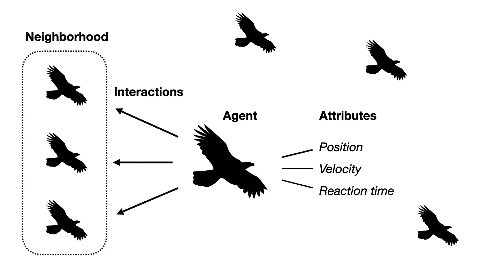
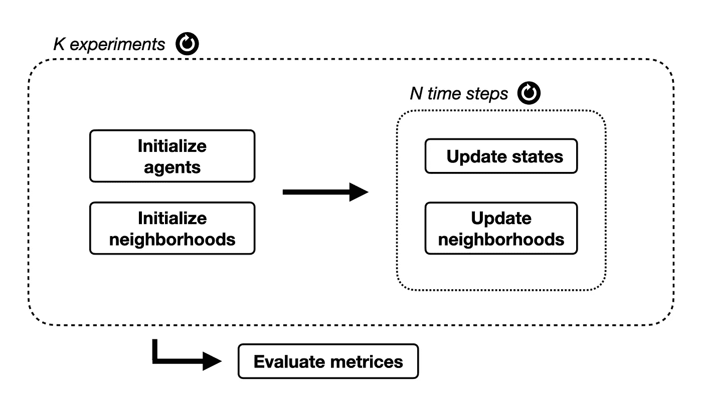

# 利用基于代理的模型克服复杂性

> 原文：<https://towardsdatascience.com/overcoming-complexity-with-agent-based-models-5c4cca37cc61?source=collection_archive---------19----------------------->

## 复杂系统

## 基于代理的模型初学者指南:它们如何工作和做什么

在 [Unsplash](https://unsplash.com?utm_source=medium&utm_medium=referral) 上由 [James Wainscoat](https://unsplash.com/@tumbao1949?utm_source=medium&utm_medium=referral) 拍摄

这是一个晴朗的秋日下午。

你坐在长椅上享受着一天中最后一缕温暖的阳光。

在远处你可以看到一大群鸟。他们正在表演艺术舞蹈，在空中画出令人印象深刻的图形。

你可能会开始怀疑:这是怎么回事？整个鸟群的运动如此复杂，它们是如何从每个个体的行为中浮现出来的？

在我们的日常生活中，我们被复杂的系统所包围。复杂系统是一个由许多部分相互作用、相互影响的系统。一个例子是大城市的交通。汽车相互碰撞，这可能导致事故或交通堵塞。交通灯、人行横道和建筑工地与汽车相互影响。它们可能会影响交通的流向和地点。一个交通灯周期的微小变化可能对大范围内的交通流量产生重大影响。

如果我们想写下一个方程式来计算某条街道的交通流量，这几乎是不可能的。很难将所有的相互作用纳入分析方程。然而，每辆车的行为很容易建模。它根据前面的汽车和交通标志遵守严格的规则。如果我们能够精确地模拟城市中的一些单独的汽车，我们就可以预测交通标志的变化在高峰时间的某一点会产生什么影响。

这就是基于主体的建模思想。

**在这篇文章中，我们将探索基于代理的模型是什么，它们是如何工作的，以及它们是如何建立的。**

对于一个动手的例子，你可以看看这个关于一个基于代理的疫情模型的帖子:

</modelling-a-pandemic-eb94025f248f>  

## 基于代理的模型的目标是什么？

通过一个基于主体的模型，我们旨在模拟一个复合的、自浮现的行为。系统的动态太复杂，无法在全局范围内描述，但在局部范围内很容易理解。对于一个城市的高峰时间交通，很难将所有的相互作用作为一个整体来描述。然而，我们很好地掌握了赛车在这个系统中遵循的具体规则。同样，把一整群鸟的形状放进一个等式也很难。但是凭直觉，我们可以粗略地描述一只鸟可能遵循的规则。

[晒帕尔](https://unsplash.com/@shaipal?utm_source=medium&utm_medium=referral)在 [Unsplash](https://unsplash.com?utm_source=medium&utm_medium=referral) 上的照片

能够精确地模拟一个复杂的系统可能会改变游戏规则。如果我们有一个城市交通的模型，我们可以研究限速的变化如何影响高峰时间的交通堵塞。基于此，我们可以找到各种情况下的最佳策略。拥有病毒感染传播的准确模型可以帮助决策者找到适当的措施。我们可以研究关闭学校或取消航班是否能有效阻止疾病的传播。

基于主体的模型不仅在调查外部干扰对系统结果的影响方面有用。他们也可以帮助**理解可能导致特定自我浮现行为的基本原则**。对于复杂系统中出现的某种动态，必须满足特定的条件。在我们的模拟中，我们可以通过将模拟的动态与现实进行比较来隔离这些条件。例如，通过模拟个人的社会行为，我们可以研究利他主义和合作可能出现的条件。

## 基于代理的模型的基本要素

大多数基于代理的模型都有相似的核心结构和几个必要的组件。

首先我们需要**代理**。代理是模型中个体的基本类型。这些可能是交通模型中的汽车司机、金融市场模型中的交易员、群体模拟中的鸟类、网络模型中的数据包、森林生长模拟中的树木或细胞自动机中的细胞。基于代理的模型可以由几种类型的代理组成。例如，生态系统的模拟可以模拟植物和动物。交通模拟可以将汽车和行人视为代理。

典型地，代理有某些**属性**来描述他们当前的状态。我们的鸟群模型中的鸟可能有位置和速度。疫情模型中的个体应该具有某种健康状态。代理的属性集试图只表示所需行为所必需的信息。在建立疫情模型时，个人的年龄或社会地位可能是一个值得考虑的属性。然而，个人的鞋码可能不是直接感兴趣的。大量属性可能会给模拟带来异构性，同时增加其复杂性。这是一个需要管理的权衡。

最重要术语的概述。由作者创建的图形。

基于代理的模型的关键部分是代理之间的**交互**。为此，代理需要一个特定的**更新方案，**一组在与其他代理交互时如何更新其状态的规则。在交通模拟的情况下，这可能意味着如果当前代理前面的汽车太靠近，就要刹车并减速。与互动相关的一个重要概念是邻居。

**邻域**定义了代理与之交互的组。对于鸟群模拟，鸟的邻域可能是离它最近的鸟。在疫情模式中，可能是一群朋友和同事。有几种方法可以在基于代理的模型中实现邻域。最简单的方法之一是在网格上排列代理，并允许代理与 4-/或 8-邻域交互，这意味着网格上 4 或 8 个最近的代理。通常这已经是引入空间异质性的合理方式。

最后，我们想要定义一些可观察的，或**度量，**量化我们模拟的行为。在交通模拟的情况下，这可能是特定点的交通流量。对于疫情模型，我们可能对任何给定时间点的感染人数感兴趣。

## 这一切是如何协同工作的

照片由 [Xavier von Erlach](https://unsplash.com/@xavier_von_erlach?utm_source=medium&utm_medium=referral) 在 [Unsplash](https://unsplash.com?utm_source=medium&utm_medium=referral) 上拍摄

我们发现，对于基于代理的模型，我们需要具有属性的代理以及代理之间的交互。此外，我们需要一组指定如何更新代理状态的更新规则。现在，我们想知道如何将这些成分放在一起，根据我们的模型进行模拟。

基于代理的模型是随时间变化的动态模型。为了模拟这种行为，我们将模拟运行为一系列离散的**时间步长**。

时间步长是模拟中最小的进度步长。在每个时间步中，代理及其邻域的状态可以根据指定的规则进行更新。请注意，时间步长不一定代表时间，但可以解释为整个动力学中的进展步长。

这些渐进步骤的大小应该根据你所期望的动态来合理选择。如果我们想模拟交通堵塞，一分钟的时间步长可能太长了，因为如果交通灯变成红色，司机需要在几秒钟内做出反应。对于模拟疫情来说，秒的时间步长可能太精细了，因为动力学是在天的尺度上发生的。

在模拟的最开始，我们需要为代理的属性和邻域设置初始值。模拟的结果可能很大程度上取决于代理的初始状态。因此，用不同的初始化运行几个实验通常是有用的。这一程序使我们能够量化模拟中涉及的一些不确定性。

一个典型的基于 agent 模型的工作流。由作者创建的图形。

## 开始简单

当构建基于代理的模型时，模型的复杂度应该尽可能低。同时，它需要尽可能高，以实现所需的动态特性。如果模拟有太多的超参数，可能很难调整它们以获得所需的动态特性。当构建交通模拟时，我们不会开始模拟所有不同种类的汽车和卡车。我们宁愿从尽可能简单的开始，找出一个最小的设置，导致最基本的动力学。

从简单开始的一个优点是，对于一个简单的设置，可能存在一个解析解。为了模拟疫情，我们可能希望从一组同质的个体开始。在每个时间步，他们中的每一个都有一定数量的*随机*触点。每次接触都有被感染的可能。在这种情况下，产生的动力学也可以通过一组微分方程来建模。这就是所谓的 SIR 模型，它有一个众所周知的解析解。我们可以使用这个解决方案作为基准来验证我们的简单模型，然后进一步增加复杂性。

照片由 [**蒂姆·莫斯霍尔德**](https://www.pexels.com/@timmossholder?utm_content=attributionCopyText&utm_medium=referral&utm_source=pexels) 发自 [**派克斯**](https://www.pexels.com/photo/photo-of-green-and-black-lights-974316/?utm_content=attributionCopyText&utm_medium=referral&utm_source=pexels)

假设混合良好的同质个体具有随机相互作用的设置被称为**平均场近似**。这是传染病模型或社会行为的一种常见近似。在这种特殊情况下，我们通常可以将系统描述为一个整体，而不需要考虑每个个体。这通常允许找到直接的解析解。如果我们把交通模拟简化到足够的程度，我们可以用一个抽象的交通流来描述动态，而不是分别考虑每辆车。这些类型的近似是我们模拟的重要锚点。它允许我们将基于代理的观点与整个系统的描述联系起来。

## 添加异构性

顾名思义，平均场近似只是一种近似。最终，我们对更复杂的行为感兴趣。基于代理的模型的全部要点是我们想要考虑单个代理。我们不想对系统进行全局描述。因此，从一个简单的模型开始，我们需要增加复杂性，或者异构性。这可以通过多种方式实现。

通过考虑更多不同的个体，可以将异质性引入系统。在疫情模拟中，我们可以开始为代理添加年龄分布，并根据代理的年龄更改更新规则。对于交通模拟，我们可能想要引入具有不同加速速度的不同类型的汽车和具有不同驾驶风格的不同驾驶员。

可以引入异质性的另一个要点是交互。从混合良好的随机互动，我们可以实现一个社会结构到行为模型。如果代理与随机联系人合作，或者总是与同一组联系人合作，通常会产生巨大的差异。

例如，在博弈论中，自私个体之间合作的出现是一个长期存在的问题。很难用一个混合均匀的社会的平均场近似来解释。然而，通过给代理人群体增加一个社会结构，自我维持的合作者群体可能会出现。

模型的**复杂性是一个需要考虑的重要属性。大多数时候，我们无法在一对一的环境中模拟现实。我们需要做出假设和近似。建立一个成功的基于主体的模型的关键是仔细考虑模拟中需要实现的细节和可以省略的细节。**

## 检验和确认

任何模型的一个重要部分是适当的确认和验证。我们已经讨论过，从一个可能存在解析解的简单案例开始，是验证模型总体设置的一个很好的方法。对于更复杂的模型，我们需要将模型与真实世界的数据进行比较。构建有意义的指标在这一过程中起着关键作用。例如，对于鸟群模拟，我们可以跟踪鸟类之间的平均距离，并将其与真实世界的观察结果进行比较。在交通模拟的例子中，我们可以在模拟和真实世界数据之间的某些点比较交通流量。

在现实世界中观察到的自浮现行为的发生也可以用于验证模型。观察高交通流量的交通堵塞将是交通模拟中的期望结果。

# 结论

基于主体的模型提供了通过分别模拟每个个体来描述复杂行为的可能性。难以全面描述的问题通常可以在参与实体的级别上进行局部描述。在模拟的帮助下，我们可以对全球行为进行建模。

基于主体的模型在从生物学、流行病学、经济学、社会科学、博弈论到网络和通信理论的广泛领域都有应用。基于代理的模型通常由一组具有特定属性的代理、一组更新规则和交互组成。在许多模型中，每一个代理的邻居，也就是交互作用发生的地方，在系统的动态中扮演着重要的角色。

尽管基于代理的模型在克服复杂性方面取得了成功，但在许多领域，它们仍然只是填补了一个空白，并且通常还不被认为是标准方法。我希望这篇文章能启发你解决复杂性问题，并自己建立一个基于代理的模型！

如果你有兴趣进入贝叶斯数据分析的世界，看看下面的帖子:

</how-to-become-a-bayesian-fcaaf6302d68> 