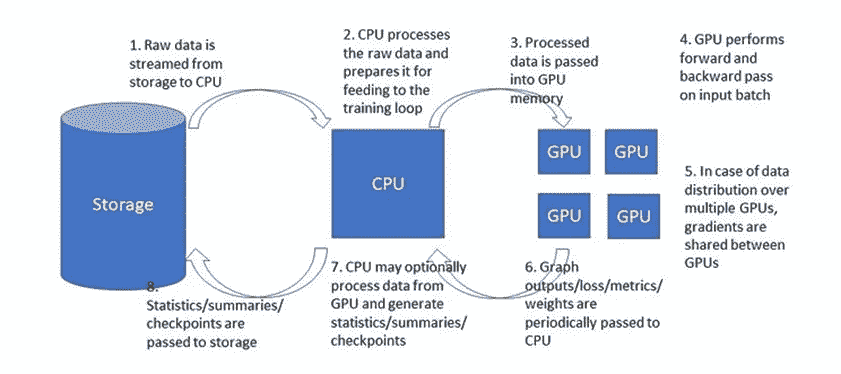
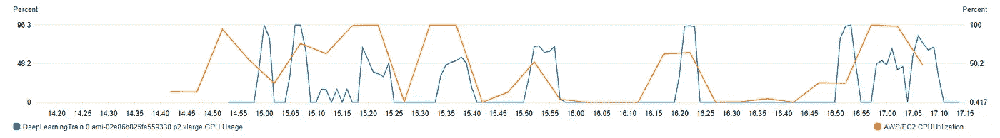
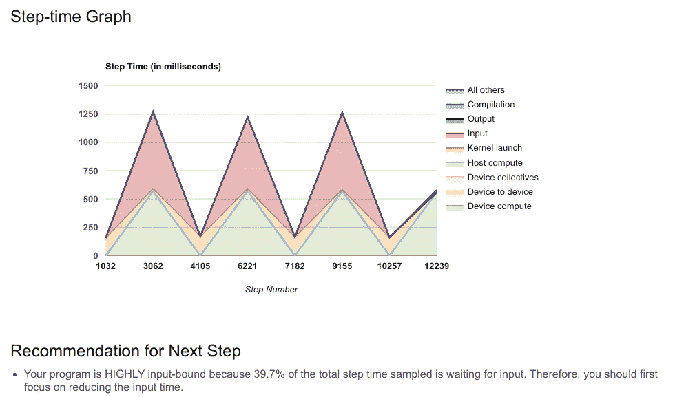
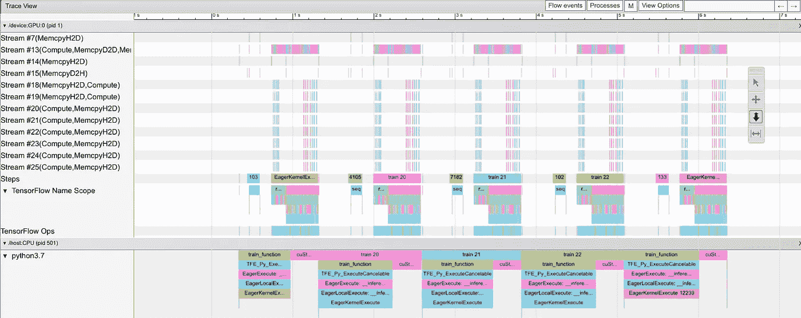
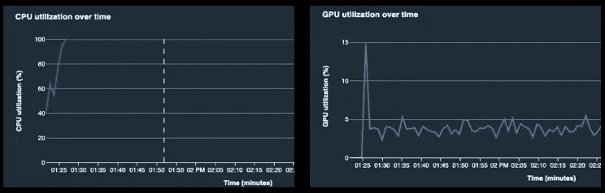
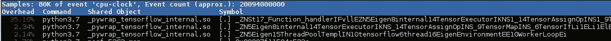
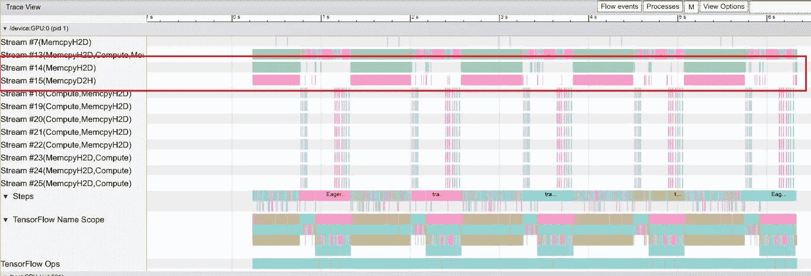
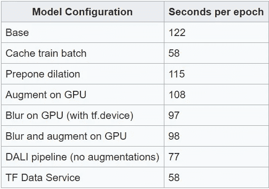

# 利用 TensorFlow 数据服务、NVIDIA DALI 和其他方法克服数据预处理瓶颈

> 原文：<https://towardsdatascience.com/overcoming-data-preprocessing-bottlenecks-with-tensorflow-data-service-nvidia-dali-and-other-d6321917f851?source=collection_archive---------12----------------------->

## [理解大数据](https://towardsdatascience.com/tagged/making-sense-of-big-data)

## 最大限度地提高培训资源利用率，加速学习，节省资金


你能找到瓶颈吗？由[维斯瓦纳特·穆达达](https://unsplash.com/@vcapture?utm_source=medium&utm_medium=referral)在 [Unsplash](https://unsplash.com?utm_source=medium&utm_medium=referral) 上拍摄

在前一篇[帖子](/tensorflow-performance-analysis-314b56dceb59)中，我谈到了剖析 DNN 培训课程运行时性能的重要性，这是充分利用您的培训资源、加速您的培训并节省资金的一种方式。我描述了一个典型的培训管道(见下图)，回顾了一些潜在的性能瓶颈，并调查了一些可用于识别这些瓶颈的工具。在这篇文章中，我想阐述一个更常见的性能瓶颈，CPU 瓶颈，以及克服它的一些方法。更具体地说，我们将讨论数据预处理管道中出现的瓶颈，以及克服它们的方法。

在这篇文章的上下文中，我们将假设我们正在使用 *TensorFlow* ，具体来说就是 *TensorFlow 2.4* ，在 *GPU* 设备上训练一个*图像处理*模型，但是内容大部分都与其他训练框架、其他类型的模型和其他训练加速器相关。



样本培训渠道(按作者)

# 数据预处理瓶颈

当由于一个或多个 CPU 达到最大利用率而导致 GPU 资源利用不足时，就会出现 CPU 瓶颈。在这种情况下，GPU 在等待 CPU 传入训练数据时将部分空闲。这是不希望的状态。因为 GPU 通常是系统中最昂贵的资源，所以你的目标应该是最大化它的利用率。在不涉及太多技术细节的情况下，当在 CPU 上执行的数据预处理的“量”与模型在 GPU 上执行的计算的“量”之间的比率大于整体 CPU 计算能力与整体 GPU 计算能力之间的比率时，通常会出现 CPU 瓶颈。例如，如果您的 CPU 核心和 GPU 都得到最大限度的利用，然后您升级到更强大的 GPU，或者降级到具有更少 CPU 核心的系统，您的训练运行时性能将受到 CPU 的限制。

很自然，您的第一反应会是简单地切换到一台 CPU 与 GPU 计算比率更合适的机器。但是，可悲的是，我们大多数人都没有这种自由。虽然云服务，如[亚马逊 SageMaker](https://aws.amazon.com/sagemaker/) ，提供了各种[训练实例类型](https://aws.amazon.com/sagemaker/pricing/)，具有不同的 CPU-计算与 GPU-计算比率，但你可能会发现它们都不太适合你的特定需求。

假设您被现有的系统所困扰，您可以采取哪些措施来解决您的性能瓶颈并加快培训？

在接下来的部分中，我们将提出解决预处理数据瓶颈的四个步骤。

1.  **确定任何可以转移到数据准备阶段的操作**
2.  **优化数据预处理流水线**
3.  **在 GPU 上执行一些预处理步骤**
4.  **使用 TensorFlow 数据服务将一些 CPU 计算卸载到其他机器上**

为了方便我们的讨论，我们将基于 Resnet50 构建一个玩具示例。

# 示例使用案例

在下面的代码块中，我使用 TensorFlow 的内置 [Resnet50](https://www.tensorflow.org/api_docs/python/tf/keras/applications/ResNet50) 应用程序构建了一个模型。我添加了一个相对较重的数据预处理管道，包括膨胀、模糊过滤和一些张量流预处理层。(参见[文档](https://www.tensorflow.org/guide/keras/preprocessing_layers)了解使用此类层的优势。)

```
**import** **tensorflow** **as** **tf
import** **tensorflow_addons** **as** **tfa
from** **tensorflow.keras.applications.resnet50** **import** **ResNet50**
**from** **tensorflow.keras.layers.experimental** **import** **preprocessing****def** get_dataset(batch_size):
    *# parse TFRecord*
    **def** parse_image_function(example_proto):
        image_feature_description = 
           {'image': tf.io.FixedLenFeature([], tf.string),
            'label': tf.io.FixedLenFeature([], tf.int64)}
        features = tf.io.parse_single_example(
                      example_proto, image_feature_description)
        image = tf.io.decode_raw(features['image'], tf.uint8)
        image.set_shape([3 * 32 * 32])
        image = tf.reshape(image, [32, 32, 3])
        label = tf.cast(features['label'], tf.int32)
        **return** image, label *# dilation filter*
    **def** dilate(image, label):
        dilateFilter = tf.zeros([3, 3, 3], tf.uint8)
        image = tf.expand_dims(image, 0)
        image = tf.nn.dilation2d(
                    image, dilateFilter, strides=[1, 1, 1, 1],
                    dilations=[1, 1, 1, 1],
                    padding='SAME', 
                    data_format='NHWC')
        image = tf.squeeze(image)
        **return** image, label *# blur filter*
    **def** blur(image, label):
        image = tfa.image.gaussian_filter2d(image=image,
                            filter_shape=(11, 11), sigma=0.8)
        **return** image, label *# rescale filter*
    **def** rescale(image, label):
        image = preprocessing.Rescaling(1.0 / 255)(image)
        **return** image, label *# augmentation filters*
    **def** augment(image, label):
        data_augmentation = tf.keras.Sequential(
           [preprocessing.RandomFlip("horizontal"),
            preprocessing.RandomRotation(0.1),
            preprocessing.RandomZoom(0.1)])
        image = data_augmentation(image)
        **return** image, label autotune = tf.data.experimental.AUTOTUNE
    options = tf.data.Options()
    options.experimental_deterministic = **False**
    records = tf.data.Dataset.list_files('data/*', 
                            shuffle=**True**).with_options(options)
    *# load from TFRecord files*
    ds = tf.data.TFRecordDataset(records, 
                 num_parallel_reads=autotune).repeat()
    ds = ds.map(parse_image_function, num_parallel_calls=autotune)
    ds = ds.map(dilate, num_parallel_calls=autotune)
    ds = ds.map(blur, num_parallel_calls=autotune)
    ds = ds.batch(batch_size)
    ds = ds.map(rescale,num_parallel_calls=autotune)
    ds = ds.map(augment, num_parallel_calls=autotune)
    ds = ds.prefetch(autotune)
    **return** ds**if** __name__ == "__main__":    
    model = ResNet50(weights=**None**,
                     input_shape=(32, 32, 3),
                     classes=10)
    model.compile(loss=tf.losses.SparseCategoricalCrossentropy(),
                  optimizer=tf.optimizers.Adam())
    dataset = get_dataset(batch_size = 1024)
    model.fit(dataset, steps_per_epoch=100, epochs=10))
```

原始数据输入存储在 [TFRecord](https://www.tensorflow.org/tutorials/load_data/tfrecord) 文件中，这些文件是我从 [CIFAR-10](https://www.cs.toronto.edu/~kriz/cifar.html) 数据集创建的，(使用[这个](https://github.com/aws/amazon-sagemaker-examples/blob/master/sagemaker-debugger/tensorflow_profiling/demo/generate_cifar10_tfrecords.py)脚本)。

我创建这个例子是为了人为地制造一个性能瓶颈。在任何情况下，我都不建议在实际训练中使用它。

所有测试都是在使用[亚马逊深度学习 AMI](https://aws.amazon.com/machine-learning/amis/) 的[亚马逊 ec2](https://aws.amazon.com/ec2/?ec2-whats-new.sort-by=item.additionalFields.postDateTime&ec2-whats-new.sort-order=desc) [p2.xlarge](https://aws.amazon.com/ec2/instance-types/p2/) 实例类型上运行的。

# 识别瓶颈

有许多不同的工具和技术可用于评估培训会话的运行时性能，以及识别和研究输入管道瓶颈。让我们回顾一下其中的几个:

## 系统度量

首先要检查的是系统资源利用率。有许多不同的方法可以做到这一点。[Linux*top*命令显示 CPU 利用率。要查看每个 CPU 内核的利用率，请在 *top* 运行时键入‘1’。要衡量 GPU 利用率，可以使用](https://man7.org/linux/man-pages/man1/top.1.html) [nvidia-smi](https://developer.download.nvidia.com/compute/DCGM/docs/nvidia-smi-367.38.pdf) 。在亚马逊 EC2 培训时，可以使用[亚马逊 CloudWatch](https://aws.amazon.com/cloudwatch/) 来监控[系统指标](https://docs.aws.amazon.com/AWSEC2/latest/UserGuide/viewing_metrics_with_cloudwatch.html)。虽然默认情况下不包含 GPU 指标，但是您可以使用[GPU on 实用程序](https://docs.aws.amazon.com/dlami/latest/devguide/tutorial-gpu-monitoring-gpumon.html)来添加这些指标。下面是几个不同实验中捕获的 CPU 和 GPU 利用率的示例图。



亚马逊 CloudWatch 中的性能指标(按作者)

在我们上面介绍的用例中，报告的平均 GPU 利用率在长时间空闲时不到 50%。同时，CPU 的利用率很高，一些内核达到了最大利用率。

## 性能分析器

要深入到下一个细节层次，了解培训是如何进行的，您可以使用一个性能分析器。

**TensorFlow Profiler:** 内置的 [TensorFlow profiler](https://www.tensorflow.org/guide/profiler) 包括丰富的性能分析，特别是用于[分析输入管道性能的工具](https://www.tensorflow.org/guide/data_performance_analysis)。您可以通过安装 [TensorBoard profile 插件](https://pypi.org/project/tensorboard-plugin-profile/)来查看使用 [TensorBoard](https://www.tensorflow.org/tensorboard/get_started) 的情况。启用 profiler 的一种方法是使用 [TensorBoad 回调](https://www.tensorflow.org/api_docs/python/tf/keras/callbacks/TensorBoard?version=nightly)对训练循环进行编程。

```
*# program the callback to capture steps 20-24*
cb = tf.keras.callbacks.TensorBoard(
        log_dir='/tmp/profile', profile_batch='20,24',
        histogram_freq=0, write_images=**False**)
model.fit(dataset, steps_per_epoch=100, epochs=10, callbacks=[cb])
```

下面是我们用例的概要分析页面，其中数据输入瓶颈非常明显。



tf profiler —概览页面(作者使用 TensorBoard)

trace-viewer 工具允许您深入到管道执行的细节，并研究 CPU 和 GPU 之间的数据流。在我们的示例中，由于数据输入瓶颈，您可以清楚地看到 GPU 长时间空闲。



tf profiler — trace-viewer(作者使用 TensorBoard)

**Amazon SageMaker 调试器:**如果您正在 [Amazon SageMaker](https://aws.amazon.com/sagemaker/) 环境中进行培训，您可以利用内置于 Amazon SageMaker 调试器中的[分析特性。下面是一个输入管道中的严重瓶颈如何出现在](https://aws.amazon.com/blogs/machine-learning/identifying-training-bottlenecks-and-system-resource-under-utilization-with-amazon-sagemaker-debugger/) [Amazon SageMaker Studio](https://aws.amazon.com/sagemaker/studio/) 中的例子。



亚马逊 SageMaker Studio 中的资源利用(按作者)

Linux 概要分析器:通用的 Linux 性能概要分析器通常也有助于分析训练瓶颈。例如，使用 [Linux perf 实用程序](https://perf.wiki.kernel.org/index.php/Main_Page)，我们能够看到我们的 CPU 在一个内部线性代数函数上花费了大量时间:



Linux 性能捕获(按作者)

## 吞吐量测量

既然我们分析的目标是加速训练运行时间，那么很自然地我们会使用这个指标来衡量我们的表现。

在我们的例子中，我们将使用单个(100 步)时期的平均运行时间作为我们的主要性能度量，并测量模型的不同变化如何影响这个值。上述模型单个历元的平均运行时间为 **122 秒**。

如果没有数据输入瓶颈，测量运行时的一个有用技术(这里描述为)是缓存第一个处理的输入批，并对所有后续步骤使用相同的缓存批。这实质上关闭了预处理流水线，并使我们能够计算理想的纪元运行时间。

为了实现这一技术，我们只需在数据集创建结束时添加以下代码行:

```
ds = ds.take(1).cache().repeat()
```

通过将这种技术应用到我们的例子中，我们能够将运行时间减少到 **58 秒**。换句话说，如果不是因为数据输入的瓶颈，我们可以将训练速度提高两倍以上。

在接下来的部分中，我们将介绍一些解决输入管道瓶颈的建议步骤。我们将在我们的玩具示例中演示一些步骤，记住我们刚刚计算的目标运行时间，每个时期 **58 秒**。

# 将操作放在数据准备阶段

为了解决数据预处理瓶颈，要做的第一件事是识别任何可以优先进入原始数据记录创建阶段的操作。我们进入数据创建阶段的操作越多，我们就越能在训练期间释放 CPU 周期。以确定性方式(没有随机成分)、不依赖于超参数并且不会过度增加数据大小的任何操作都是优势的良好候选。在我们的玩具示例中，膨胀操作(假设它不依赖于超参数)符合这个标准。因此，我们要做的第一件事是停止膨胀操作，并假设 TFRecords 包含已经经过适当膨胀的图像数据。

在我们的具体实现中，模糊过滤器可能也是优势的良好候选，但由于在大多数情况下，模糊是随机应用的，我们将把它留在这里。

通过去除膨胀操作，我们的运行时间减少到每个时期 115 秒。这比我们的起始值**每周期 122 秒**要小，但是要达到我们的目标**每周期 58 秒**我们还有很长的路要走。

需要注意的一点是，某些操作可能会更改数据记录的大小，因此可能会影响数据集的整体大小以及训练期间的网络流量(如果训练集是远程存储的)。如果您选择优先处理那些会过度增加数据大小的操作，您可能会冒用一个瓶颈替换另一个瓶颈的风险，即网络 IO 或数据加载瓶颈。

# 优化数据预处理管道

一旦我们将尽可能多的操作转移到数据创建阶段，第二步就是确定优化剩余管道性能的方法。

## 流水线调整

通常，对输入管道设置进行一些小的调整可以降低性能开销。以下是一些你可以尝试的事情:

1.  如果您有多个相对较小的[数据集映射](https://www.tensorflow.org/api_docs/python/tf/data/Dataset?version=nightly#map)函数，请考虑将它们组合成一个映射函数。
2.  相反，如果您有一个非常大的数据集映射函数，可以考虑将它分成两个或更多的小函数，以便更好地利用内置的并行调用支持。
3.  寻找可以在批处理后应用的操作，而不是每个记录。(在我们的示例中，模糊函数理论上可以应用于训练批次，但由于它通常以随机方式应用，因此我们将保留每个记录的模糊函数。)
4.  尽可能使用低精度类型。推迟铸造到更高的精度到管道的末端。
5.  如果您的管道包含 [tf.numpy_function](https://www.tensorflow.org/api_docs/python/tf/numpy_function) 或 [tf.py_function](https://www.tensorflow.org/api_docs/python/tf/py_function) ，请考虑改用 TensorFlow 原语。

## CPU 优化和扩展

确保您的 TensorFlow 二进制文件被配置(和编译)为充分利用您的 CPU 和 CPU 扩展。例如，如果您使用现代 x86 ISA CPU，(如 Intel 或 AMD)，请确保使用经过优化的 TensorFlow 二进制文件，以使用 CPU 的高级矢量扩展(如 [AVX2](https://en.wikipedia.org/wiki/Advanced_Vector_Extensions) )。总的来说，英特尔提供了各种各样的二进制文件，专门针对在英特尔 CPU 上运行进行了优化，包括[英特尔至强](https://anaconda.org/intel/intelpython3_full)和 [TensorFlow-mkl](https://software.intel.com/content/www/us/en/develop/tools/frameworks.html) 。

请注意，使用基于云的解决方案进行培训的优势之一是，云学习环境(大概)被配置为充分利用云系统资源。

## CPU 负载平衡

当您在多 CPU 内核系统中遇到 CPU 瓶颈时，您可能会发现，虽然一个或多个 CPU 内核处于完全利用状态，但其他内核却没有。这其实挺常见的。您可以尝试的一件事是改善 CPU 之间的负载平衡，从而提高整体 CPU 利用率。您可以尝试使用[TF . config . set _ logical _ device _ configuration](https://www.tensorflow.org/api_docs/python/tf/config/set_logical_device_configuration)API 将 CPU 计算分成多个逻辑设备，并使用 tf.device API 指定每个操作应该在哪里运行。您还可以尝试通过使用 [tf.data.Dataset.map](https://www.tensorflow.org/api_docs/python/tf/data/Dataset#map) 函数的 num_parallel_calls 参数的不同选项来改善负载平衡，(而不是依赖 TensorFlow 的自动调优功能)。在任何情况下，请记住，这可能是一个乏味的、令人痛苦的工作，即使对您的模型进行最轻微的更改，也可能需要重新计算负载平衡。

# 将操作卸载到 GPU

在我们的例子中，您可能会发现，即使您已经尝试了所有将操作放在数据创建阶段并优化 CPU 代码的方法，您仍然会面临数据预处理瓶颈。下一个要考虑的选项是通过将一些预处理操作转移到 GPU 上来修改 CPU 和 GPU 之间的负载平衡。这种方法的缺点是，我们几乎肯定会增加 GPU 步骤的运行时间。此外，由于我们正在增加 GPU 上运行的计算图形的大小，我们可能需要通过运行较小的批处理来释放一些 GPU 内存。因此，我们很可能无法实现上面计算的目标吞吐量。但是如果它减少了总的火车时间，那么它是完全值得的。让我们探索几种将预处理操作卸载到 GPU 上的方法。

## 将预处理操作推迟到 GPU

在大多数情况下，减轻 CPU 负担的最佳方式是将预处理管道末端执行的操作转移到 GPU。通过瞄准这些“尾部”操作，而不是流水线中间的操作，我们避免了 GPU 和 CPU 之间的数据传输开销。如果“尾部”操作是在模型输入上执行的，我们可以将它们放在模型的头部。如果它们是在标签数据上执行的，我们可以在应用实际损失之前修改我们的损失函数来执行这些操作。

在我们的示例中，我们已经从输入管道中移除了增强，而是将它们应用于 GPU 计算图的开头:

```
data_augmentation = tf.keras.Sequential(
        [preprocessing.RandomFlip("horizontal"),
         preprocessing.RandomRotation(0.1),
         preprocessing.RandomZoom(0.1)])inputs = tf.keras.Input(shape=(32, 32, 3))
*# Augment images*
x = data_augmentation(inputs)
*# Add the rest of the model*
outputs = tf.keras.applications.ResNet50(weights=**None**,
                      input_shape=(32, 32, 3), classes=10)(x)
model = tf.keras.Model(inputs, outputs)
```

通过应用这一改变，我们能够将运行时间减少到每个时期 108 秒。

## 用 [tf.device](https://www.tensorflow.org/api_docs/python/tf/device)

通过用一个[*TF . device*](https://www.tensorflow.org/api_docs/python/tf/device)*('/device:GPU:0 ')*语句包装操作，我们可以强制某些操作在 GPU 上运行。这种方法的缺点是，它需要在 GPU 设备之间来回传输数据。

在我们的例子中，我们选择将这种技术应用于模糊函数，修改如下:

```
**def** blur(image, label):
    **import** **tensorflow_addons** **as** **tfa**
    **with** tf.device('/device:GPU:0'):
        image = tfa.image.gaussian_filter2d(image=image,
                           filter_shape=(11, 11), sigma=0.8)
        **return** image, label
```

当以这种方式在 GPU 上运行模糊功能时，同时将增强功能留在 CPU 上，我们获得了 97 秒的纪元运行时间**。当结合两种技术时，epoch 运行时间是 **98 秒**。**

**使用 TensorFlow profiler trace-viewer，我们可以看到 tf.device 技术如何增加 CPU 和 GPU 之间的数据流量:**

****

**使用 tf.device 卸载到 GPU—TF profiler 跟踪查看器(作者使用 TensorBoard)**

**通过将本实验中突出显示的流与上面 trace-viewer 捕获中的相同流进行比较，我们看到进出 GPU 的内存拷贝明显更多。我们还看到，GPU 要活跃得多。**

**验证模糊函数确实在 CPU 上运行的另一种方法是设置[TF . debugging . set _ log _ device _ placement(True)](https://www.tensorflow.org/api_docs/python/tf/debugging/set_log_device_placement)。您可以运行这个示例，在 CPU 上使用模糊函数运行一次，在 GPU 上使用模糊函数运行一次，看看它如何影响日志设备放置例程的输出。**

## **女娲大理**

**[NVIDIA DALI](https://docs.nvidia.com/deeplearning/dali/user-guide/docs/#)是一个用于构建高度优化的预处理管道的框架。特别是，使用 NVIDIA DALI，您可以对部分管道或整个管道进行编程，以在 GPU 上运行。DALI 管道由 DALI 运营公司建造。DALI 附带了一个[支持的操作](https://docs.nvidia.com/deeplearning/dali/user-guide/docs/supported_ops.html)列表，以及用于创建[定制操作](https://docs.nvidia.com/deeplearning/dali/user-guide/docs/examples/custom_operations/index.html)的 API。使用 [TensorFlow DALI 插件](https://docs.nvidia.com/deeplearning/dali/user-guide/docs/plugins/tensorflow_plugin_api.html)，DALI 管道可以用符合 [tf.data.Dataset](https://www.tensorflow.org/api_docs/python/tf/data/Dataset) API 的 [DALIDataset](https://docs.nvidia.com/deeplearning/dali/user-guide/docs/plugins/tensorflow_plugin_api.html#nvidia.dali.plugin.tf.DALIDataset) 包装，如此处[所示](https://docs.nvidia.com/deeplearning/dali/user-guide/docs/examples/frameworks/tensorflow/tensorflow-dataset.html)。此外，DALI 支持从 TFRecord 文件加载，如下图[所示](https://docs.nvidia.com/deeplearning/dali/user-guide/docs/examples/general/data_loading/dataloading_tfrecord.html)。不幸的是，在撰写本文时，对 DALI 的文档支持仅限于[版本 1 兼容的 TensorFlow](https://www.tensorflow.org/api_docs/python/tf/compat/v1) 。(那些读过我以前博客的人，应该已经知道我对使用遗留代码的感受。)另外，NVIDIA DALI 是为 NVIDIA GPUs 设计的。它不会在其他机器学习加速器上运行。另一个考虑是分布式培训。虽然 DALI 确实支持[多 gpu 训练](https://docs.nvidia.com/deeplearning/dali/user-guide/docs/examples/frameworks/tensorflow/tensorflow-dataset-multigpu.html)，但根据您实现分布式训练的方式(例如，使用 [Horovod](https://horovod.readthedocs.io/en/stable/running_include.html) 或 [TensorFlow 分布策略，](https://www.tensorflow.org/api_docs/python/tf/distribute/Strategy?version=nightly)使用 [model.fit()](https://www.tensorflow.org/api_docs/python/tf/keras/Model?version=nightly#fit) 或自定义训练循环)，集成 DALI 管道会在稍微困难和困难得多之间变化。如果你对使用最新的 TensorFlow 功能有强烈的感觉，或者如果你希望你的代码与其他加速器兼容，( [AWS Tranium](https://aws.amazon.com/machine-learning/trainium/) ， [Habana Gaudi](https://aws.amazon.com/ec2/instance-types/habana-gaudi/) ， [TPU](https://cloud.google.com/tpu) 等。)，或者如果将您的管道转换为 DALI 操作需要大量工作，或者如果您依赖于高级 TensorFlow 分布式培训 API，NVIDIA DALI 可能不是您的正确解决方案。**

**使用 DALI 需要使用 TensorFlow DALI 插件 python 包。安装步骤见[文件](https://docs.nvidia.com/deeplearning/dali/user-guide/docs/installation.html)。在下面的代码块中，我展示了如何将管道从我们的用例转换到 NVIDIA DALI。我省略了一些随机的扩充，因为没有内置的、相应的 DALI 操作。**

```
**from** **nvidia.dali.pipeline** **import** **Pipeline**
**import** **nvidia.dali.ops** **as** **ops**
**import** **nvidia.dali.types** **as** **types**
**import** **nvidia.dali.tfrecord** **as** **tfrec**
**import** **nvidia.dali.plugin.tf** **as** **dali_tf**
**import** **tensorflow.compat.v1** **as** **tf**
tf.disable_eager_execution() **class** **TFRecordPipeline**(Pipeline):
    **def** __init__(self, batch_size, num_threads,
                 device = 'cpu', device_id = 0):
        super(TFRecordPipeline, self).__init__(batch_size,
                                         num_threads,
                                         device_id)
        self.input = ops.TFRecordReader(
             path = ['data/train0.tfrecords'],
             index_path = ['index/train0'],
             features = {
              "image": tfrec.FixedLenFeature((), tfrec.string, ""),
              "label": tfrec.FixedLenFeature([], tfrec.int64,  -1)})
        self.decode = ops.Cast(device=device,dtype=types.UINT8)
        self.reshape = ops.Reshape(device=device,
                                   shape=[32, 32, 3])
        self.cast = ops.Cast(device=device,
                             dtype=types.DALIDataType.INT32)
        self.blur = ops.GaussianBlur(device=device,
                                     window_size=11,sigma=0.8)
        self.iter = 0 **def** define_graph(self):
        inputs = self.input()
        images = self.decode(inputs["image"].gpu())
        images = self.reshape(images)
        images = self.blur(images)/255.
        labels = self.cast(inputs["label"].gpu())
        **return** (images, labels) **def** iter_setup(self):
        **pass** **if** __name__ == "__main__":
    batch_size = 1024
    shapes = ((batch_size, 32, 32, 3),
              (batch_size))
    pipe = TFRecordPipeline(batch_size=batch_size, 
                            num_threads=4, 
                            device='gpu', 
                            device_id=0) **with** tf.device('/gpu:0'):
        *# Create dataset*
        ds = dali_tf.DALIDataset(
            pipeline=pipe,
            batch_size=batch_size,
            output_shapes=shapes,
            output_dtypes=(tf.float32, tf.int32),
            device_id=0)
        model = tf.keras.applications.resnet.ResNet50(
                   weights=**None**, 
                   input_shape=(32, 32, 3), 
                   classes=10)
        model.compile(
             loss=tf.keras.losses.SparseCategoricalCrossentropy(),
             optimizer=tf.keras.optimizers.Adam())
        model.fit(ds, steps_per_epoch=100, epochs=10)
```

**我在 TensorFlow 2.3 中运行脚本(看起来，在撰写本文时，DALI 还没有更新到支持 TensorFlow 2.4)。一个 100 步的时间的结果运行时间是 **77 秒**。虽然这个试验没有包括增强功能，但是很明显 DALI 提供了显著的运行时改进的潜力。**

**正如我上面提到的，将操作卸载到 GPU 可能需要释放一些内存来减少训练批次的大小。事实证明，这在我们的玩具示例中是不需要的。(这可能意味着我们可以从更大的批量开始。)这一发现不一定适用于其他模型，尤其是如果你要确保最大化你的 GPU 内存和批处理大小。**

# **将数据预处理卸载到其他机器上**

**我们探索的最后一个选项是将一些预处理活动卸载到其他机器上。我们将把预处理计算转移到辅助机器的 CPU 核心上，而不是转移到 GPU 上。我们将使用相对较新的 [TensorFlow 数据服务功能](https://www.tensorflow.org/api_docs/python/tf/data/experimental/service)来探索这种方法。在 TensorFlow 版本 2.3 中引入，[TF . data . experimental . service](https://www.tensorflow.org/api_docs/python/tf/data/experimental/service)提供了用于定义执行数据预处理的专用工作机的 API。一个[调度服务器](https://www.tensorflow.org/api_docs/python/tf/data/experimental/service/DispatchServer)负责将预处理任务分配给一个或多个[工作服务器](https://www.tensorflow.org/api_docs/python/tf/data/experimental/service/WorkerServer)，每个工作服务器直接从存储器中加载原始数据，并将处理后的数据发送给 GPU 设备。通过将[TF . data . experimental . service . distribute](https://www.tensorflow.org/api_docs/python/tf/data/experimental/service/distribute)应用到您的数据集，您可以对数据集进行编程，以便在专用工作器上运行所有预处理操作，直到应用点。要使用的工作服务的数量和类型，以及在管道中的什么位置应用服务，应该根据一些考虑因素来确定，例如瓶颈的严重程度、辅助机器的可用性和成本、预处理操作影响数据大小的方式，以及这会如何影响网络流量。例如，如果您选择一台网络带宽较低的远程工作机，并编写一个在该工作机上运行的扩大数据大小的预处理操作，您可能看不到任何性能改进。**

**让我们在玩具示例中演示这个 API 的用法。对于这个演示，我选择了一个单独的辅助 [Amazon EC2 c5.4xlarge](https://aws.amazon.com/ec2/instance-types/c5/) 实例，它具有 16 个 CPU 内核，并使用相同的 [Amazon 深度学习 AMI](https://aws.amazon.com/machine-learning/amis/) 。p2.xlarge 和 c5.4xlarge 之间的通信将使用 [grpc 网络协议](https://en.wikipedia.org/wiki/GRPC)，因此您需要确保两个实例都在一个[安全组](https://docs.aws.amazon.com/vpc/latest/userguide/VPC_SecurityGroups.html)中，该安全组允许相关协议的入站流量，一个来自另一个。**

**在工作设备上，我们运行以下脚本，其中“10.0.1.171”是辅助设备的 ip 地址:**

```
**import** **tensorflow** **as** **tf**
d_config = tf.data.experimental.service.DispatcherConfig(port=5000)
dispatcher = tf.data.experimental.service.DispatchServer(d_config)
w_config = tf.data.experimental.service.WorkerConfig(port=5001,
    dispatcher_address=dispatcher.target.split("://")[1],
    worker_address='10.0.1.171:5001')
worker = tf.data.experimental.service.WorkerServer(w_config)
dispatcher.join()
```

**注意，我们在同一台机器上运行调度服务器和工作服务器。我们还确保将 TFRecord 文件复制到这台机器上，因为工作人员将从这些文件中加载原始数据。在 GPU 机器上，我们对训练脚本进行了如下修改:**

```
autotune = tf.data.experimental.AUTOTUNE
options = tf.data.Options()
options.experimental_deterministic = **False**
records = tf.data.Dataset.list_files('data/*', shuffle=**True**).with_options(options)
ds = tf.data.TFRecordDataset(records, num_parallel_reads=autotune).repeat()
ds = ds.map(parse_image_function, num_parallel_calls=autotune)
ds = ds.map(blur, num_parallel_calls=autotune)
*# use the TensorFlow Data Service*
ds = ds.apply(tf.data.experimental.service.distribute(
      processing_mode="parallel_epochs",
      service='grpc://10.0.1.171:5000'))
ds = ds.batch(batch_size)
ds = ds.map(rescale,num_parallel_calls=autotune)
ds = ds.map(augment, num_parallel_calls=autotune)
ds = ds.prefetch(autotune)
```

**请注意，我们只编写了记录解析和在 worker 上运行的大量模糊函数。批处理和扩充保留在主设备上。**

**运行此设置的结果再好不过了！每个历元的运行时间是 **58 秒**，达到了我们上面为自己设定的目标。通过使用辅助 CPU 设备和 TensorFlow 数据服务来卸载预处理计算，我们已经完全解决了 CPU 瓶颈！事实上，我们发现在这种情况下，平均 GPU 利用率提高了 97%左右。**

# **摘要**

**下表总结了我们对玩具 resnet50 模型的研究结果:**

****

**在本帖中，我们调查了解决数据输入管道中性能瓶颈的许多方法。特别是，我们展示了如何使用 TensorFlow 数据服务来彻底解决这一瓶颈。这项调查并不全面。很可能会有其他可用的工具和技术。虽然我们已经演示了如何将这些技术应用于玩具 Resnet50 模型，但它们的影响肯定会因模型和数据集而异。请不要犹豫，分享您自己的工具、技术和经验。**