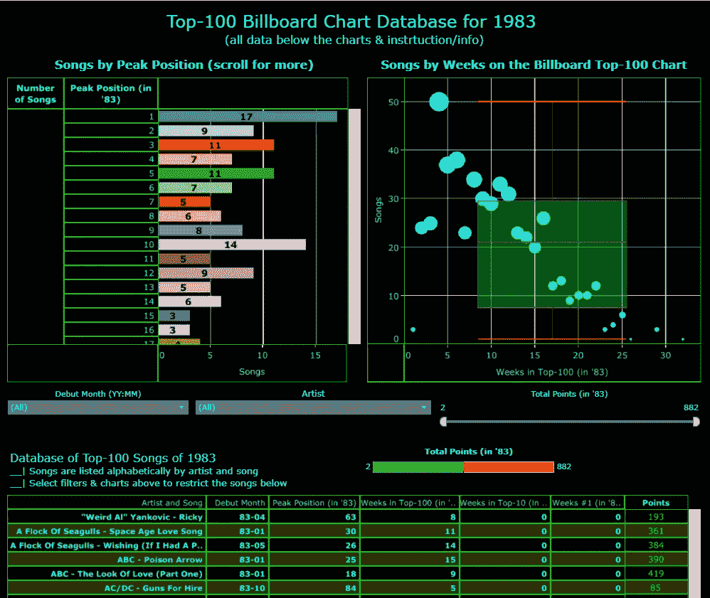
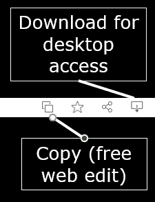

# 克服数据可视化冒名顶替综合症

> 原文：<https://towardsdatascience.com/overcoming-data-visualization-imposter-syndrome-5c22ec1bca3d?source=collection_archive---------11----------------------->

## 社交媒体上共享数据的可视化程度高得惊人，这让许多人望而却步，不敢分享。剧透:我们都有过这样的感觉！

鸣谢:Unsplash 的 Chris Yang 和 Adam Mico

**注**:这里重点介绍的数据可视化工具是 Tableau，但是提到的很多项都适用于所有的数据可视化工具。

在周三我的 [**Dreamforce 采访**](https://www.salesforce.com/plus/experience/Dreamforce_2021/series/Data_and_Integration/episode/episode-3) 期间，我提到我的旅程在 2019 年才刚刚开始。我提供了一些信息，但没有时间全部分享。最重要的是意识到我的可视化和设计方法需要彻底改革，成为社区的一员不仅让我明白了这一点，还给了我改进的资源和灵感。

两年多前，当我开始在 Tableau 的社交媒体上创建#DataFam 或数据可视化社区时，我知道我有自己的工作要做。那时，我使用这个工具已经五年了，所以我对它的功能很熟悉，可以进行计算，分析数据以获得洞察力，还可以制作图表。尽管如此，我对设计最佳实践毫无头绪，更不用说创建美观的可视化了。所以即使我肩膀上的魔鬼一直告诉我，我不是设计师，不再打扰，另一个肩膀上的天使也不肯让我屈服。

在 Tableau 之前，我使用 Excel 进行数据可视化。它是一个工具，用来炫耀用 3D 爆炸饼图和大量的颜色制作精美的图表或仪表板——越多越好。这贯穿了我对 Tableau 的工作。我的客户想要颜色，并且总是红色和绿色作为度量。他们想要空间颜色和大量的交叉表。这就是我如何来到这个社区和我的想象。这只丑小鸭是我认为的一个好的、可共享的数据可视化的例子:

鸣谢:Adam Mico 2019 Tableau Viz

一旦我加入，我立即发现，在许多情况下，少即是多。例如，我们不需要共享所有的数据或使用所有可用的颜色或填充每个像素。

最成功的社区成员有一个非常不同的方法。他们有节制地、有目的地使用颜色来成功地推动一个点，使用空白，并分享产生最大影响的数据亮点。

尽管我在社区中的可视化率有时不是每周甚至每月一次，但我每周在工作中都会创建一些数据可视化。那时，我的重点是在工作中学习和应用最好的技术。考虑到我的观众和他们习惯的东西，我知道这将是一个艰难的推销，需要大量的学习和研究来解释选择，并在一点点见解中应用稳健的数据。此外，当我做 vizzed 时，我与我尊敬的人合作，并寻求他们对个人可视化的反馈，这些人包括**扎克·鲍德斯**[[Twitter](https://twitter.com/ZachBowders)|[Tableau](https://public.tableau.com/app/profile/zach.bowders)|[Site](https://ko-fi.com/datapluslove)，**Toan Hoang**[[Twitter](https://twitter.com/thoang1000)|[Tableau](https://public.tableau.com/app/profile/toan.hoang)|[Site](https://tableau.toanhoang.com/)，**Sarah Bartlett**[[Twitter](https://twitter.com/sarahlovesdata) 凯文·弗莱格**[推特](https://twitter.com/FlerlageKev) | [画面](https://public.tableau.com/app/profile/kevin.flerlage) | [现场](https://www.flerlagetwins.com/)，还有**布莱恩·摩尔** [ [推特](https://twitter.com/BMooreWasTaken) | [画面](https://public.tableau.com/app/profile/brian.moore7221)等等。**

**我知道我在处理冒名顶替综合症，但我不想把它公之于众。公开分享它会给我一个借口，不把我的工作放在那里，努力更好地可视化，或者限制我的学习欲望。**

**自 2019 年加入该社区以来，我已经投入了数千小时来进行数据可视化，其形式包括消费媒体、文献、协作、讨论、指导和可视化数百个仪表板(如果不是接近一千个的话)。因为这些努力，我在 2020 年取得了足够的进步，成为 Tableau 公共精选作者，今年有了两个 Tableau 公共全球“今日(VOTD)”活动，并在大约 20 个其他 votd 上提供了迭代反馈。我作为一个冒名顶替者的感觉并没有因为外界的认可(或者我对别人得到认可的贡献)而消退……而是因为我下面提到的。**

## **3 个事实让我们都成了“冒名顶替者”(或感觉自己是)**

1.  **要学的东西太多了。虽然数据可视化课程开始在大学中找到自己的路，但它不是人们通常会考虑的事情。它将数据科学、心理学和艺术的一些复杂性结合到一个学科中——我们大多数人都学习其中一个或另一个，甚至可能来自两个地方，但不是所有三个。开发这些技能的和谐融合需要时间、工具内练习和许多错误的开始。**
2.  ****我们一开始没有下文**。我们都是从无到有。比如我的 Twitter 和 LinkedIn 在 2019 年 8 月是-0-。因为我使用这个工具的经历，我想回馈社会，但是谁会把我当回事呢？然后你会看到那些拥有成千上万追随者的人，他们拥有巨大的荣誉、令人难以置信的头衔等等。我不知道如何开始，更不用说适应和成长。**
3.  ****数据可视化社区可能会让人不知所措，压力重重**。我总是将我们社区中共享的可视化视为灵感的无尽源泉。尽管如此，许多人认为这是一个可怕的提醒，提醒他们还有多远才能和出现在他们订阅源上的许多人坐在同一张桌子上。**

## **帮助克服冒名顶替综合症的 7 个技巧**

1.  **与你尊敬的社区成员联系。我学得很快；我欣赏的许多人都可以立即接触到——你可以和他们聊天，获得反馈，并更多地了解 dataviz 艺术家。将他们视为不仅仅是数据可视化专家的化身，增加了使社区变得更小和更人性化的背景——你也很快了解到我们希望你做得好，并尽我们所能支持你。从你钦佩的人那里感受到有助于激励和启发学习。**
2.  ****阅读，练习，分享(冲洗，重复)**。要想提高，光是潜伏在一个社区里，在真空中观察是不够的。如果你把自己推到那里，利用许多社区资源来提高技能，这将会有所帮助。此外，参与那些鼓励参与者分享和观看他人作品的项目是一种更快提高的方式。例如，对于社区的新成员，我分享了[#改头换面星期一](https://www.makeovermonday.co.uk/data/)是看到数据可视化改进的最快方式——你不仅有一个干净的数据源可以使用，安迪·克里贝尔(禅宗大师名人堂成员)在 YouTube 上分享了他对每个可视化的方法——你还可以看到许多其他人在 Twitter 和 LinkedIn 上对相同数据的处理过程。此外，您可以进入档案馆，研究过去几周的情况，并查看伊娃·默里和客人的每周反馈。其他项目、灵感来源和教程由 Tableau — [**书签**](https://www.tableau.com/community/blog)Tableau 社区博客中心每周和每月编辑。**
3.  ****在 Tableau Public** 上下载并评论你欣赏的作品。此外，Tableau Public 为作者提供了下载或复制其可视化内容的机会。在可视化效果的右上角，如果允许，您可以将其复制到您的 Tableau 公共帐户(需要登录)上进行网络编辑(免费),或者下载到您的 Tableau 桌面上查看。**

****

> *****超级重要提示*** *:尽管有些作者允许下载他们的可视化作品，但请意识到这是他们的作品和资产。如果你创作的作品受到视觉化的启发，请注明作者。此外，如果工作是一个副本或非常相似，请隐藏在您的 Tableau 公共投资组合或以任何方式代表他们的工作作为您的工作。***

**4.**寻求私人反馈**。我更喜欢私人反馈——无论是发送还是接收。对于那些感觉有点像骗子的人来说，这甚至更重要。分享时，请随意征求私人反馈或私下询问某人。然而，假设你觉得这样做不舒服。在这种情况下，Tableau 大使米歇尔·弗雷曼和**扎克·盖修** [ [推特](https://twitter.com/ZaksViz) | [Tableau](https://public.tableau.com/app/profile/zakgeis) | [网站](https://datatheories.com/)提供了一个极好的社区资源，名为 Viz 反馈办公时间，请参见并 [**填写表格**](https://docs.google.com/forms/d/e/1FAIpQLSddJTbIj8Pxp1vllItHfrZTkaEVoYjkI1EACFEAnSyTm_sklg/viewform) 以供参考。**

****5.**合作**。与他人合作有助于您在创造新事物的同时向其他数据可视化工具学习。以我的经验来看，一次成功的合作是它改善了视觉化，提供了独特的学习机会，并加深了友谊。****

****6.**寻找你自己的数据集，创造你感兴趣的东西**。这是可以做到的，因为你在互联网上找到了灵感，并想把它放在一起可视化或有助于社区倡议，如# [**IronQuest**](https://sarahlovesdata.co.uk/tag/ironquest/) 需要你找到你的数据。看到或整理你的数据可以激发你开发一些独特的东西。激励性的存在是与世界分享你的激情——你想让它变得伟大，并将努力理解数据并以最有影响力的形式呈现出来。****

****7.**定期花时间回顾进度**。你可能永远不会成为 [**Tableau 公共精选作者**](https://public.tableau.com/en-us/s/authors#!/) 或获得 [**Tableau 公共 Viz of the Day**](https://public.tableau.com/en-us/gallery/?tab=viz-of-the-day&type=viz-of-the-day) 但应该会看到你的投资组合从底部到顶部的显著改善。即使每六个月看一次也能为你的设计成就提供一个骄傲的源泉。****

# ****亚当·米克****

****[Twitter](https://twitter.com/AdamMico1)|[LinkedIn](https://www.linkedin.com/in/adammico/)|[Tableau Public](https://public.tableau.com/profile/adammico#!/)****