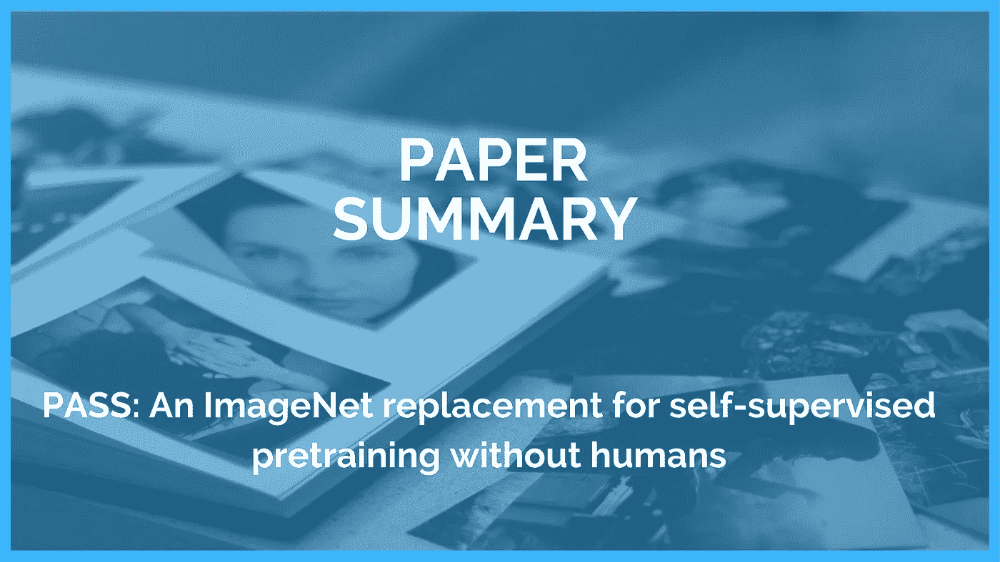

# 用 PASS 克服 ImageNet 数据集偏差。

> 原文：<https://towardsdatascience.com/overcoming-imagenet-dataset-biases-with-pass-6e54c66e77a?source=collection_archive---------16----------------------->

## PASS:ImageNet 替代无人参与的自我监督预训练

图片作者使用@Canva

[ImageNet](https://www.image-net.org/) 是计算机视觉应用中使用最广泛的数据集之一。然而，研究表明，基于收集方法和图像类型的偏见在该数据集中普遍存在。在这方面，牛津大学视觉几何小组[的一组研究人员提出了一个名为 PASS for self-supervised (SSL)模型预训练的新数据集，专门解决隐私和公平问题。本文是该团队发表的论文的摘要。](https://www.robots.ox.ac.uk/~vgg/)

# PASS:ImageNet 替代无人参与的自我监督预训练

arXiv 上的及格论文|来源:[https://arxiv.org/pdf/2109.13228.pdf](https://arxiv.org/pdf/2109.13228.pdf)

## 什么是通行证？

PASS 代表`Pictures without humans for Self-Supervision.`它是一个大规模的无标签图像数据集，旨在缓解围绕著名的 Imagenet 数据集的道德、法律和隐私问题。

## ImageNet 的问题

ImageNet 当前的一些问题包括:

ImageNet |作者图片的问题

*   **数据保护**:包含未经同意获取的个人信息
*   **版权**:许可使用不明
*   **偏向**—通过搜索引擎抓取收集数据集，
*   **有问题的图像内容-** [刻板的、不恰当的特定类别的描绘。](https://www.theregister.com/2019/10/23/ai_dataset_imagenet_consent/)

## 作为备选方案通过

作者指出:

> 当前最先进的模型预训练使用自我监督学习(SSL ),因此根本不需要标签。受此推动，我们因此考虑在不使用标签的情况下形成数据集，显著增加多样性并消除搜索引擎选择偏差。因为我们去除了带有人的图像，所以我们进一步显著降低了包含与人的外表相关的背景偏见的风险。此外，由于其更随机和无监督的性质，该数据集也可以作为 SSL 的更好的基准，以研究对没有预定义类别标签集的自然图像的缩放，从而解决当前评估的技术缺点。

*   **数据保护**:PASS 数据集不包含人体或身体部位
*   **版权** : PASS 仅包含 CC-BY 授权图片，有完整的归属信息。
*   **偏差** —数据集不包含标签，从而减轻了搜索引擎的偏差。
*   **有问题的图像内容-没有**个人身份信息，如车牌、签名或笔迹和 NSFW(不适合工作)图像。

## 收集方法

作者从一个名为 [***雅虎 Flickr 知识共享 1 亿张* (YFCC100m)**](http://webscope.sandbox.yahoo.com/catalog.php?datatype=i&did=67) **的随机 Flickr 图片数据集开始。**接下来，只过滤具有有效CC-BY 授权图像的图像，总共 1700 万。从这里，包含人类的有问题的图像被移除，剩下的净图像总数为 1000 万。由于每个摄影师的图像分布是高度倾斜的，每个摄影师的图像贡献是平衡的，最后，这些图像被提交给人类标记。

数据集生成管道|来源:[https://arxiv.org/pdf/2109.13228.pdf](https://arxiv.org/pdf/2109.13228.pdf)

提交人还提到，注释是由一家注释公司历时三周完成的，该公司支付注释者 150%的最低工资。

## 结果

作者在论文中提交的结果如下:

(I)诸如 MoCo、SwAV 和 DINO 的自监督方法在 PASS 数据集上训练良好，产生强有力的图像表示

(ii)在预训练期间排除人类图像对下游任务表现几乎没有影响，即使这是在 ImageNet 中进行的；

(iii)在 PASS 上训练的模型的性能产生比在 ImageNet 上预训练更好的结果(包括没有人或者甚至没有 [Places 205 数据集](http://places.csail.mit.edu/downloadData.html)的 ImageNet)，如下所示:

冻结编码器评估|来源:[https://arxiv.org/pdf/2109.13228.pdf](https://arxiv.org/pdf/2109.13228.pdf)

(iv)对于微调评估，例如检测和分割，通过预训练在 COCO 数据集上产生 1% mAP 和 AP50 内的结果。

微调代表性评估|来源:[https://arxiv.org/pdf/2109.13228.pdf](https://arxiv.org/pdf/2109.13228.pdf)

(v)即使在涉及人类的任务上，如密集姿势预测，在我们的数据集上进行预训练也能产生与 ImageNet 相当的性能，即使 PASS 没有人类图像

## 这对 Imagenet 意味着什么？

作者强调，PASS 不会使现有数据集过时，因为它不足以进行基准测试。然而，PASS 背后的想法是展示在使用更安全的数据时，模型预训练通常是可能的，并且它还为预训练方法的更稳健的评估提供了基础。

## PASS 是无偏差的吗？

尽管 PASS 显著降低了数据主体的数据保护和其他道德风险，但正如作者自己指出的那样，一些问题仍然普遍存在:

*   即使在过滤图像时非常小心，有害图像仍有可能漏网。
*   由于图像是随机采样的，地理偏见的问题依然存在。
*   由于缺少人体图像，PASS 不能用于学习人体模型，例如用于姿势识别。
*   PASS(与 ImageNet 相反)不能单独用于培训和基准测试，因为 PASS 不包含标签

# 结论

PASS 有其局限性，但仍然是研究界朝着降低许多任务和应用的道德和法律风险迈出的令人鼓舞的一步。ImageNet 数据集无疑开创了最先进的计算机视觉应用的时代，但作为一个社区，我们不能忽视数据集中的缺点。

# 参考

**论文*:***[*PASS:ImageNet 替代无人自监督预训练*](https://arxiv.org/pdf/2109.13228.pdf)

**作者** : [*YM。*](https://yukimasano.github.io/) *，* [*C .鲁普雷希特*](https://chrirupp.github.io/) *，* [*A .齐塞曼*](http://www.robots.ox.ac.uk/~az/) *，* [*A .韦达尔迪*](http://www.robots.ox.ac.uk/~vedaldi/)