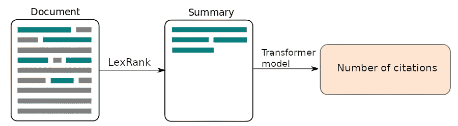
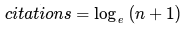
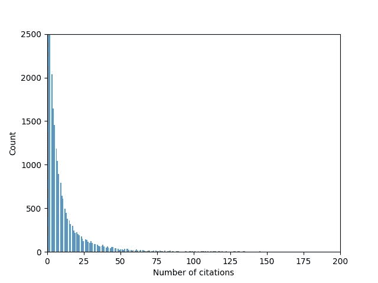
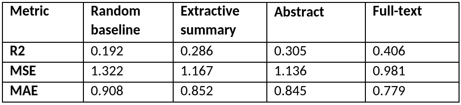
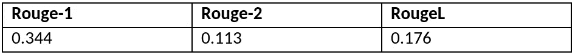

# 克服变压器的输入长度限制

> 原文：<https://towardsdatascience.com/overcoming-input-length-constraints-of-transformers-b0dd5c557f7e?source=collection_archive---------19----------------------->

## [思想和理论](https://towardsdatascience.com/tagged/thoughts-and-theory)

## 一种面向长文档训练的抽取摘要方法

由[贾瑞德·克雷格](https://unsplash.com/@jaredd_craig?utm_source=unsplash&utm_medium=referral&utm_content=creditCopyText)在 [Unsplash](https://unsplash.com/?utm_source=unsplash&utm_medium=referral&utm_content=creditCopyText) 上拍摄

名副其实，Transformers**【1】**在过去几年中真正改变了 NLP 领域，主要是因为它们的并行化能力允许大型预训练模型，如 BERT**【2】**。虽然 BERT 及其衍生工具已经在 NLP 的大多数领域显示出了最先进的结果，但是 Transformer 模型有一个主要缺点:它很难应用于非常长的文档。这个困难是由于自我注意操作，其相对于输入长度具有 O(n)的指数复杂度。随着许多公司将人工智能模型集成到他们的工作流程中，这可能会成为一个问题，因为并非所有公司都有资源来有效处理他们可以访问的数据的大小和复杂性。例如律师事务所(法律文件)和医院(医疗记录)。

已经提出了几种解决方案来减轻长文档带来的问题。最简单的解决方案是**截断**，其中只将文档的前 N 个标记作为输入，但是这从原始文档中丢弃了许多潜在的有价值的信息。另一个解决方案是**分块**，将一个文档分割成更小的块，每个块都作为模型的一个独立输入。虽然这确实允许更长的输入，但是每个块必须被单独编码，并且必须在下游模型中使用，这仍然使得它在计算上是昂贵的。这种方法的另一个缺点是长时间的注意力丢失了，因为组块之间没有注意力。一个有希望的新解决方案是通过用一种称为局部敏感哈希自关注**【9】**的近似方法来替代全局自关注，潜在地降低计算复杂度，这种近似方法在重整器模型**【10】**中使用，有效地将复杂度降低到 O(L log L)。

然而，我建议**针对长文档输入的另一种解决方案:摘要**。我将展示如何使用提取摘要首先从长文档中提取重要信息，然后利用这些摘要训练一个基于 Transformer 的模型。换句话说，我将演示如何应用摘要来减少输入大小，从而减少计算需求。

为了评估这种方法，我们比较了“引文预测”任务的几个输入预测科学文献的引用数量是一项任务，通过利用文献的全文与仅使用摘要相比，已经取得了明显的改进 **[3]。**对于我们的实验来说，引用预测任务有两个独特的性质:首先，我们知道需要长文档输入才能在这项任务中获得更好的结果。第二，我们有一个摘要形式的人工摘要，我们可以将自己的摘要与之进行比较。我们提出的模型如图 1 所示。

**图 1: T** 他提出了引文预测模型。使用 LexRank 从输入文档中提取摘要，然后将其用作引用预测的 Transformer 模型的输入。图片作者。

# **摘录摘要的复习**

为了理解我们的方法是如何工作的，重要的是理解我们的总结算法是如何工作的。摘要算法有两种风格:提取的和抽象的。

提取摘要算法从源文档中选择一组被组合成摘要的句子，而抽象摘要算法生成包含不一定出现在源文档中的句子的摘要。

虽然在过去的几年中在抽象概括方面已经取得了很大的进步，主要是由于基于预训练的编码器-解码器的模型(例如变换器)的出现，但是抽象概括模型要复杂得多，并且在计算上非常昂贵；违背了我们实验的目的。出于这个原因，我们使用了 lex rank**【4】，**一种 2004 年的快速摘要算法，它仍然是摘要中最先进的算法之一。

LexRank 使用无监督的基于图的方法从文档中选择最相关的句子。LexRank 的工作方式如下:输入文档中的每一个句子首先被转化为一个嵌入(使用句子中单词的平均值 TF-IDF)，然后被视为图中的一个节点。通过计算句子嵌入之间的余弦相似度来创建连接或边缘。在实践中，这些信息被放在一个连接矩阵中，该矩阵包含所有句子的所有相似之处。然后，LexRank 对每个连接应用相似性阈值，以确保在连接矩阵中只使用“强”连接。这就产生了一个由 0 和 1 组成的矩阵。之后，每个节点除以它的度数:它拥有的连接数。最后，使用幂迭代方法计算每个句子的得分，并返回得分最高的前 N 个句子作为摘要。因此，我们的摘要是原始文档的严格子集。对于算法的更广泛的解释，我鼓励你阅读 Erkan 等人的论文**【4**】。

# **实验装置**

为了评估我们的方法，我们使用 LexRank 从所有的全文输入中生成了摘要。我们将这些摘要与训练数据中每个文档的摘要和全文进行了比较。此外，我们还为每个文档生成了一组随机句子，作为我们的随机基线。为了公平的比较，作为随机句子的两个生成的摘要具有与人类书面摘要相同数量的句子。

请注意，该数据集没有可用的小节信息，这就是为什么我们随机选取句子，而不是每个小节的前 N 个句子(这是文献中常见的基线)。虽然可以将平均引用计数作为基线，但这将总是导致 R2 值为 0，因为我们的预测无法解释我们数据中的任何差异。

作为我们的训练数据，我们使用了**【3】**中提出的 ACL-文献计量学数据集。该数据集包含来自 ACL 选集数据库的 30950 个文档的全文和摘要信息。每篇论文都有一个标签，标明论文发表后前 10 年的引用情况。由于引用数量的增加遵循齐普斯-曼德勃罗定律(或幂定律)**【8】，**，我们感兴趣的是“从谷壳中分离出小麦”，而不是预测极端影响的论文，因此我们使用了等式 1 中所示的公式，其中我们取了对数并将引用数量 n 加 1，以确保我们的公式是针对引用数量为 0 的情况定义的。图 2 显示了训练集中非标准化引用的图表。请注意，我们数据中的引用计数严重倾斜，并且遵循幂定律。

**等式 1:** 引用的对数归一化函数

**图 2:** 训练数据中引用计数的直方图。图片作者。

因此，我们有一个文档的四个输入，每个输入都训练了一个引用预测模型:全文、摘要、随机基线和我们的 LexRank 摘要。我们的假设是，我们可以通过摘要对全文文档中的重要信息进行编码，并匹配甚至提高摘要的性能。

摘要和概要中的平均句子数是 6。相比之下，全文文档中的平均句子数量是 150，因此我们的摘要在输入大小上平均减少了 25 倍。

我们使用了在**【3】**中提出的舒伯特模型，除了我们用 SciBERT**【5】**代替了 BERT-base，因为我们处理的是科学文档。在这个模型中，使用我们的 SciBERT 层将全文文档编码为 512 个标记的块，之后使用单个丢弃层训练 GRU 层，然后使用单个线性层进行预测。对于架构的更全面的解释，我鼓励你阅读 **[3]。为了生成我们的 LexRank 摘要，我们使用了 Sumy 包(https://pypi.org/project/sumy/)。**

为了比较我们的结果，我们报告了三个常见的回归指标:R2、均方误差(MSE)和平均绝对误差(MAE)。对于 R2，分数越高越好，对于 MSE 和 MAE，分数越低越好。

除了评估我们的摘要在预测引用数量方面的表现，我们还计算了摘要和摘要之间的(F1) Rouge-1、Rouge-2 和 Rouge-L 得分**【6】**。我们这样做是为了评估两者之间有多少重叠，因为我们希望它们包括全文中的类似信息。

# **建议实验的结果**

****

****表 1:** 引文预测不同输入类型的结果。**

****

****表 2:**F-1·鲁日在摘要和 LexRank 摘要之间的得分。**

**表 1 中列出了测试集的 R2、MSE 和 MAE 分数，它们是三次运行的平均值。正如所料，我们选择 N 个随机句子的基线模型的表现明显比其他输入差。人工撰写的摘要略优于 LexRank 摘要，而全文输入则显著优于两者。请注意，当我们将这些分数转换回它们的非标准化值时，对于全文文档和摘要文档，我们得到的 MAE 分别为 13.09 和 13.62。这些高 MAE 分数受到大量引用的论文的严重影响，这就是为什么我们训练对数标准化引用计数。供参考:如果我们从 1474 篇论文的测试集中删除引用率最高的前 50 篇论文，这些分数分别为 6.92 和 7.19。**

**表 2 列出了摘要和摘要之间的 Rouge-1、Rouge-2 和 RougeL。Rouge 的得分与最近的研究相当，在最近的研究中，LexRank 被用作基线**【7】**。**

# ****讨论****

**我们的结果表明，使用 LexRank 获得的摘要在用作下游任务的输入时，提供了与人工编写的摘要相似的结果。LexRank 摘要和摘要的结果的接近程度表明，我们通过使用全文输入的精简版本所能获得的下游结果可能有一个上限。尽管我们提取的摘要并没有提高摘要的性能，但它们具有相似性能的事实表明，当全文文档输入过于昂贵时，提取的摘要可以作为一种很好的输入。这在经常发现长文档，但通常没有压缩版本的领域中特别有用，例如法律或医疗文档。但是，如果可能的话，全文文档仍然是首选，性能的显著提高就证明了这一点。**

**rouge 分数表明，就内容而言，摘要和摘要之间存在显著差异，这很有趣，因为表 1 中的结果非常接近。我们尝试使用摘要和概要的连接作为输入来平衡这些差异，但是这仅仅给出了非常小的改进。**

**一个有趣的后续研究是比较不同的摘要长度，看看我们是否可以用更短的摘要来匹配全文输入的性能，例如，通过生成长度为我们输入长度一半的摘要。另一个有趣的研究是比较不同的摘要算法，因为在这个实验中只使用了 LexRank。最后，由于 LexRank 为每个句子输出一个分数，我们也可以用它来减少噪音，去掉最不突出的句子。**

# ****结论****

**我们表明，摘录摘要在引用预测任务中用作转换器的输入时，具有与人类编写的摘要相似的性能。对于资源有限的长文档培训任务，这是一个很有前途的解决方案。然而，与摘要相比，全文输入仍然有很大的改进。**

# ****参考文献****

**[1] Ashish Vaswani、Noam Shazeer、Niki Parmar、Jakob Uszkoreit、Llion Jones、Aidan N. Gomez、Lukasz Kaiser 和 Illia Polosukhin。你只需要关注，2017。**

**[2] Jacob Devlin、张明蔚、Kenton Lee 和 Kristina Toutanova。Bert:用于语言理解的深度双向转换器的预训练。arXiv 预印本 arXiv:1810.04805，2018。**

**[3]托马斯·范东恩、吉迪恩·迈莱特·德·布伊·温尼日尔和兰伯特·肖梅克。舒伯特:带有伯特编码的学术文档块促进引用计数预测。2020 年第一届学术文献处理研讨会会议录。**

**[4]居内斯·埃尔坎和德拉戈米尔·拉杰夫。基于图的词汇中心性作为文本摘要中的显著性。j .阿提夫。里面的第 22(1):457-479 号决议，2004 年 12 月。**

**[5] Iz Beltagy、Kyle Lo 和 Arman Cohan。科学文本的预训练语言模型。在 EMNLP，2019。**

**[6]林金耀。ROUGE:一个自动评估摘要的包。《文本摘要分支》, 74-81 页，西班牙巴塞罗那，2004 年 7 月。计算语言学协会。**

**[7]董玥、安德烈·米尔恰和成龙。长科学文献的话语感知无监督摘要，2021。**

**[8]祖拉布·西拉加德泽。引文和齐夫-曼德勃罗定律。复杂系统，1999 年 2 月 11 日。**

**[9]亚历山大·巴甫洛夫·安多尼、皮奥特·因迪克、蒂伊斯·拉霍文、伊利亚·拉赞施泰因和路德维希·施密特。角距离的实用和最佳 lsh，2015。**

**[10]尼基塔·基塔耶夫、祖卡斯·凯泽和安塞姆·列夫斯卡娅。改革者:高效的变压器，2020。**