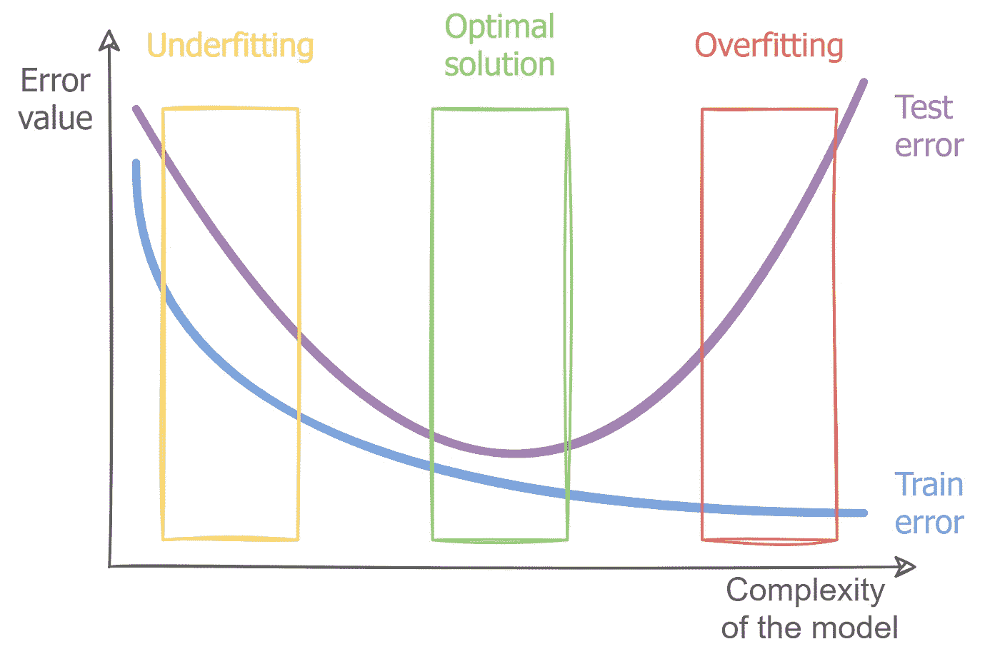

# 过拟合和欠拟合原则

> 原文：<https://towardsdatascience.com/overfitting-and-underfitting-principles-ea8964d9c45c?source=collection_archive---------0----------------------->

## **理解欠拟合和过拟合的基本原理，以及为什么你应该使用特殊的技巧来处理它们**

欠拟合和过拟合原则。作者图片

已经有很多关于过度拟合的文章，但是几乎所有的*都只是简单的工具列表*。“如何处理过度拟合——十大工具”或“防止过度拟合的最佳技术”。*这就像给别人看钉子却不解释怎么钉一样*。对于试图弄清楚过度拟合是如何工作的人来说，这可能非常令人困惑。还有，这些文章往往不考虑欠适，好像根本不存在。

在这篇文章中，我想列出提高模型质量的**基本原则**(确切地说是*原则*),并相应地防止特定示例的欠拟合和过拟合。这是一个非常普遍的问题，可以适用于所有的算法和模型，所以很难完全描述它。但是我想试着给你一个*理解*为什么会出现欠拟合和过拟合，以及为什么要使用一种或另一种特定的技术。

# 欠拟合和过拟合以及偏差/方差权衡

虽然我没有在这里描述你需要知道的所有概念(例如，*质量度量*或者*交叉验证*，但是我认为向你解释(或者只是提醒你)什么是欠拟合/过拟合是很重要的。

为了弄清楚这一点，让我们创建一些数据集，将其分为训练集和测试集，然后在其上训练三个模型——简单、良好和复杂(我不会在这个示例中使用验证集来简化它，但我将在稍后讲述它)。所有代码都可以在这个 [GitLab repo](https://gitlab.com/Winston-90/underfitting_vs_overfitting) 中找到。

生成的数据集。作者图片

**欠拟合**是指你的模型对于你的数据来说**过于简单**的情况。更正式地说，你关于数据分布的假设是错误的，过于简单——比如你的数据是二次的，你的模型是线性的。这种情况也叫**高偏**。这意味着您的算法可以进行准确的预测，但最初对数据的假设是不正确的。

不合身。基于立方数据训练的线性模型。作者图片

相反，**过度拟合**是当你的模型对于你的数据来说**太复杂**的情况。更正式地说，你关于数据分布的假设是错误的，太复杂了——比如你的数据是线性的，你的模型是高次多项式。这种情况也被称为**高方差**。这意味着您的算法无法进行准确的预测——输入数据变化很小，模型输出变化很大。

过度拟合。基于立方数据训练的 13 次多项式模型。作者图片

这是同一个问题的两个极端，最优解总是在中间的某个地方。

好模式。基于立方数据训练的立方模型。作者图片

我不会过多谈论偏差/方差权衡(您可以阅读本文中的基础知识[，但让我简单地提一下可能的选项:](/understanding-the-bias-variance-tradeoff-165e6942b229)

*   低偏差、低方差——这是一个很好的结果，恰到好处。
*   低偏差、**高方差** — **过度拟合** —算法对相似数据输出非常不同的预测。
*   **高偏差**，低方差— **欠拟合** —算法对相似数据输出相似预测，但预测是错误的(算法“未命中”)。
*   高偏差、高方差——非常糟糕的算法。你很可能永远看不到这个。

四幅图上的偏差和方差选项。作者图片

所有这些情况都可以放在同一个地块上。这是一个有点不如前一个清晰，但更紧凑。

一个图上的偏差和方差选项。作者图片

## 如何检测欠拟合和过拟合

在我们进入工具之前，让我们了解如何“诊断”欠拟合和过拟合。

训练/测试错误和欠拟合/过拟合。作者图片

**拟合不足**意味着你的模型做出了准确但最初不正确的预测。在这种情况下，**训练误差大**和 **val/test 误差也大**。

过度拟合意味着你的模型预测不准确。在这种情况下，**训练误差很小**而 **val/test 误差很大**。

当你找到一个**好的模型**，**训练误差小**(但比过拟合的情况下大)，并且 **val/test 误差也小**。

在上述情况下，测试误差和验证误差大致相同。当一切正常，并且您的*训练、验证和测试数据具有相同的分布*时，就会发生这种情况。如果验证和测试误差非常不同，那么您需要获得更多类似于测试数据的数据，并确保您正确地分割数据。

如何检测欠拟合和过拟合？作者图片

# 工具和技术

现在让我们看看防止欠拟合和过拟合的技术，确切地考虑一下*为什么我们应该使用它们*。

## 你应该记住一般直觉

我们记得:

*   **当你的模型对你的数据来说**太简单**时，就会出现**欠拟合。
*   **过度拟合**发生在你的模型**对你的数据**太复杂的时候。

基于此，你应该记住的简单直觉是:

*   要修复**欠拟合**，你应该**将**模型复杂化。
*   为了修正**过拟合**，你应该**简化**模型。

事实上，下面将要列出的一切只是这个简单规则的结果。我将试图说明为什么某些行为会使模型变得复杂或简化。

## 更简单/复杂的模型

基于上述直觉想到的最简单的方法是尝试更简单或更复杂的算法(模型)。

为了使模型变得复杂，你需要添加更多的参数(*自由度*)。有时这意味着直接尝试更强大的模型——一种先验地能够恢复更复杂的依赖性的模型(具有不同内核的 *SVM，而不是逻辑回归*)。**如果算法已经相当复杂**(神经网络或者某种集成模型)**你需要给它增加更多的参数**，比如增加 boosting 中的模型数量。在神经网络的上下文中，这意味着添加更多的层/每层中更多的神经元/层之间更多的连接 CNN 更多的过滤器，等等。

为了简化模型，你需要反过来减少参数的数量。要么彻底改变算法(*尝试随机森林代替深度神经网络*)，要么减少自由度。更少的层，更少的神经元，等等。

## 更多正规化/更少正规化

这一点与前一点非常相关。实际上，**正则化是对模型**的间接强制简化。正则项要求模型保持参数值尽可能小，因此要求模型尽可能简单。具有强正则化的复杂模型通常比最初的简单模型表现得更好，因此这是一个非常强大的工具。

正则化的好模型和复杂模型。作者图片

更多的正则化(简化模型)意味着增加正则化项的影响。这一过程是严格的个体化过程——取决于算法，正则化参数是不同的(例如，**为了减少正则化，岭回归的α应该减少，而 SVM 的 C——增加**)。所以你要研究算法的参数，注意在特定情况下是应该增加还是减少。有很多这样的参数——线性回归的 L1/L2 系数，SVM 的 C 和 gamma，决策树的最大树深度，等等。在神经网络中，主要的正则化方法有:

*   提前停车，
*   辍学，
*   L1 和 L2 正规化。

你可以在这篇文章中读到它们[。](https://medium.com/@ODSC/classic-regularization-techniques-in-neural-networks-68bccee03764)

相反，在模型需要复杂的情况下，你应该减少正则项的影响或者完全放弃正则化，看看会发生什么。

## 更多功能/更少功能

这可能不那么明显，但是添加新功能也会使模型变得复杂。在*多项式回归*的背景下考虑这个问题-向数据集添加二次要素允许线性模型恢复二次数据。

*添加新的“自然”特性*(如果你可以这样称呼的话)——获取现有数据的新特性很少使用，主要是因为它非常昂贵且耗时较长。但是你要记住，有时候这是有帮助的。

但是从现有特征中人工获得附加特征(所谓的*特征工程*)经常用于经典的机器学习模型。这种转变的例子数不胜数，但以下是主要的几个:

*   多项式特征—从 *x* ₁ *，x* ₂到 *x* ₁ *，x* ₂ *，x* ₁ *x* ₂ *，x* ₁ *，x* ₂ *，…* ( `sklearn.preprocessing.PolynomialFeatures`类)
*   log(x)，用于非正态分布的数据
*   ln(|x| + 1)用于右尾粗的数据
*   范畴特征的转换
*   其他非线性数据转换(从长度和宽度到面积(长度*宽度))等等。

如果您需要简化模型，那么您应该使用较少数量的特征。首先，删除您之前添加的所有附加功能。但结果可能是，在原始数据集中，有些要素不包含有用的信息，有时还会引发问题。如果一些特征是相关的，线性模型通常工作得更差。在这种情况下，你需要使用*特征选择*方法来选择那些携带最大量有用信息的特征。

值得一提的是，在神经网络的背景下，*特征工程*和*特征选择*几乎毫无意义，因为**网络在数据本身**中找到依赖性。这其实也是为什么深度神经网络可以还原如此复杂的依赖关系。

## 为什么获取更多数据有时没有帮助

对抗过度拟合的技术之一是获取更多的数据。然而，令人惊讶的是，这并不总是有用的。让我们生成一个类似的 10 倍大的数据集，并在其上训练相同的模型。

为什么获取更多的数据有时没有帮助。作者图片

一个非常简单的模型(1 级)一直保持简单，几乎没有什么变化。因此**获得更多的数据在**不足的情况下没有帮助。

但是复杂模型(13 度)已经变好了。它仍然比最初的好模型(3 级)差，但比原来的好得多。为什么会这样？

上次(对于初始数据集)，在 14 个数据点上训练模型( *20(初始数据集大小)* 0.7(训练比)= 14* )。一个 13 次多项式可以完美匹配这些数据(以此类推，我们可以通过 2 个点画一条理想直线(次数=1)，通过 3 个点画一条理想抛物线(次数=2)，以此类推)。通过获得 10 倍多的数据，我们的训练集的大小现在是 140 个数据点。为了完美匹配这些数据，我们需要一个 139 次多项式！

注意，如果我们最初训练了一个*非常复杂的模型*(例如，150 次多项式)，这样的数据增加不会有帮助。所以获取更多的数据是提高模型质量的好方法，但是如果模型非常非常复杂的话可能就没什么帮助了。

因此，结论是——**获得更多的数据只能有助于过度拟合(而不是欠拟合)，并且如果你的模型不是太复杂**。

在计算机视觉的背景下，获得更多数据也可以意味着 [*数据扩充*](https://en.wikipedia.org/wiki/Data_augmentation) 。

# 摘要

让我们用一个表来总结所有的事情。

对抗欠适和过适的技巧。作者图片

好吧，两个更好。

应对欠适和过适的技巧(扩展版)。作者图片

一些工具和技术在本文中没有涉及。例如，我认为**数据清理**和**交叉验证**或**保持验证**是任何机器学习项目中的常见做法，但它们也可以被视为对抗过度拟合的工具。

你可能会注意到，为了消除欠拟合或过拟合，你需要应用**完全相反的动作**。因此，如果您最初“误诊”了您的模型，您可能会花费大量的时间和金钱在无意义的工作上(例如，当实际上您需要将模型复杂化时，获取新的数据)。这就是它如此重要的原因——数小时的分析可以节省您数天甚至数周的工作时间。

除了通常的模型质量分析(训练/测试错误)，还有许多技术可以准确理解需要做什么来改进模型([错误分析](https://www.analyticsvidhya.com/blog/2021/08/a-quick-guide-to-error-analysis-for-machine-learning-classification-models/)、[上限分析](https://www.coursera.org/lecture/machine-learning/ceiling-analysis-what-part-of-the-pipeline-to-work-on-next-LrJbq)等)。).不幸的是，这些主题超出了本文的范围。

但是，所有这些程序都有一个目的，就是了解往哪里搬，需要注意什么。我希望这篇文章能帮助你理解欠适和过适的基本原则，并激励你去了解更多。

正如我之前所说，本教程中使用的所有代码都可以在 [GitLab](https://gitlab.com/Winston-90/underfitting_vs_overfitting) 上获得。

 [## Dmytro Nikolaiev /欠拟合 _ vs _ 过拟合

### 过拟合和欠拟合原则。理解适配不足和适配过度的基本原则，以及为什么你应该…

gitlab.com](https://gitlab.com/Winston-90/underfitting_vs_overfitting) 

# 感谢您的阅读！

*   我希望这些材料对你有用。[在 Medium](https://medium.com/@andimid) 上关注我，获取更多这样的文章。
*   如果您有任何问题或意见，我将很高兴得到任何反馈。在评论里问我，或者通过 [LinkedIn](https://www.linkedin.com/in/andimid/) 或者 [Twitter](https://twitter.com/dimid_ml) 联系。
*   为了支持我作为一个作家，并获得数以千计的其他媒体文章，使用[我的推荐链接](https://medium.com/@andimid/membership)获得媒体会员资格(不收取额外费用)。