# 过度适应并不是正规化可以帮助解决的唯一问题

> 原文：<https://towardsdatascience.com/overfitting-is-not-the-only-problem-regularisation-can-help-with-6fcdbfdb9384?source=collection_archive---------30----------------------->

## 从数学上理解岭回归在特征数量超过数据点时的作用

弗兰基·查马基在 [Unsplash](https://unsplash.com?utm_source=medium&utm_medium=referral) 上拍摄的照片

# 特征多于数据的问题

当我们谈论正则化时，我们几乎总是在过度拟合的背景下谈论它，但一个鲜为人知的事实是，它可以帮助解决上述问题。

由于数据是机器学习的核心，你永远不会想到会遇到这样的问题。话虽如此，但我们有许多特征而数据点很少，这是很常见的，尤其是在涉及生物学的 ML 问题中。**在回归问题中，特征多于数据点使得普通最小二乘回归(OLS)表现很差**。

让我们通过一个简单得可笑的例子来理解为什么。

这是直线的方程式

**hθ(x) = θ0 + θ1x1**

为了找出给定 **x1 和 hθ(x)** 的 **θ0 和θ1** 的值，我们需要**至少 2 个数据点。**假设我们根据一个单一特征**预测人的**体重**——他们的**年龄**。在这种情况下，我们需要至少两个人的数据来拟合一条直线。如果我们只有一个人的年龄会怎样？**

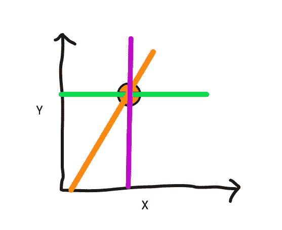

无限解(图片由作者提供)

从上面我们可以看到，多条直线可以穿过一个点，虽然我只展示了三条这样的直线，但是这样的系统有无穷多个解！

# 线性回归的正规方程与不可逆性

首先，我们在线性回归期间最小化的成本函数是

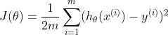

线性回归成本函数

这里 m 代表数据点的数量，θ是(n+1)维向量，(n 维代表 n 个特征+1 维代表偏差( **θ0** )。

为了最小化这个成本函数，我们将关于θ矩阵中每个条目的偏导数设置为 0，并且同时求解θ。

## 这是我们最后的法线方程

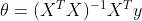

线性回归的正规方程

*详细的推导对于熟悉微积分的人可以在这里找到*<https://see.stanford.edu/materials/aimlcs229/cs229-notes1.pdf>**第 11 页。**

***现在 X 是由 m 个数据点和 n 个特征组成的(m X (n+1))维矩阵。请注意，X 的第一列填充了 1，以说明偏差。因此，X 对于 n 个特征中的每一个都有一列，加上 1 的一列，使得它总共有(n+1)列。***

*如果我们有两个数据点，分别由特征(2，5)和(4，7)组成，这就是我们矩阵的样子。*

*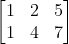*

*一个示例 X 矩阵*

*现在在正规方程中，**每当我们有 m < n** 也就是每当 X 的行数比特征数少的时候，X 转置的乘积的**逆，并且 X 不存在。***

*这里有一个同样的数学证明。如果你不熟悉线性代数，请跳过证明。*

*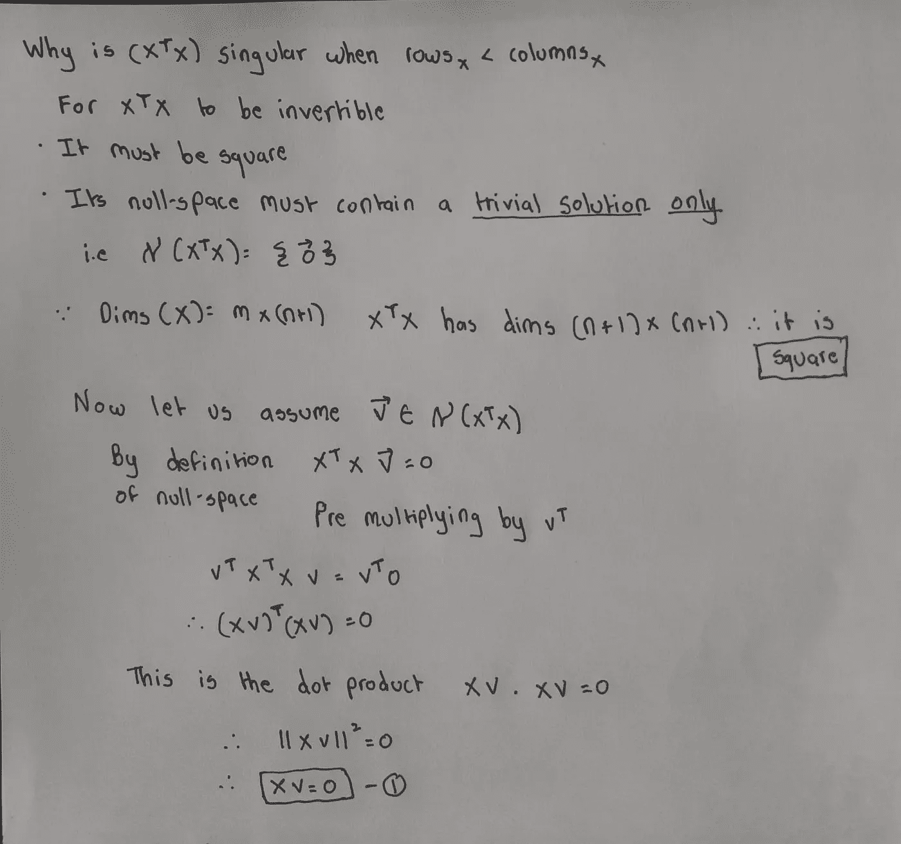**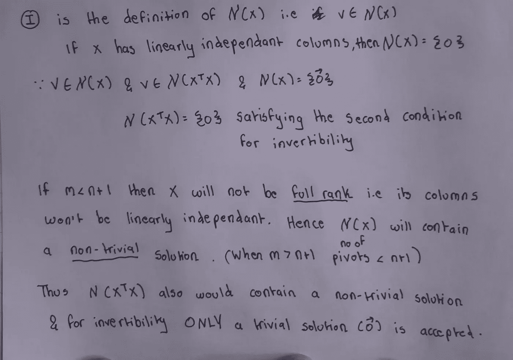*

*证据 1*

## *外卖食品*

******

# *救援正规化！*

*这里是正则化成本函数的等式，更具体地说是 [*岭回归。*](https://www.mygreatlearning.com/blog/what-is-ridge-regression/#:~:text=Ridge%20regression%20is%20a%20model,away%20from%20the%20actual%20values.)***λ**是这里经常微调的正则化参数。**

**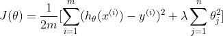**

**岭回归成本函数**

**使用与上一节相同的逻辑，我们对该函数进行微分，并将其设置为零，求解**θ**以得出**正则化法线方程。****

**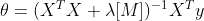**

**正则正规方程**

**这里，M 是一个矩阵，其维数为 **(n+1 X n+1)** ，对角线上的值为 1，除了左上角的条目为 0 之外，其他地方的值都为 0。**比如一个 3X3 M 的矩阵看起来是这样的:****

**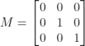**

**三维 M 矩阵**

**哒哒！只要λ严格大于 0，我们可以证明正则化正规方程中的乘积是可逆的。**

**这是对数学好奇的人的证明！如果你不熟悉线性代数，请跳过它。**

**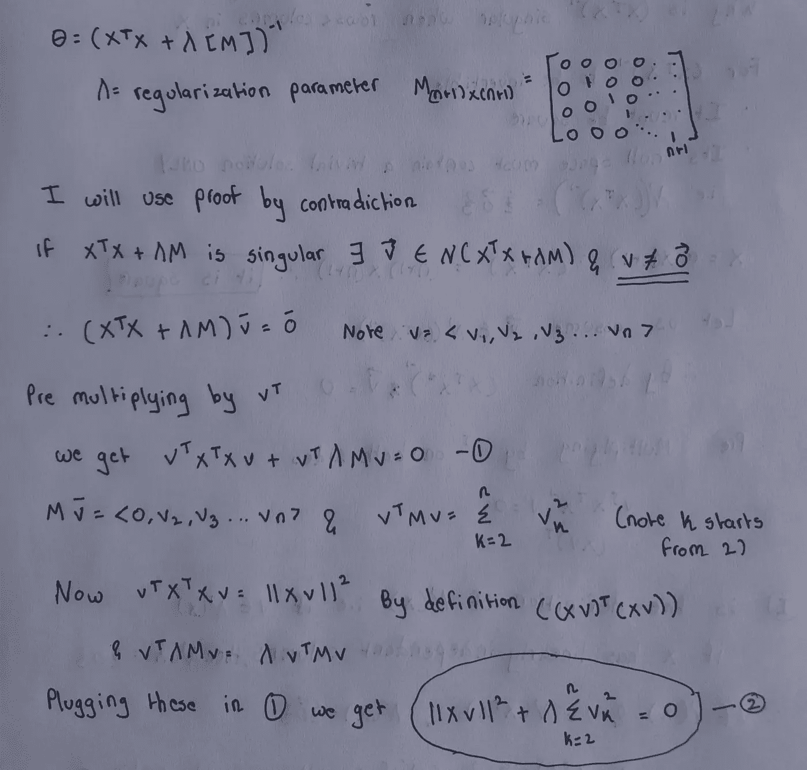****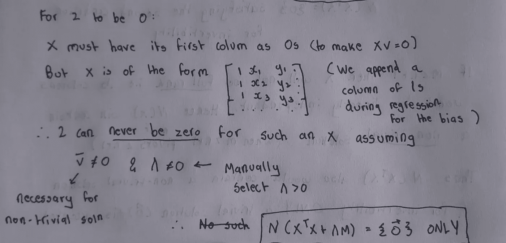**

**证据 2**

## **外卖食品**

# **那么梯度下降呢？**

**到目前为止，我们只谈到了线性回归的正常方程，但如果您使用梯度下降来优化θ呢？虽然从理论上讲，这应该会给你一个解决方案，**事实证明，由于未知因素多于特征，我们有多个解决方案，这个解决方案可能不能很好地推广**。添加正则化项将有助于进一步约束目标，并使解偏向θ的“小”值(输入的小变化不会转化为输出的大变化)。这通常会帮助我们收敛到一个更通用的解决方案。**

# **这类问题在实践中是如何处理的？**

**通常，当我们试图解决一个回归问题时，当我们面临特征多于数据点的问题时，我们会这样做。**

1.  **选择山脊(L2)或拉索回归(L1)**
2.  **使用 K 倍交叉验证并调整正则化参数(λ)**
3.  **在调整严格大于 0 的λ之后，应该会产生比普通最小二乘回归更好的性能**
4.  **在一些极端的情况下，调整后，如果λ结果为零，这将意味着问题本身并不适合算法，正则化不会给出比 OLS 更好的解决方案**

**我知道我谈到了极端的例子，我们只有 1 或 2 个数据点，但在实践中，你会面临大约 500 个数据点和大约 5000 个特征的问题，让你选择调整 lambda。**

# **结论**

**除了更著名的(解决过度拟合)之外，我们还看到了一个有趣的正则化用例。我们也看到了数学证明，显示了正则化如何解决我们的目标。**不过，我希望你小心谨慎。仅仅因为正规化找到了解决方案，并不意味着这是最好的方案。事实上，正则化将有助于比 OLS 执行得更好，但其他最大似然算法可以更好地解决你的问题！****

****此外，还有其他方法，比如降维，来解决特征多于数据点的问题****

**如果你喜欢这篇文章，这里有更多！**

**</dealing-with-features-that-have-high-cardinality-1c9212d7ff1b>  </regex-essential-for-nlp-ee0336ef988d>  </powerful-text-augmentation-using-nlpaug-5851099b4e97>  </scatter-plots-on-maps-using-plotly-79f16aee17d0>  </effortless-exploratory-data-analysis-eda-201c99324857>  其他一些项目。可以联系我 [***这里***](https://rajsangani.me/) ***。*** 感谢您的配合！**