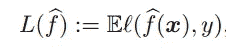
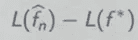
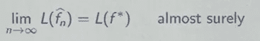
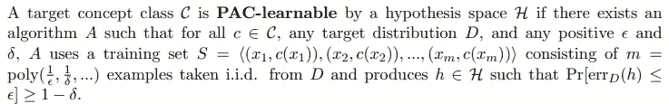
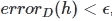
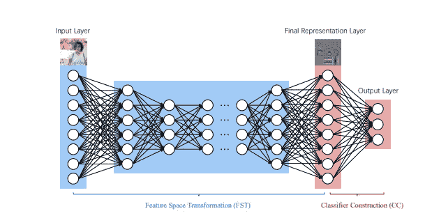

# 过度参数化但一般化的神经网络

> 原文：<https://towardsdatascience.com/overparameterized-but-generalized-neural-network-420fe646c54c?source=collection_archive---------20----------------------->

## 为什么你的深度神经网络在测试数据上表现很好？

信用:Maximalfocus Unsplash

深度学习已经从只是参数化的非线性函数发展到用于主要的计算机视觉和自然语言处理任务。分段非线性网络能够形成数据的非平凡表示。尽管这些网络已经非常成功，但是在他们对为什么通过找到问题的近似最优解而表现如此之好的理解之间还有许多差距。

> 这些模型给出的训练误差为 *0，因此*高度过拟合训练数据*，但仍然能够给出良好的测试性能。*

这种良性的过度拟合似乎与公认的统计学智慧相矛盾，统计学智慧坚持在模型的复杂性及其与数据的拟合之间进行*权衡。因此，有必要研究这一有趣的现象来填补空白。*

## 什么是泛化？

假设我们的任务是将一组数据点 *X* 映射到它们的标签*Y。*我们定义一个函数 *f: X- > Y* 。这里的基本假设是数据是独立同分布的，这意味着每个数据点都是彼此独立随机生成的。

选择 *f* 可以有很多种方式。其中一种方法是让数据分布 *X* 决定 *f* 应该是什么，假设这是 *f^* 。现在，我们希望 *f^* 给出好的预测，这样*f^*的*风险*

是最小值。 ***风险*** 基本上就是损失的*预期。有办法保证这一点吗*

对于大样本量 n，输出较小。这里 *f** 是描述数据的最佳函数。

这给了我们一个衡量我们的模型在未知样本上表现如何的标准。这里需要注意的一点是，如果我们有足够数量的样本，这两项将会收敛。

但在现实生活中并非如此。我们需要知道在一个特定的模型上，我们的模型在 n 个样本的情况下会犯多少错误，因此我们的模型会有多好。

> 泛化为我们提供了一个在没有看到数据的情况下，我们的模型将执行的最高错误数的界限。

你不觉得这对*量产*的车型超级重要吗？我们可以找出我们的模型可能犯的最多的错误！

## 概括方法

传统的一般化方法采用**模型容量**的观点，其中一般化的能力由假设类 *H* 的复杂性(容量)来建模。其中假设类是所有可能符合数据的函数 *f* (见第一节)。一些传统的方法包括 VC 维、Rademacher 复杂度和 PAC-Bayes 界。

1.  **VC dimension-** 衡量算法可以学习的一组函数的能力。它由算法能够*粉碎的最大点集来衡量。f* 被认为分解了一组数据点，如果对于这些点的所有标签分配，存在一个函数使得 *f* 在对这些点求值时没有错误。
2.  **Rademacher complexity-** 一类实值函数丰富性的度量，因此是一个假设类拟合二元标签的能力。
3.  **大概正确-** 如【3】所述

来自[3]的定义

简单来说:PAC 的主要目标是分析一个模型是否以及在什么条件下可能输出一个近似正确的分类器。在这里，我们可以通过以下方式定义近似的

其中 D 是输入的分布，h 是假设。接下来，我们如何定义“大概”？如果我们的模型将以概率 1-δ输出这样一个分类器，其中 0≤δ≤1/2，我们称该分类器*可能*近似正确。知道目标概念是 PAC 可学习的，允许您限制可能学习近似正确的分类器所需的样本大小。

# 神经网络中的泛化

## **实证研究的方法**

社区提出了各种理论和经验结果。[2] **通过系统地改变超参数对 40 个测量值进行了研究。**他们训练了大约 10000 个卷积网络，以了解泛化和不同超参数设置之间的关系。他们发现了 PAC-Bayesian 界限的**潜力**和基于规范的措施的失败。

## **通过随机测试探索普遍性**

张等[1]的论文进行了随机测试，用随机标签代替真实标签。理想情况下，模型的性能应该不会很好。但令他们惊讶的是，他们发现~深度神经网络很容易以 0 的训练误差拟合随机标签。

> 仅通过随机化标签，我们就可以在不改变模型、其大小、超参数或优化器的情况下，迫使模型的泛化误差大幅上升。

他们还用完全随机的像素(例如高斯噪声)代替真实图像，并观察到卷积神经网络继续以零训练误差拟合数据。*这表明，尽管它们的结构不同，* ***卷积神经网络可以拟合随机噪声。***

他们进一步改变随机化的量，在无噪声和完全噪声的情况之间平滑地插值，以观察当我们增加噪声水平时泛化误差的稳定恶化。这表明神经网络能够捕捉数据中的剩余信号，同时使用蛮力拟合噪声部分。

## **表征学习视角**

周 Z-H[4]对这个问题给出了一个非常不同的视角。他对为什么过度参数化不会过度拟合的回答导致了一个事实-

> 深度网络将 ***特征学习*** 与**分类器训练**相结合。所有传统的学习理论主要关注学习者的训练，或者更具体地说，来自特征空间的分类器的训练，但是很少关注特征空间本身的构造。

深度学习结合了分类器构造和特征学习

因此，传统的学习理论可以用来理解概括的行为，*但是当它被应用到表征学习的时候就必须小心了*。因此，需要对表征学习的一般化做特殊的工作。

## **实证方法**

NeurIPS 竞赛关于*预测深度学习中的泛化(NeurIPS 2020)的获奖方案【5】。*声称理论上的界限通常被证明在实际设置中没有用。他们在不查看测试数据的情况下给出了训练数据的泛化错误。他们利用表征的两个特征- **一致性**和**稳健性**来衡量泛化。他们对他们的方法有如下的看法-

> 如果深度神经网络将相同的标签分配给两幅图像，它们必须在网络的某个阶段收敛到相似的表示。

测量网络内部表示的一致性将会告诉我们这个网络的泛化能力。

> 模型对输入空间中似是而非的扰动的鲁棒性是泛化能力的另一个标志。

为了测量网络表示对有效或似是而非的扰动的鲁棒性，他们使用了 Mixup。**在 Mixup 中，他们检查相同标签内输入样本线性组合的模型性能**。

> 样本离被归入另一类有多远。

他们证明了**扩大的边际分布作为泛化的度量**，可以考虑过度拟合和异常样本。

## **优化视角到泛化**

Google[7]给出了泛化的在线优化视角。他们给出了一个**深度引导框架**，其中他们将数据有限的训练世界与数据无限的理想世界进行了比较。*先验*，人们可能期望现实世界和理想世界可能彼此无关，因为在现实世界中，模型从分布中看到有限数量的例子，而在理想世界中，模型看到整个分布。但在实践中，他们发现真实模型和理想模型实际上有相似的测试误差。

> 在存在无限训练数据(理想世界)和存在有限数据(现实世界)的场景中的训练给出相似的测试误差，直到现实世界收敛。

因此，人们可以通过研究模型在理想世界中的相应行为来研究现实世界中的模型。好的模型和训练程序是那些(1) **在理想世界中快速优化**和(2) **在现实世界中不太快速优化**的模型和训练程序。每当一个人做出影响现实世界中的普遍性的改变时(架构、学习速度等)。)，应该考虑它对(1)测试误差的理想世界优化(越快越好)和(2)训练误差的现实世界优化(越慢越好)的影响。

# 结论

从统计学的角度来看，神经网络中的过度参数化使它们变得有趣。这篇文章简单介绍了传统的测量泛化能力的方法，这些方法并不直接适用于深度学习。已经从表示学习和优化的角度提供了不同的视角来解释神经网络所实现的高测试性能。

[1] [理解深度学习需要重新思考泛化(arxiv.org)](http://export.arxiv.org/pdf/1611.03530)

[2][1912.02178.pdf(arxiv.org)](https://arxiv.org/pdf/1912.02178.pdf)

[3][0211.pdf(princeton.edu)](https://www.cs.princeton.edu/courses/archive/spring14/cos511/scribe_notes/0211.pdf)

[4][sciChina20over.pdf(nju.edu.cn)](https://cs.nju.edu.cn/zhouzh/zhouzh.files/publication/sciChina20over.pdf)

[5][【2012.02775】基于表征的复杂性度量用于预测深度学习中的泛化(arxiv.org)](https://arxiv.org/abs/2012.02775#:~:text=Title%3ARepresentation%20Based%20Complexity%20Measures%20for%20Predicting%20Generalization%20in,on%20these%20viewpoints%2C%20such%20as%20norm-based%2C%20PAC%20)

[6]【arxiv.org 【2010.08127】深度引导框架:好的在线学习者是好的离线概括者

【2103.09177.pdf(arxiv.org)