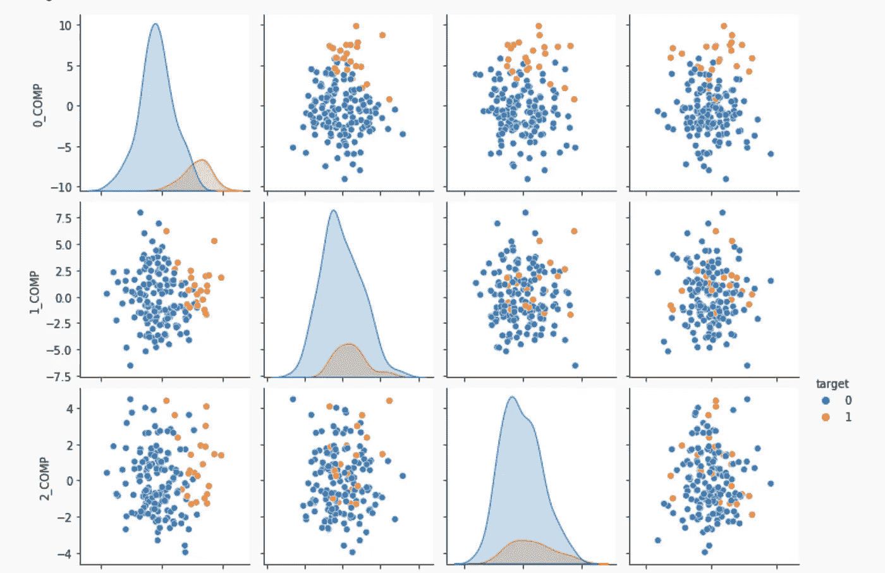

# 过采样:主成分分析-KNN 方法

> 原文：<https://towardsdatascience.com/oversampling-a-pca-knn-approach-f392ca232486?source=collection_archive---------17----------------------->

## 利用多数类信息改进预测

[https://jovian . ai/ana prec 07/PCA-KNN-article-notebook-breatcancer](https://jovian.ai/anaprec07/pca-knn-article-notebook-breatcancer)

在本文中，我将讨论一种使用 PCA 降维和 K-最近邻算法的过采样方法。它包括(1)预处理特征以缩放它们、去除空值和去除离群值；(2)通过主成分分析降低它们的维数；(3)使用 KNN 算法找到与少数类观察足够相似的多数类观察，以使它们被错误地认为是少数类。

请随时通过这个木星笔记本跟随练习。

我将使用通过 scikit-learn 图书馆获得的乳腺癌数据集。在笔记本中，我对数据集进行了重新采样，以创建一个新的高度不平衡的版本，它有 248 个观察值，其中只有 36 个是阳性的——换句话说，14%。使用 train_test_split，我们将数据集分为训练(70%)和测试(30%)。

在评估我在本文中提出的 PCA KNN 过采样方案之前，我们需要一个基准。为此，我们将创建两个基本模型，它们直接根据我们新创建的功能进行训练。为了多样性，我们将看看 SVM，决策树分类器，随机森林和梯度推进。

接下来，我们将使用基本算法预测我们的测试集，并创建一个函数来帮助我们通过在一个清晰有序的 pandas 表中选择的指标(平均精度、Breier 得分损失、ROC AUC)来评估它们的性能。让它成为一个预先定义的函数的目的是为了我们将来可以重用它。

这是我从 [sklearn 文档](https://scikit-learn.org/stable/modules/generated/sklearn.metrics.brier_score_loss.html)中直接引用的一个度量词典。

# 度量字典:

*   **average _ precision _ score**:“AP 将精度-召回曲线总结为每个阈值下达到的精度的加权平均值，召回率从前一个阈值的增量作为权重。这种实现不是内插的，并且不同于用梯形规则计算精度-召回曲线下的面积，梯形规则使用线性内插并且可能过于乐观”。
*   **Brier _ score _ loss**:“Brier 分数损失越小越好，故以“损失”命名。Brier 评分衡量预测概率和实际结果之间的均方差。Brier 分数总是取 0 和 1 之间的值，因为这是预测概率(必须在 0 和 1 之间)和实际结果(只能取 0 和 1 之间的值)之间的最大可能差异。
*   **roc auc** :“根据预测得分计算受试者工作特征曲线下面积(roc auc)”。

# 基本模型结果:

# 提议的过采样技术:主成分分析 KNN

接下来，我们将尝试一种方法，在这种方法中，我们将使用主成分分析和 KNN，以便将一些负面观察转化为正面观察，并提高我们的机器学习模型的质量。

在下面的 cod 中，我们将创建一个表，通过该表我们将选择哪些是多数类观测值，我们希望通过少数类观测值切换到 fakely，以便我们可以丰富我们接下来要训练的模型。

如前所述，我们预处理数据(电源变压器和标准定标器)，对其应用主成分分析，然后用 KNN 识别这些我们将切换的观察值。

这是我们使用的 PCA 组件的漂亮的 seaborn pairplot 图:

在这里，我们使用生成的数据来训练和预测 KNN:

我们为多数类观察选择了一个阈值截止点，我们将切换到少数类，我们用它们创建新的目标。

在笔记本中，阈值设置为 0.3。通过这种方式，我们获得了 5 个新的积极观察值——这听起来可能不多，但比我们在训练集中的原始数量增加了 20%。

我们在这里训练模型:

和他们一起预测:

# **结论——这意味着什么？**

这意味着过采样方法确实产生了稍微好一点的模型。正如你在木星笔记本上看到的，如果我们以预测值 0.97 为分界点，我们会得到 7 个正确的预测值，而不是以前的 3 个。另一个优点是，该技术在不影响或夸大模型特征重要性的情况下实现了更高的性能。它有助于一种侵入性更小的过采样技术，同时仍然改善基本预测。

<https://www.linkedin.com/in/anapreciado/> 