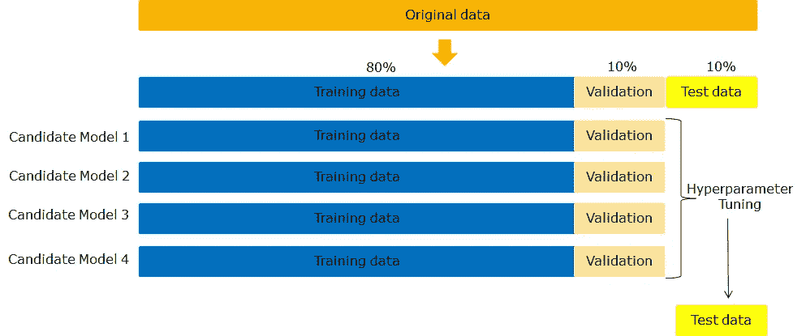
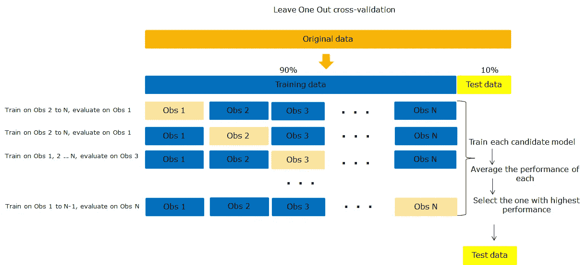
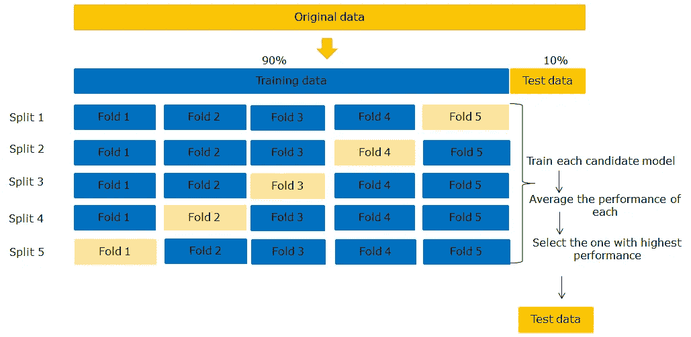

# 缓解过拟合问题的 4 种模型验证方法概述

> 原文：<https://towardsdatascience.com/overview-of-4-model-validation-approaches-to-mitigate-overfitting-problem-6d2eecdf8053?source=collection_archive---------24----------------------->

## 本文是一篇 ***全面概述*** 的四(4)个模型验证策略以构建健壮的模型

图片由[杰奎琳·马库](https://pixabay.com/users/jackmac34-483877/)提供，来自 [Pixabay](https://pixabay.com/photos/tampons-authorization-validation-1143489/)

# 为什么模型验证很重要

未经验证而训练的模型可能会过度拟合测试数据。如果我们只处理两组数据，即训练和测试数据，这种情况很可能发生。

(图片由作者提供)

为了减少测试数据的过度拟合，您将需要验证。在本文的其余部分，我们将讨论不同的验证方法，从单一交叉验证(最不健壮)到 k 重交叉验证的不同变体(更健壮)。

# 单一交叉验证

这是您可以执行的最简单的验证方法。它涉及到三组数据的使用:训练数据**、**验证数据**和**测试数据。**典型的划分是 80%用于培训，10%用于验证，10%用于测试。**

**如果 y** 你有 ***N*** 个候选模型( ***N*** 在下图的例子中是 4)，这些模型将使用训练数据进行训练，并使用验证数据进行评估。评估的过程是超参数调整。一旦找到可能的最佳模型，它将在测试数据上运行，以便了解它在现实世界中的表现。总的来说，我们有 ***N 个训练过程******N 个验证过程******只有 1 个测试过程*** 。

(图片由作者提供)

这种方法的问题是，在拆分之后，验证集中的数据将永远不会用于训练模型。此外，由于训练和验证分割的随机性，您可能会选择一个恰好给出非常差的结果，或者可能给出很好的结果的分割。我们将看到如何应用更健壮的技术来缓解这些问题。

# K 重交叉验证的不同变体

对于每个候选模型，这些方法包括使用训练数据的不同子集重复训练和验证。这是一个非常稳健的数据，不会浪费数据，因为每个观察值都用于训练和验证。使用这种方法与 ***N*** 候选模型和 *K* 折叠，你将运行 ***NxK 训练*** 和 ***N 个验证过程*** ，但是 ***只有 1 个测试过程*** 。

## 遗漏一个交叉验证

假设您有一个大小为 ***N*** 的训练数据，当使用这种方法时，您首先保持第一个观察值，在剩余的 ***N-1*** 观察值上训练您的模型，并在保持观察值上评估它。然后，维持第二次观察，在 ***N-1*** 剩余观察上训练模型，并在维持(第二次观察)上评估模型。同样的过程也适用于第三次观察，以此类推。在这个过程的最后，你将对每个观测值进行一次精确的测量，并将得到 ***N*** 的评估值。最终的评估指标是 ***N*** 值的平均值。

(图片由作者提供)

这种技术的好处是，它确保每一个观察结果都用于培训和评估。然而，这可能非常耗时且计算量大，因为只有一个模型被训练 ***N*** 次。此外，如果您有 ***M*** 个候选模型，则每个模型都将在所有这些分割上进行训练和验证，这将增加很多计算时间。

## k 重交叉验证

这种方法类似于省去一个交叉验证，但是在模型性能方面，极大地改进了计算时间，而没有损失太多。它不是一次只保留一个观察值，而是将训练数据拆分成相等数量的数据(称为折叠)。

(图片由作者提供)

训练数据被分成 5 个相同大小的不同数据，在本例中，我们执行 5 重交叉验证。在每次迭代中，模型在 4/5 的数据上进行训练，在剩下的 1/5 的数据上进行验证

*   从分割 1 开始，折叠 1 至 4 用于训练模型，折叠 5 用于验证模型。
*   从分割 2 开始，折叠 1 至 3 和 5 用于训练模型，折叠 4 用于验证模型。
*   执行相同的过程直到分割 5，并且这适用于所有模型。

数据中的每个观察值用于验证一次，单个模型的整体性能通过平均所有分割的所有性能获得。在所有模型的训练结束时，最好的模型是具有最高性能值(最低误差值)的模型。然后对测试数据运行最佳模型，以获得对未知数据的性能评估。

K-folds 改进了留一交叉验证，但是在将训练数据分成不同的 folds 时，它们都没有考虑到类/标签，这可能是一个缺点，因为一些标签可能在一些 folds 中不被表示。

## 分层 K 重交叉验证

这种方法在分割成折叠时考虑训练数据的标签/类别，并确保每个折叠具有不同类别的表示。假设原始数据被分类为“疟疾”和“疟疾”，每个文件夹将具有整个数据中存在的“疟疾”或“非疟疾”的近似代表性混合。

假设训练数据有 100 个观测值，80 个“疟疾”，20 个“非疟疾”。如果您决定应用 10 倍验证，每个折叠将有大约 8 个“疟疾”和 2 个“非疟疾”

# 文章结尾

我希望您喜欢这篇文章。如果您有任何问题或意见，我将很高兴欢迎他们进行进一步的讨论。如需进一步阅读，请随时查阅以下链接:

[https://sci kit-learn . org/stable/modules/cross _ validation . html](https://scikit-learn.org/stable/modules/cross_validation.html)

再见🏃🏾