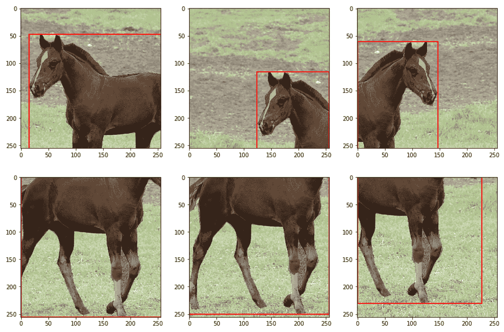
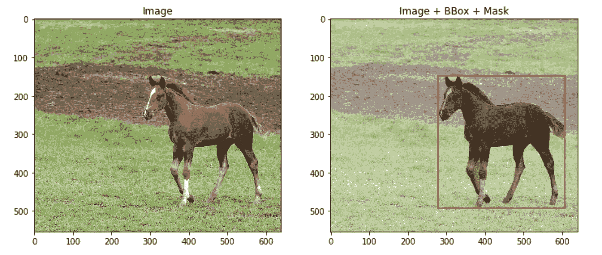
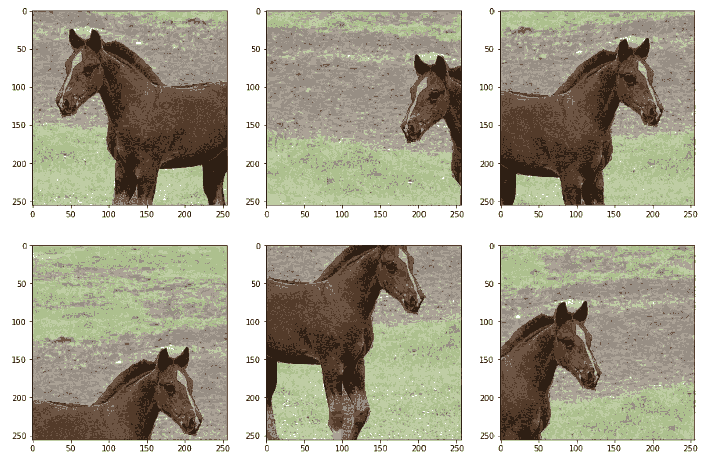
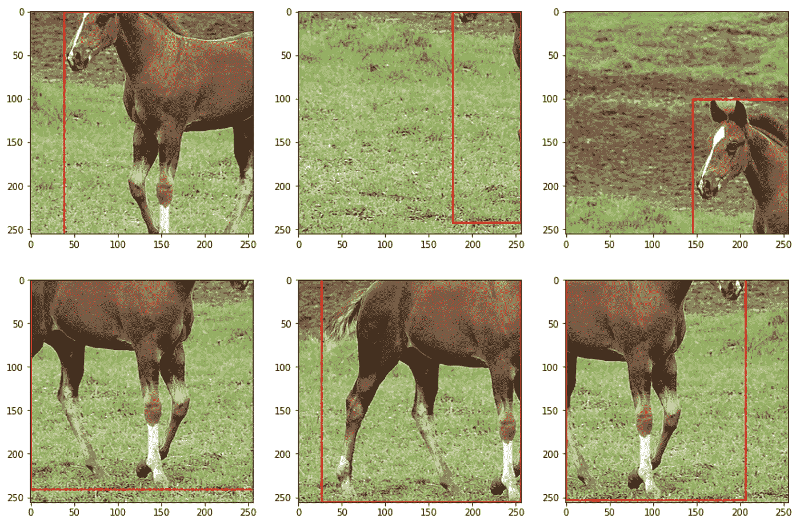

# 相册概述:用于高级图像增强的开源库

> 原文：<https://towardsdatascience.com/overview-of-albumentations-open-source-library-for-advanced-image-augmentations-c821a025c2ca?source=collection_archive---------31----------------------->

## [实践教程](https://towardsdatascience.com/tagged/hands-on-tutorials)

## *带有关于增强和集成 PyTorch 和 Tensorflow 管道的代码片段*。



作者图片

原生 PyTorch 和 TensorFlow 增强器有一个很大的缺点，它们不能同时增强图像及其分段遮罩、边界框或关键点位置。所以有两个选择——要么自己写函数，要么用第三方库。两个我都试过了，第二个选择更好🙂

# 为什么是白蛋白？

[albuminations](https://albumentations.ai/)是我尝试过的第一个图书馆，我一直坚持着，因为:

*   它是开源的，
*   直觉，
*   快，
*   拥有超过 60 种不同的增强功能，
*   证据充分，
*   最重要的是，可以同时增强图像及其分段遮罩、边界框或关键点位置。

还有两个类似的库——[img aug](https://github.com/aleju/imgaug)和 [Augmentor](https://github.com/mdbloice/Augmentor) 。不幸的是，我不能提供任何比较，因为我还没有尝试过。直到现在，白蛋白已经足够了。

# 简短教程

在这个简短的教程中，我将展示如何用几行代码轻松地增强图像以用于分割和对象检测任务。

如果你想跟随这个教程:

1.  [安装抛光垫](https://albumentations.ai/docs/getting_started/installation/)。我真的建议检查你是否有最新的版本，因为旧的版本可能会有问题。我用的是 1.0.0 版本，运行良好。
2.  下载标签如下的测试图像。这只是来自 [COCO 数据集](https://cocodataset.org/#home)的随机图像。我稍微修改了一下，然后按照相册要求的格式保存了下来。该库接受 NumPy 数组形式的图像、NumPy 数组形式的分段遮罩和列表形式的边界框。

在这里下载。

让我们加载图像、它的二进制像素分割蒙版和一个边界框。边界框被定义为 4 元素列表— [x_min，y_min，width，height]。

```
import pickle 
import numpy as np 
import matplotlib.pyplot as plt 
import matplotlib.patches as patches# load data
with open("image_data.pickle", "rb") as handle:
    image_data = pickle.load(handle)image = image_data["image"]
mask = image_data["mask"]
bbox = image_data["bbox_coco"]# visualize data
fig, ax = plt.subplots(1, 2, figsize=(12, 5))
ax[0].imshow(image)
ax[0].set_title("Image")
ax[1].imshow(image)
bbox_rect = patches.Rectangle(
    bbox[:2], bbox[2], bbox[3], linewidth=2, edgecolor="r", facecolor="none"
)
ax[1].add_patch(bbox_rect)
ax[1].imshow(mask, alpha=0.3, cmap="gray_r")
ax[1].set_title("Image + BBox + Mask")
plt.show()
```

在加载并可视化图像后，您应该会看到:



*图像。运行图像及其标签可视化代码时的输出。分割遮罩被可视化为透明的黑白图像(1 为黑色，“马”)。作者图片*

**用于分割的掩模增强**。现在我们可以从白蛋白开始。这里的转换定义非常类似于 PyTorch 和 TensorFlow (Keras API):

*   通过使用 Compose 对象组合几个扩充来定义转换。
*   每个增强都有参数“p ”,即要应用的概率，此外还有特定于增强的参数，如 RandomCrop 的“width”和“height”。
*   使用定义的变换作为函数来增加图像及其遮罩。这个函数返回一个包含关键字“图像”和“遮罩”的字典。

下面是如何用随机 256×256 裁剪(总是)和水平翻转(仅在 50%的情况下)来增加图像(及其遮罩)的代码。

```
import albumentations as A# define agumentation
transform = A.Compose([
    A.RandomCrop(width=256, height=256, p=1),
    A.HorizontalFlip(p=0.5),
])# augment and visualize images
fig, ax = plt.subplots(2, 3, figsize=(15, 10))
for i in range(6):
    **transformed = transform(image=image, mask=mask)**
    ax[i // 3, i % 3].imshow(transformed["image"])
    ax[i // 3, i % 3].imshow(transformed["mask"], alpha=0.3, cmap="gray_r")
plt.show()
```

结果，你应该得到这样的东西。您的增强图像会有所不同，因为白蛋白会产生随机转换。关于面罩增大的详细教程，请参考[原始文档](https://albumentations.ai/docs/getting_started/mask_augmentation/)。



*形象。运行用于同时增强图像和遮罩的代码时的输出。*
*分割蒙版被可视化为透明的黑白图像(1 为黑色，‘马’)。作者图片*

**用于对象检测的包围盒增强**。然而，它类似于分段遮罩的增强:

*   此外，定义“bbox_params ”,其中指定边界框的格式和边界框类的参数。“coco”表示 COCO 数据集格式的边界框— [x_min，y_min，width，height]。参数“bbox_classes”将在后面用于传递边界框的类。
*   ` transform '接受边界框作为列表的列表。此外，即使图像中只有一个边界框，它也需要边界框类(作为列表)。

下面是对图像及其边界框同时进行 RandomCrop 和 HorizonalFrip 的代码。

```
# define augmentation 
transform = A.Compose([
     A.RandomCrop(width=256, height=256, p=1),
     A.HorizontalFlip(p=0.5), 
], **bbox_params=A.BboxParams(format='coco', label_fields=["bbox_classes"])**)# augment and visualize 
bboxes = [bbox]
bbox_classes = ["horse"]fig, ax = plt.subplots(2, 3, figsize=(15, 10))
for i in range(6):
 **transformed = transform(
        image=image, 
        bboxes=bboxes, 
        bbox_classes=bbox_classes
    )**
    ax[i // 3, i % 3].imshow(transformed["image"])
    trans_bbox = transformed["bboxes"][0]
    bbox_rect = patches.Rectangle(
        trans_bbox[:2],
        trans_bbox[2],
        trans_bbox[3],
        linewidth=2,
        edgecolor="r",
        facecolor="none",
    )
    ax[i // 3, i % 3].add_patch(bbox_rect)
plt.show()
```

这是结果。如果您需要一些特定的边界框扩充，请参考[原始文档](https://albumentations.ai/docs/getting_started/bounding_boxes_augmentation/)。



*图像。运行同步图像
和边界框扩充代码时的输出。作者图片*

多个目标的同时增强。除了允许同时[增加几个遮罩](https://albumentations.ai/docs/getting_started/mask_augmentation/)或[几个边界框](https://albumentations.ai/docs/getting_started/bounding_boxes_augmentation/)之外，Albumentations 还有一个功能可以同时增加不同类型的标签，例如，一个遮罩和一个边界框。

当调用“转换”时，简单地给它你所拥有的一切:

```
# define augmentation 
transform = A.Compose([
     A.RandomCrop(width=256, height=256, p=1),
     A.HorizontalFlip(p=0.5), 
], bbox_params=A.BboxParams(format='coco', label_fields=["bbox_classes"]))# augment and visualize 
bboxes = [bbox]
bbox_classes = ["horse"]fig, ax = plt.subplots(2, 3, figsize=(15, 10))
for i in range(6):
    **transformed = transform(
        image=image, 
        mask=mask, 
        bboxes=bboxes, 
        bbox_classes=bbox_classes
    )**
    ax[i // 3, i % 3].imshow(transformed["image"])
    trans_bbox = transformed["bboxes"][0]
    bbox_rect = patches.Rectangle(
        trans_bbox[:2],
        trans_bbox[2],
        trans_bbox[3],
        linewidth=2,
        edgecolor="r",
        facecolor="none",
    )
    ax[i // 3, i % 3].add_patch(bbox_rect)
    ax[i // 3, i % 3].imshow(transformed["mask"], alpha=0.3, cmap="gray_r")
plt.show()
```

您的结果将如下图所示。这里是关于那个的[更详细的文档。](https://albumentations.ai/docs/getting_started/simultaneous_augmentation/)


*形象。运行同步图像、分割遮罩、
和边界框增强代码时的输出。分割蒙版被可视化为透明的
黑白图像(1 为黑色，‘马’)。作者图片*

**还有更多。**albuminations 有更多可用的功能，例如对[关键点](https://albumentations.ai/docs/getting_started/keypoints_augmentation/)和[自动增强](https://albumentations.ai/docs/autoalbument/)的增强。它包括大约 60 种不同的增强类型，字面意思是你需要的任何任务。

最有可能的是，你将使用白蛋白作为 PyTorch 或 TensorFlow 培训管道的一部分，所以我将简要描述如何做。

PyTorch 。当[创建自定义数据集](https://pytorch.org/tutorials/beginner/basics/data_tutorial.html#creating-a-custom-dataset-for-your-files)时，在` __init__ '函数中定义 Albumentations 转换，并在` __getitem__ '函数中调用它。PyTorch 模型要求输入数据是张量，所以确保在定义“transform”时将“ToTensorV2”作为最后一步添加(这是一个来自 Albumentations 教程之一的技巧)。

```
from torch.utils.data import Dataset
from albumentations.pytorch import ToTensorV2class CustomDataset(Dataset):
    def __init__(self, images, masks):
        self.images = images  # assume it's a list of numpy images
        self.masks = masks  # assume it's a list of numpy masks
        **self.transform = A.Compose([
            A.RandomCrop(width=256, height=256, p=1),
            A.HorizontalFlip(p=0.5),
            ToTensorV2,
        ])** def __len__(self):
        return len(self.images) def __getitem__(self, idx):
        """Returns a single sample"""
        image = self.images[idx]
        mask = self.masks[idx]
        **transformed = self.transform(image=image, mask=mask)
        transformed_image = transformed["image"]
        transformed_mask = transformed["mask"]**
        return transformed_image, transformed_mask
```

**TensorFlow** (Keras API)也允许创建[自定义数据集](https://www.tensorflow.org/api_docs/python/tf/keras/utils/Sequence)，类似于 PyTorch。因此，在“__init__”函数中定义 Albumentations 转换，并在“__getitem__”函数中调用它。很简单，不是吗？

```
from tensorflow import kerasclass CustomDataset(keras.utils.Sequence):
    def __init__(self, images, masks):
        self.images = images
        self.masks = masks
        self.batch_size = 1
        self.img_size = (256, 256)
        **self.transform = A.Compose([
            A.RandomCrop(width=256, height=256, p=1), 
            A.HorizontalFlip(p=0.5),
        ])** def __len__(self):
        return len(self.images) // self.batch_size def __getitem__(self, idx):
        """Returns a batch of samples"""
        i = idx * self.batch_size
        batch_images = self.images[i : i + self.batch_size]
        batch_masks = self.masks[i : i + self.batch_size]
        batch_images_stacked = np.zeros(
            (self.batch_size,) + self.img_size + (3,), dtype="uint8"
        )
        batch_masks_stacked = np.zeros(
            (self.batch_size,) + self.img_size, dtype="float32"
        )
        for i in range(len(batch_images)):
            **transformed = self.transform(
                image=batch_images[i], 
                mask=batch_masks[i]
            )
            batch_images_stacked[i] = transformed["image"]
            batch_masks_stacked[i] = transformed["mask"]**
        return batch_images_stacked, batch_masks_stacked
```

就是这样！希望这篇教程鼓励你下次在做分割、物体检测或关键点定位任务时尝试 Albumentations。如果有，请告诉我！

*原载于*[*notrocketseconomy . blog*](https://notrocketscience.blog/)

*如果你想阅读更多类似的教程，可以订阅我的博客“非火箭科学”——*[*电报*](https://t.me/notrocketscienceblog) *和* [*推特*](https://twitter.com/nRocketScience) *。*