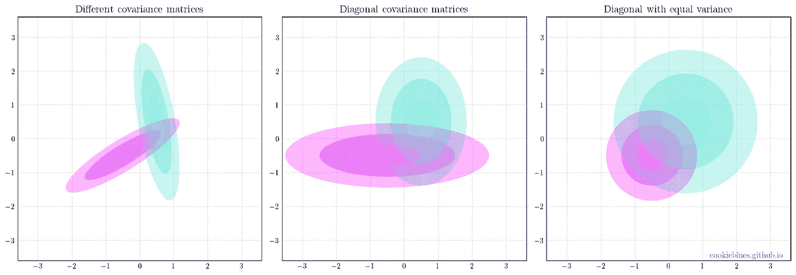
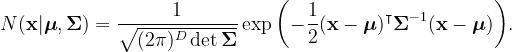
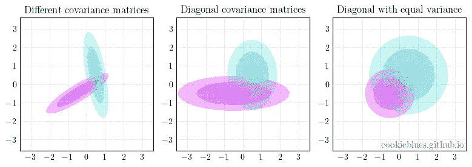
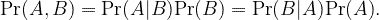
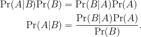
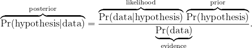
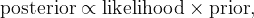

# 分类器概述

> 原文：<https://towardsdatascience.com/overview-of-classifiers-d0a0d3eecfd1?source=collection_archive---------22----------------------->

## 对分类、模型概述和其中重要概念的简要介绍

多元高斯分布中不同协方差矩阵的图示。图片作者。

# 内容

这篇文章是我将要发表的一系列文章的一部分。你可以通过点击[这里](https://cookieblues.github.io/guides/2021/03/30/bsmalea-notes-3a/)在我的个人博客上阅读这篇文章的更详细版本。下面你可以看到该系列的概述。

## 1.机器学习导论

*   [(一)什么是机器学习？](/what-is-machine-learning-91040db474f9)
*   [(b)机器学习中的模型选择](/model-selection-in-machine-learning-813fe2e63ec6)
*   [(c)维度的诅咒](/the-curse-of-dimensionality-5673118fe6d2)
*   [(d)什么是贝叶斯推理？](/what-is-bayesian-inference-4eda9f9e20a6)

## 2.回归

*   [(a)线性回归的实际工作原理](/how-linear-regression-actually-works-theory-and-implementation-8d8dcae3222c)
*   [(b)如何使用基函数和正则化改进您的线性回归](/how-to-improve-your-linear-regression-with-basis-functions-and-regularization-8a6fcebdc11c)

## 3.分类

*   **(a)分类器概述**
*   [(b)二次判别分析(QDA)](/quadratic-discriminant-analysis-ae55d8a8148a#204a-71584f33e137)
*   [(c)线性判别分析](/linear-discriminant-analysis-1894bbf04359)
*   [(d)(高斯)朴素贝叶斯](/gaussian-naive-bayes-4d2895d139a)

# 分类器的类型

正如在系列文章的第一篇[中提到的，在分类中，目标变量的可能值是离散的，我们称这些可能值为“类”。在](/what-is-machine-learning-91040db474f9) [2(a)](/how-linear-regression-actually-works-theory-and-implementation-8d8dcae3222c) 和 [2(b)](/how-to-improve-your-linear-regression-with-basis-functions-and-regularization-8a6fcebdc11c) 中，我们经历了回归，简而言之，这是指从数据集 **X** 中构造一个函数 *h* ( **x** )，该函数为新的值 **x** 产生预测值 *t* 。分类的目的是相同的，除了 *t* 的值是离散的。

我们将讨论 3 种不同的方法或分类器类型:

*   **生成分类器**，对输入和目标变量 Pr 的联合概率分布进行建模( **x** ， *t* )。
*   **鉴别分类器**，其对给定输入变量 Pr( *t* | **x** )的目标的条件概率分布进行建模。
*   **不使用概率模型但直接将输入分配给目标变量的无分布分类器**。

这个主题的一个快速声明:**术语会很混乱**，但是当我们跨越这些桥梁时，我们会处理它。

# 生成性与鉴别性

下面是我们将要讨论的分类器列表:对于**生成分类器**来说，它是**二次判别分析(QDA)** 、**线性判别分析(LDA)** 和(高斯)**朴素贝叶斯**，它们都是同一模型的特例；对于**歧视分类器**来说是**逻辑回归**；对于**无分布分类器**，我们将看看**感知器**以及**支持向量机(SVM)** 。

所以，他们都做同样的事情(分类)。哪个最好？你应该用哪一个？好吧，让我们回忆一下“没有免费的午餐”定理，它概括地说，没有一个模型总是比另一个更好。它总是取决于你的数据。也就是说，关于生成性和区别性量词，我们可以说一些事情。Ng 和 Jordan (2002)发现，重复将朴素贝叶斯和逻辑回归应用于二元分类任务的实验，**朴素贝叶斯(生成型)在数据较少的情况下表现更好，但逻辑回归通常表现更好** [1]。然而，Ulusoy 和 Bishop (2006)指出，**只有当数据遵循生成模型的假设时才会出现这种情况**【2】，这意味着逻辑回归(判别)通常优于朴素贝叶斯(生成)。

**普遍的共识是，在大多数情况下，判别模型优于生成模型**。其原因是，生成模型在某种程度上有更困难的工作，因为它们试图模拟联合分布，而不仅仅是后验分布。他们还经常对数据做出不切实际的假设。然而，怎么强调都不为过，尽管情况并非总是如此，而且**你不应该忽视生成模型**。例如，生成对抗网络(GANs)是一种生成模型，已经证明在各种任务中非常有用。还有一些其他的原因可以解释为什么你不应该忽视生成模型，例如，它们更容易适应。无论如何，我们在这里不是要找出使用哪种模型，而是要了解这两种模型。

# 重要工具

## 多元高斯分布

在接下来的文章中，我们将非常依赖多元高斯(正态)分布，掌握它非常重要。多元高斯分布表示为 *N* ( ***μ*** ，**σ**)，其中 ***μ*** 为均值向量，**σ**为协方差矩阵。 *D* 维的概率密度函数定义为

协方差矩阵决定了高斯分布的形状，对于我们将要研究的分类器来说是一个重要的概念。下图展示了不同类型的协方差矩阵。

多元高斯分布中不同协方差矩阵的图示。图片作者。

## 贝叶斯定理

我们要使用的另一个重要工具是贝叶斯定理。如果你没有读过关于频率主义和贝叶斯主义的文章，那么这里有一个关于贝叶斯定理的快速回顾。给定两个事件 *A* 和 *B* ，我们可以用条件概率扩展它们的联合概率

利用右边的等式，我们可以改写它，得到贝叶斯定理

就假设和数据而言，我们经常使用后验、似然、先验和证据来指代贝叶斯定理的部分

我们经常这样写

其中∝表示“成比例”。

# 参考

[1] Andrew Y. Ng 和 Michael I. Jordan，“判别型和生成型分类器:逻辑回归和朴素贝叶斯的比较”，2001 年。

[2] Ilkay Ulusoy 和 Christopher Bishop，“用于对象检测和分类的生成和鉴别技术的比较”，2006 年。