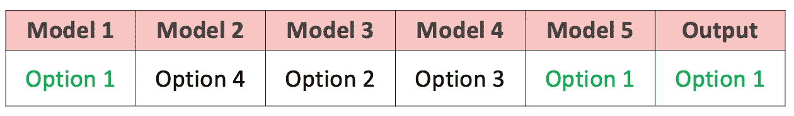
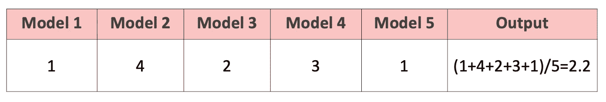
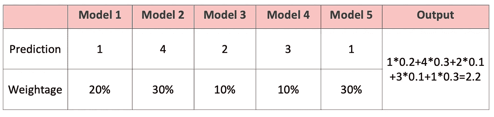
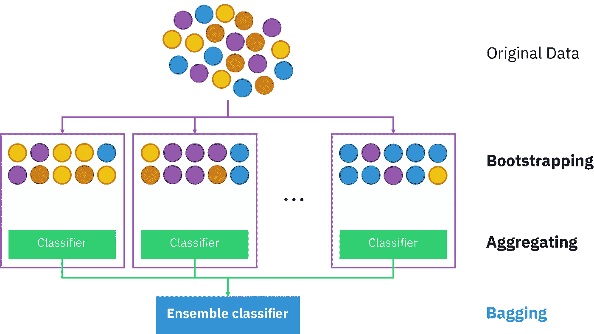
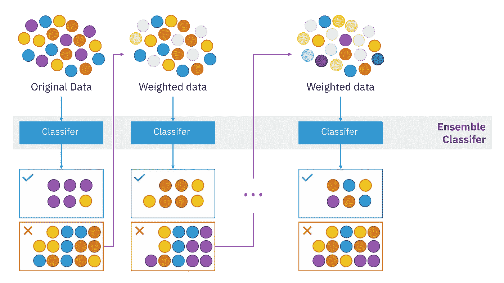

# 什么是集成学习？

> 原文：<https://towardsdatascience.com/overview-of-ensemble-learning-c216a9f6c04?source=collection_archive---------25----------------------->

## 简单的集合方法，装袋，引导，助推

来自 [Unsplash](https://medium.com/u/2053395ac335?source=post_page-----c216a9f6c04--------------------------------) 的夏洛特·诺勒的照片

想象一下，你计划去度假，还没有决定去哪里(是的，在 covid 期间，我只能梦想旅行)。你不能自己决定，因此你想收集更多的信息。你在网上搜索不同旅游目的地的旅游反馈，你向一些朋友寻求建议，最后，你需要**根据多种信息来源**做出决定。

在生活中做出决定从来都不容易，这也适用于机器学习模型。不同的模型在不同的场景下表现良好。您可以选择运行多个模型并汇总结果，而不是依赖单个模型的结果。

> 现在问题来了，如何汇总不同模型的结果并做出最终决策？

集成学习模型是多个模型的集合，它结合不同的决策来提高整体性能。本文的主要目的是向您概述不同的集成学习方法如何从不同的模型中聚合结果。

# 基本集成技术

## 1.最大投票

你收集完去哪里旅游的建议。你意识到大多数人都推荐你去马尔代夫。嗯，既然大多数人都推荐那个地方，那就不会错。最后，你决定去马尔代夫。

该方法输出具有最高投票的结果，或者您可以将此视为采用所有预测的模式。通常，它应用于分类结果。

最大投票

## 2.简单平均/加权平均

决定去哪里后，你要决定兑换多少钱。根据你在网上搜索的预算数字和你朋友告诉你的，你应该决定一个数字。

**简单平均:**你可以对你找到的所有数字进行简单平均。

简单平均数

**加权平均:**你知道你的一些朋友真的很有钱，所以你没有办法花他们的预算(悲伤故事)。因此，您希望采用加权平均法，并对更适合您个人资料的旅程给予更多权重。

加权平均值

# 打包/引导汇总

Bagging 超越了基本的集成学习。它不仅依赖于来自多个模型的结果，它让每个模型在原始数据集的不同随机子集上训练(带有替换)

> 我们为什么要这么做？

一些机器学习模型对训练数据集非常敏感，这意味着它们的模型方差会很高。这并不理想，因为当数据发生变化时，可能会对结果产生很大影响。

> 这也是一个被称为过度拟合的问题。通过为不同的模型随机选择训练子集，使模型的敏感性多样化，从而减轻过拟合。

作者西拉科恩——自己的作品，CC BY-SA 4.0，[https://commons.wikimedia.org/w/index.php?curid=85888768](https://commons.wikimedia.org/w/index.php?curid=85888768)

**随机森林算法**采用 Bagging 技术，通过随机选择数据集的子集来适合不同的决策树。此外，随机森林算法还将模型的待训练特征随机化，这进一步减少了过拟合的机会。

来自 [Unsplash](https://medium.com/u/2053395ac335?source=post_page-----c216a9f6c04--------------------------------) 的 Jens Lelie 的照片

这是因为决策树是对他们接受训练的特定数据非常敏感的模型之一。因此，bagging 和随机化特征可以帮助获得将模型应用于测试数据集的更好结果。

# 助推

Bagging 或其他基本集成学习方法是并行技术，这意味着每个模型在聚合之前独立运行。Boosting 是一种连续的技术，在这种技术中，不同的模型被迭代地添加以提高整体模型性能。

boosting 的思想是将多个弱模型组合起来，形成一个强模型。每个模型都有自己的优势，boosting 试图结合不同模型的优势。

由西拉科恩——自己的作品，CC BY-SA 4.0，[https://commons.wikimedia.org/w/index.php?curid=85888769](https://commons.wikimedia.org/w/index.php?curid=85888769)

Boosting 通过迭代实现聚合。当一个模型训练数据时，它会将模型结果与地面真实情况进行比较，并找出错误分类的案例。在训练随后的模型时，这些情况被给予更高的权重(意味着错误地计算这些情况将具有更高的惩罚)。结果将是所有模型的加权平均值。

常用的升压方式有 [AdaBoost](https://scikit-learn.org/stable/modules/generated/sklearn.ensemble.AdaBoostClassifier.html) 、[渐变升压](https://scikit-learn.org/stable/modules/generated/sklearn.ensemble.GradientBoostingClassifier.html)、[光渐变升压机](https://lightgbm.readthedocs.io/en/latest/pythonapi/lightgbm.LGBMClassifier.html)等。我包含了如何使用这些方法的相关文档的链接。不同的方法有不同的性能和运行时。我将在以后的文章中对这些提升方法进行更详细的比较。

# 在装袋和增压之间选择

这可能是许多人在选择型号时想知道的问题。

这取决于数据以及您选择的基本模型。一般来说，如果单一模型有过度拟合的问题，装袋将是一个更好的选择，因为它减少了模型的方差。如果单个模型的性能较低，您应该考虑使用 boosting 来提高精度。

与装袋技术相比，**升压更容易过度拟合**。然而，这并不意味着当我们选择助推时，我们对此无能为力。我们可以**为 boosting 算法**设置一些早期停止标准，这样模型就不会变得过于特定于训练数据。

# 最后

集成学习通常给出比单一模型更好的性能，因为它减轻了过度拟合问题，并且它结合了不同模型的优势。然而，这可能导致**更长的运行时间，**并且**模型逻辑更难解释**。

就个人而言，我会推荐使用集成学习模型而不是单一模型，因为该模型的性能和鲁棒性更好。当我们选择集合模型时，我们还应该考虑基础数据和基础模型来做出决定。