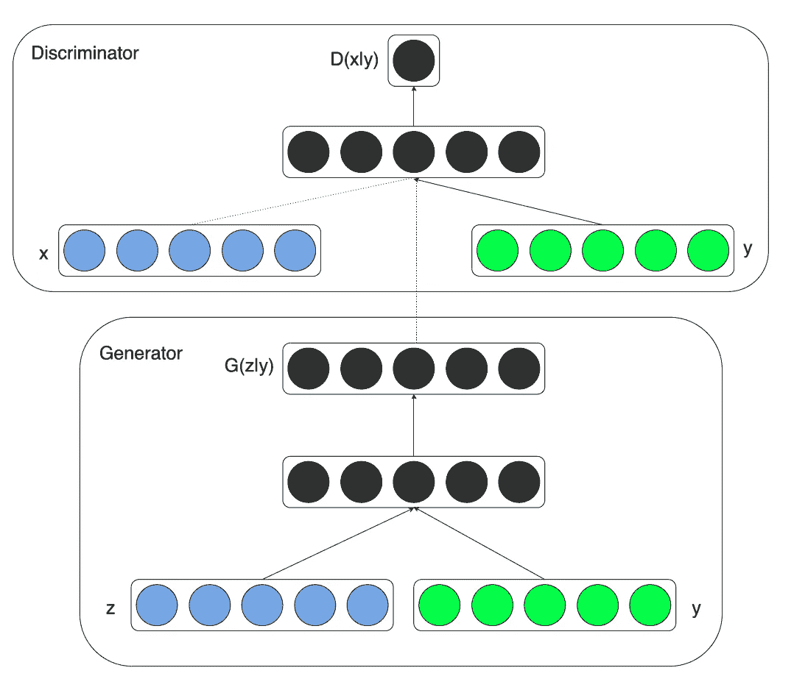
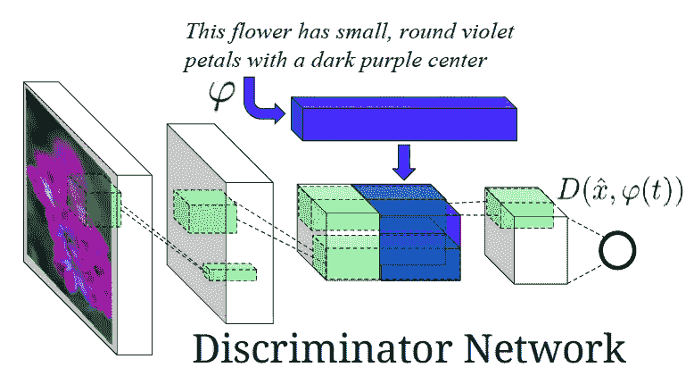
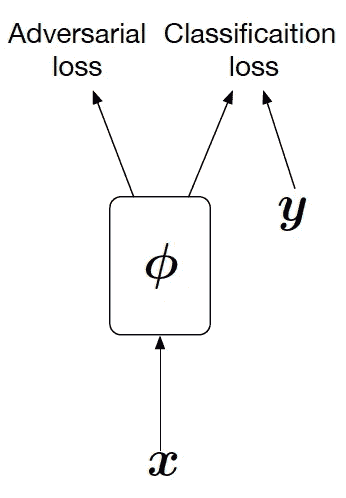
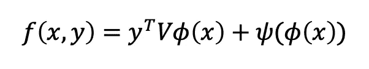
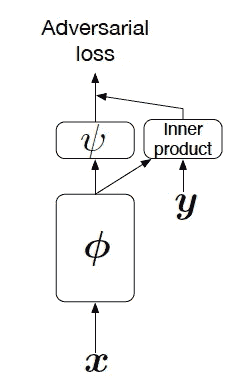
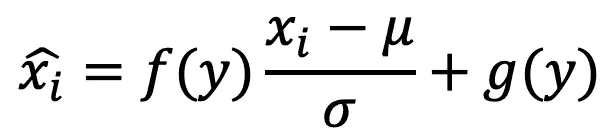

# GANs 调理方法概述

> 原文：<https://towardsdatascience.com/overview-of-gans-conditioning-methods-edeac018a7f3?source=collection_archive---------27----------------------->

## 最近，生成对抗网络不仅在计算机视觉问题上，而且在广泛的应用领域都引起了广泛的关注。使用[谷歌的 BigGANs](https://arxiv.org/abs/1809.11096) 或[英伟达的 StyleGANs](https://arxiv.org/abs/1912.04958) ，从高分辨率的训练集中生成新样本和模式的能力成为可能。

GANs 由两个神经网络组成，称为生成器和鉴别器。生成器旨在生成与训练集中的样本相似的随机样本，而鉴别器旨在区分生成的样本和真实样本。这两个网络被对立地训练；发生器被优化为将产生的样本推向正侧，而鉴别器被优化为将它们推向负侧。

GANs 的一个突出变体是[条件 GANs](https://arxiv.org/abs/1411.1784) ，其中一些附加信息被传递给发生器和鉴别器网络。该信息通常表示训练集中的类，例如，在 MNIST 数据集的情况下，不同的数字。使用 cGANs 不仅可以有条件地生成样本，还可以提高生成样本的质量。

在这篇博客中，我们将简要讨论一些最常用的条件反射方法如下:
**1-串联条件反射。
2-使用辅助分类器进行调节。
3-投射条件反射。
4-有条件的批量标准化。**

# **串联调节:**

将条件集成到网络中的最简单的方法是将其连接到第一层，即，在传递到生成器和转发到鉴别器的图像之前，将其连接到 z 向量。如图 1 所示，这种方法在第一篇关于 cgan([条件生成对抗网](https://arxiv.org/abs/1411.1784))的论文中使用过。

图 1，串联调节[ [来源](https://arxiv.org/abs/1411.1784)

该方法的扩展版本用于([生成对立文本到图像合成](https://arxiv.org/abs/1605.05396))中，他们使用可学习函数(如线性层)将条件映射到空间特征，并将输出连接到鉴别器中间层从图像中提取的特征，如图 2 所示。

图 2，在中间层连接[ [源](https://arxiv.org/abs/1605.05396)

使用这种方法的缺点是背后没有数学逻辑；通常情况下，条件是作为一个热编码的向量引入的，简单的连接与图像的像素空间无关。

# 使用辅助分类器的调节:

在 [AC-GANs](https://arxiv.org/abs/1610.09585) 中，鉴别器架构被修改以输出样本的真实概率及其类别概率。这样，鉴别器使用辅助分类器，并且目标函数被修改以包括附加项:正确类别的对数似然性。

图 3，AC-GANs 鉴别器图[ [来源](https://arxiv.org/abs/1802.05637)

这种方法的缺点是，生成器可能生成易于分类的样本，以满足新呈现的损失，因此生成的图像的多样性将较低。

# 投影调节:

在[带投影鉴别器](https://arxiv.org/abs/1802.05637)的 cGANs 中，他们修改了鉴别器，使其包含了条件和从图像中提取的特征之间的投影。该投影值测量条件和图像之间的相似性，并被添加到鉴别器 logit。鉴频器输出变为:

其中 V 是嵌入矩阵(例如 PyTorch 中的嵌入层或线性层)，该方法的示意图如图 4 所示。

图 4，鉴别器[ [源](https://arxiv.org/abs/1802.05637) ]中的条件预测

用投射进行调节已被证明比早期的方法更有效。然而，一个限制是当条件是连续值时，在这种情况下，它们不能使用嵌入矩阵进行映射，并且使用线性层会导致小的角度变化。

# 条件批处理规范化(CBN):

在( [Dumoulin et al .，2016](https://arxiv.org/abs/1610.07629) )中使用了条件批次归一化； [De Vries et al .，2017](https://arxiv.org/abs/1707.00683) )进行风格转移，其中条件 **y** 用于调制神经网络的激活函数。考虑以下等式:

其中 ***x_i*** 代表激活函数。首先，使用在小批量实例上计算的平均值和方差来标准化激活，然后通过基于所提供的条件/样式选择的自适应函数 ***f*** 和 ***g*** 来缩放和移位激活。这种思想在最近的 GANs 模型中被使用，([张等，2019](https://arxiv.org/abs/1805.08318)； [Brock et al .，2018](https://arxiv.org/abs/1809.11096) )通过用 ***CBN*** 图层 ***替换生成器中的批量归一化图层。***

总之，有许多方法可以为 GANs 的生成器和鉴别器提供附加信息。对于分类类，投影鉴别器似乎比简单的连接或使用附加分类器更有效。在生成器中，条件批处理规范化已经在最近的许多工作中使用，而不是连接。

# 参考资料:

*   [条件生成对抗网](https://arxiv.org/abs/1411.1784)
*   [艺术风格的学术表现](https://arxiv.org/abs/1610.07629)
*   [带投影鉴别器的 cGANs】](https://arxiv.org/abs/1802.05637)
*   [用辅助分类器 GANs 进行条件图像合成](https://arxiv.org/abs/1610.09585)