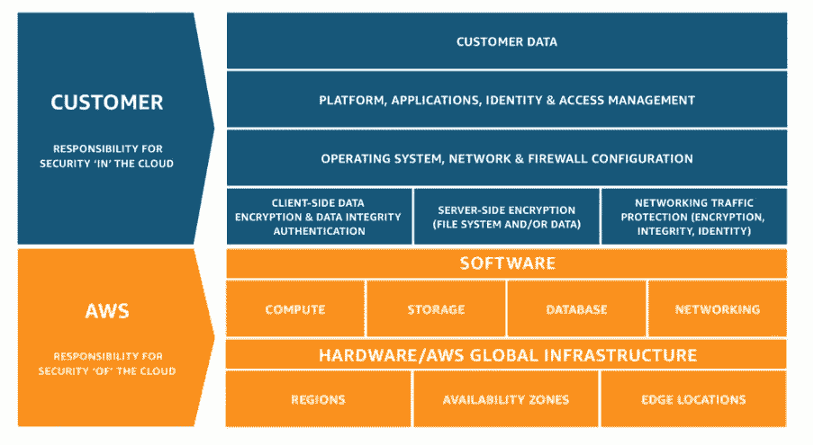

# AWS 共同责任模式概述

> 原文：<https://towardsdatascience.com/overview-of-the-aws-shared-responsibility-model-4d2dab91aced?source=collection_archive---------55----------------------->

## AWS 共享责任模型解释了如何在客户和 AWS 之间分配安全性

图片来自 Pexels

在本文中，我将解释 AWS 共享责任模型，并谈论与此相关的实践。在当今竞争激烈的世界中，云计算是越来越多的公司最想要的技术之一。虽然一些公司正在将他们现有的基础设施升级并转移到云，但一些公司已经在全面使用 AWS 服务的过程中。在云上似乎令人生畏，但是，我们需要特别关注驻留在云上的数据的安全性和合规性。AWS 共享责任模型是 Amazon 定义的关于云中安全性和合规性的实践，并定义了客户和 AWS 的责任。

图 1 — AWS 共享责任模型描述([来源](https://d1.awsstatic.com/security-center/Shared_Responsibility_Model_V2.59d1eccec334b366627e9295b304202faf7b899b.jpg))

AWS 共享责任模型是在客户和 AWS 之间划分的安全实践的集合，以便他们可以减轻压力，平等地参与云安全和合规性。AWS 通常负责管理云系统的全局基础设施，包括硬件和网络模块。这些可以跨越多个区域、可用性区域等。客户主要负责保护云中的数据，维护操作系统的补丁等。让我们详细了解一下双方的责任。

# AWS 共享责任模型

在很高的层面上，共享责任模型可以大致分为以下几类。

1.基础设施服务

2.集装箱服务

3.抽象服务

现在，让我们详细了解上述每一种责任模式。

# 基础设施服务

当考虑基础设施服务时，任何人都能想到的第一个服务是 EC2 实例。EC2，也称为弹性计算云，是一种允许客户在云上运行虚拟机的服务。正如我们所知，AWS 的主要职责是提供云的安全性，这使 AWS 能够保护其遍布全球的基础架构，包括多个地区、可用性区域和边缘位置。这也延伸到 AWS 用于计算、存储、数据库和网络的设备。

AWS 在世界各地运营着几个物理数据中心。对这些数据中心的物理访问由 AWS 以及为这些数据中心提供必要备份的其他设施控制。例如，对电力系统、不间断电源、HVAC 系统等的访问。完全由 AWS 负责。因此，维护这些的负担摆脱了客户的负担，他们可以将更多精力放在云计算业务上。

尽管如此，客户主要负责管理 EC2 实例的客户端和服务器端加密，设置安全组并允许对操作系统的特定访问。客户还负责配置防火墙并设置身份和访问管理(IAM)用户。作为一个最佳实践，应该向任何将要使用 EC2 实例的用户提供最少的访问权限。

# 集装箱服务

容器服务可以被认为是基础设施服务之上的封装。在这些服务中，操作系统的维护由 AWS 负责，而维护系统的安全性和完整性则委托给客户。在任何情况下，如果您的服务需要启动基础设施服务，它会在幕后完成。例如，将 AWS RDS 视为不需要客户安装或维护任何操作系统的容器服务。但是，在后台，AWS 已经启动了一个 EC2 实例来支持您的 RDS 实例。容器服务也称为平台即服务(PaaS)。

在这样的产品中，维护硬件和操作系统的责任由 AWS 承担。AWS 还维护各种系统补丁和其他活动，如升级系统和软件。客户在使用服务时需要保持数据加密，还需要进行必要的安全配置，如设置 VPC 和其他配置设置。下图解释了容器服务的责任模型。

# 抽象服务

AWS 共享责任模型中关注的第三个类别是抽象服务。这些服务也称为软件即服务产品。在这些服务中，大部分安全性由 AWS 自己处理，很少功能由客户负责。这对客户非常有帮助，因为他们不需要维护系统的操作更新或操作系统的补丁。但是，客户仍然有责任通过在其中应用适当的 IAM 角色和策略来保护数据。客户还应该通过维护对编程访问凭据的健康检查来控制这些服务不会受到未经授权的访问。

亚马逊 S3、DynamoDB、SQS 就是属于这一类的服务。下图描述了抽象服务模型中 AWS 和客户之间共享的一些安全特性。

# 从客户的角度看安全性

在本文的前几节中，我们已经讨论了 AWS 共享责任模型的三个层，现在让我们来讨论客户需要实现的其他一些重要的安全特性，而不考虑他们使用的各种共享责任模型。

AWS 帐户安全功能

了解安全日志

让我们详细了解一下上述每个主题。

# AWS 帐户安全功能

AWS 在 AWS 帐户中提供了许多安全功能，建议客户利用这些功能在 AWS 中构建一个安全的工作环境。一些重要的功能是在组织内定义适当的角色和策略，然后使用这些角色分配给用户和组。这有助于控制谁可以控制 AWS 帐户中的哪些服务或资源。为了访问跨帐户资源，应该使用 AssumeRole 服务，该服务可用于承担另一个 AWS 帐户的角色，并在另一个 AWS 帐户中执行一些活动。

要了解有关 AWS IAM 角色和政策的更多信息，请遵循[官方文档](https://docs.aws.amazon.com/IAM/latest/UserGuide/id_roles.html)。

# 了解安全日志

尽管我们努力保护 AWS 内的服务和资源，但仍有可能发生一些安全事故。在这种情况下，分析各种服务生成的日志以识别故障并采取适当的措施来修复它以减少漏洞是非常重要的。AWS 提供了一项名为 CloudTrail 的服务，使用它可以分析来自 web 服务器和其他服务的各种日志。要阅读更多关于 AWS CloudTrail 的信息，请关注[官方文档](https://docs.aws.amazon.com/awscloudtrail/latest/userguide/cloudtrail-user-guide.html)。

# 结论

本文详细解释了 AWS 共享责任模型，该模型解释了关注云中数据的安全性和合规性的任务。尽管将应用程序迁移到云中有好处，但也存在一些风险，因此亚马逊推出了 AWS 共享责任模型，该模型解释了客户必须关注的部分以及 AWS 将关注的部分。使用 AWS 共享责任模型，客户和 AWS 都能够管理庞大的云生态系统的安全性和合规性。

要了解更多关于 AWS 安全性和最佳实践的信息，请阅读白皮书。