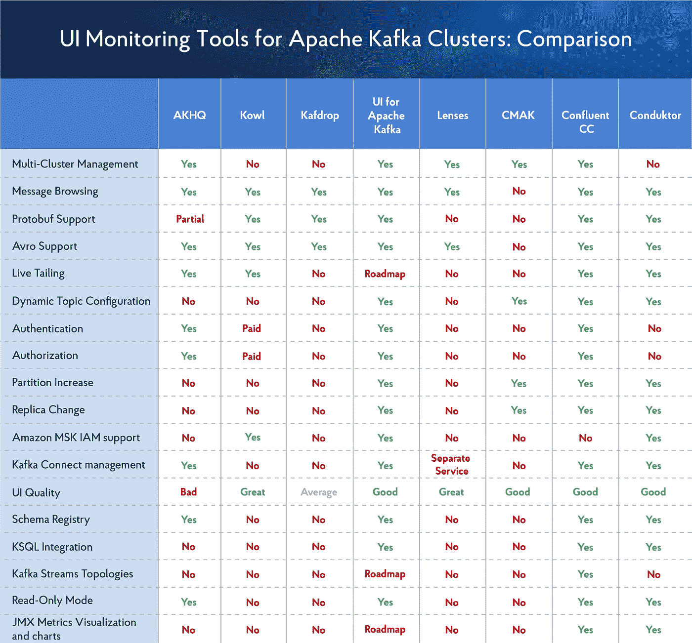
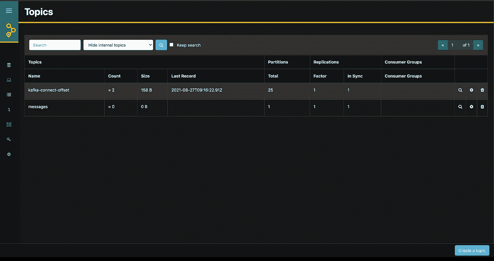
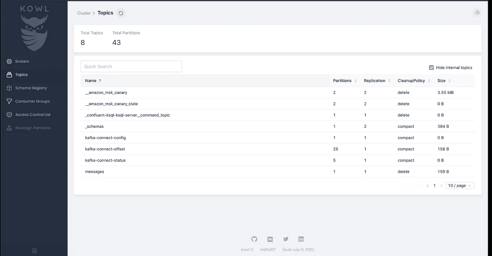
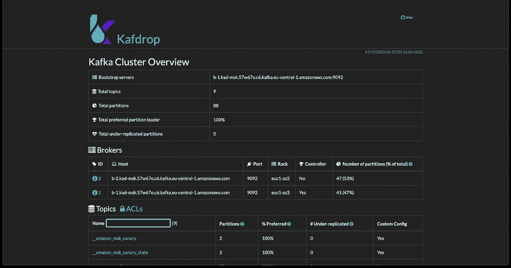
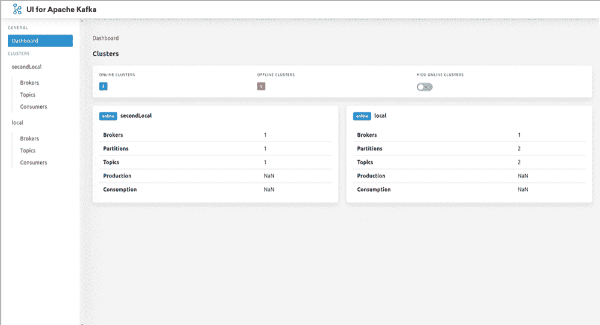
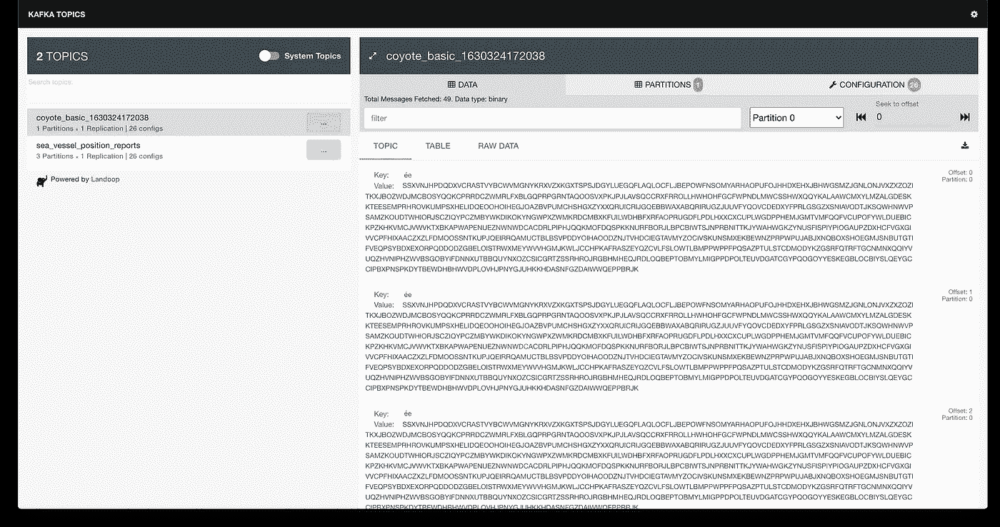
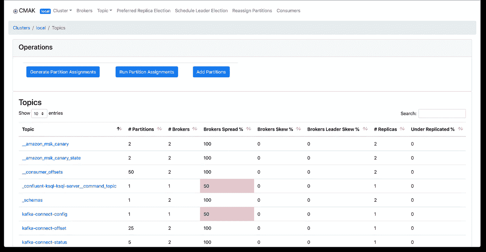
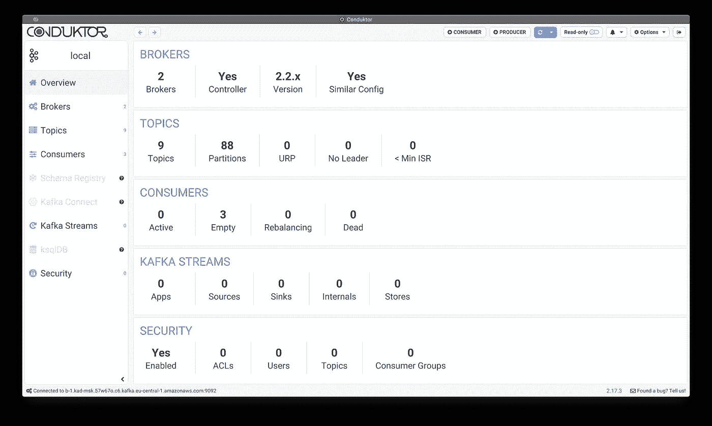

# 用于监控和管理 Apache Kafka 集群的 UI 工具概述

> 原文：<https://towardsdatascience.com/overview-of-ui-tools-for-monitoring-and-management-of-apache-kafka-clusters-8c383f897e80?source=collection_archive---------0----------------------->

图片由来自 freepic.com[的](https://ru.freepik.com/premium-photo/digital-cyberspace-and-data-network-connections_9285251.htm)[卡纳瓦特](https://ru.freepik.com/kanawatth)拍摄

在 Apache Kafka 中，工程师可以使用哪些最佳工具来观察数据流、跟踪关键指标和解决问题？

Apache Kafka 是一个开源的分布式事件流平台，使组织能够实施和处理高性能数据管道、流分析、数据集成和任务关键型应用程序。它被成千上万的公司使用，其中 80%是财富 100 强公司。

虽然 Apache Kafka 是需要实时数据处理和应用程序活动跟踪的场景的首选服务，但 Apache Kafka 中的集群监控和管理经常带来挑战。为了使这些任务更加高效和透明，您可能需要提供附加管理和监控功能的第三方、开源或商业图形工具。

本文提供了此类 UI 工具的概述，包括:

1.  AKHQ
2.  科尔
3.  卡夫多普
4.  Apache Kafka 的用户界面
5.  镜头
6.  CMAK
7.  汇合 CC
8.  康杜克托尔

但首先，让我们深入研究一下阿帕奇卡夫卡中的可观察性和监控问题。

# 阿帕奇卡夫卡中的可观察性和监控

Apache Kafka 是任何数据驱动型组织的关键服务。但是处理普通的 Apache Kafka 集群可能相当痛苦。Kafka 集群很难建立，难以扩展，维护成本也很高。最重要的是，它们容易出错并且观察起来很复杂，这可能会导致数据流中的各种业务关键问题，并阻止工程师跟踪和解决这些问题。

为了减少错误和避免关键问题，对于组织来说，通过添加健壮的可观察性组件来确保其 Apache Kafka 集群的安全是非常重要的。更好的可观察性有助于:

*   更快地解决数据流问题
*   通过对工程师通过元数据管理的数据流有一个共同的理解，改善工程师之间的协作。
*   更轻松地发现数据流中的敏感数据，以满足合规性要求。
*   更快速有效地清理数据。更少的错误仪表板意味着更满意的客户。

集群可观察性的挑战是 Apache Kafka 附带了用于所有必要管理任务的 CLI 工具。但是因为它们没有集成到一个单一的服务中，所以您必须为不同的任务分别运行不同的工具，这就造成了不便和时间损失。随着集群规模的增长，或者如果您有多个集群，问题可能会迅速升级，这仅仅是因为您缺乏正确观察它们的能力。

这让我们回到 UI 监控工具，它可以帮助组织简化和加快开发，最大限度地缩短解决问题的时间，并加快报告过程，以提高工程团队内部和之间的运营效率。

# Apache Kafka 集群的 8 大 UI 监控工具

首先，快速比较一下 Apache Kafka 集群监控工具。

作者图片

## AKHQ

*   GitHub:[https://github.com/tchiotludo/akhq](https://github.com/tchiotludo/akhq)
*   许可证:Apache 2
*   可用性:免费
*   优点:许多有用的功能
*   缺点:UI 不好；缺少 KSQL 集成；部分支持 Protobuf 模式注册表

[AKHQ](https://akhq.io/) (之前被称为 KafkaHQ)是一个用于 Apache Kafka 的 Kafka GUI，它使工程团队能够在一个统一的控制台中搜索和探索数据。有了 AKHQ，开发者和 DevOps 可以管理主题、主题数据、消费者群体、模式注册、连接性等等。

作者图片

AKHQ 提供了大量有用的功能，包括多集群管理、消息浏览、实时跟踪、认证、授权、只读模式、模式注册和 Kafka 连接管理。它支持 Avro 并兼容 LDAP 和 RBAC。

但是 AKHQ 的 UI 并不是最方便的。你肯定需要分配一些时间来调整学习曲线。

最重要的是，AKHQ 没有 KSQL 集成，只提供对 Protobuf 模式注册中心的部分支持。它也不支持动态主题配置、分区增加、副本更改、Kafka Streams 拓扑或 JMX 度量可视化和图表。

那些希望在 AWS 上使用 AKHQ 作为其数据流解决方案的一部分的人应该知道，它不支持亚马逊 MSK 的 [AWS 身份和访问管理(IAM)访问控制。](https://docs.aws.amazon.com/msk/latest/developerguide/iam-access-control.html)

## 科尔

*   GitHub:[https://github.com/cloudhut/kowl](https://github.com/cloudhut/kowl)
*   许可证:Apache 2
*   可用性:部分支付
*   优点:良好的用户界面
*   缺点:缺少许多功能

Kowl(以前称为 Kafka Owl)是一个 web 应用程序，旨在帮助开发人员探索 Apache Kafka 集群中的消息，并更好地了解这些集群中实际发生的事情。

作者图片

Kowl 最大的优势是它梦幻般的 UI。这是方便的，用户友好的，非常简单的使用。不过，它没有太多的特性。

例如，Kowl 提供消息浏览、实时跟踪，以及对 Protobuf、Avro 和亚马逊 MSK IAM 的支持，但登录系统(Google、GitHub、Okta)和 RBAC 的群组同步权限只能通过付费的 Kowl 商业计划获得。

Kowl 还缺少多集群管理、动态主题配置、分区增加、副本更改、Kafka 连接管理、模式注册、KSQL 集成、Kafka 流拓扑、只读模式以及 JMX 指标的可视化和图表等功能。如果将这些纳入一揽子计划，Kowl 将优于任何其他工具。

## 卡夫多普

*   GitHub:[https://github.com/obsidiandynamics/kafdrop](https://github.com/obsidiandynamics/kafdrop)
*   许可证:Apache 2
*   可用性:免费
*   优点:不错的社区
*   缺点:UI 一般；缺少很多功能

[Kafdrop](https://github.com/obsidiandynamics/kafdrop) 是一个用于查看阿帕奇卡夫卡主题和浏览消费群体的 web UI。该工具使开发人员能够更容易地显示和处理集群信息，如代理、主题、分区和消费者。它还允许查看消息。

作者图片

在很大程度上，Kafdrop 是一个非常普通的工具。它的用户界面并不壮观，而且缺少很多功能。它允许你查看 Kafka 经纪人和消费者团体，创建和查看主题，浏览消息，和监控 ACL。它还提供对 Azure 事件中心的支持。但是其他有用的特性呢，比如实时跟踪、模式注册或只读模式？

好消息是 Kafdrop 在 GitHub 上的评价很高，如果你正在寻找一个有帮助的沉浸式社区，这很可能是你的工具。

## Apache Kafka 的用户界面

*   GitHub:【https://github.com/provectus/kafka-ui 
*   许可证:Apache 2
*   可用性:免费
*   优点:UI 好；灵活；许多功能
*   缺点:发展中

Apache Kafka 的 UI 是一个免费的开源 web 服务，为开发者提供了一个清晰的 UI 来处理 Apache Kafka 集群。它使开发人员能够监控数据流，并在提供最佳性能的同时发现和解决数据中的问题。轻量级仪表板使跟踪 Apache Kafka 集群的关键指标变得容易，包括代理、主题、分区、生产和消费。

作者图片

Apache Kafka 的用户界面因其方便的用户界面、免费的可用性和众多的特性而脱颖而出。它具有以下功能:

*   **浏览消息** —浏览采用 Avro、Protobuf、JSON 和纯文本编码的消息
*   **查看用户群** —查看每个分区的暂停偏移，以及组合延迟和每个分区的延迟
*   **可配置认证** —使用可选的 Github/Gitlab/Google OAuth 2.0 保护您的安装
*   **查看 Kafka Brokers** —查看主题和分区分配，以及控制器状态
*   **查看 Kafka 主题** —查看分区数量、复制状态和自定义配置
*   **多集群管理** —在一个位置监控和管理您的所有集群
*   **动态主题配置** —使用动态配置创建和配置新主题

设计和构建该工具的人工智能咨询公司 Provectus 声称，最早将于 8 月底添加更多功能，包括实时跟踪、KSQL 集成、Kafka Streams 拓扑以及 JMX 度量可视化和图表。

## 镜头

*   GitHub:[https://github.com/lensesio](https://github.com/lensesio)
*   许可证:BSL
*   可用性:免费
*   优点:对于 fast-kafka-dev 和本地开发来说非常棒
*   缺点:缺少许多功能

[lens](https://lenses.io/)将自己定位为 Apache Kafka 和 Kubernetes 的实时应用和数据操作的数据操作平台。它可以帮助工程师提高数据的可用性和安全性，并消除数据孤岛。镜头似乎是实时流分析中评价最高的产品。

但是镜头可以说是一个相当普通的工具。用镜头搭配 fast-kafka-dev 再合适不过了。对地方发展也有好处。然而，它缺乏某些特征；多集群管理、消息浏览和 avro 支持根本不足以让它为许多任务工作。将 Kafka Connect 管理作为一项单独的服务提供也没有帮助。

作者图片

但如果你对没有很多功能感到满意，Lenses 的用户界面绝对符合要求。这是一个真正令人惊叹的工具，非常圆滑和直观。

## CMAK

*   GitHub:[https://github.com/yahoo/CMAK](https://github.com/yahoo/CMAK)
*   许可证:Apache 2
*   可用性:免费
*   优点:非常适合分区重新分配；Ops 工具
*   缺点:仅限于 Ops 任务

[CMAK](https://github.com/yahoo/CMAK) (之前称为 Kafka Manager)是一个全面的工具，使工程师能够管理 Apache Kafka 集群，以完成各种运营任务。

作者图片

CMAK 自诩有一个好的和相当简单的用户界面。虽然它没有提供很多特性，但是多集群管理、动态主题配置、分区创建和副本更改将涵盖您的大部分任务。

在很大程度上，CMAK 主要是一个作战工具。它也非常擅长分区重分配。

## 汇合 CC

*   GitHub:[https://github.com/confluentinc](https://github.com/confluentinc)
*   许可证:付费
*   可用性:付费
*   优点:融合企业的一部分
*   缺点:融合企业的一部分

[汇合控制中心](https://www.confluent.io/product/confluent-platform/gui-driven-management-and-monitoring/)是一个基于 web 的用户界面，允许开发人员和操作员管理和监控 Apache Kafka 集群，包括检查集群健康状况、观察和控制消息、主题和模式注册。它还可以用于开发和运行 ksqlDB 查询。

关于融合 CC 的重要事情是，它是作为融合企业的一部分提供的，这意味着它只是一项付费服务。它有很多功能和一个非常好的用户界面。如果你不介意被锁定在合流生态系统中，这个 UI 工具将远远满足你的需求。

总的来说，Confluent CCS 不仅仅是一个普通的主题检查工具。它的功能是一流的，所有这些功能都完美地工作，没有任何故障。

## 康杜克托尔

*   GitHub:【https://github.com/conduktor 
*   许可证:付费
*   可用性:付费
*   优点:大量的功能
*   缺点:桌面工具

Conduktor 是 Apache Kafka 的桌面客户端，为工程师提供了与 Kafka 生态系统合作的用户友好界面。该客户端是 Windows、Linux 和 Mac 的原生客户端。它可以处理任何类型的 Apache Kafka 集群，并拥有您可以要求的所有功能。

作者图片

但是 Conduktor 可能没有这个列表中的其他 UI 工具方便，因为它是一个桌面应用。如果你同意的话，Conduktor 可以成为融合 CC 的一个可行的替代方案。

# 结论

拥有合适的 UI 工具来监控和管理 Apache Kafka 集群是集群健康的关键。通过简单方便的用户界面，您可以更有效地观察数据流、跟踪指标和排除故障，而不必使用许多额外的 CLI 工具。这导致更少的瓶颈、更快的报告和更具成本效益的开发。

本文提供了我对 Apache Kafka 中监控和管理集群的主要 UI 工具的看法。我尽了最大努力保持客观，但社区肯定会有所补充。

欢迎在评论区分享你对这些 Apache Kafka UI 工具的反馈和意见，以及我对它们的概述。