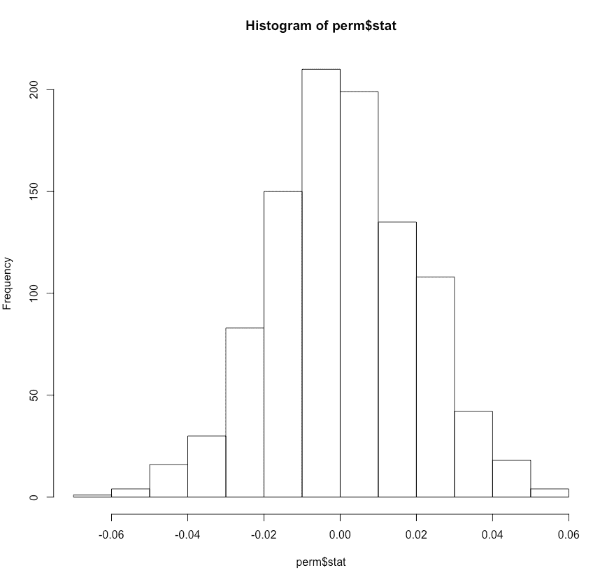
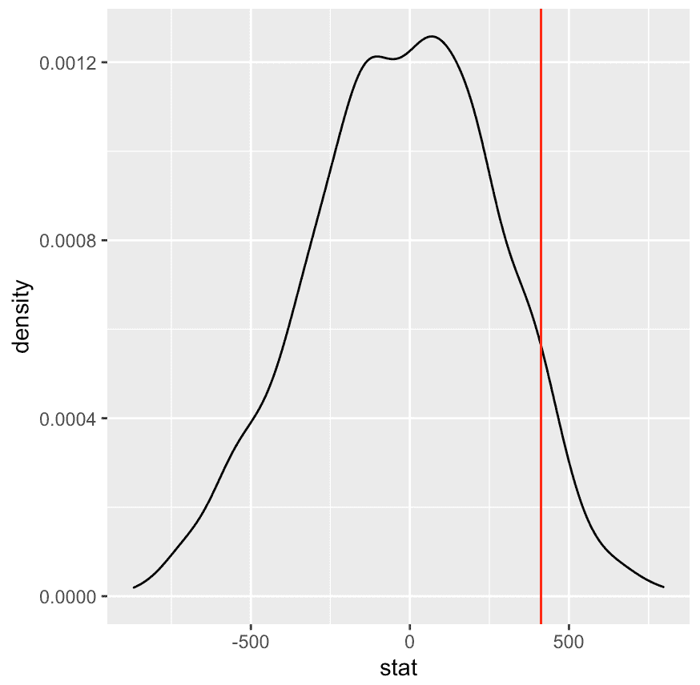

# 简而言之 p 值:它实际上意味着什么？

> 原文：<https://towardsdatascience.com/p-value-in-a-nutshell-what-does-it-actually-mean-d180388bb499?source=collection_archive---------68----------------------->

## 理解、可视化和计算 p 值


图片由[皮克斯拜](https://pixabay.com/?utm_source=link-attribution&utm_medium=referral&utm_campaign=image&utm_content=839037)的[格雷格·蒙塔尼](https://pixabay.com/users/gregmontani-1014946/?utm_source=link-attribution&utm_medium=referral&utm_campaign=image&utm_content=839037)拍摄

# 介绍

欢迎学习计算 p 值的课程。

在我们开始计算 p 值之前，重要的是要考虑 p 值的真正用途。

# 假设检验复习者

这篇文章不涉及太多细节，当建立一个假设检验时，你将确定一个零假设。你的零假设代表了你评估的两个变量没有任何关系的世界。相反，另一个假设代表了一个世界，在那里有一个统计上显著的关系，这样你就可以拒绝零假设而支持另一个假设。

# 潜得更深

在我们离开假设检验的概念之前……想想我们刚刚说的。你需要有效地证明，几乎没有出错的余地，我们在*现实世界*中看到的事情不可能发生在这些变量不相关的世界，或者关系独立的世界*。*

*有时在学习统计学的概念时，你会听到定义，但很少花时间去概念化。经常会有很多规则集的记忆…我发现理解这些原则的直觉基础会在找到它们的实际应用时更好地为你服务。*

*继续这个思路。如果你想比较真实世界和虚拟世界，那正是你应该做的。*

*正如您所猜测的，我们可以通过创建一个线性回归模型来计算观察到的统计数据，在该模型中，我们将响应变量解释为解释变量的函数。一旦我们做到了这一点，我们就可以使用通过 ols 回归确定的斜率或系数来量化这两个变量之间的关系。*

*但是现在我们需要想出一个零世界的概念，或者说这些变量是独立的。这是我们没有的东西，所以我们需要模拟它。为了方便起见，我们将利用 infer 包。*

# *让我们来计算我们观察到的统计数据*

*首先，让我们得到我们观察到的统计！*

*我们正在处理的数据集是西雅图房价数据集。我以前多次使用过这个数据集，发现它在演示时特别灵活。数据集的记录级别是按房屋和详细价格、平方英尺数、床位数、浴室数等。*

*在这篇文章中，我们将试图通过平方英尺的函数来解释价格。*

*让我们创建我们的回归模型*

```
*fit <- lm(price_log ~ sqft_living_log,
          data = housing)
summary(fit)*
```

**

*正如您在上面的输出中看到的，我们所追求的统计数据是我们的解释变量`sqft_living_log`的`Estimate`。*

*一个非常干净的方法是整理我们的结果，这样我们得到的不是一个线性模型，而是一个 tibble。tible、tables 或 data frames 将使我们更容易进行系统化的交互。*

*然后我们想要过滤到`sqft_living_log`项，我们将通过使用`pull`函数返回估计值本身来结束它。这将把斜率作为一个数字返回，这将使得稍后与我们的空分布*进行比较更加容易。**

*看一看！*

```
*lm(price_log ~ sqft_living_log,
          data = housing)%>%
  tidy()%>%
  filter(term == 'sqft_living_log')%>%
  pull(estimate)*
```

# *模拟时间到了！*

*首先，你应该知道有各种类型的模拟。我们这里要用的是所谓的*排列*。*

*在展示变量相互独立的世界时，排列特别有用。*

*虽然我们不会深入研究如何在幕后创建置换样本的细节；值得注意的是，对于观察到的统计量，样本将是正态的，以 0 为中心。*

*在这种情况下，斜率将集中在 0 附近，因为我们在解释变量和响应变量之间没有关系的前提下进行操作。*

# *推断基本原理*

*有几件事你需要知道:*

*   *指定我们如何确定我们正在建模的关系:`price_log~sqft_living_log`*
*   *假设是我们指定的`independence`*
*   *“生成”是我们确定想要复制的数据集的数量的方式。请注意，如果您这样做了，一个复制而没有`calculate`它将返回一个与原始数据集大小相同的样本数据集。*
*   *计算允许您确定有问题的计算(斜率、平均值、中值、均值差异等)。)*

```
*library(infer)
set.seed(1)perm <- housing %>%
  specify(price_log ~ sqft_living_log) %>%
  hypothesize(null = 'independence') %>%
  generate(reps = 100, type = 'permute') %>%
  calculate('slope')perm
hist(perm$stat)*
```

**

*1000 个代表的相同分布*

**

# *零抽样分布*

*好了，我们做到了！我们创造了所谓的零抽样分布。我们在上面看到的是 1000 个斜率的分布，每个斜率都是在独立数据的 1000 次模拟后建模的。*

*这正是我们所需要的。一个我们可以与现实进行比较的模拟世界。*

*以我们刚刚制作的视觉效果为例，让我们使用密度图，并为我们观察到的斜率添加一条垂直线，用红色标记。*

```
*ggplot(perm, aes(stat)) + 
  geom_density()+
  geom_vline(xintercept = obs_slope, color = 'red')*
```

**

*从视觉上，你可以看到这种情况的发生远远超出了随机事件的发生。*

*从视觉上看，你可以猜到这里的 p 值是 0。至于说，在 0%的零抽样分布中大于或等于我们观察到的统计量。*

*如果事实上我们看到置换数据大于或等于我们观察到的统计数据，我们就会知道这只是随机的。*

*这里重申一下，p 值的目的是让您了解我们看到的这种随机斜率与统计显著关系的可行性。*

# *计算 P 值*

*虽然我们知道这里的 p 值是多少，但是让我们来计算一下 p 值。*

*重新提出这个想法；p 值是(随机)大于或等于我们观察到的斜率的重复部分。*

*您将在我们的`summarise`函数中看到，我们正在检查我们的 stat 或斜率是否大于或等于观察到的斜率。每条记录将被赋予相应的真或假..当你用一个均值函数包装它时，TRUE 将代表 1，FALSE 代表 0，导致一部分情况 stat 大于或等于我们观察到的斜率。*

```
*perm %>%
  summarise(p_val = 2 * round(mean(stat >= obs_slope),2))*
```

*为了确定我们没有足够的证据来拒绝零假设的较弱关系的情况，让我们看一下价格作为它建立的年份的函数。*

**

*使用与上面相同的计算，这导致 12%的 p 值；根据 95%的标准置信水平，这不足以作为拒绝零假设的证据。*

# *关于 P 值解释的最终注释*

*最后，我想再强调一次…*

*12%的意思。我们看到，当我们随机生成一个独立的样本时……在整整 12%的时间里，我们随机生成的斜率等于或大于……*

**你可能会看到 12%的结果是随机的**

# *结论*

*就是这样！你是计算和理解 p 值的大师。*

*在短短的几分钟内，我们学到了很多东西:*

*   *假设检验*
*   *线性回归复习器*
*   *抽样解释*
*   *了解推断包*
*   *构建抽样分布*
*   *可视化 p 值*
*   *计算 p 值*

*在剖析 p 值等统计概念时，很容易迷失方向。我的希望是，对需求和相应的执行有一个强有力的基础理解能让你理解并正确地将它应用于各种各样的问题。*

*如果这有帮助，请随时查看我在[https://medium.com/@datasciencelessons](https://medium.com/@datasciencelessons)的其他帖子。祝数据科学快乐！*