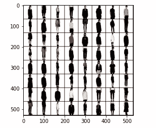

# 以自包含格式打包 PyTorch 模型

> 原文：<https://towardsdatascience.com/package-pytorch-models-in-a-self-contained-format-badbe10b7ae5?source=collection_archive---------29----------------------->

## 在机器之间移动你的模型，而不是 Python 代码。


克劳迪奥·施瓦茨在 [Unsplash](https://unsplash.com/s/photos/package?utm_source=unsplash&utm_medium=referral&utm_content=creditCopyText) 拍摄的照片

PyTorch 在 2016 年开始了它卑微的旅程，并迅速成为深度学习研究人员的首选工具。然而，PyTorch 现在已经不仅仅是一个原型工具了。它已经发展成为一个成熟的生产就绪框架，正在扩大其在商业领域的粉丝基础。

而这恰恰是它的创造者和维护者的目标；成为学术界和工业界的事实标准。研究人员和机器学习工程师应该能够高效地运行 PyTorch，从本地 Jupyter 服务器到云平台，从多节点 GPU 集群到边缘的智能设备。

然而，PyTorch 在我看来有一个显著的缺点:它存储模型的方式。你会问，PyTorch 模型的推荐存储方式是什么？一言以蔽之，你要保留的是模型的参数，而不是模型本身。从文档中:

> 当保存用于推理的模型时，只需要保存训练模型的学习参数。用`torch.save()`函数保存模型的 *state_dict* 将为您以后恢复模型提供最大的灵活性，这就是为什么它是保存模型的推荐方法。

缺点是什么？您应该在服务器中再次定义模型的架构，反序列化`state_dict`并将参数加载到模型中。如果您有办法将所有需要的东西打包到一个归档文件中，在服务器中解压缩，然后完成您的工作，这不是很好吗？好吧，我有一些好消息:现在你可以了！

> [学习率](https://www.dimpo.me/newsletter?utm_source=medium&utm_medium=article&utm_campaign=torch_package)是为那些对 AI 和 MLOps 的世界感到好奇的人准备的时事通讯。你会在每周五收到我关于最新人工智能新闻和文章的更新和想法。在这里订阅！

# 火炬.包装

`*torch.package*`是一种将 PyTorch 模型打包成独立、稳定格式的新方法。包是一个档案，包括模型的参数和元数据以及它的架构。

此外，`torch.package`增加了对创建包含任意 PyTorch 代码的密封包的支持。这意味着您可以使用它来打包您想要的任何东西(例如，PyTorch 数据加载器、数据集等)。).

这是一种很好的方式来重现您的训练结果，并使用您喜欢的工具为模型服务。

那么，让我们来看看如何使用这个强大的工具。

## 装置

`torch.package`模块是核心 PyTorch 1.9 的一部分，所以我们首先需要检查并安装 PyTorch 的正确版本。使用下面的命令来完成此操作:

```
!pip uninstall -y torch
!pip install -f https://download.pytorch.org/whl/test/cpu/torch_test.html torch
```

## 包装你的模型

在这个故事中，我们将使用`torch.package`封装然后导入[一个 DCGAN 模型](https://pytorch.org/hub/facebookresearch_pytorch-gan-zoo_dcgan/)，可以用来生成时装模型。这个预先训练好的模型托管在火炬中心。要下载它，请复制下面的代码:

接下来，我们来测试一下。使用下面的代码生成时装模特的随机图像，使用您刚刚下载的 DCGAN:

结果应该是这样的:



作者图片

现在，让我们包装模型。我们将创建`PackageExporter`来创建一个归档文件，其中包含在另一台机器上运行模型所需的一切。为此，复制以下代码:

运行上面的代码会产生一个错误:

```
PackagingError:
* Module did not match against any action pattern. Extern, mock, or intern it.
models.DCGAN
models.utils.config
models.loss_criterions.ac_criterion     models.loss_criterions.base_loss_criterions     models.networks.DCGAN_nets
```

这意味着什么？为了创建一个密封的包，`PackageExporter`将试图访问将要被酸洗的模块和对象所需的所有依赖关系的源代码。

在此过程中，它将跳过标记为`extern`或`mock`的依赖项，并将标记为`intern`的依赖项包含在存档中。在这种情况下，我们需要包括`models`。为此，请修改您的代码，如下所示:

现在，我们有另一个问题:

```
PackagingError:
* Module did not match against any action pattern. Extern, mock, or intern it.
numpy
```

然而，NumPy 不是我们想要打包的模型的一部分。因此，我们可以安全地排除它:

使用这个命令，您已经成功地创建了您的包！

## 加载您的模型

要将你的模型加载回内存，你应该使用`PackageImporter`。这比以前简单；只需复制下面的代码:

为了测试一切工作正常，您可以再次调用您之前定义的`run_model`函数并检查结果。一切都应该井然有序！

最后，您可以使用这个 [colab](https://colab.research.google.com/drive/1lFZkLyViGfXxB-m3jqlyTQuYToo3XLo-) 实验并运行完整的示例。

# 结论

PyTorch 在 2016 年开始了它卑微的旅程，并迅速成为深度学习研究人员的首选工具。然而，PyTorch 现在已经不仅仅是一个原型工具了。它已经发展成为一个成熟的生产就绪框架，正在扩大其在商业领域的粉丝基础。

因此，研究人员和 ML 工程师必须能够为本地 Jupyter 服务器到云平台，从多节点 GPU 集群到边缘智能设备高效运行 PyTorch。

为了实现这一点，PyTorch 1.9 引入了一种新的打包机制:模块`torch.package`。

在这个故事中，您看到了什么是`torch.package`模块，以及如何使用它来保存和检索模型。玩得开心！

# 关于作者

我叫[迪米特里斯·波罗普洛斯](https://www.dimpo.me/?utm_source=medium&utm_medium=article&utm_campaign=torch_package)，我是一名为[阿里克托](https://www.arrikto.com/)工作的机器学习工程师。我曾为欧洲委员会、欧盟统计局、国际货币基金组织、欧洲央行、经合组织和宜家等主要客户设计和实施过人工智能和软件解决方案。

如果你有兴趣阅读更多关于机器学习、深度学习、数据科学和数据运算的帖子，请在 Twitter 上关注我的 [Medium](https://towardsdatascience.com/medium.com/@dpoulopoulos/follow) 、 [LinkedIn](https://www.linkedin.com/in/dpoulopoulos/) 或 [@james2pl](https://twitter.com/james2pl) 。

所表达的观点仅代表我个人，并不代表我的雇主的观点或意见。