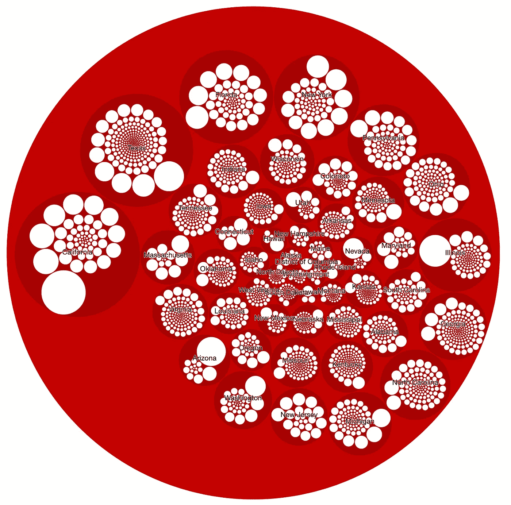

# 包装圈

> 原文：<https://towardsdatascience.com/packing-circles-a9d1f775353b?source=collection_archive---------28----------------------->

## 交互式层次图



美国所有县的 Circlepacker 可视化(按人口)-图片按作者

你是否曾经处理过层次数据，并努力使其可视化？那这篇文章就送给你了！我最近偶然发现了 **R** 中的便捷的[**circle packer**](http://jeromefroe.github.io/circlepackeR/)**包，它使您能够创建交互式图表，便于分层数据的可视化，我想与您分享我的经验。**

# **先决条件**

**为了创建如上所述的类似可视化，您首先需要安装以下软件包:**

```
devtools::install_github("jeromefroe/circlepackeR")
install.packages("data.tree")
install.packages("htmlwidgets")library(circlepackeR)
library(data.tree)
library(htmlwidgets)
```

# **数据**

**在这个简短的示例中，我将使用包含州名、县名及其人口的美国县数据:**

```
head(counties)# A tibble: 3,093 x 5
   country       state   county   population                       
   <chr>         <chr>   <chr>         <dbl>                             United States Alabama Autauga       55380 
United States Alabama Baldwin      212830 
United States Alabama Barbour       25361 
United States Alabama Bibb          22493 
United States Alabama Blount        57681 
United States Alabama Bullock       10248 
```

# **预处理**

**为了准备好数据，我们需要应用两个预处理步骤:**

## **1.添加路径字符串列**

```
counties$pathString <- paste(“world”, counties$country, counties$state, counties$county, sep = “/”)
```

**新列应该被称为“pathString ”,并将您想要显示的所有层次级别连接成一个长字符串，该字符串以单词“world”开头，并使用“/”作为分隔符。在这一步之后，带有新添加的列的数据帧看起来是这样的:**

```
country       state   county   population pathString                          
   <chr>         <chr>   <chr>         <dbl> <chr>                               
United States Alabama Autauga       55380 world/United States/Alabama/Autauga 
United States Alabama Baldwin      212830 world/United States/Alabama/Baldwin 
United States Alabama Barbour       25361 world/United States/Alabama/Barbour 
United States Alabama Bibb          22493 world/United States/Alabama/Bibb    
United States Alabama Blount        57681 world/United States/Alabama/Blount  
United States Alabama Bullock       10248 world/United States/Alabama/Bullock
```

## **2.将数据帧转换成一个`data.tree`数据结构**

**第二个预处理步骤包括将数据帧转换成 data.tree 数据结构。这听起来很复杂，但可以通过下面的函数轻松完成:**

```
nodes <- as.Node(counties)
```

**这是新创建的结构的样子:**

```
levelName
world 
° — United States 
¦ — Alabama 
¦ ¦ — Autauga 
¦ ¦ — Baldwin 
¦ ¦ — Barbour
¦ ¦ — Blount
¦ ¦ — Bullock
..
```

**我们准备好创造我们的观想了！**

# **创建圆形包装图**

**创建 circlepackeR 图再简单不过了。只需运行以下代码:**

```
#create circlepacker graph
p <- circlepackeR(nodes, 
                  size="population", 
                  color_min=rgb(255/255,0/255,0/255), 
                  color_max=rgb(0/255,0/255,0/255), 
                  width=1200, 
                  height=1200) #save the circle graph
saveWidget(p, file="circles.html")
```

****注意上面的论点:****

*   ****size** :应该作为每个圆大小的列名。**
*   ****颜色最小值:**圆圈颜色范围的最小值。可以是十六进制、RGB 或 HSL 颜色。**
*   ****color_max:** 圆圈颜色范围的最大值。可以是十六进制、RGB 或 HSL 颜色。**
*   ****width:** 创建的圆形图形的宽度(像素)(如果图形很大，尤其有用)**
*   ****高度:**高度(像素)所创建的圆形图形(如果你的图形很大的话特别有用)**

**保存图表后，您将在指定的目录中看到一个 HTML 文件，该文件可以通过电子邮件或嵌入在网页中与其他人共享。此外，您可以使用 [codepen.io](http://www.codepen.io) 将它嵌入到一篇中型文章中(复制 HTML 源代码并根据它创建一个 codepen，如下所示:**

# **调整图表**

**该图通常显示得很好，但有时导出图的字体大小有点太小。不幸的是，字体大小和任何其他样式选项都不能在图形创建过程中设置，但是您可以做一些事情！**

**由于导出的文件是一个 HTML 文件，您可以简单地在任何编辑器中打开它并搜索 CSS 声明:**

```
<style type=”text/css”>.circlepackeR .node {cursor: pointer;}.circlepackeR .node:hover {
stroke: #000;
stroke-width: 1.5px;
}.circlepackeR .node — leaf {
fill: white;
}.circlepackeR .label {
font: 11px “Helvetica Neue”, Helvetica, Arial, sans-serif;
text-anchor: middle;
text-shadow: 0 1px 0 #fff, 1px 0 0 #fff, -1px 0 0 #fff, 0 -1px 0 #fff;
}.circlepackeR .label,
.circlepackeR .node — root,
.circlepackeR .node — leaf {
pointer-events: none;
}</style>
```

**如果你有一些 CSS 知识，你会发现修改图形的布局很容易。如果以前从未使用过 CSS，这里是你如何改变字体大小和改变圆形轮廓的颜色:**

## **更改字体样式**

**只需通过指定像素数(如 15px)来更改字体大小。此外，您可以将字体名称从“Helvetica 新”更改为任何想要的字体:**

```
.circlepackeR .label {
font: 15px “Helvetica Neue”, Helvetica, Arial, sans-serif;
text-anchor: middle;
text-shadow: 0 1px 0 #fff, 1px 0 0 #fff, -1px 0 0 #fff, 0 -1px 0 #fff;
}
```

## **更改圆形轮廓颜色**

**如果你想改变圆轮廓(笔画)的颜色，你可以简单地在这里指定所需的十六进制代码(例如#FF0000):**

```
.circlepackeR .node:hover {
stroke: #FF0000;
stroke-width: 1.5px;
}
```

**我希望这对你们中的一些人有用！**

# **进一步阅读**

****【1】**jeromefroe—D3 可缩放圆形装箱可视化(教程):【http://jeromefroe.github.io/circlepackeR/】T2**

****【2】**circle packer Github 库:[https://github.com/jeromefroe/circlepackeR](https://github.com/jeromefroe/circlepackeR)**