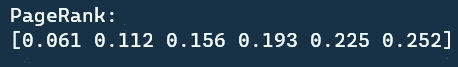
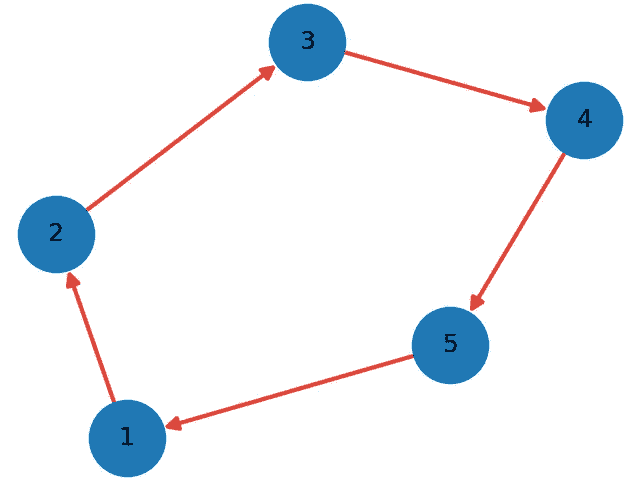
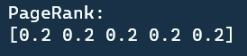
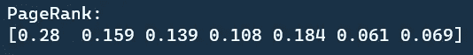
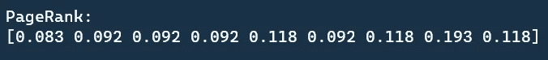
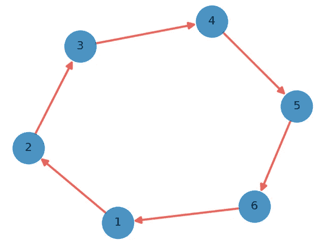
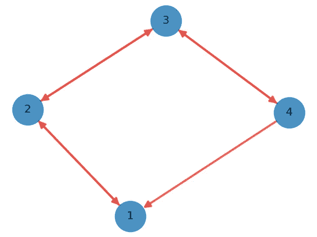
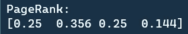
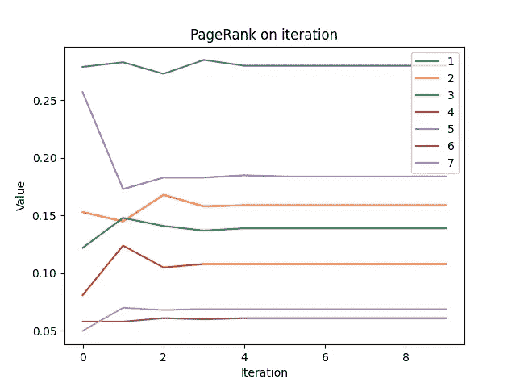
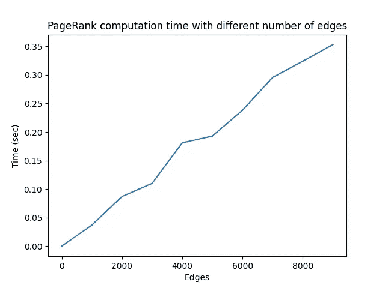

# PageRank:从零开始的链接分析解释和 Python 实现

> 原文：<https://towardsdatascience.com/pagerank-3c568a7d2332?source=collection_archive---------1----------------------->

## 启动谷歌的算法

克里斯蒂安·威迪格在 [Unsplash](https://unsplash.com?utm_source=medium&utm_medium=referral) 上拍摄的照片

# 介绍

在前一篇文章中，我们已经介绍了 HITS 算法并指出它的主要缺点。在本文中，我们将展示一种叫做 PageRank 算法的高级方法。我们将简要解释 PageRank 算法，并演练整个 Python 实现。

<https://chonyy.medium.com/hits-algorithm-link-analysis-explanation-and-python-implementation-61f0762fd7cf>  

PageRank 最好的部分是它的**查询独立**。我们不需要根集来启动算法。

PageRank 和 HITS 最大的区别

*   HITS 根据 hub 和 authority 值计算权重
*   PageRank 根据网站之间传递的比例排名计算排名

根据谷歌的说法，

> PageRank 的工作原理是通过计算一个页面的链接数量和质量来粗略估计该网站的重要性。潜在的假设是，更重要的网站可能会从其他网站收到更多的链接。

# 算法

请随意查看评论良好的源代码。这真的有助于理解整个算法。

<https://github.com/chonyy/PageRank-HITS-SimRank>  

算法步骤如下所列

*   用值 1 初始化每个节点的 PageRank
*   对于每次迭代，更新图中每个节点的 PageRank
*   新的 PageRank 是其所有父级的比例等级的总和
*   对新的 PageRank 应用随机漫步
*   PageRank 值将在足够的迭代后收敛

> PageRank 方程

图片由 Chonyy 提供

# Python 实现

## 初始化 PageRank 值

我们在节点构造函数中初始化 PageRank 值。

## PageRank 一次迭代

这是 PageRank 主函数。就像上面解释的算法一样，我们只需在每次迭代中为每个节点更新 PageRank。这个算法的关键是我们如何更新 PageRank。

## 计算新的页面排名

*   指定节点的内部邻居，即其所有父节点
*   对其所有邻居的比例等级求和
*   用阻尼因子 d 计算随机走出链路的概率
*   用比例排名和随机漫步的和来更新 PageRank

# 结果分析

让我们在回购中的 [***数据集***](https://github.com/chonyy/PageRank-HITS-SimRank/tree/master/dataset) 上测试我们的实现。我们在所有结果中设置阻尼因子= 0.15。

## graph_1.txt

图片由 Chonyy 提供。

> ***结果***

结果遵循节点值`1, 2, 3, 4, 5, 6`的顺序。

让我们观察图表的结果。图中的节点是单向流动的。我们知道 PageRank 算法将从邻居中累加比例等级。这意味着节点 2 将累积来自节点 1 的等级，节点 3 将累积来自节点 2 的等级，等等。

换句话说，节点 6 将累积从节点 1 到节点 5 的等级。这就是 node6 排名最高的原因。

## graph_2.txt

图片由 Chonyy 提供。

> ***结果***

节点形成一个循环。所以等级的传递将会是一个无止境的循环。并最终收敛到一个相等的值。

## graph_3.txt

图片由 Chonyy 提供。

> ***结果***

如果我们从物理学的角度来看这个图表，我们假设每个环节都提供相同的力。直观地说，我们可以计算出，与旁边的节点 1 和节点 4 相比，中心的节点 2 和节点 3 将会受到更大的力。

## graph_4.txt

图片由 Chonyy 提供。

> ***结果***

节点 1 和节点 5 都有四个邻居。但是为什么 Node1 的 PageRank 最高呢？这是因为节点 5 的两个内邻居具有非常低的等级，它们不能向节点 5 提供足够的比例等级。

节点 6 和节点 7 具有较低的 PageRank，因为它们位于图的边缘，并且只有一个邻居。对他们来说等级不够。

## IBM.txt

图片由 Chonyy 提供。

> ***结果***

结果遵循节点值顺序`2076, 2564, 4785, 5016, 5793, 6338, 6395, 9484, 9994`。

节点 9484 具有最高的 PageRank，因为它从其内部邻居获得许多成比例的等级，并且它没有外部邻居来传递该等级。根据这一观察，我们可以猜测，具有许多内邻居而没有外邻居的节点往往具有较高的 PageRank。

# 讨论

让我们做一个有趣的实验。假设我们要**增加**每个图中 **node1** 的枢纽和权限。怎么才能做到呢？

## graph_1.txt

因为 PageRank 是用其父级的比例排名的总和计算的，所以我们将关注图周围的排名流。为了增加 PageRank，直观的做法是增加其父节点来传递其中的排名。

与原始图相比，我们添加了一条额外的边(节点 6，节点 1)来形成一个循环。这样，每个节点的 PageRank 是相等的，大于 node1 的原始 PageRank 值。

## graph_2.txt

同样，我们希望增加 node1 的父节点。父节点越多，传递给节点 1 的秩就越多。

因此，我们添加了一条额外的边(节点 4，节点 1)。在原始图中，节点 1 只能从节点 5 获得他的等级。但是在添加了这条额外的边之后，节点 1 可以获得由节点 4 和节点 5 提供的等级。

## graph_3.txt

添加新边(节点 4，节点 1)。就像我们在 graph_2 中解释的那样，节点 1 可以通过这种方式从节点 4 获得更多的排名。请注意，这条规则可能并不总是适用。这只是我通过观察得出的直觉方法。

# 计算性能

## 趋同；聚集

现在我们都知道，经过足够的迭代，PageRank 将总是收敛到一个特定的值。为什么我们不画出来看看它收敛的有多快？

> ***在 graph_4.txt 上测试收敛性***

图片由 Chonyy 提供。

从图表中，我们可以看到曲线在开始时有点颠簸。等级在每个节点之间传递，最终达到平衡。每个节点的 PageRank 值在迭代 5 时开始收敛。

请注意，完成计算可能不总是只需要这几次迭代。例如，如果我们在 repo 中的 graph_6 上测试这个算法，它有 1228 个节点和 5220 条边，即使 500 次迭代也不足以使 PageRank 收敛。并且由于大量的边，计算会花费很长时间。

## 边数

图片由 Chonyy 提供。

我们用不同数量的总边运行 100 次迭代，以便发现总边和计算时间之间的关系。正如你所看到的，边数对计算时间的推断几乎是线性的，这是非常好的。

请注意，它不是完全线性的原因是边彼此链接的方式也会稍微影响计算时间。

# 结论

这并不奇怪，PageRank 并不是 Google 搜索引擎中实现的唯一算法。现实世界中的问题远比单一算法复杂。例如，他们可以对每个节点应用额外的权重，以更好地反映网站的重要性。所以有另一种算法结合 PageRank 来计算每个站点的重要性。

根据谷歌的说法，

> 谷歌使用各种技术评估每个网页的重要性，包括其专利的 PageRank 算法。

# 源代码

<https://github.com/chonyy/PageRank-HITS-SimRank> 