# Power BI 中的分页报告可视化—您需要知道的一切！

> 原文：<https://towardsdatascience.com/paginated-report-visual-in-power-bi-everything-you-need-to-know-34a39c9f6fe7?source=collection_archive---------7----------------------->

## 有人告诉你 SSRS 和分页报告已经死了？再次检查，因为 Power BI 中全新的分页报告视觉效果将继续存在并丰富您的报告解决方案！

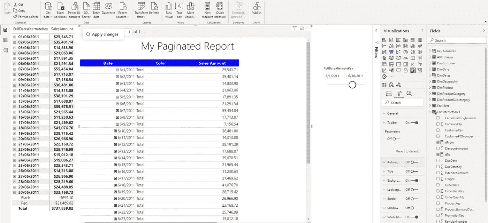

作者图片

最令人期待的 Power BI 特性之一终于出现了！不，这不是新的花哨的小倍数改进，或另一个新鲜的人工智能东西…它甚至不是对数据流的 DirectQuery 支持，也不是数据集可发现性(顺便说一下，这两者都是非常酷的补充)。猜猜看，分页报告可视化刚刚进入 Power BI 桌面！此时此刻，它仍在预览中，但周围的兴奋是巨大的。

我听到了，我听到了…谁需要这个东西？！为什么人们会在超级现代的闪亮电源 BI 解决方案中使用(几乎)被否决的技术？！更有甚者，分页报告几乎都是枯燥的表格+矩阵。我们在 Power BI 中推出了这两款产品，并提供了更多的定制选项和属性，让它们看起来更好看。

## 历史课…

我们这些上了年纪的人往往会说:“你知道我年轻时是怎么做的……”或者“我们 X 年前也是这么做的……”在 Power BI 出现之前，分页报告就已经进入了我们的生活。2004 年，微软推出了名为 SQL Server Reporting Services 的 SQL Server 2000 外接程序，该工具成为了本世纪头十五年的报告标准(直到今天，有些人还会争论更久)。


[https://www . pexels . com/photo/Stonehenge-under-nimbostratus-clouds-161798/](https://www.pexels.com/photo/stonehenge-under-nimbostratus-clouds-161798/)

数据领域的发展速度很快！速度极快！因此，新的挑战需要新的解决方案，Power BI 于 2015 年推出，以最高效、最引人注目的方式回答尽可能多的业务报告问题。然而，和 SSAS 多维一样，它仍然拒绝放弃(即使微软在最近几年将所有东西都变成了表格)，SSRS 是许多遗留 BI 解决方案的一个组成部分，这些解决方案仍然工作——不仅仅是工作，它们工作得相当好！

好吧，与 Power BI 相比，可视化类型的数量和它们的定制可能看起来很笨拙，但是，嘿，我们可以编写 Visual Basic 来扩展内置特性！使用了类似下面的代码片段使表格行颜色交替的人请举手:)

```
=iif(rownumber(nothing) mod 2 = 0,"LightGrey","Transparent")
```

是的，我知道，在 Power BI 中格式化你的表格要容易得多，只需点击交替行选项，但是 VB 更有趣:)(当然，只是开玩笑)

我自己在 2-3 年前认为 SSRS 已经死了…哦，我错了！你知道电影《老无所依》吗？在我的案例中，它可以很容易地翻译为:“没有老(数据)人的 SSRS”…即使大多数公司迁移到 Power BI 并调整他们的报告解决方案以适应新的云环境，仍然有大量的客户不愿意停止使用良好的旧分页报告。

## 老男人没有 SSRS

相信我，我看到了许多混合解决方案，其中大多数报告都迁移到 Power BI，但某些报告仍然以分页形式存在，没有任何在 Power BI 中重新创建它们的意图…我听到你问为什么会这样？动力阿碧难道不是更强大、更高效、更有力的工具吗？当然是啦！这是毫无疑问的。如果从性能的角度来看， [VertiPaq 是一个能够以惊人的速度压缩和处理大量数据的庞然大物](/how-to-reduce-your-power-bi-model-size-by-90-76d7c4377f2d)…从数据建模的角度来看，我敢打赌 Power BI 是目前最全面的解决方案。您可以使用各种强大的功能来扩展传统的数据建模原则，例如[复合模型](/power-bi-how-to-fit-200-million-rows-in-less-than-1gb-5eee310064b7)、[角色扮演维度](/role-playing-dimensions-in-power-bi-185dc58f90f1)、数据流等等。

不要谈论数据转换和[数据整形](/power-bi-101-data-shaping-in-a-nutshell-1df4681bdfd3)的能力，以最佳方式为最终报告解决方案准备您的数据。

## 分页报告不能替代 Power BI！

当然，如果你把力量 BI 和 SSRS 放在一起，胜利者是显而易见的！但是，如果您逐一比较这两个工具的特性，您就忽略了这一点。分页报告不是 Power BI 的替代品，而是 Power BI 的补充！简而言之，SSRS 提供了一些 Power BI 无法复制的特性。例如，如果您的用户坚持要像素完美、可打印或易于导出的报表，那么没有比分页报表更好的选择了！它们的名字说明了一切——它们被称为分页的，因为它们被设计成很适合页面！

到目前为止，分页报告和 Power BI 报告之间的集成是不可能的。非此即彼。现在，有了分页报表可视化，您可以利用两个世界的最佳功能！

## 创建分页报表

为了能够使用分页报表可视化，首先需要构建分页报表本身。因此，让我们使用 Adventure Works 示例数据库构建一个非常基本的分页报表。我有意使事情保持简单，因为本文的目的不是深入分页报告的创建过程，而是更多地关注分页报告和 Power BI 之间的集成。

> 如果你计划使用分页报告，你必须拥有某种高级许可(T1)，即 EM1-EM3 SKU、P1-P3 SKU 和 A1-A6 SKU。它也可以基于每个用户提供 Premium per user，这是基于 Premium Gen2 构建的，也有公共预览版。请记住，您要将分页报表发布到的工作区必须定义为高级工作区，这一点很重要

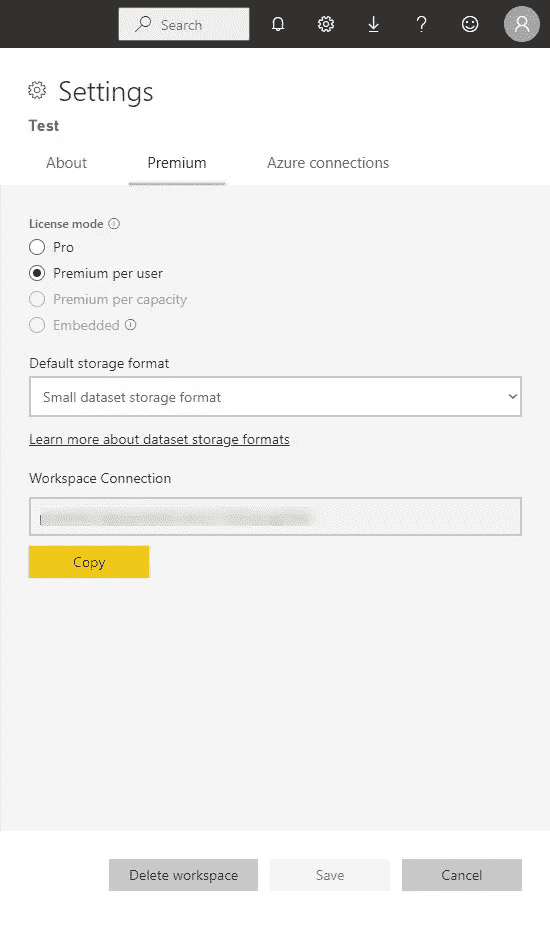

作者图片

为了构建分页报告，您需要一个单独的工具，称为 *Power BI Report Builder* 。如果您曾经在 SSRS 报表生成器中工作过，整个环境看起来会很熟悉。下面是我将用来为分页报表创建数据集的查询:

```
SELECT p.Color,
       fsi.SalesAmount,
       d.FullDateAlternateKey AS [date]
FROM FactInternetSales fsi
    INNER JOIN DimProduct p
        ON p.ProductKey = fsi.ProductKey
    INNER JOIN DimDate d
        ON d.DateKey = fsi.OrderDateKey
WHERE d.FullDateAlternateKey >= @dFrom
      AND d.FullDateAlternateKey <= @dTo;
```

基本上，我想显示 FactInternetSales 表中每笔交易的产品颜色、销售额和日期。如我所说，这是一个非常基本的设置。

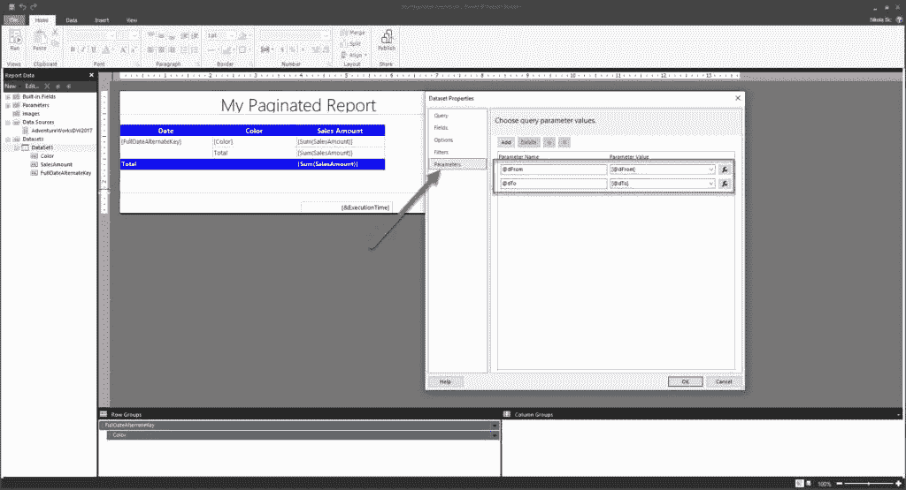

作者图片

因为我的查询是参数化的，所以我需要映射参数(在我的例子中，这些是开始和结束日期)。如果您使用附加参数(例如，颜色)，请确保也映射它们。我已经在报告画布上放置了一个简单的矩阵，现在我准备将报告发布到我的工作区:

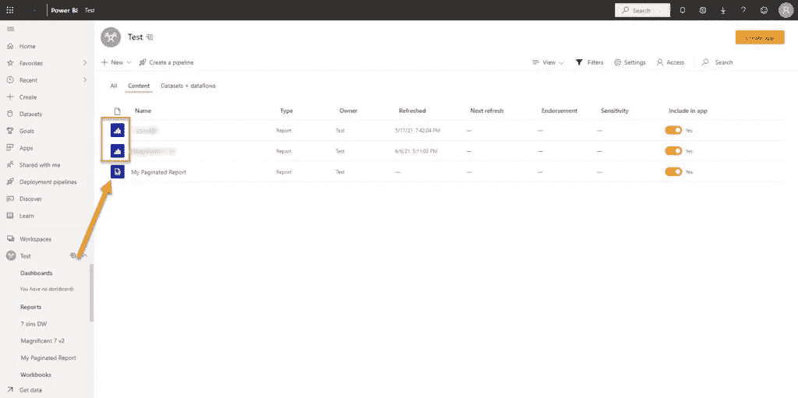

作者图片

通过查看报告名称旁边的图标，您可以立即注意到分页报告不同于“经典”的 Power BI 报告。而且，如果我运行分页报告，它会很好地显示基于我设置的日期参数的结果:

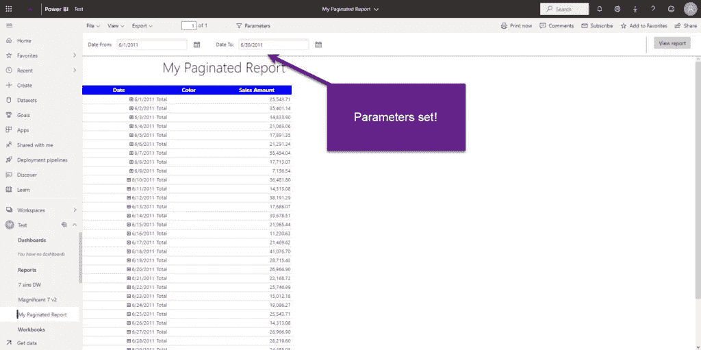

作者图片

到目前为止，没有什么特别的，因为你必须决定你是否要使用 Power BI 或分页报告…

## 在 Power BI 报告中运行分页报告！

这里是真正的奇迹发生的地方！现在，您可以将分页报告集成到 Power BI 报告中，并从那里运行它！让我们一步一步来看看是怎么做的…

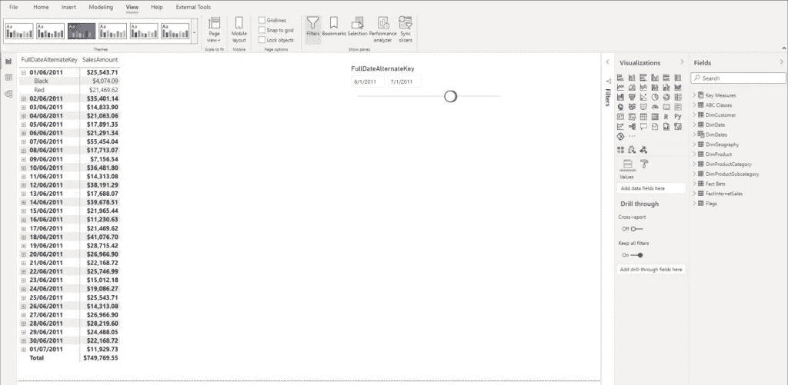

作者图片

在 Power BI Desktop 中，我使用了完全相同的数据集(AdventureWorksDW2017 ),并且创建了与之前分页报告中相同的矩阵。现在，我将在报告画布上拖动一个全新的分页报告，并按照指示连接到*我的分页报告*。

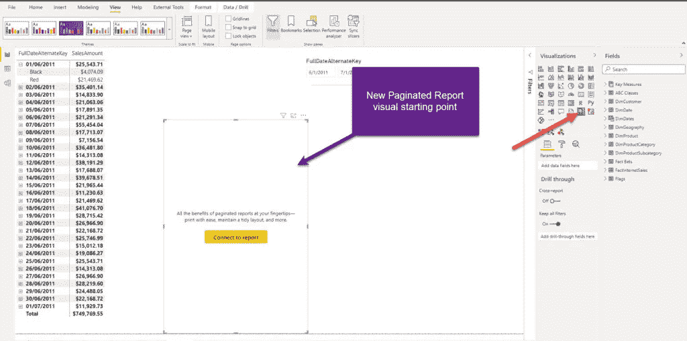

作者图片

接下来是有趣的部分，因为您需要配置一些东西。在我选择了我想要连接的分页报告(在我的例子中，我的分页报告)之后，我需要提供参数值，以便可以从 Power BI 中交叉过滤可视化内容！因此，我将创建两个度量来使用它们提供参数值:

```
dFrom = MIN(FactInternetSales[OrderDate])
dTo = MAX(FactInternetSales[OrderDate])
```

我将拖动这些度量值作为分页报表可视化的参数，并将这些值赋给我的原始参数:

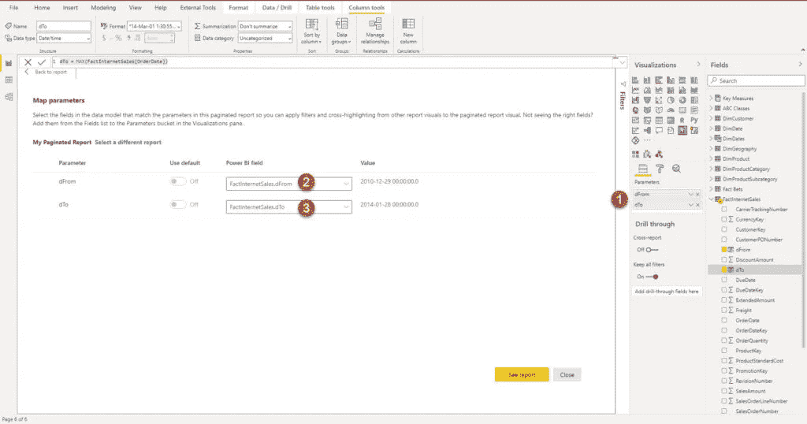

作者图片

当我单击“查看报告”时，您会注意到我将在 Power BI 中直接呈现分页的报告！多酷啊！两个矩阵之间的结果是相同的:

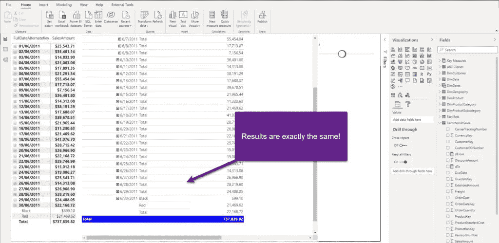

作者图片

对于分页报表视觉效果，还有其他格式选项。显然，定制的可能性不如“常规”Power BI 视觉效果多，但仍然有用，尤其是工具栏和参数属性:

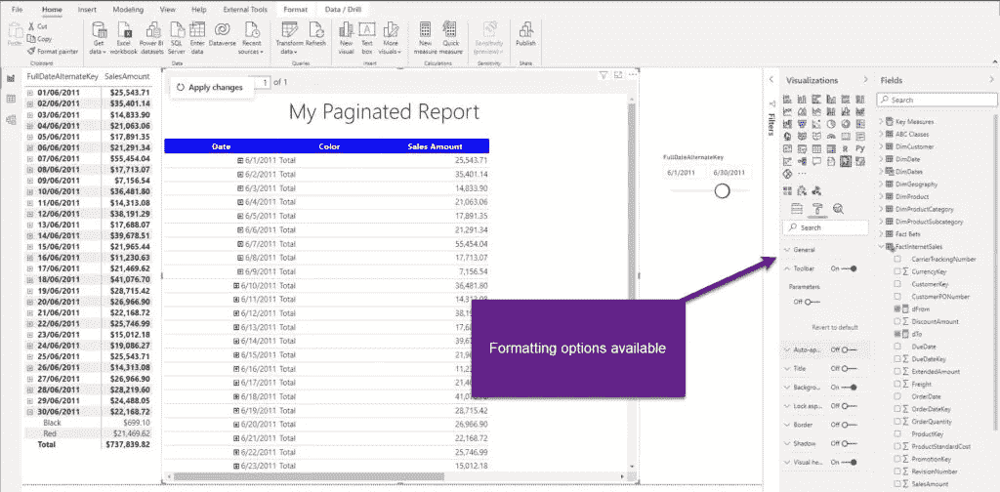

作者图片

## 它是如何在后台工作的？

因为视觉在交叉过滤方面完全响应，所以让我们检查如果我改变切片器值会发生什么:

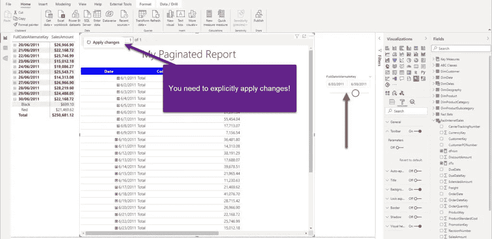

作者图片

正如您所期望的，Power BI visual 会立即反映这些更改，但是对于分页的报表 visual 没有任何变化。默认情况下，您需要显式单击此应用更改按钮，以便将新的切片器值传播到基础数据源。您可以通过在“格式”面板中启用自动应用过滤器来改变这种行为，但我建议不要这样做，因为默认设置是在考虑减少查询的情况下指定的。我们将很快解释当您更改切片器值时，后台发生了什么…

因此，我很想知道当您在 Power BI 中呈现分页报告时会发生什么，以及如何检索数据。让我们首先启动 DAX Studio 并[捕获 Power BI](/how-to-capture-sql-queries-generated-by-power-bi-fc20a94d4b08) 生成的查询:

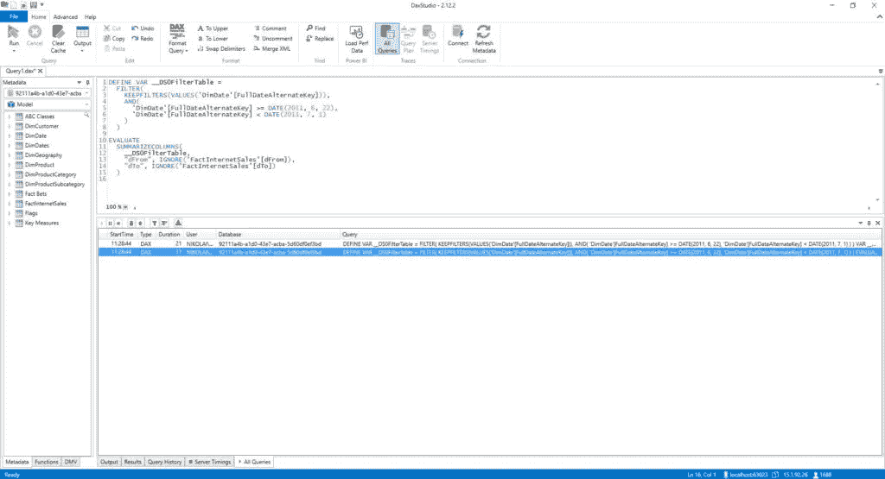

作者图片

嗯，这很奇怪，因为没有生成 SQL 代码，我希望看到类似 SQL 语句的东西。这个查询基本上只计算我们对 dFrom 和 dTo 参数的度量。因此，我打开了一个很好的旧 SQL Server Profiler 来检查下面到底发生了什么。

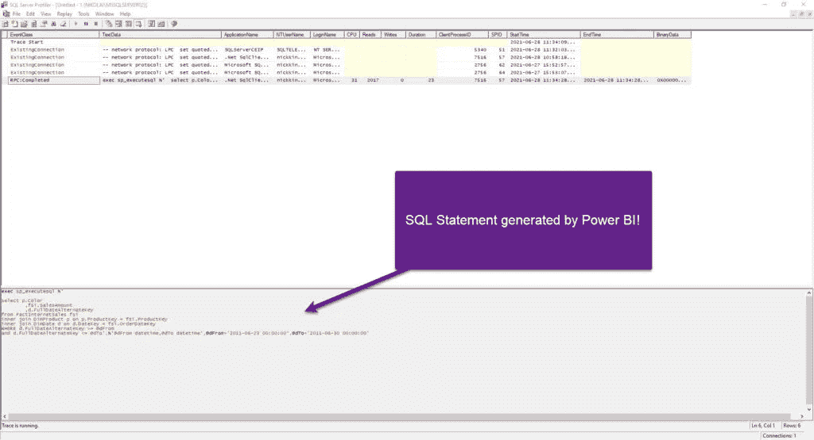

作者图片

这就是了！这是从 AdventureWorksDW2017 数据库中检索数据的 SQL 语句。看着眼熟？没错，这就是我们用来为分页报表创建原始数据集的查询！然而，Power BI 生成了一个动态 SQL 语句，用从 Power BI slicer 获取的参数包装了我们的原始查询(这就是我们在 DAX Studio 中看到的查询)！

如果我更改切片器的值，我们应该看到具有不同参数值的新动态 SQL 查询(我将开始日期设置为 6 月 25 日)。让我们来看看是不是这样:

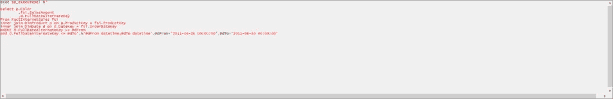

作者图片

嘭！这就对了。正如预期的那样，我们有了一个新的 SQL 语句——事实上，基本语句是相同的，但是参数值发生了变化，生成并执行了新的动态 SQL。

由此得出结论 ***分页报表可视化工作于 DirectQuery 模式*** ！

## 导出数据

好吧，这一切都很好，但我听到你问:为什么我首先需要我的 Power BI 报告中的分页报告可视化？我将发布我们的 Power BI 报告，其中包括对工作区可视化的分页报告，并向您展示使用案例。

让我们假设一个用户请求从视觉效果中导出数据。

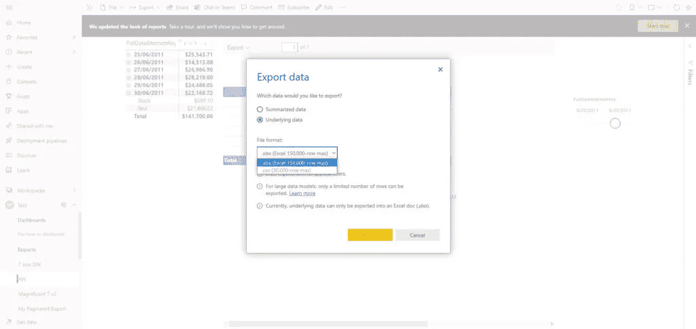

作者图片

当您从 Power BI 原始矩阵导出数据时，唯一可用的格式是 xlsx。另一方面，如果我在分页的报表视图中单击 Export，看看我有什么可以处理:

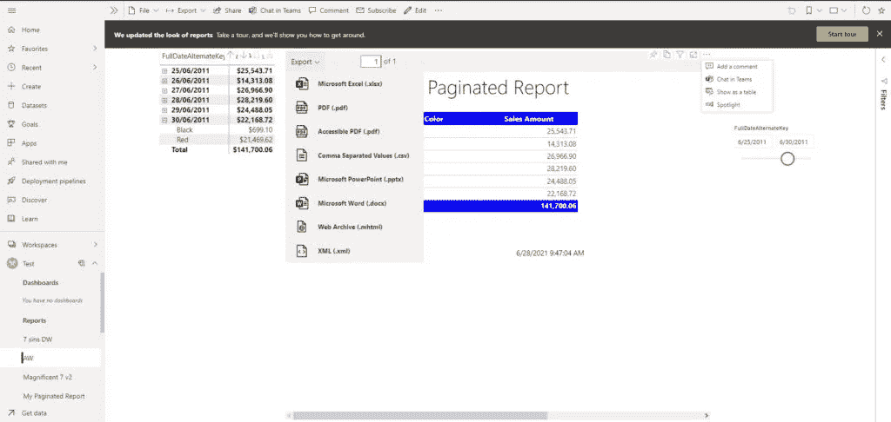

作者图片

哇！不仅仅是 Excel！我可以导出各种不同的格式，包括 pdf(如果我需要打印一些东西的话)(哦，是的，相信我，周围有很多人仍然喜欢打印他们的报告)，或者 pptx(如果我需要它来做我的精彩 PowerPoint 演示的话)!不要忘记为什么分页的报表首先被称为分页的:)

接下来，如果我的视觉效果中的数据超过了一个页面所能容纳的范围，并且想将其导出为 pdf，会发生什么情况？让我们看看 Power BI matrix 如何渲染为 pdf:

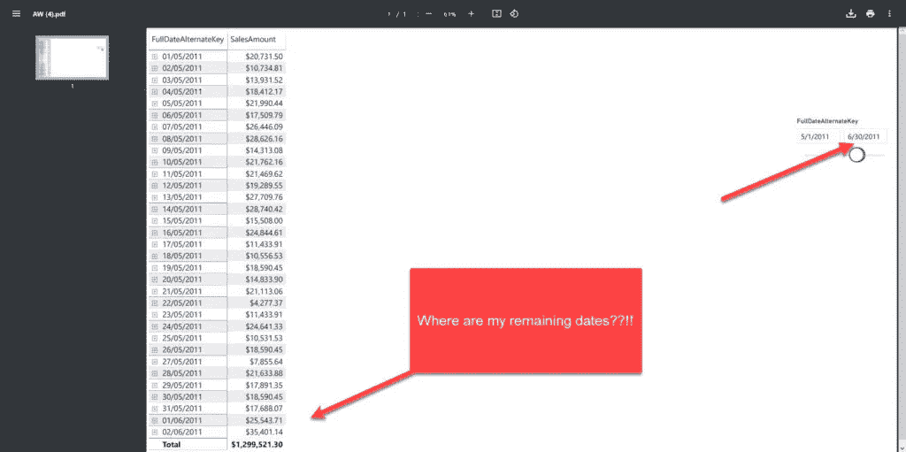

作者图片

哦，伙计，我丢失了数据！这是为什么呢？6 月 3 日到 6 月 30 日之间我的日期在哪里？我在我的 Power BI 报告中看到了它们。是的，你做到了。但是，您可以滚动 Power BI 报告中的表格，但不能滚动 pdf 格式的图像！

让我们看看如果从分页的报表可视化中导出数据会发生什么:

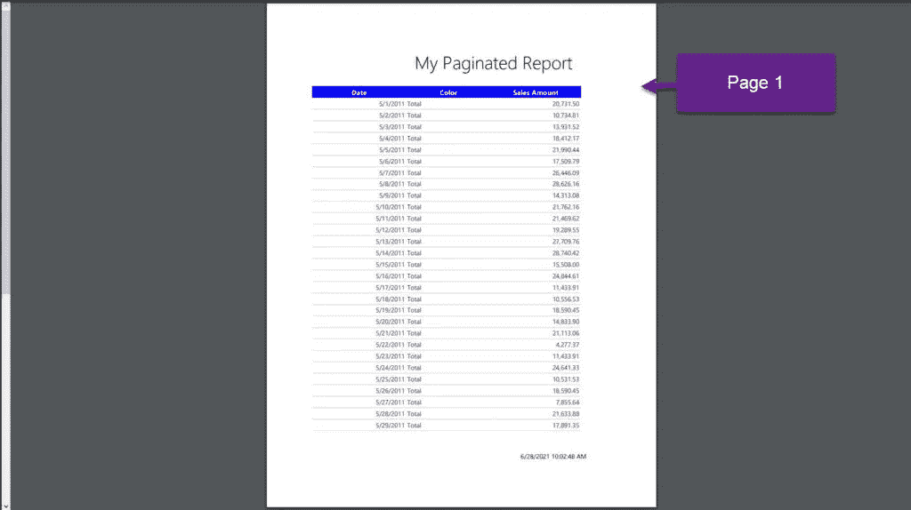

pdf 报告的第 1 页

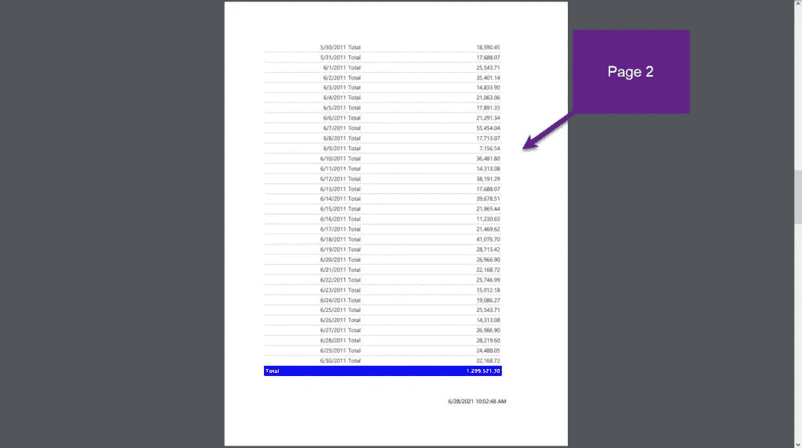

pdf 报告的第 2 页

哦，看起来多干净漂亮啊！

## 结论

在 Power BI report 中直接呈现分页报告的可能性是对 Power BI 已经提供的广泛功能的巨大补充。拥有另一个(非常强大的)工具只会增加您的报告解决方案提供的业务价值。

总会有一些用户坚持要求像素完美、打印友好的数据，而 Power BI 本身无法满足这些要求。但是，现在，通过集成成熟的技术，如分页报告，您可以从一个位置满足所有请求，甚至可以一次对数据应用所有过滤器！

尽管有一些[限制](https://docs.microsoft.com/en-us/power-bi/paginated-reports/paginated-reports-report-builder-power-bi#limitations-and-considerations)，我相信分页报告可视化是 Power BI 最近最大的改进之一！

感谢阅读！

成为会员，阅读媒体上的每一个故事！