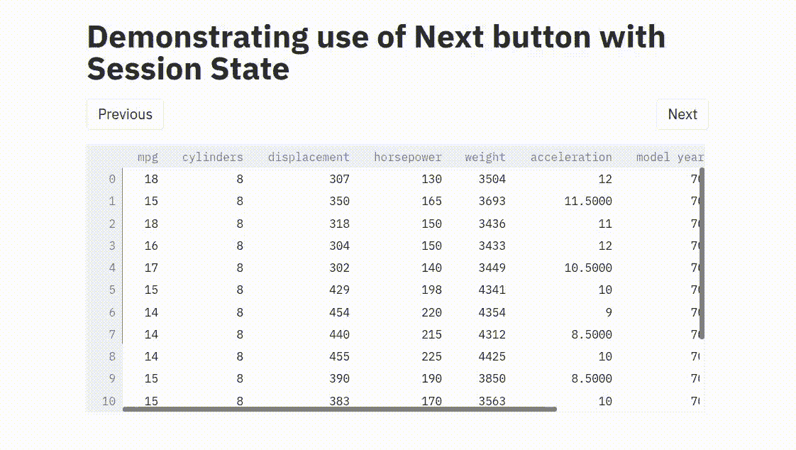
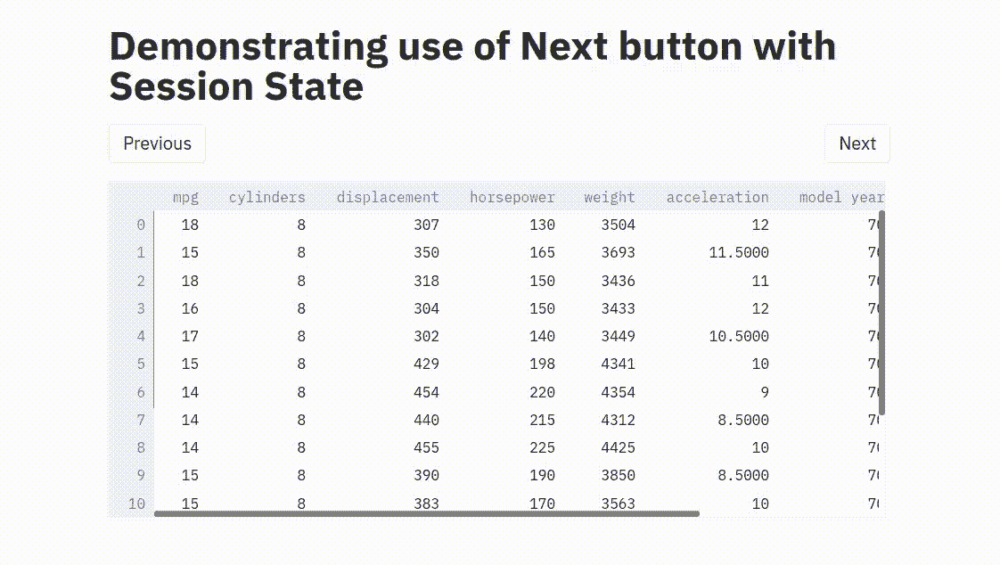

# streamlit 中的分页

> 原文：<https://towardsdatascience.com/pagination-in-streamlit-82b62de9f62b?source=collection_archive---------18----------------------->

## 使用会话状态实现下一个/上一个功能


照片由[本斯·博罗斯](https://unsplash.com/@benceboros?utm_source=medium&utm_medium=referral)在 [Unsplash](https://unsplash.com?utm_source=medium&utm_medium=referral) 上拍摄

# 介绍

这篇文章旨在演示如何使用`Streamlit`中的会话状态来存储关于某些变量的信息，并防止它们在运行中更新。但是什么是`Streamlit`？

`Streamlit`是一个 python 库，旨在使 python 开发者构建 web 应用程序来展示你的工作变得非常容易。在这个包到来之前，`Flask`和`Django`是开发人员选择使用的 goto 库，以便在 web 上开发和部署他们的应用程序；然而，这两种框架都要求用户编写 HTML/CSS 代码来将他们的工作呈现为 web 应用程序。`Streamlit`抽象了所有这些，并提供了一个简单的 pythonic 接口来添加自定义组件，如滑块、下拉列表、表单、文本框等。同时也允许人们添加他们自己的定制 HTML/CSS 组件。如果你是 Streamlit 的新手，[他们的官方文档](https://docs.streamlit.io/en/stable/getting_started.html)非常适合让你入门。

在这篇文章中，我将讨论我们如何构建一个组件来帮助实现分页支持，因为它不是开箱即用的，需要一个小技巧`SessionStates.`

# 什么是分页？

Wikipedia 将分页定义为将文档分成离散页面的过程，这些页面可以是电子页面，也可以是印刷页面。

所以基本上，如果你有很多内容想要显示在你的应用程序/网页上，你可以将它们分成多个组件页面，一个接一个地显示，在页面之间切换的触发器可以是像`Next`按钮或`Previous`按钮这样的按钮。

在许多网页上，你可以看到分页为 eg。

*   在任何有大量产品展示的电子商务网站上，它们通常以页面方式展示。
*   给定查询的谷歌搜索结果总是在页面中可见，而不是一次全部可见。

Streamlit 的当前版本不提供开箱即用的支持来处理这种用例，但在本帖中，我们将讨论一种使我们能够以整洁的方式执行分页的方法。

# 问题是

如果我们看一个简单的演示代码来显示一个数据帧到我们的屏幕上，我们可以看到代码如下:

在屏幕上显示数据帧

我们在这里面临的问题是，如果我们想做分页，我们将必须定义一个页码，如果我们在这里初始化它。

接下来，我们需要创建一个名为`Next`和`Previous`的按钮，它将在数据帧中的下一个或上一个条目之间移动。但是，当我们将变量 page_number 链接到这些按钮时，每次点击页码或会话中有任何组件的状态更改时，变量都会被重新初始化为它的初始值，我们永远不会动态地跨页面移动。假设我们有这样一个代码

我们已经创建了一个按钮 next 和一个按钮 previous，当单击它们时，会根据一些条件检查来更改页码(即，在第一页和最后一页的情况下不要超出范围；视情况分别回滚到最后/第一页)。如果我们按原样使用此代码并在应用程序中显示数据帧，我们的输出将如下所示:



图片由 Vinayak 提供

当我们单击“下一步”时，页码被重新初始化为 0。这就是为什么我们永远无法超越第一页。页码重新初始化为 0，递增 1，如此循环往复。

同样，当我们点击“上一页”时，页码会重新初始化为 0，然后递减到最后一页，这种情况会一直持续下去！

# 解决方案

有[这段代码](https://gist.github.com/tvst/036da038ab3e999a64497f42de966a92)由 [Thiago Teixeira](https://github.com/tvst) 慷慨地借给 streamlit 的用户，他是 streamlit 的联合创始人，允许我们创建对象，我们可以在一个会话中跟踪这些对象，而不用一次又一次地覆盖/重新初始化它们。

您基本上是将上面这段代码中给出的代码复制到一个名为 SessionState.py 的文件中，并将其保存在与应用程序文件相同的工作目录中。接下来，你只需要通过使用如下所示的 get 方法，将你想要阻止重新初始化的变量封装在一个会话状态对象中。

如果你有更多的变量要记录，你可以写

```
import SessionState
ss = SessionState.get(page_number = 0, var_1 = True, var_2 = "Streamlit demo!")
```

它也能很好地工作。但是这里有一个警告

> *每个应用程序只能有一个会话状态对象*

这一点很重要，否则如果你试图用多个变量/属性初始化多个状态，将会失败并抛出一个错误。所以你必须 ***小心*** 哪些变量要动态跟踪，哪些要通过会话跟踪，并把后者放在你要创建的唯一的 SessionState 对象中。上述代码的结果非常完美，如下所示



图片由 Vinayak 提供

如果你喜欢上面的内容，你可能会对我写的其他文章感兴趣。你可以在这里[找到它们。](https://nayakvinayak95.medium.com/)

这里有一个帮助你使用 Pytorch 建立自己的视频背景模糊功能

[https://towards data science . com/semantic-image-segmentation-with-deeplab v3-py torch-989319 a9 a4fb](/semantic-image-segmentation-with-deeplabv3-pytorch-989319a9a4fb)

# 参考

1.  [该应用源代码的 Github 链接](https://github.com/ElisonSherton/streamlit-next-button-demo)
2.  [数据集引用—来自 Kaggle 的 auto-mpg . CSV](https://www.kaggle.com/uciml/autompg-dataset)